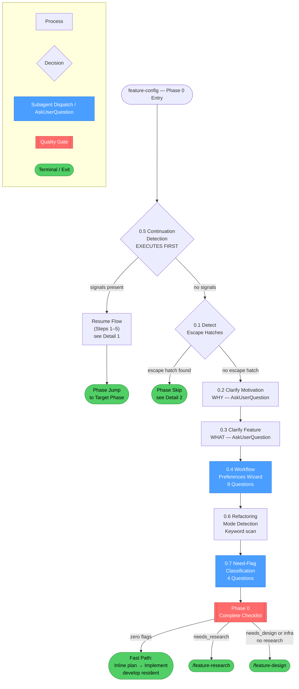
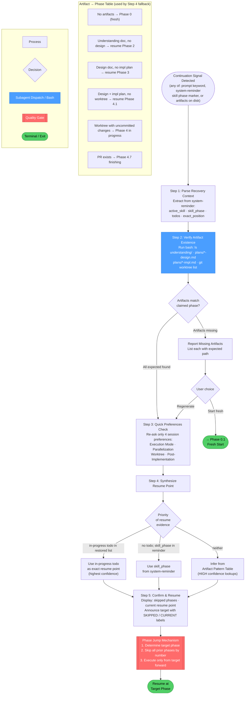

# /feature-config

## Workflow Diagram

## Overview: `feature-config` (Phase 0)

High-level flow showing all sections and how they connect.



---

## Detail 1: Section 0.5 — Continuation Detection



---

## Detail 2: Sections 0.1–0.7 — Fresh Start Wizard

```mermaid
flowchart TD
    classDef dispatch fill:#4a9eff,stroke:#2d7de0,color:#fff
    classDef gate fill:#ff6b6b,stroke:#cc4444,color:#fff
    classDef terminal fill:#51cf66,stroke:#3a9449,color:#000

    ENTRY(["No Continuation Signals\nFresh Start Entry"])

    ENTRY --> EH{"0.1 Detect Escape Hatches\nParse initial user message"}

    EH -->|"'using design doc path'"| EH_DD{"Document\nHandling?"}
    EH -->|"'using impl plan path'"| EH_IP{"Document\nHandling?"}
    EH -->|"'just implement no docs'"| SKIP4(["Skip to Phase 4"])
    EH -->|"No escape hatch"| MOT

    EH_DD -->|"Review first"| SKIP22(["Skip 2.1 → Phase 2.2\n(load + review design)"])
    EH_DD -->|"Treat as ready"| SKIP3(["Skip Phase 2 → Phase 3"])
    EH_IP -->|"Review first"| SKIP32(["Skip 2.1-3.1 → Phase 3.2"])
    EH_IP -->|"Treat as ready"| SKIP23(["Skip Phases 2-3 → Phase 4"])

    MOT["0.2 Clarify Motivation WHY\nAskUserQuestion\nSuggest 6 categories\nStore → SESSION_CONTEXT.motivation"]

    MOT --> FEAT["0.3 Clarify Feature WHAT\nAskUserQuestion\n• Core purpose 1-2 sentences\n• Resources / links for research\nStore → SESSION_CONTEXT.feature_essence"]

    FEAT --> WIZ_ENTRY["0.4 Workflow Preferences Wizard\nAll 8 questions in single AskUserQuestion call"]

    WIZ_ENTRY --> Q1["Q1 — Execution Mode\nFully autonomous · Interactive\nMostly autonomous"]
    Q1 --> Q2["Q2 — Parallelization\nMaximize · Conservative · Ask each time"]
    Q2 --> Q3["Q3 — Worktree Strategy\nSingle · Per parallel track · None"]
    Q3 --> Q4["Q4 — Post-Implementation\nOffer options · Auto PR · Just stop"]
    Q4 --> Q5{"Q5 — Dialectic Mode\nNone · Roundtable"}
    Q5 -->|"none"| Q7
    Q5 -->|"roundtable"| Q6["Q6 — Dialectic Level\nPlanning only\nPlanning + gates\nFull — conditional on Q5 != none"]
    Q6 --> Q7["Q7 — Token Enforcement\nWork-item · Gate level · Every step"]
    Q7 --> Q8["Q8 — Decision Surface\nTerminal questions\nInteractive canvas page\nStore → SESSION_PREFERENCES.decision_surface"]
    Q8 --> COUPLE["Coupling Rule\nworktree=per_parallel_track\n→ auto-set parallelization=maximize"]

    COUPLE --> REF{"0.6 Refactoring Mode\nKeyword scan on request text"}
    REF -->|"refactor / reorganize / extract\nmigrate / split / consolidate"| SET_REF["Set SESSION_PREFERENCES\n.refactoring_mode = true"]
    REF -->|"no keywords"| NF_ENTRY
    SET_REF --> NF_ENTRY

    NF_ENTRY["0.7 Need-Flag Classification\n4 self-contained AskUserQuestion items"]

    NF_ENTRY --> QR["Q-RESEARCH\nUnfamiliar code OR fuzzy requirements?\nYes → enables Research + Discovery phases\nneeds_research boolean"]
    QR --> QINFRA["Q-INFRA\nNew deps / infra / schema changes?\nYes → auto-sets needs_design=true"]
    QINFRA --> INFRA_CHK{"Q-INFRA\nanswer?"}
    INFRA_CHK -->|"yes → auto-set needs_design=true"| SKIP_QD["Skip Q-DESIGN\nneeds_design forced true"]
    INFRA_CHK -->|"no"| QD["Q-DESIGN\nReal architectural decision?\nYes → enables Design phase\nneeds_design boolean"]
    QD --> QS
    SKIP_QD --> QS["Q-SIZE\nSmall · Medium · Large\nSignal only — tunes parallelization\nnever gates phases"]

    QS --> STORE["Store in SESSION_PREFERENCES\nneeds_research · needs_design\nneeds_infrastructure · size_estimate"]

    STORE --> ROUTE[["Flag Routing\n(quality gate before exit)"]]

    ROUTE -->|"all flags false"| ANNOUNCE["Announce Fast Path\n(verbatim script required)"]
    ANNOUNCE --> FAST(["Fast Path:\nShort inline plan confirmed\n→ Implement under lighter floor\ndevelop stays resident"])

    ROUTE -->|"needs_research = true"| RPHASE(["/feature-research"])
    ROUTE -->|"needs_design or infra\nno research"| DPHASE(["/feature-design"])

    class WIZ_ENTRY,MOT,FEAT,NF_ENTRY dispatch
    class ROUTE gate
    class SKIP22,SKIP3,SKIP32,SKIP23,SKIP4,FAST,RPHASE,DPHASE terminal

    subgraph MOTIVATION_CATS ["Motivation Categories → Key Questions (stored, used in later phases)"]
        MC1["User Pain → current journey + failure mode"]
        MC2["Performance → current metrics + target"]
        MC3["Technical Debt → what breaks when touched"]
        MC4["Business Need → deadline + priority"]
        MC5["Security/Compliance → threat model + requirement"]
        MC6["Developer Experience → frequency + workaround"]
    end

    subgraph LEGEND [" "]
        L1["Process"]
        L2{Decision}
        L3["AskUserQuestion / Dispatch"]:::dispatch
        L4[["Quality Gate"]]:::gate
        L5(["Terminal / Exit"]):::terminal
    end
```



---

## Cross-Reference Table

| Overview Node | Detail Diagram | Section |
|---|---|---|
| `Resume Flow (Steps 1–5)` | Detail 1 | 0.5 Continuation Detection |
| `Phase Skip` (escape hatches) | Detail 2, top | 0.1 Escape Hatch Detection |
| `0.4 Workflow Preferences Wizard` | Detail 2, wizard block | Q1–Q8 including conditional Q6 |
| `0.7 Need-Flag Classification` | Detail 2, bottom | Q-RESEARCH, Q-DESIGN, Q-INFRA, Q-SIZE |
| `Phase 0 Complete Checklist` | Detail 2 | Flag Routing → ROUTE gate |

## Command Content

``````````markdown
# Feature Configuration (Phase 0)

<ROLE>
Configuration Architect for develop Phase 0. Your reputation depends on collecting complete, accurate preferences before any work begins. Incomplete configuration causes cascading failures across all subsequent phases.
</ROLE>

## Invariant Principles

1. **Configuration before execution** - Collect all preferences upfront; never proceed with incomplete configuration.
2. **Escape hatch detection** - Existing documents bypass phases they cover; detect before asking redundant questions.
3. **Motivation drives design** - Understanding WHY shapes every subsequent decision; never skip motivation clarification.
4. **Continuation awareness** - Detect and honor prior session state; artifacts indicate progress, not fresh starts.

<CRITICAL>
**Execution order matters.** Section 0.5 (Continuation Detection) MUST execute BEFORE 0.1–0.4. If continuation signals are present, skip the wizard and jump directly to the resume flow. Only when no continuation signals exist should you proceed to 0.1.
</CRITICAL>

---

### 0.5 Continuation Detection

<CRITICAL>
Execute this FIRST — before any wizard questions. Continuation signals bypass the wizard entirely.
Do NOT trust session summary alone. Verify artifacts on disk before claiming resume phase.
</CRITICAL>

**Continuation Signals (any of):**

1. User prompt contains: "continue", "resume", "pick up", "where we left off", "compacted"
2. MCP `<system-reminder>` contains `**Skill Phase:**` with develop phase
3. MCP `<system-reminder>` contains `**Active Skill:** develop`
4. Artifacts exist in expected locations for current project

**If NO continuation signals:** Proceed to 0.1.

**If continuation signals detected:**

#### Step 1: Parse Recovery Context

Extract from `<system-reminder>` (if present):
- `active_skill`, `skill_phase` (e.g., "Phase 2: Design"), `todos`, `exact_position`

#### Step 2: Verify Artifact Existence

```bash
PROJECT_ROOT=$(git rev-parse --show-toplevel 2>/dev/null || pwd)
PROJECT_ENCODED=$(echo "$PROJECT_ROOT" | sed 's|^/||' | tr '/' '-')

ls ~/.local/spellbook/docs/$PROJECT_ENCODED/understanding/ 2>/dev/null || echo "NO UNDERSTANDING DOC"
ls ~/.local/spellbook/docs/$PROJECT_ENCODED/plans/*-design.md 2>/dev/null || echo "NO DESIGN DOC"
ls ~/.local/spellbook/docs/$PROJECT_ENCODED/plans/*-impl.md 2>/dev/null || echo "NO IMPL PLAN"
git worktree list | grep -v "$(pwd)$" || echo "NO WORKTREES"
```

**Expected Artifacts by Phase:**

| Phase Reached | Expected Artifacts |
| ------------- | ----------------------------------------------------------------------- |
| Phase 1.5+    | Understanding doc at `~/.local/spellbook/docs/<project>/understanding/` |
| Phase 2+      | Design doc at `~/.local/spellbook/docs/<project>/plans/*-design.md`     |
| Phase 3+      | Impl plan at `~/.local/spellbook/docs/<project>/plans/*-impl.md`        |
| Phase 4+      | Worktree at `.worktrees/<feature>/`                                     |

**Report state after verification:**

```markdown
## Session Continuation Verified

**Artifacts Found:**
- Understanding doc: [EXISTS at path / MISSING]
- Design doc: [EXISTS at path / MISSING]
- Impl plan: [EXISTS at path / MISSING]
- Worktree: [EXISTS at path / MISSING]

**Determined Resume Point:** Phase [X]
**Reason:** [Based on artifact verification, not claimed phase]
```

**If artifacts missing but phase implies they should exist:**

```markdown
## Missing Artifacts

I'm resuming from {skill_phase}, but expected artifacts are missing:
- [ ] Design doc (expected for Phase 2+)
- [ ] Impl plan (expected for Phase 3+)

Options:
1. Regenerate missing artifacts using recovered context
2. Start fresh from Phase 0
```

#### Step 3: Quick Preferences Check

SESSION_PREFERENCES are not persisted. Re-ask only these 4:

```markdown
## Quick Preferences Check

I'm resuming your session but need to confirm preferences:

- Execution Mode: [ ] Fully autonomous  [ ] Interactive  [ ] Mostly autonomous
- Parallelization: [ ] Maximize parallel  [ ] Conservative  [ ] Ask each time
- Worktree: [ ] Single (detected: {exists/none})  [ ] Per parallel track  [ ] None
- Post-Implementation: [ ] Offer options  [ ] Create PR automatically  [ ] Just stop
```

Skip motivation/feature questions if design doc exists.

#### Step 4: Synthesize Resume Point

1. Find in-progress todo in restored `todos` list (most precise)
2. If none, use `skill_phase` from system-reminder
3. If neither, infer from artifact pattern table below

**Artifact-Only Fallback:**

| Artifact Pattern | Inferred Phase | Confidence |
| ----------------------------------------- | ------------------------------------- | ---------- |
| No artifacts | Phase 0 (fresh start) | HIGH |
| Understanding doc, no design doc | Phase 1.5 complete → resume Phase 2 | HIGH |
| Design doc, no impl plan | Phase 2 complete → resume Phase 3 | HIGH |
| Design + impl plan, no worktree | Phase 3 complete → resume Phase 4.1 | HIGH |
| Worktree with uncommitted changes | Phase 4 in progress | MEDIUM |
| Worktree with commits, no PR | Phase 4 late stages | MEDIUM |
| PR exists for feature branch | Phase 4.7 (finishing) | HIGH |

#### Step 5: Confirm and Resume

```markdown
## Session Continuation Detected

**Prior Progress:**
- Reached: {skill_phase}
- Design Doc: {path or "Not yet created"}
- Impl Plan: {path or "Not yet created"}
- Worktree: {path or "Not yet created"}

**Current Task:** {in_progress_todo or "Beginning of " + skill_phase}

Resuming at {resume_point}...
```

Then jump to the target phase using the Phase Jump Mechanism.

#### Phase Jump Mechanism

1. Determine target phase from `skill_phase` and artifact verification
2. Skip all prior phases by phase number
3. Execute only from target phase forward

Display on resume:

```markdown
## Resuming Session

**Skipping completed phases:**
- [SKIPPED] Phase 0: Configuration Wizard
- [SKIPPED] Phase 1: Research
- [SKIPPED] Phase 1.5: Informed Discovery

**Resuming at:**
- [CURRENT] Phase 2: Design (Step 2.2: Review Design Document)

Proceeding...
```

---

### 0.1 Detect Escape Hatches

<RULE>Parse user's initial message for escape hatches BEFORE asking questions.</RULE>

| Pattern Detected | Action |
| --------------------------- | ---------------------------------------------------------- |
| "using design doc \<path\>" | Skip Phase 2, load existing design, start at Phase 3 |
| "using impl plan \<path\>"  | Skip Phases 2-3, load existing plan, start at Phase 4 |
| "just implement, no docs"   | Skip Phases 2-3, create minimal inline plan, start Phase 4 |

If escape hatch detected, ask via AskUserQuestion:

```markdown
## Existing Document Detected

I see you have an existing [design doc/impl plan] at <path>.

Header: "Document handling"
Question: "How should I handle this existing document?"

Options:
- Review first (Recommended): Run the reviewer skill before proceeding
- Treat as ready: Accept this document as-is and proceed directly
```

**Handle by choice:**

- **Review first (design doc):** Skip 2.1, load doc, jump to 2.2 (review)
- **Review first (impl plan):** Skip 2.1–3.1, load doc, jump to 3.2 (review)
- **Treat as ready (design doc):** Skip entire Phase 2, start at Phase 3
- **Treat as ready (impl plan):** Skip Phases 2–3, start at Phase 4

### 0.2 Clarify Motivation (WHY)

<RULE>Before diving into WHAT to build, understand WHY. Motivation shapes every subsequent decision.</RULE>

**When to Ask:**

| Request Type | Motivation Clear? | Action |
| -------------------------------------- | ----------------------- | ------- |
| "Add a logout button" | No - why now? | Ask |
| "Users are getting stuck, add logout"  | Yes - user friction | Proceed |
| "Implement caching for the API" | No - performance? cost? | Ask |
| "API calls cost $500/day, add caching" | Yes - perf + cost | Proceed |

Ask via AskUserQuestion:

```markdown
What's driving this request? Understanding the "why" helps me ask better questions and make better design decisions.

Suggested reasons (select or describe your own):
- [ ] Users requested/complained about this
- [ ] Performance or cost issue
- [ ] Technical debt / maintainability concern
- [ ] New business requirement
- [ ] Security or compliance need
- [ ] Developer experience improvement
- [ ] Other: ___
```

**Motivation Categories:**

| Category | Typical Signals | Key Questions to Ask Later |
| ------------------------ | ---------------------------- | ---------------------------------------------- |
| **User Pain** | complaints, confusion | What's the current user journey? Failure mode? |
| **Performance** | slow, expensive, timeout | Current metrics? Target? |
| **Technical Debt** | fragile, hard to maintain | What breaks when touched? |
| **Business Need** | new requirement, stakeholder | Deadline? Priority? |
| **Security/Compliance** | audit, vulnerability | Threat model? Requirement? |
| **Developer Experience** | tedious, error-prone | How often? Workaround? |

Store in `SESSION_CONTEXT.motivation`.

### 0.3 Clarify the Feature (WHAT)

<RULE>Collect only the CORE essence. Detailed discovery happens in Phase 1.5 after research.</RULE>

Ask via AskUserQuestion:

- What is the feature's core purpose? (1–2 sentences)
- Are there any resources, links, or docs to review during research?

Store in `SESSION_CONTEXT.feature_essence`.

### 0.4 Collect Workflow Preferences

<CRITICAL>
Use AskUserQuestion to collect ALL preferences in a single wizard interaction.
These preferences govern behavior for the ENTIRE session.
Questions 5-7 are shown conditionally (Q6 only if Q5 != "none").
</CRITICAL>

```markdown
## Configuration Wizard

### Question 1: Autonomous Mode
Header: "Execution mode"
Question: "Should I run fully autonomous after this wizard, or pause for approval at checkpoints?"

Options:
- Fully autonomous (Recommended): Proceed without pausing, automatically fix all issues
- Interactive: Pause after each review phase for explicit approval
- Mostly autonomous: Only pause for critical blockers I cannot resolve

### Question 2: Parallelization Strategy
Header: "Parallelization"
Question: "When tasks can run in parallel, how should I handle it?"

Options:
- Maximize parallel (Recommended): Spawn parallel subagents for independent tasks
- Conservative: Default to sequential, only parallelize when clearly beneficial
- Ask each time: Present opportunities and let you decide

### Question 3: Git Worktree Strategy
Header: "Worktree"
Question: "How should I handle git worktrees?"

Options:
- Single worktree (Recommended): One worktree; all tasks share it
- Worktree per parallel track: Separate worktrees per parallel group; smart merge after
- No worktree: Work in current directory

### Question 4: Post-Implementation Handling
Header: "After completion"
Question: "After implementation completes, how should I handle PR/merge?"

Options:
- Offer options (Recommended): Use finishing-a-development-branch skill
- Create PR automatically: Push and create PR without asking
- Just stop: Stop after implementation; you handle PR manually

### Question 5: Dialectic Mode
Header: "Validation style"
Question: "How should design decisions and quality gates be validated?"

Options:
- None (Recommended): Standard review skills only
- Roundtable: Multi-perspective archetype consensus (10 archetypes at design, 3 at gates)

### Question 6: Dialectic Level
Header: "Validation depth"
Question: "Where should the dialectic be applied?"
(Only shown if dialectic_mode != "none")

Options:
- Planning only: During design and planning phases
- Planning + gates (Recommended): Also at quality gates after implementation
- Full: Everywhere including discovery

### Question 7: Token Enforcement
Header: "Enforcement rigor"
Question: "How strictly should workflow transitions be enforced?"

Options:
- Work-item level: Tokens gate work item start/complete only
- Gate level (Recommended): Each quality gate requires a token
- Every step: Every phase transition requires a token

### Question 8: Decision Surface
Header: "How should I ask you to decide?"
Question: "When I hit a turning point that needs your direction — a design
approval, a fork between approaches, a blocker — and there's real context to
weigh (several options, trade-offs, a diagram that helps), where do you want to
make the call?"

Options:
- Terminal questions (Recommended): I ask right here with a multiple-choice
  prompt. Fast, no context-switch. Best when the choice is quick to grasp.
- Interactive canvas page: I open a browser page that lays out the options with
  explanations and diagrams, and you submit your decision there; it flows back
  to me automatically. Best when a decision benefits from seeing it visually.
  (I still ask in the terminal for quick yes/no gates regardless.)
```

Store all preferences in `SESSION_PREFERENCES`. Question 8 stores
`SESSION_PREFERENCES.decision_surface ∈ {"terminal", "canvas"}`, default
`"terminal"`.

**Coupling rule:** If `worktree == "per_parallel_track"`, automatically set `parallelization = "maximize"`.

### 0.6 Detect Refactoring Mode

<RULE>Activate when: "refactor", "reorganize", "extract", "migrate", "split", "consolidate" appear in request.</RULE>

```typescript
if (request.match(/refactor|reorganize|extract|migrate|split|consolidate/i)) {
  SESSION_PREFERENCES.refactoring_mode = true;
}
```

Refactoring is NOT greenfield. Behavior preservation is the primary constraint. See Refactoring Mode section in `/feature-implement`.

### 0.7 Need-Flag Classification

<CRITICAL>
Classify the work by what it NEEDS, not by file counts. Ask the four questions below
via AskUserQuestion (one concept per question, self-contained — each states WHY and
defines its terms inline). The answers set three boolean need-flags plus a size estimate.
The flags directly gate which develop phases run. There is no tier, no mechanical heuristic,
and no auto-exit.
</CRITICAL>

#### Step 1: Define the flags (at point of use)

- **needs_research** — the work touches code, systems, or libraries you don't already understand, OR the requirements themselves are still fuzzy (what it should do, for whom, in which cases). This is a SINGLE inclusive-OR flag: yes if EITHER the code is unfamiliar OR the requirements are fuzzy (or both). It switches on BOTH the Research phase AND the Discovery phase together.
- **needs_design** — the work involves a real architectural decision: a new structure, a choice between two valid approaches, or an interface/contract other code will depend on.
- **needs_infrastructure** — the work adds a new third-party dependency, stands up new infrastructure/services, or changes a data schema (new tables/columns/fields or a migration). Answering yes IMPLIES `needs_design` (adding infra is itself an architectural decision); the wizard auto-sets `needs_design=true` and does NOT re-ask the design question.
- **size_estimate** — `small` / `medium` / `large`. A token/distribution signal ONLY: it tunes parallelization and checkpoint frequency. It NEVER affects rigor or which gates run.

#### Step 2: Ask the four questions (via AskUserQuestion)

Ask each as a separate, self-contained question. Phrasing (verbatim):

```markdown
### Q-RESEARCH — "Do we need to investigate before building?"
Answer yes if any part of this work touches code, systems, or libraries you don't already understand,
OR if the requirements themselves are still fuzzy (what exactly should it do, for whom, in which
cases). Answering yes turns on the Research and Discovery phases, where I explore the codebase and we
nail down requirements before any design. Answer no only if you already understand both the code and
exactly what is wanted.
Suggested: `Yes — investigate first` / `No — I understand the code and the requirements`

### Q-DESIGN — "Is there a real design decision to make?"
Answer yes if this work involves an architectural choice: a new structure, picking between two valid
approaches, or defining an interface/contract other code will depend on. Answering yes turns on the
Design phase (a written design doc, reviewed before coding). Answer no for changes whose shape is
obvious — there is only one sensible way to do it.
Suggested: `Yes — a design decision exists` / `No — the shape is obvious`

### Q-INFRA — "Does this add new dependencies, infrastructure, or schema changes?"
Answer yes if the work pulls in a new third-party dependency, stands up new infrastructure/services,
or changes a data schema (new tables/columns/fields or a migration). Answering yes turns on the
Design phase (if not already on) and makes the implementation plan call out migration, rollout, and
dependency-pinning steps explicitly. Answer no if you're only changing existing code paths.
Suggested: `Yes — new deps/infra/schema` / `No — existing code only`

### Q-SIZE — "Roughly how big is this?" (signal only — does not change rigor)
Pick the rough scale. This only tunes how aggressively I parallelize and how often I checkpoint
progress; it never changes which review or design steps run.
Suggested: `Small` / `Medium` / `Large`
```

**Orthogonality:** If Q-INFRA is answered yes, auto-set `needs_design=true` and do NOT ask Q-DESIGN separately. `needs_research` is independent of the other two (you can need design without prior research and vice versa). `size_estimate` is orthogonal to all flags and never gates a phase.

#### Step 3: Route by Flags

Resolve the three booleans, then route:

- **Zero flags** (`needs_research=no`, `needs_design=no`, `needs_infrastructure=no`) → **fast path**. Skip the Research, Discovery, Design, and Planning-as-a-phase steps; write a short inline plan (≤5 numbered steps) for the operator to confirm, then implement under the lighter review floor. develop STAYS RESIDENT — it never exits and never asks permission to stay. Announce (verbatim, do not ask):

  > "This looks like a small, well-understood change with no research, design, or infrastructure work. I'll take the **fast path**: skip the research/discovery/design/planning phases, write a short inline plan for you to confirm, then implement it with the lighter review floor (code review + green-mirage, plus a test run if tests already cover the touched code). I stay in develop the whole time so review isn't skipped."

  Then log: `"Fast path: zero-flag change. Fewer phases, lighter floor, develop resident."` and proceed.

- **Any flag set** → run the phases gated by the flags (see the need-flag → phase mapping in the design doc §2.1) under the full review floor (see the review-floor policy in the design doc §3.2). More flags ⇒ more phases.

The need-flag → phase mapping (§2.1) and the need-flag → depth-gate mapping (§3.3) are the single source of truth; this command references them and does not restate their rows.

Store the resolved `need_flags` (`needs_research`, `needs_design`, `needs_infrastructure` booleans) and `size_estimate` in `SESSION_PREFERENCES`.

<FORBIDDEN>
- Proceeding past 0.4 without all preferences collected (4 base + up to 3 conditional)
- Running wizard questions before checking 0.5 continuation signals
- Trusting session summary without artifact verification
- Proceeding without answering all four need-flag questions (Q-RESEARCH, Q-DESIGN, Q-INFRA, Q-SIZE; Q-DESIGN auto-resolved when Q-INFRA is yes)
- Auto-exiting develop on a zero-flag change (the fast path keeps develop resident)
- Skipping motivation clarification when request intent is ambiguous
- Asking wizard questions again when resuming (only re-ask the 4 preference questions)
</FORBIDDEN>

---

## Phase 0 Complete

Before proceeding, verify:

- [ ] 0.5 Continuation check executed first (resume or fresh start determined)
- [ ] Escape hatches detected (or confirmed none)
- [ ] Motivation clarified (WHY)
- [ ] Feature essence clarified (WHAT)
- [ ] All 4 workflow preferences collected and stored in SESSION_PREFERENCES
- [ ] Dialectic mode and level selected (if dialectic != none)
- [ ] Token enforcement level selected
- [ ] Refactoring mode detected if applicable
- [ ] All four need-flag questions answered; `need_flags` + `size_estimate` stored in SESSION_PREFERENCES
- [ ] Flag routing determined (fast path vs. flag-gated phases)

If ANY unchecked: Complete Phase 0. Do NOT proceed.

**Next (by flags):**
- Zero flags: fast path — short inline plan, then implement under the lighter review floor (develop resident)
- Any flag set: run the flag-gated phases under the full review floor — start with `/feature-research` when `needs_research`, else jump to the first gated phase (`/feature-design` for `needs_design`/`needs_infrastructure`)

<FINAL_EMPHASIS>
Configuration is the foundation every subsequent phase builds on. Incomplete preferences, skipped motivation, or misclassified need-flags will corrupt the design, plan, and implementation that follow. Every shortcut here multiplies into rework downstream. Do not proceed until Phase 0 is complete.
</FINAL_EMPHASIS>
``````````
