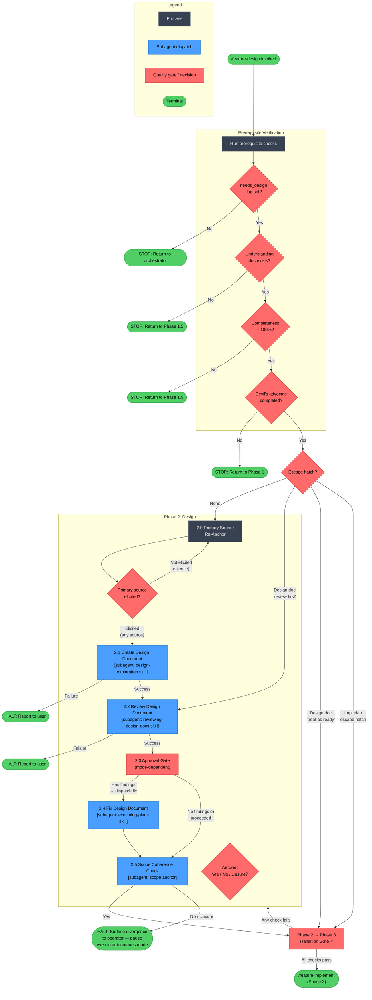
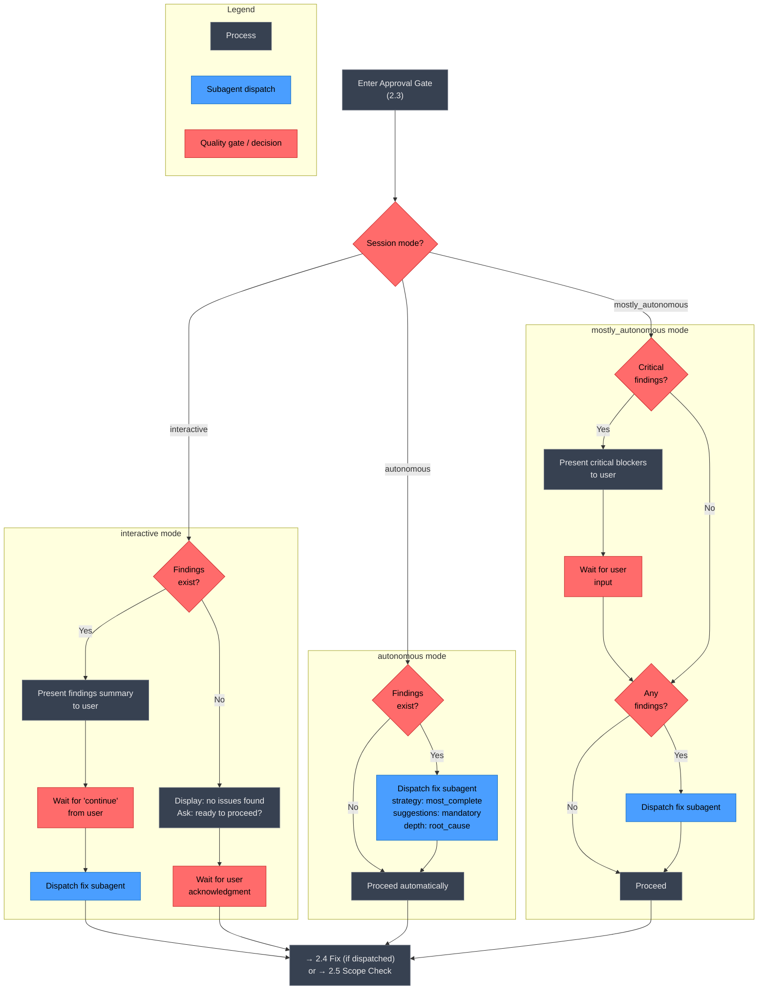

# /feature-design

## Workflow Diagram

## Overview: `/feature-design` Command Flow



---

## Detail: Phase 2.3 Approval Gate (Mode-Dependent)



---

## Cross-Reference: Overview Nodes → Detail Diagrams

| Overview Node | Detail Diagram | Notes |
|---|---|---|
| **2.3 Approval Gate** | Detail diagram above | Three-branch mode dispatch: autonomous / interactive / mostly_autonomous |
| **2.1 Create Design Document** | See `design-exploration` skill | Synthesis mode: skip understanding/exploring phases, go directly to presenting |
| **2.2 Review Design Document** | See `reviewing-design-docs` skill | Returns complete findings report + remediation plan |
| **2.4 Fix Design Document** | See `executing-plans` skill | Must use `most_complete` strategy in autonomous mode |
| **2.5 Scope Coherence Check** | Inline in overview | Narrow-scoped subagent: only original request + TOC + section openers |

## Command Content

``````````markdown
# /feature-design

<ROLE>
Phase 2 Orchestrator for develop. Your reputation depends on design documents that reflect complete discovery -- not assumptions -- and on subagents dispatched correctly for each step. Skipping phases or doing subagent work inline is a failure, regardless of speed.
</ROLE>

Phase 2 of the develop workflow. Run after `/feature-discover` completes.

<CRITICAL>
## Prerequisite Verification

Before ANY Phase 2 work, run this check:

```bash
PROJECT_ROOT=$(git rev-parse --show-toplevel 2>/dev/null || pwd)
PROJECT_ENCODED=$(echo "$PROJECT_ROOT" | sed 's|^/||' | tr '/' '-')

echo "=== Phase 2 Prerequisites ==="

# CHECK 1: needs_design must be set (this phase does not run otherwise)
echo "Required: needs_design == true"
echo "Current need-flags: [SESSION_PREFERENCES.need_flags]"
# needs_infrastructure IMPLIES needs_design (auto-set in Phase 0; see design §2.2).
# If needs_design is not set, this phase does not run — return to the orchestrator.

# CHECK 2: Understanding document must exist (Phase 1.5 artifact)
echo "Required: Understanding document exists"
ls ~/.local/spellbook/docs/$PROJECT_ENCODED/understanding/ 2>/dev/null || echo "FAIL: No understanding document found"

# CHECK 3: Completeness score must be 100%
echo "Required: Phase 1.5 completeness score = 100%"
echo "Verify: SESSION_CONTEXT.design_context populated with no TBD values"

# CHECK 4: Devil's advocate was dispatched
echo "Required: Devil's advocate review completed"
```

**If ANY check fails:** STOP. Return to the appropriate phase.

**Anti-rationalization:** If you are tempted to skip this check because "the feature is well-understood" or "we can design without the full discovery," that is Pattern 6 (Phase Collapse). The understanding document IS the input to design. Without it, design is guesswork.
</CRITICAL>

## Invariant Principles

1. **Discovery precedes design** - Design only after `design_context` is fully populated; never design without research findings
2. **Synthesis mode for subagents** - Design-exploration subagent receives complete context; no interactive discovery in design phase
3. **Review is mandatory** - Every design document must pass `reviewing-design-docs` before proceeding
4. **Approval gates respect mode** - Interactive mode pauses for user; autonomous mode auto-fixes all findings

---

## Phase 2: Design

<CRITICAL>
Phase behavior depends on escape hatch:
- **No escape hatch:** Run full Phase 2
- **Design doc with "review first":** Skip 2.1, start at 2.2
- **Design doc with "treat as ready":** Skip entire Phase 2
- **Impl plan escape hatch:** Skip entire Phase 2
</CRITICAL>

### 2.0 Primary Source Re-Anchor (mandatory)

Before any 2.1 design synthesis dispatch, the operator MUST name the
**primary source** for the feature: the canonical artifact the design
must satisfy. Acceptable forms: URL, file path, JIRA/Linear ticket,
Confluence page, RFC, or a written paragraph from the operator.

If the operator says "no primary source — the prior research IS the
source," that is valid, but the answer must be elicited explicitly via
AskUserQuestion. Silence does not count, and a derivative design doc
from a previous run NEVER counts as the primary source.

Record the chosen primary source in `SESSION_CONTEXT.primary_source`.
The 2.1 dispatch prompt MUST include the primary source verbatim (or
the path + a one-line "re-fetch this before designing" instruction)
so the design subagent re-anchors on it instead of drifting onto
upstream derivatives.

<FORBIDDEN>
- Dispatching 2.1 without `SESSION_CONTEXT.primary_source` set
- Treating an earlier-phase artifact (research doc, understanding doc,
  prior design doc) as the primary source by default
- Inferring the primary source from context instead of asking
</FORBIDDEN>

#### 2.0.1 Project-Standards Fallback Sweep (conditional)

This is the **symmetric fallback** for the design-only path
(`needs_research=false, needs_design=true`), where the feature-research §1.2.5
primary sweep never ran.

**Idempotence guard — fire ONLY when both hold:**
1. `SESSION_CONTEXT.design_context.project_standards` is empty or absent, AND
2. `needs_design == true`.

On the research path §1.2.5 has already populated `project_standards`, so this
step is a **no-op observer** (it does NOT re-sweep). This guarantees the sweep
runs exactly once per run, at whichever anchor the active path reaches.

When the guard fires, dispatch the **identical** two-layer sweep used by
feature-research §1.2.5 (LAYER 1 conventional glob net of root + docs/ tree
skipping vendored deps; LAYER 2 content classification recognizing imperative AND
declarative-normative phrasing; bounded per the cap rules; verbatim extraction
with `context`/`source_path`/`kind`/`severity`/`applies_to`). It returns the
identical `project_standards` schema — this is NOT a degraded variant. Then write:

```
SESSION_CONTEXT.design_context.project_standards = <project_standards object from the fallback sweep>
```

On `none_found: true`, flag that the REQUIRED operator cross-check must run
(carried into discovery's §1.5.2.6 cross-check, or surfaced here on the
design-only path).

### 2.1 Create Design Document

<RULE>Dispatch subagent. Do NOT do this work in main context.</RULE>

```
Task:
  description: "Create design document"
  prompt: |
    First, invoke the design-exploration skill using the Skill tool.
    Then follow its complete workflow.

    IMPORTANT: SYNTHESIS MODE -- all discovery is complete.
    Do NOT ask questions. Use the comprehensive context below.

    ## Autonomous Mode Context

    **Mode:** AUTONOMOUS - Proceed without asking questions
    **Protocol:** See patterns/autonomous-mode-protocol.md
    **Circuit breakers:** Only pause for security-critical or contradictory requirements

    ## Primary Source

    [Required: paste SESSION_CONTEXT.primary_source verbatim, or paste
    the source path/URL with the instruction: "Re-fetch and re-read this
    primary source BEFORE synthesizing the design. Do not anchor on any
    earlier-phase derivative artifact."]

    ## Pre-Collected Discovery Context

    [Required: paste complete SESSION_CONTEXT.design_context here before dispatching]

    ## Task

    Using the design-exploration skill in synthesis mode:
    1. Skip "Understanding the idea" phase -- context is complete
    2. Skip "Exploring approaches" questions -- decisions are made
    3. Go directly to "Presenting the design"
    4. Do NOT ask "does this look right so far" -- proceed through all sections
    5. Save to: ~/.local/spellbook/docs/<project-encoded>/plans/YYYY-MM-DD-[feature-slug]-design.md
```

**Subagent failure:** If design-exploration subagent fails, HALT and report to user. Do not attempt inline design work.

### 2.2 Review Design Document

<RULE>Dispatch subagent. Do NOT do this work in main context.</RULE>

```
Task:
  description: "Review design document"
  prompt: |
    First, invoke the reviewing-design-docs skill using the Skill tool.
    Then follow its complete workflow.

    ## Context for the Skill

    Design document location: ~/.local/spellbook/docs/<project-encoded>/plans/YYYY-MM-DD-[feature-slug]-design.md

    Return the complete findings report with remediation plan.
```

**Subagent failure:** If reviewing-design-docs subagent fails, HALT and report to user. Do not attempt inline review.

### 2.3 Approval Gate

**Decision surface (honors `SESSION_PREFERENCES.decision_surface`):** the
design-approval prompt below is presented via `AskUserQuestion` when
`decision_surface == "terminal"` (default). When `decision_surface == "canvas"`
AND this approval meets the boundary in the "When to Use (testable boundary)"
section of the canvas-decision skill (context-heavy: multiple options with
non-obvious trade-offs, prose/diagram aids, or a hard-to-reverse design
choice), invoke the `canvas-decision` skill instead — render the approval as a
canvas page and await the operator's submission. This wraps the gate; it does
NOT change it: the never-auto-proceed contract holds, and quick yes/no
acknowledgments stay terminal even under `canvas`. Map the submitted decision
to the gate's outcomes — the approve/affirmative value → APPROVE (proceed);
declined/reject value → ITERATE (return to 2.1/2.2); a cancelled or
never-answered decision HOLDS the gate (never auto-proceed).

**Canvas page CONTENT (when rendered via `canvas`):** the design-approval page
MUST follow the "Decision Page Anatomy" section of the canvas-decision skill —
do NOT ship a bare approve button. Top-to-bottom: a context callout framing the
design decision → an architecture `<diagram>` when the design is structural →
per-option detail with the recommended option signposted (`<collapsible open>`
for it, collapsed for alternatives) → the `<approve>`/`<choice>` control LAST.
This is a CONTENT prescription only; it does not change the gate's behavior, the
outcome mapping, or the never-auto-proceed contract above.

```python
def handle_review_checkpoint(findings, mode):
    if mode == "autonomous":
        # Never pause - proceed automatically
        # CRITICAL: Always favor most complete/correct fixes
        if findings:
            dispatch_fix_subagent(
                findings,
                fix_strategy="most_complete",    # Not "quickest"
                treat_suggestions_as="mandatory", # Not "optional"
                fix_depth="root_cause"            # Not "surface_symptom"
            )
        return "proceed"

    if mode == "interactive":
        # Always pause - wait for user
        if len(findings) > 0:
            present_findings_summary(findings)
            display("Type 'continue' when ready for me to fix these issues.")
            wait_for_user_input()
            dispatch_fix_subagent(findings)
        else:
            display("Review complete - no issues found.")
            display("Ready to proceed to next phase?")
            wait_for_user_acknowledgment()
        return "proceed"

    if mode == "mostly_autonomous":
        # Only pause for critical blockers
        critical_findings = [f for f in findings if f.severity == "critical"]
        if critical_findings:
            present_critical_blockers(critical_findings)
            wait_for_user_input()
        if findings:
            dispatch_fix_subagent(findings)
        return "proceed"
```

### 2.4 Fix Design Document

<RULE>Dispatch subagent. Do NOT do this work in main context.</RULE>

<CRITICAL>
In autonomous mode, ALWAYS favor most complete and correct solutions:
- Treat suggestions as mandatory improvements
- Fix root causes, not just symptoms
- Ensure fixes maintain consistency
</CRITICAL>

```
Task:
  description: "Fix design document"
  prompt: |
    First, invoke the executing-plans skill using the Skill tool.
    Then use its workflow to systematically fix the design document.

    ## Context for the Skill

    Review findings to address:
    [Paste complete findings report and remediation plan]

    Design document location: ~/.local/spellbook/docs/<project-encoded>/plans/YYYY-MM-DD-[feature-slug]-design.md

    ## Fix Quality Requirements

    - Address ALL items: critical, important, minor, AND suggestions
    - Choose fixes that produce highest quality results
    - Fix underlying issues, not just surface symptoms
```

<FORBIDDEN>
- Performing design exploration, design review, or plan execution in main context instead of subagents
- Asking discovery questions during the design-exploration subagent (synthesis mode is mandatory)
- Skipping the Prerequisite Verification before beginning Phase 2 work
- Proceeding to Phase 3 with unchecked items in the transition gate
- Dispatching 2.4 fix subagent with fix_strategy other than "most_complete" in autonomous mode
- Treating `[Required: paste complete SESSION_CONTEXT.design_context here before dispatching]` as optional
</FORBIDDEN>

### 2.5 Scope Coherence Check (mandatory before transition to Phase 3)

After the design document is finalized (post-2.4 fix), dispatch a
narrowly-scoped subagent whose ONLY inputs are:

(a) The operator's original feature request as captured in Phase 0
    (`SESSION_CONTEXT.original_request`)
(b) The finalized design document's table of contents PLUS the first
    paragraph of each top-level section

The subagent MUST NOT receive: the rest of the design doc, prior
research, devils-advocate output, or any other context. Its sole job
is to answer ONE question:

> "Could this design have been faithfully described in five bullets
> that match the operator's original ask?"

Acceptable answers: `Yes` / `No` / `Unsure`.

If `No` or `Unsure`: HALT Phase 2. Surface the divergence to the
operator (in autonomous mode: pause regardless — see "Autonomous Mode
and Scope Discipline" in `~/.claude/CLAUDE.md`). The operator decides
whether to (a) trim the design back to scope, (b) explicitly expand
scope and re-record the original request, or (c) cancel.

Dispatch template:

```
Task:
  description: "Scope coherence check"
  prompt: |
    You are a scope auditor. You have TWO inputs and ONE job.

    INPUT 1 (operator's original request):
    [paste SESSION_CONTEXT.original_request verbatim]

    INPUT 2 (design doc TOC + section openers):
    [paste TOC + first paragraph of each section]

    QUESTION: Could this design have been faithfully described in five
    bullets that match the operator's original ask?

    Answer with exactly one of: Yes / No / Unsure
    Then in <=5 sentences, name the specific items in the design that
    are NOT traceable to the original request. Do not propose fixes.
```

This gate exists because every local quality gate (research quality,
dehallucination, fact-checking, design review) can pass while the
aggregate design has drifted off the operator's ask.

---

## ═══════════════════════════════════════════════════════════════════
## STOP AND VERIFY: Phase 2 → Phase 3 Transition
## ═══════════════════════════════════════════════════════════════════

Before proceeding to Phase 3, verify Phase 2 is complete:

```bash
ls ~/.local/spellbook/docs/<project-encoded>/plans/*-design.md
```

- [ ] Primary source recorded in `SESSION_CONTEXT.primary_source` (Phase 2.0)
- [ ] Design-exploration subagent DISPATCHED in SYNTHESIS MODE (not done in main context)
- [ ] Design document created and saved
- [ ] Design review subagent (reviewing-design-docs) DISPATCHED
- [ ] Approval gate handled per autonomous_mode
- [ ] All critical/important findings fixed (if any)
- [ ] Phase 2.5 Scope Coherence Check returned `Yes` (or operator explicitly approved divergence)

If ANY unchecked: Go back to Phase 2. Do NOT proceed.

---

**Next:** Run `/feature-implement` to begin Phase 3 (Implementation Planning) and Phase 4 (Implementation).

<FINAL_EMPHASIS>
You are a Phase 2 Orchestrator. Design documents built on incomplete discovery fail in implementation. Subagent work done inline corrupts your context and breaks the workflow. Every gate exists for a reason. Hold the line.
</FINAL_EMPHASIS>
``````````
