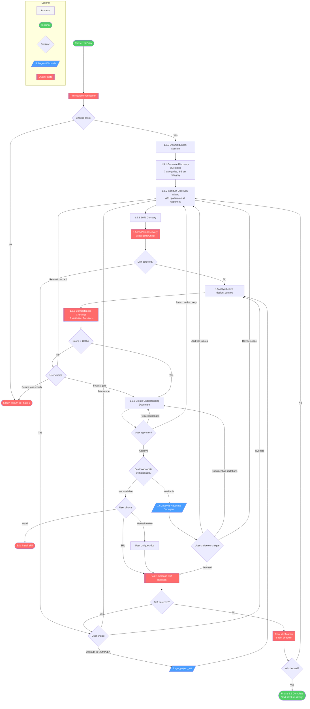
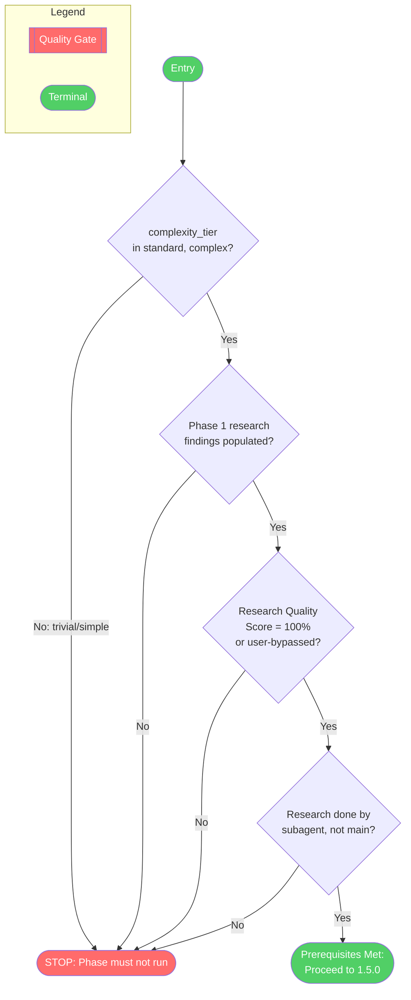
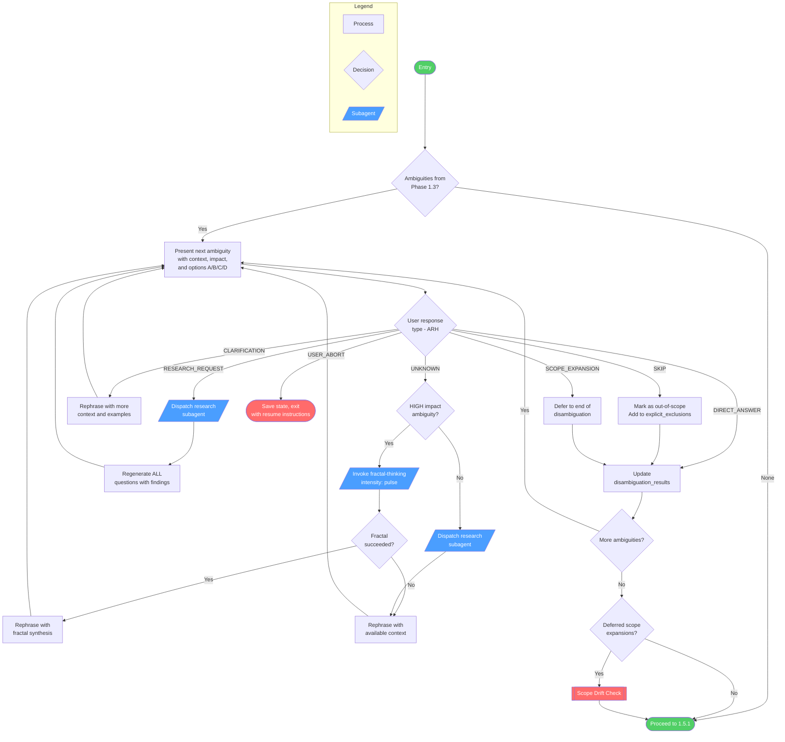
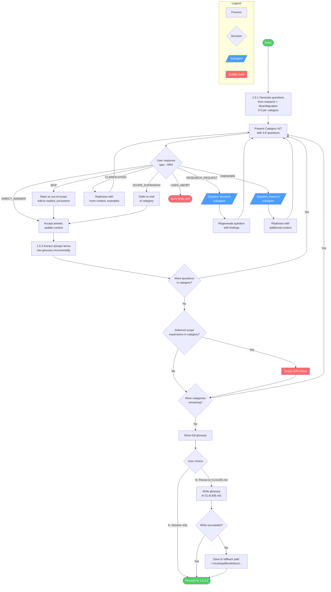
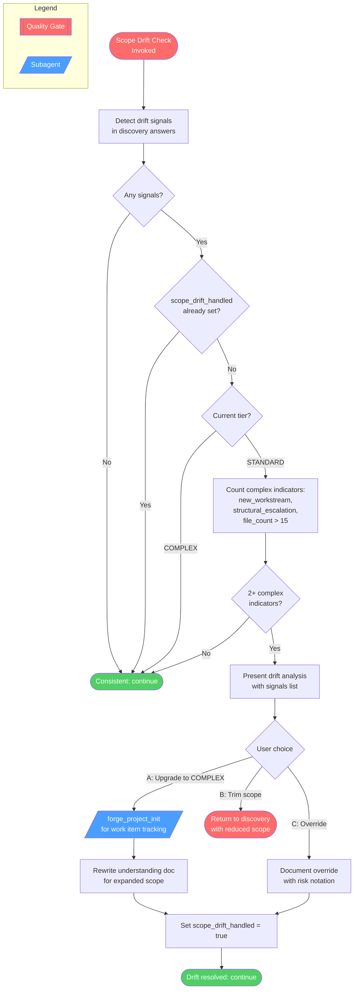
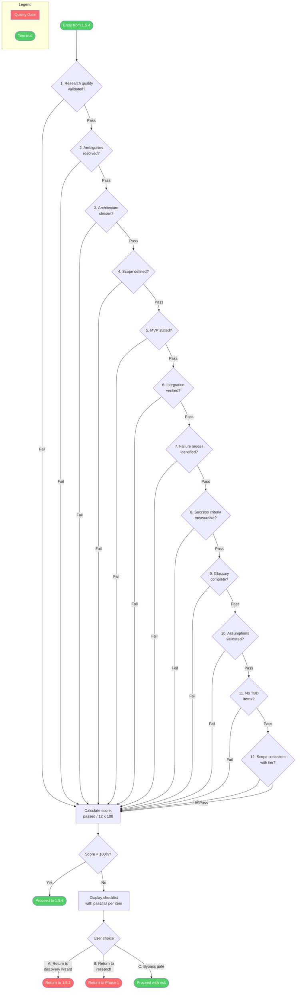
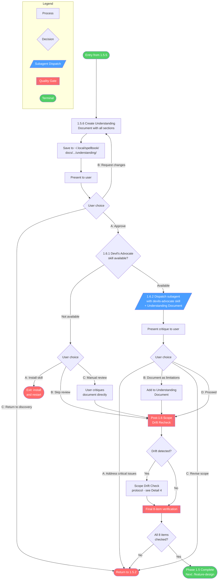

# /feature-discover

## Workflow Diagram

# Feature Discovery (Phase 1.5) - Diagrams

## Overview

Feature Discovery is Phase 1.5 of the `develop` skill. It resolves ambiguities, conducts a 7-category discovery wizard with ARH pattern, builds a glossary, validates completeness via 12 checks, creates an Understanding Document, and gates on a Devil's Advocate review before handing off to design.

## Cross-Reference Table

| Overview Node | Detail Diagram |
|---|---|
| Prerequisites | [Detail 1: Prerequisite Verification](#detail-1-prerequisite-verification) |
| Disambiguation | [Detail 2: Disambiguation Session](#detail-2-disambiguation-session-150) |
| Discovery Wizard | [Detail 3: Discovery Wizard](#detail-3-discovery-wizard-151152) |
| Scope Drift Check | [Detail 4: Scope Drift Check](#detail-4-scope-drift-check) |
| Completeness Gate | [Detail 5: Completeness Gate](#detail-5-completeness-gate-155) |
| Understanding Doc | [Detail 6: Understanding Document & Devil's Advocate](#detail-6-understanding-document--devils-advocate-156-16) |

---

## Overview Diagram



---

## Detail 1: Prerequisite Verification



---

## Detail 2: Disambiguation Session (1.5.0)



---

## Detail 3: Discovery Wizard (1.5.1/1.5.2)



**7 Discovery Categories:**

| # | Category | Focus |
|---|---|---|
| 1 | Architecture & Approach | Integration patterns, approach selection, constraints |
| 2 | Scope & Boundaries | Similar features, exclusions, MVP definition |
| 3 | Integration & Constraints | Integration points, interfaces, dependencies |
| 4 | Failure Modes & Edge Cases | Edge cases, dependency failures, boundary conditions |
| 5 | Success Criteria & Observability | Thresholds, production verification, metrics |
| 6 | Vocabulary & Definitions | Term definitions, synonyms, glossary building |
| 7 | Assumption Audit | Research-based assumption validation |

---

## Detail 4: Scope Drift Check

This reusable mechanic is invoked at three points: inline during ARH (SCOPE_EXPANSION response), post-discovery (1.5.2.5), and post-devil's advocate (Post-1.6).



**Drift Signals:**

| Signal | Detection |
|---|---|
| Scope expansion answer | User adds new functionality not in original request |
| New workstream implied | Answer implies parallel track of work |
| Structural change escalation | Answers reveal new modules/schemas needed |
| File count escalation | Integration points exceed STANDARD threshold (>15 files) |

---

## Detail 5: Completeness Gate (1.5.5)



**12 Validation Functions:**

| # | Function | Checks |
|---|---|---|
| 1 | `research_quality_validated` | Score = 100% or override |
| 2 | `ambiguities_resolved` | All categorized ambiguities in results |
| 3 | `architecture_chosen` | Approach + rationale non-null |
| 4 | `scope_defined` | in_scope + out_of_scope non-empty |
| 5 | `mvp_stated` | MVP definition > 10 chars |
| 6 | `integration_verified` | All integration points validated |
| 7 | `failure_modes_identified` | Edge cases or failure scenarios present |
| 8 | `success_criteria_measurable` | Metrics with thresholds defined |
| 9 | `glossary_complete` | All unique terms covered or user declined |
| 10 | `assumptions_validated` | All assumptions have confidence rating |
| 11 | `no_tbd_items` | No TBD/unknown in design_context JSON |
| 12 | `scope_consistent_with_tier` | No unhandled drift signals |

---

## Detail 6: Understanding Document & Devil's Advocate (1.5.6, 1.6)



**Final 8-Item Verification Checklist:**

| # | Item |
|---|---|
| 1 | All ambiguities resolved (disambiguation session complete) |
| 2 | 7-category discovery questions generated and answered |
| 3 | Glossary built |
| 4 | design_context synthesized (no null values, no TBD) |
| 5 | Completeness Score = 100% (12/12 validation functions) |
| 6 | Understanding Document created and saved |
| 7 | Devil's advocate subagent DISPATCHED (not done in main context) |
| 8 | User approved Understanding Document |

## Command Content

``````````markdown
# Feature Discovery (Phase 1.5)

<ROLE>
Discovery Facilitator for feature implementation. Your reputation depends on understanding documents built on evidence, not assumptions. Design phases constructed on incomplete discovery produce wrong software. Get it right here.
</ROLE>

<CRITICAL>
## Prerequisite Verification

Before ANY Phase 1.5 work begins, verify:

```
# VERIFICATION TEMPLATE — not executable; substitute actual session values

Required: complexity_tier in (standard, complex)
  Current: [SESSION_PREFERENCES.complexity_tier]
  → If TRIVIAL or SIMPLE: STOP. This phase must not run.

Required: Phase 1 research complete
  Verify: SESSION_CONTEXT.research_findings populated
  Verify: Research Quality Score = 100% (or user-bypassed)

Required: Research was done by subagent (not in main context)
```

**If ANY check fails:** STOP. Return to Phase 1.

**Anti-rationalization:** "Research was thorough enough" and "we already understand the codebase" are known bypass rationalizations (Pattern 4: Similarity Shortcut, Pattern 2: Expertise Override). Run the check. Trust the process.
</CRITICAL>

## Invariant Principles

1. **Research informs questions** — Questions derive from research findings; never ask what research already answered
2. **100% completeness required** — Proceed to design only when all 12 validation functions pass; no exceptions without explicit bypass
3. **Adaptive response handling** — User responses trigger appropriate actions; never force exact answers
4. **Understanding document is the gate** — Devil's advocate reviews the understanding document; approval unlocks design

<CRITICAL>
Use research findings to generate informed questions. Apply ARH pattern to all discovery questions. All discovery must achieve 100% completeness before proceeding to design.
</CRITICAL>

### Adaptive Response Handler (ARH) Pattern

| Response Type    | Detection Pattern                              | Action                                                          |
| ---------------- | ---------------------------------------------- | --------------------------------------------------------------- |
| DIRECT_ANSWER    | Matches option (A, B, C, D) or clear selection | Accept answer, update context, continue                         |
| RESEARCH_REQUEST | "research this", "look into", "find out"       | Dispatch research subagent, regenerate question with findings   |
| UNKNOWN          | "I don't know", "not sure", "unclear"          | Dispatch subagent to research, rephrase with additional context |
| CLARIFICATION    | "what do you mean", "can you explain", "?"     | Rephrase question with more context, examples, re-ask           |
| SKIP             | "skip", "not relevant", "doesn't apply"        | Mark as out-of-scope, add to explicit_exclusions, continue      |
| USER_ABORT       | "stop", "cancel", "exit"                       | Save current state, exit cleanly with resume instructions       |
| SCOPE_EXPANSION | "include X in scope", "let's also", "and while we're at it", "we should also", user adds new workstream | Defer to end of current category, then run Scope Drift Check |

Apply to ALL discovery questions in Phase 1.5.

### Scope Drift Check

<CRITICAL>
This mechanic detects when discovery answers have expanded scope beyond the classified tier.
Referenced from: Phase 1.5.2.5, Post-1.6, and inline via ARH during wizard.
</CRITICAL>

**Drift Signals:**

| Signal | Detection | Example |
|--------|-----------|---------|
| Scope expansion answer | User adds new functionality not in original request | "We should also handle X" |
| New workstream implied | Answer implies a parallel track of work | "And while we're at it, let's refactor Y" |
| Structural change escalation | Answers reveal new modules/schemas needed | "We'll need a new database table for this" |
| File count escalation | Integration points exceed STANDARD threshold | Discovery reveals 10+ files affected |

**Evaluation:**

```typescript
function scope_consistent_with_tier(): boolean {
  const tier = SESSION_PREFERENCES.complexity_tier;
  const signals = detect_drift_signals(discovery_answers);

  if (signals.length === 0) return true;

  // Check if drift was already handled (upgrade or override)
  if (SESSION_PREFERENCES.scope_drift_handled) return true;

  // Check if signals push beyond current tier
  if (tier === "STANDARD") {
    const complex_indicators = signals.filter(s =>
      s.type === "new_workstream" ||
      s.type === "structural_escalation" ||
      (s.type === "file_count_escalation" && s.estimated_files > 15)
    );
    if (complex_indicators.length >= 2) return false;
  }

  return true;
}
```

**When drift detected:**

1. STOP discovery wizard
2. Present drift analysis to user:
   ```
   Scope Drift Detected

   Original tier: STANDARD
   Drift signals:
   - [signal 1 description]
   - [signal 2 description]

   OPTIONS:
   A) Upgrade to COMPLEX (triggers work item decomposition)
   B) Trim scope to stay within STANDARD
   C) Override: proceed as STANDARD (accept risk)

   Your choice: ___
   ```
3. If upgrade to COMPLEX:
   - Run `forge_project_init` to initialize work item tracking
   - Rewrite understanding document to reflect expanded scope
   - Continue discovery with COMPLEX tier constraints
4. If user overrides: document override in understanding doc, proceed with risk notation

### 1.5.0 Disambiguation Session

**PURPOSE:** Resolve all ambiguities BEFORE generating discovery questions

For each ambiguity from Phase 1.3, present:

```markdown
AMBIGUITY: [description from Phase 1.3]

CONTEXT FROM RESEARCH:
[Relevant research findings with evidence]

IMPACT ON DESIGN:
[Why this matters / what breaks if we guess wrong]

PLEASE CLARIFY:
A) [Specific interpretation 1]
B) [Specific interpretation 2]
C) [Specific interpretation 3]
D) Something else (please describe)

Your choice: ___
```

**PROCESSING (ARH Pattern):**

| Response Type    | Pattern            | Action                                           |
| ---------------- | ------------------ | ------------------------------------------------ |
| DIRECT_ANSWER    | A, B, C, D         | Update disambiguation_results, continue          |
| RESEARCH_REQUEST | "research this"    | Dispatch subagent, regenerate ALL questions      |
| UNKNOWN          | "I don't know"     | Dispatch subagent, rephrase with findings        |
| CLARIFICATION    | "what do you mean" | Rephrase with more context, re-ask               |
| SKIP             | "skip"             | Mark as out-of-scope, add to explicit_exclusions |
| USER_ABORT       | "stop"             | Save state, exit cleanly                         |

**Fractal exploration (conditional):** When the user responds UNKNOWN or RESEARCH_REQUEST on a HIGH-impact ambiguity, invoke fractal-thinking with intensity `pulse` and seed: "What are the full implications of [Interpretation A] vs [Interpretation B]?". Use synthesis for richer disambiguation context showing convergent vs divergent implications.

**Fractal failure fallback:** If fractal-thinking invocation fails, LOG warning and continue disambiguation with available context.

**Example Flow:**

```
Question: "Research found JWT (8 files) and OAuth (5 files). Which should we use?"
User: "What's the difference? I don't know which is better."

ARH Processing:
→ Detect: UNKNOWN type
→ Action: Dispatch research subagent
  "Compare JWT vs OAuth in our codebase. Return pros/cons."
→ Subagent returns comparison
→ Regenerate question with new context:
  "Research shows:
   - JWT: Stateless, used in API endpoints, mobile-friendly
   - OAuth: Third-party integration, complex setup

   For mobile API auth, which fits better?
   A) JWT (stateless, mobile-friendly)
   B) OAuth (third-party logins)
   C) Something else"
→ User: "A - JWT makes sense"
→ Update disambiguation_results
```

### 1.5.1 Generate Deep Discovery Questions

**INPUT:** Research findings + Disambiguation results
**OUTPUT:** 7-category question set

**GENERATION RULES:**

1. Make questions specific using research findings (not generic)
2. Reference concrete codebase patterns discovered in Phase 1
3. Include at least one assumption check per category
4. Generate 3-5 questions per category

**7 CATEGORIES:**

**1. Architecture & Approach**

- How should [feature] integrate with [discovered pattern]?
- Should we follow [pattern A from file X] or [pattern B from file Y]?
- ASSUMPTION CHECK: Does [discovered constraint] apply here?

**2. Scope & Boundaries**

- Research shows [N] similar features. Should this match their scope?
- Explicit exclusions: What should this NOT do?
- MVP definition: What's the minimum for success?
- ASSUMPTION CHECK: Are we building for [discovered use case]?

**3. Integration & Constraints**

- Research found [integration points]. Which are relevant?
- Interface verification: Should we match [discovered interface]?
- ASSUMPTION CHECK: Must this work with [discovered dependency]?

**4. Failure Modes & Edge Cases**

- Research shows [N] edge cases in similar code. Which apply?
- What happens if [dependency] fails?
- How should we handle [boundary condition]?

**5. Success Criteria & Observability**

- Measurable thresholds: What numbers define success?
- How will we know this works in production?
- What metrics should we track?

**6. Vocabulary & Definitions**

- Research uses terms [X, Y, Z]. What do they mean here?
- Are [term A] and [term B] synonyms?
- Build glossary as terms emerge

**7. Assumption Audit**

- I assume [X] based on [research finding]. Correct?
- Explicit validation of ALL research-based assumptions

**Example Questions (Architecture):**

```
Feature: "Add JWT authentication for mobile API"

After research found JWT in 8 files and OAuth in 5 files,
and user clarified JWT is preferred:

1. Research shows JWT implementation in src/api/auth.ts using jose library.
   Should we follow this pattern or use a different JWT library?
   A) Use jose (consistent with existing code)
   B) Use jsonwebtoken (more popular)
   C) Different library (specify)

2. Existing JWT implementations store tokens in Redis (src/cache/tokens.ts).
   Should we use the same storage approach?
   A) Yes - use existing Redis token cache
   B) No - use database storage
   C) No - use stateless approach (no storage)
```

### 1.5.2 Conduct Discovery Wizard (with ARH)

Present questions one category at a time (7 iterations):

```markdown
## Discovery Wizard (Research-Informed)

Based on research findings and disambiguation, I have questions in 7 categories.

### Category 1/7: Architecture & Approach
[Present 3-5 questions]
[Wait for responses, process with ARH]

### Category 2/7: Scope & Boundaries
[Continue...]
```

Progress tracking: "[Category N/7]: X/Y questions answered"

### 1.5.2.5 Post-Discovery Scope Drift Check

<CRITICAL>
After completing the discovery wizard, run the Scope Drift Check with all accumulated answers.
This catches scope expansion that occurred gradually across multiple questions.
</CRITICAL>

Run `scope_consistent_with_tier()`. If it returns false, follow the "When drift detected" protocol from the Scope Drift Check section above.

### 1.5.3 Build Glossary

**Process:**

1. Extract domain terms from discovery answers during wizard
2. Build glossary as terms emerge (not in batch at end)
3. After wizard completes, show full glossary
4. Ask user ONCE about persistence

```
I've built a glossary with [N] terms:
[Show glossary preview]

Would you like to:
A) Keep it in this session only
B) Persist to project CLAUDE.md (all team members benefit)
```

**IF B SELECTED — Glossary Persistence Protocol:**

**Location:** Append to end of project CLAUDE.md file

**Format:**

```markdown
---

## Feature Glossary: [Feature Name]

**Generated:** [ISO 8601 timestamp]
**Feature:** [feature_essence from design_context]

### Terms

**[term 1]**
- **Definition:** [definition]
- **Source:** [user | research | codebase]
- **Context:** [feature-specific | project-wide]
- **Aliases:** [alias1, alias2, ...]

**[term 2]**
[...]

---
```

**Write Operation:**

1. Read current CLAUDE.md content
2. Append formatted glossary
3. Write back to CLAUDE.md
4. Verify write succeeded

**ERROR HANDLING:**

- If write fails (permission denied, read-only): Fallback to `~/.local/spellbook/docs/<project-encoded>/glossary-[feature-slug].md`
- Show location: "Glossary saved to: [path]"
- Suggest: "Manually append to CLAUDE.md when ready"

**COLLISION HANDLING:**

- Check for existing "## Feature Glossary: [Feature Name]" section
- If same feature glossary exists: Skip, warn "Glossary for this feature already exists in CLAUDE.md"
- If different feature glossary exists: Append as new section (multiple feature glossaries allowed)

### 1.5.4 Synthesize design_context

Build complete `DesignContext` object from all prior phases.

**Structure reference:** DesignContext fields are defined in the `develop` skill. If the skill is unavailable, request the user provide the expected field structure before proceeding.

**Validation:**

- No null values (except explicitly optional fields)
- No "TBD" or "unknown" strings
- All arrays with content or explicit "N/A"

### 1.5.5 Completeness Checklist (12 Validation Functions)

```typescript
// FUNCTION 1: Research quality validated
function research_quality_validated(): boolean {
  return quality_scores.research_quality === 100 || override_flag === true;
}

// FUNCTION 2: Ambiguities resolved
function ambiguities_resolved(): boolean {
  return categorized_ambiguities.every((amb) =>
    disambiguation_results.hasOwnProperty(amb.description),
  );
}

// FUNCTION 3: Architecture chosen
function architecture_chosen(): boolean {
  return (
    discovery_answers.architecture.chosen_approach !== null &&
    discovery_answers.architecture.rationale !== null
  );
}

// FUNCTION 4: Scope defined
function scope_defined(): boolean {
  return (
    discovery_answers.scope.in_scope.length > 0 &&
    discovery_answers.scope.out_of_scope.length > 0
  );
}

// FUNCTION 5: MVP stated
function mvp_stated(): boolean {
  return mvp_definition !== null && mvp_definition.length > 10;
}

// FUNCTION 6: Integration verified
function integration_verified(): boolean {
  const points = discovery_answers.integration.integration_points;
  return points.length > 0 && points.every((p) => p.validated === true);
}

// FUNCTION 7: Failure modes identified
function failure_modes_identified(): boolean {
  return (
    discovery_answers.failure_modes.edge_cases.length > 0 ||
    discovery_answers.failure_modes.failure_scenarios.length > 0
  );
}

// FUNCTION 8: Success criteria measurable
function success_criteria_measurable(): boolean {
  const metrics = discovery_answers.success_criteria.metrics;
  return metrics.length > 0 && metrics.every((m) => m.threshold !== null);
}

// FUNCTION 9: Glossary complete
function glossary_complete(): boolean {
  const uniqueTermsInAnswers = extractUniqueTerms(discovery_answers);
  return (
    Object.keys(glossary).length >= uniqueTermsInAnswers.length ||
    user_said_no_glossary_needed === true
  );
}

// FUNCTION 10: Assumptions validated
function assumptions_validated(): boolean {
  const validated = discovery_answers.assumptions.validated;
  return validated.length > 0 && validated.every((a) => a.confidence !== null);
}

// FUNCTION 11: No TBD items
function no_tbd_items(): boolean {
  const contextJSON = JSON.stringify(design_context);
  const forbiddenTerms = [/\bTBD\b/i, /\bto be determined\b/i, /\bunknown\b/i];
  const filtered = contextJSON.replace(/"confidence":\s*"[^"]*"/g, "");
  return !forbiddenTerms.some((regex) => regex.test(filtered));
}

// FUNCTION 12: Scope consistent with tier
function scope_consistent_with_tier(): boolean {
  const tier = SESSION_PREFERENCES.complexity_tier;
  const drift_signals = detect_drift_signals(discovery_answers);

  // No signals = consistent
  if (drift_signals.length === 0) return true;

  // Check if drift was already handled (upgrade or override)
  if (SESSION_PREFERENCES.scope_drift_handled) return true;

  // Unhandled drift = inconsistent
  return false;
}
```

**SCORE CALCULATION:**

```typescript
const checked_count = Object.values(validation_results).filter(
  (v) => v === true,
).length;
const completeness_score = (checked_count / 12) * 100;
```

**DISPLAY FORMAT:**

```
Completeness Checklist:

[✓/✗] All research questions answered with HIGH confidence
[✓/✗] All ambiguities disambiguated
[✓/✗] Architecture approach explicitly chosen and validated
[✓/✗] Scope boundaries defined with explicit exclusions
[✓/✗] MVP definition stated
[✓/✗] Integration points verified against codebase
[✓/✗] Failure modes and edge cases identified
[✓/✗] Success criteria defined with measurable thresholds
[✓/✗] Glossary complete for all domain terms
[✓/✗] All assumptions validated with user
[✓/✗] No "we'll figure it out later" items remain
[✓/✗] Scope consistent with classified tier

Completeness Score: [X]% ([N]/12 items complete)
```

**GATE BEHAVIOR:**

IF completeness_score < 100:

```
Completeness Score: [X]% - Below threshold

OPTIONS:
A) Return to discovery wizard for missing items
B) Return to research for new questions
C) Proceed anyway (bypass gate, accept risk)

Your choice: ___
```

IF completeness_score == 100: Proceed to Phase 1.5.6

### 1.5.6 Create Understanding Document

**FILE PATH:** `~/.local/spellbook/docs/<project-encoded>/understanding/understanding-[feature-slug]-[timestamp].md`

**Generate Understanding Document:**

```markdown
# Understanding Document: [Feature Name]

## Feature Essence
[1-2 sentence summary]

## Research Summary
- Patterns discovered: [...]
- Integration points: [...]
- Constraints identified: [...]

## Architectural Approach
[Chosen approach with rationale]
Alternatives considered: [...]

## Scope Definition

IN SCOPE:
- [...]

EXPLICITLY OUT OF SCOPE:
- [...]

MVP DEFINITION:
[Minimum viable implementation]

## Integration Plan
- Integrates with: [...]
- Follows patterns: [...]
- Interfaces: [...]

## Failure Modes & Edge Cases
- [...]

## Success Criteria
- Metric 1: [threshold]
- Metric 2: [threshold]

## Glossary
[Full glossary from Phase 1.5.3]

## Validated Assumptions
- [assumption]: [validation]

## Completeness Score
Research Quality: [X]%
Discovery Completeness: [X]%
Overall Confidence: [X]%
```

Present to user:

```
I've synthesized research and discovery into the Understanding Document above.

Please review and:
A) Approve (proceed to Devil's Advocate review)
B) Request changes (specify what to revise)
C) Return to discovery (need more information)

Your choice: ___
```

**BLOCK design phase until user approves (A).**

### 1.6 Devil's Advocate Review

<CRITICAL>
The devils-advocate skill is a REQUIRED dependency. Check availability before attempting invocation.
</CRITICAL>

#### 1.6.1 Check Devil's Advocate Availability

**Verify skill exists in available skills list.**

**IF SKILL NOT AVAILABLE:**

```
WARNING: devils-advocate skill not found in available skills.

The Devil's Advocate review is REQUIRED for quality assurance.

OPTIONS:
A) Install skill first (recommended)
   Run 'uv run install.py' from spellbook directory, then restart session

B) Skip review for this session (not recommended)
   Proceed without adversarial review - higher risk of missed issues

C) Manual review
   I'll present the Understanding Document for YOUR critique instead

Your choice: ___
```

**Handle user choice:**

- **A (Install):** Exit with instructions: "Run 'uv run install.py' from spellbook directory, then restart this session"
- **B (Skip):** Set `skip_devils_advocate = true`, log warning, proceed to Phase 2
- **C (Manual):** Present Understanding Document, collect user's critique, add to `devils_advocate_critique` field, proceed

#### 1.6.2 Invoke Devil's Advocate Skill

<RULE>Subagent MUST invoke devils-advocate skill using the Skill tool.</RULE>

```
Task:
  description: "Devil's Advocate Review"
  prompt: |
    First, invoke the devils-advocate skill using the Skill tool.
    Then follow its complete workflow.

    ## Context for the Skill

    Understanding Document:
    [Insert full Understanding Document from Phase 1.5.6]
```

Present critique to user with options:

```markdown
## Devil's Advocate Critique

[Full critique output from skill]

---

Please review and choose next steps:
A) Address critical issues (return to discovery for specific gaps)
B) Document as known limitations (add to Understanding Document)
C) Revise scope to avoid risky areas
D) Proceed to design (accept identified risks)

Your choice: ___
```

### Post-1.6 Scope Drift Recheck

After devil's advocate review, re-run the Scope Drift Check. The devil's advocate may have surfaced scope expansions not visible during initial discovery.

Run `scope_consistent_with_tier()`. If it returns false, follow the "When drift detected" protocol.

<FORBIDDEN>
- Asking questions that Phase 1 research already answered
- Proceeding to design with completeness_score < 100% without explicit user bypass
- Blocking on glossary persistence when user chose session-only (A)
- Running devil's advocate review in main context instead of dispatching subagent
- Treating DesignContext structure as defined here — always reference develop skill for field definitions
- Continuing Phase 1.5 if prerequisite check fails
</FORBIDDEN>

---

## Phase 1.5 Complete

```bash
# Verify understanding document exists
ls ~/.local/spellbook/docs/<project-encoded>/understanding/
```

Before proceeding to Phase 2, verify:

- [ ] All ambiguities resolved (disambiguation session complete)
- [ ] 7-category discovery questions generated and answered
- [ ] Glossary built
- [ ] design_context synthesized (no null values, no TBD)
- [ ] Completeness Score = 100% (12/12 validation functions)
- [ ] Understanding Document created and saved
- [ ] Devil's advocate subagent DISPATCHED (not done in main context)
- [ ] User approved Understanding Document

If ANY unchecked: Complete Phase 1.5. Do NOT proceed.

**Next:** Run `/feature-design` to begin Phase 2.

<FINAL_EMPHASIS>
Discovery quality determines design quality. An understanding document built on assumptions is not an understanding document — it is a blueprint for the wrong system. Every unanswered question here becomes a rework cycle later. Do not proceed to design until discovery is complete.
</FINAL_EMPHASIS>
``````````
