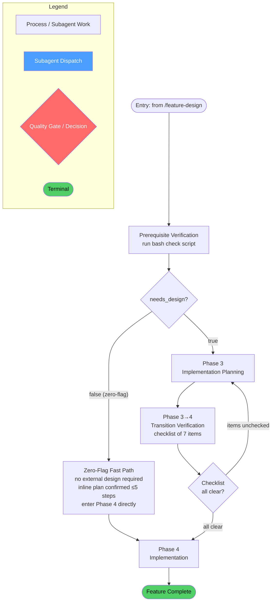
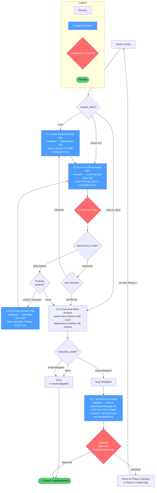

# /feature-implement

## Workflow Diagram

Now I'll generate the diagrams based on the full content of the file.

## Overview: `/feature-implement` (Phases 3–4)



---

## Phase 3: Implementation Planning (Detail)



---

## Phase 4: Implementation — Worktree Setup & Task Execution (Detail)

```mermaid
flowchart TD
    entry4["Phase 4 Entry\nORCHESTRATION ONLY in main context"]

    wt{"worktree\nstrategy?"}
    wt_single["4.1 Create Single Worktree\nsubagent → using-git-worktrees skill"]
    wt_para["4.1 Parallel Worktree Setup\nsetup/skeleton tasks first\ncommit before creating worktrees\nsubagent → using-git-worktrees per track"]
    wt_none["4.1 No Worktree\nwork in current directory"]

    para{"parallelization\nstrategy?"}
    exec_ppt["4.2 Parallel Track Execution\none background Task per worktree\nsubagent → executing-plans skill\nverify branch before any work"]
    exec_max["4.2 Maximize Parallel Groups\nsubagent → dispatching-parallel-agents skill\ngroup tasks by Parallel Group field"]
    exec_seq["4.2 Sequential Execution\nsubagent → executing-plans skill"]

    smartmerge["4.2.5 Smart Merge\nsubagent → merging-worktrees skill\ndelete worktrees after merge\nverify all tests pass\nverify interface contracts"]

    taskloop{"More tasks\nin plan?"}

    tdd["4.3 Implement Task N\nsubagent → test-driven-development skill\nread assertion-quality-standard.md first\nFULL ASSERTION PRINCIPLE: assert == only\nno substring / len / mock.ANY assertions\ncommit when done"]

    dialect{"dialectic_mode?"}
    roundtable["4.3.1 Dialectic Overlay\nforge_roundtable_convene at IMPLEMENT stage\nplanning_and_gates: 3 archetypes\nfull: all 10 archetypes"]

    verify["4.4 Completion Verification\nauditor subagent: acceptance criteria check\nexpected outputs, interface contracts\nbehavior verification, dead code paths\noutput: COMPLETE / INCOMPLETE / PARTIAL"]
    vgate{"Blocking\nissues?"}

    review["4.5 Code Review\nsubagent → requesting-code-review skill"]
    rgate{"Issue\nseverity?"}

    factcheck["4.5.1 Claim Validation\nsubagent → fact-checking skill\nscope: files for Task N only\ndocstrings, comments, test names, type hints"]
    fcgate{"False\nclaims?"}

    nexttask["Mark task complete\nadvance to next task"]

    qgates["→ Phase 4 Quality Gates\n(all tasks complete)"]

    entry4 --> wt
    wt -->|"single"| wt_single
    wt -->|"per_parallel_track"| wt_para
    wt -->|"none"| wt_none

    wt_single --> para
    wt_para --> para
    wt_none --> para

    para -->|"per_parallel_track"| exec_ppt
    para -->|"maximize"| exec_max
    para -->|"conservative"| exec_seq

    exec_ppt --> smartmerge
    smartmerge --> taskloop
    exec_max --> taskloop
    exec_seq --> taskloop

    taskloop -->|"yes"| tdd
    tdd --> dialect
    dialect -->|"roundtable or full"| roundtable
    dialect -->|"planning_only or none"| verify
    roundtable --> verify

    verify --> vgate
    vgate -->|"YES: fix and re-verify"| tdd
    vgate -->|"NO: all complete"| review

    review --> rgate
    rgate -->|"critical: fix immediately"| tdd
    rgate -->|"important / minor"| factcheck

    factcheck --> fcgate
    fcgate -->|"YES: fix immediately"| tdd
    fcgate -->|"NO: clean"| nexttask
    nexttask --> taskloop

    taskloop -->|"no more tasks"| qgates

    style wt_single fill:#4a9eff,color:#fff
    style wt_para fill:#4a9eff,color:#fff
    style exec_ppt fill:#4a9eff,color:#fff
    style exec_max fill:#4a9eff,color:#fff
    style exec_seq fill:#4a9eff,color:#fff
    style smartmerge fill:#4a9eff,color:#fff
    style tdd fill:#4a9eff,color:#fff
    style roundtable fill:#4a9eff,color:#fff
    style review fill:#4a9eff,color:#fff
    style factcheck fill:#4a9eff,color:#fff
    style vgate fill:#ff6b6b,color:#fff
    style rgate fill:#ff6b6b,color:#fff
    style fcgate fill:#ff6b6b,color:#fff
    style qgates fill:#51cf66,color:#000

    subgraph LEGEND4[" Legend"]
        la4["Process"]
        lb4["Subagent Dispatch"]
        lc4{"Quality Gate / Decision"}
        ld4(["Terminal"])
    end
    style lb4 fill:#4a9eff,color:#fff
    style lc4 fill:#ff6b6b,color:#fff
    style ld4 fill:#51cf66,color:#000
```



---

## Phase 4: Quality Gates & Completion (Detail)

```mermaid
flowchart TD
    qentry["Phase 4 Quality Gates Entry\n(all tasks complete)"]

    audit["4.6.1 Comprehensive Implementation Audit\nauditor subagent: plan item sweep\ncross-task integration verification\ndesign doc traceability\nfeature completeness end-to-end"]
    auditgate{"Blocking\nissues?"}

    testsuite["4.6.2 Run Full Test Suite\npytest / npm test / cargo test"]
    testgate{"Tests\npassing?"}
    debug["subagent → systematic-debugging skill\nfix issues, then re-run"]

    mirage["4.6.3 Green Mirage Audit\nsubagent → audit-green-mirage skill\nread assertion-quality-standard.md first\nfocus: new code from this feature\nFULL ASSERTION PRINCIPLE enforced"]
    mirgate{"Issues\nfound?"}

    compfact["4.6.4 Comprehensive Claim Validation\nsubagent → fact-checking skill\nscope: ALL files for this feature\ncross-reference design doc + impl plan"]
    cfgate{"Issues\nfound?"}

    prepr["4.6.5 Pre-PR Claim Validation\nsubagent → fact-checking skill\nscope: branch diff since merge-base\nlast line of defense before PR"]
    ppgate{"Issues\nfound?"}

    postmode{"post_impl?"}
    finish_opts["4.7 Offer Options\nsubagent → finishing-a-development-branch skill\npresent: merge / create PR / cleanup"]
    finish_pr["4.7 Auto PR\npush branch\ngh pr create\nreturn URL"]
    finish_stop["4.7 Stop\nannounce complete\nsummarize work\nlist remaining TODOs"]
    done4(["Feature Complete"])

    qentry --> audit
    audit --> auditgate
    auditgate -->|"YES: fix and re-audit"| audit
    auditgate -->|"NO: clean"| testsuite

    testsuite --> testgate
    testgate -->|"FAIL"| debug
    debug --> testsuite
    testgate -->|"PASS"| mirage

    mirage --> mirgate
    mirgate -->|"YES: fix and re-audit"| mirage
    mirgate -->|"NO: clean"| compfact

    compfact --> cfgate
    cfgate -->|"YES: fix immediately"| compfact
    cfgate -->|"NO: clean"| prepr

    prepr --> ppgate
    ppgate -->|"YES: fix immediately"| prepr
    ppgate -->|"NO: clean"| postmode

    postmode -->|"offer_options"| finish_opts
    postmode -->|"auto_pr"| finish_pr
    postmode -->|"stop"| finish_stop

    finish_opts --> done4
    finish_pr --> done4
    finish_stop --> done4

    style audit fill:#4a9eff,color:#fff
    style debug fill:#4a9eff,color:#fff
    style mirage fill:#4a9eff,color:#fff
    style compfact fill:#4a9eff,color:#fff
    style prepr fill:#4a9eff,color:#fff
    style finish_opts fill:#4a9eff,color:#fff
    style finish_pr fill:#4a9eff,color:#fff
    style auditgate fill:#ff6b6b,color:#fff
    style testgate fill:#ff6b6b,color:#fff
    style mirgate fill:#ff6b6b,color:#fff
    style cfgate fill:#ff6b6b,color:#fff
    style ppgate fill:#ff6b6b,color:#fff
    style done4 fill:#51cf66,color:#000

    subgraph LEGEND5[" Legend"]
        la5["Process"]
        lb5["Subagent Dispatch"]
        lc5{"Quality Gate / Decision"}
        ld5(["Terminal"])
    end
    style lb5 fill:#4a9eff,color:#fff
    style lc5 fill:#ff6b6b,color:#fff
    style ld5 fill:#51cf66,color:#000
```



---

## Cross-Reference: Overview Nodes → Detail Diagrams

| Overview Node | Detail Diagram |
|---|---|
| Prerequisite Verification | Phase 3 Detail (entry condition) |
| Zero-Flag Fast Path | Phase 3 Detail (`escape_hatch = treat as ready`) |
| Phase 3: Implementation Planning | Phase 3 Detail diagram |
| Phase 4: Implementation | Phase 4 Task Execution + Phase 4 Quality Gates diagrams |

## Skills Invoked by Phase

| Step | Skill | Trigger |
|---|---|---|
| 3.1 | `writing-plans` | Create impl plan |
| 3.2 | `reviewing-impl-plans` | Review impl plan |
| 3.4 | `executing-plans` | Fix plan findings |
| 4.1 | `using-git-worktrees` | Create workspace(s) |
| 4.2 | `dispatching-parallel-agents` | Maximize parallelization |
| 4.2.5 | `merging-worktrees` | Merge parallel tracks |
| 4.3 | `test-driven-development` | TDD per task |
| 4.3.1 | `forge_roundtable_convene` (MCP) | Dialectic overlay (if enabled) |
| 4.5 | `requesting-code-review` | Per-task code review |
| 4.5.1, 4.6.4, 4.6.5 | `fact-checking` | Claim validation (3×) |
| 4.6.2 | `systematic-debugging` | Debug test failures |
| 4.6.3 | `audit-green-mirage` | Test quality audit |
| 4.7 | `finishing-a-development-branch` | Branch completion |

## Command Content

``````````markdown
# /feature-implement

Phases 3-4 of the develop workflow. Run after `/feature-design` completes (Phase 2 approved).

<CRITICAL>
## Prerequisite Verification

Before ANY Phase 3-4 work begins, run this verification:

```bash
# ══════════════════════════════════════════════════════════════
# PREREQUISITE CHECK: feature-implement (Phase 3-4)
# ══════════════════════════════════════════════════════════════

PROJECT_ROOT=$(git rev-parse --show-toplevel 2>/dev/null || pwd)
PROJECT_ENCODED=$(echo "$PROJECT_ROOT" | sed 's|^/||' | tr '/' '-')

echo "=== Phase 3-4 Prerequisites ==="

# CHECK 1: Determine entry path by need flags
NEEDS_DESIGN="[SESSION_PREFERENCES.need_flags.needs_design]"
echo "needs_design: $NEEDS_DESIGN"

if [ "$NEEDS_DESIGN" = "true" ]; then
  # CHECK 2 (needs_design): Design document must exist
  echo "Required: Design document exists"
  ls ~/.local/spellbook/docs/$PROJECT_ENCODED/plans/*-design.md 2>/dev/null || echo "FAIL: No design document found"

  # CHECK 3 (needs_design): Design review must be complete
  echo "Required: Design review completed"
else
  echo "Zero-flag fast path: no external design required"
  echo "Required: Inline plan confirmed by user (<=5 steps)"
  echo "Navigate directly to the '## Phase 4: Implementation' section header."
  echo "Skip the Phase 3 design-derived steps. Entering at Phase 4 directly."
fi

# CHECK 4 (all paths): No escape hatch conflict
echo "Verify: escape_hatch routing is consistent with current entry point"
```

**If ANY check fails:** STOP. Return to the appropriate phase.

**Anti-rationalization:** "Simple enough to hold in your head" or "plan as we go" = Pattern 3 (Time Pressure) or Pattern 5 (Competence Assertion). Implementation without a plan must be re-done.
</CRITICAL>

## Invariant Principles

1. **Design precedes implementation** - Never implement without an approved design document and implementation plan
2. **Delegate actual work** - Main context orchestrates; subagents write code, run tests, perform reviews
3. **Quality gates are mandatory** - Code review, fact-checking, and green mirage audit after every task; no exceptions
4. **Behavior preservation in refactoring** - Test verification at every transformation; no behavior changes without approval

---

## Phase 3: Implementation Planning

<CRITICAL>
Phase behavior depends on escape hatch:
- **No escape hatch:** Run full Phase 3
- **Impl plan with "review first":** Skip 3.1, start at 3.2
- **Impl plan with "treat as ready":** Skip entire Phase 3
</CRITICAL>

### 3.1 Create Implementation Plan

<RULE>Subagent MUST invoke writing-plans.</RULE>

```
Task (or subagent simulation):
  description: "Create implementation plan"
  prompt: |
    First, invoke the writing-plans skill using the Skill tool.
    Then follow its complete workflow.

    ## Context for the Skill

    Design document: ~/.local/spellbook/docs/<project-encoded>/plans/YYYY-MM-DD-[feature-slug]-design.md
    Parallelization preference: [maximize/conservative/ask]

    Save to: ~/.local/spellbook/docs/<project-encoded>/plans/YYYY-MM-DD-[feature-slug]-impl.md
```

### 3.2 Review Implementation Plan

<RULE>Subagent MUST invoke reviewing-impl-plans.</RULE>

```
Task (or subagent simulation):
  description: "Review implementation plan"
  prompt: |
    First, invoke the reviewing-impl-plans skill using the Skill tool.
    Then follow its complete workflow.

    ## Context for the Skill

    Implementation plan: ~/.local/spellbook/docs/<project-encoded>/plans/YYYY-MM-DD-[feature-slug]-impl.md
    Parent design document: ~/.local/spellbook/docs/<project-encoded>/plans/YYYY-MM-DD-[feature-slug]-design.md

    Return complete findings report with remediation plan.
```

### 3.3 Approval Gate

**Interactive mode:** Present findings to user. Ask: APPROVE (proceed to 3.4.5) or ITERATE (return to 3.1/3.2).
**Autonomous mode:** If findings are critical/important → fix automatically (dispatch executing-plans subagent). If minor → proceed.

### 3.4 Fix Implementation Plan

Dispatch subagent to invoke executing-plans skill. Pass: impl plan path, specific findings to fix, design doc for reference.

### 3.4.5 Execution Mode Analysis

<CRITICAL>
Determine execution strategy from plan structure and parallelization preference.
spellbook runs a single orchestrator: the only modes are `direct` and `delegated`.
</CRITICAL>

<analysis>
**Plan Structure Analysis:**

1. Parse implementation plan for track markers (`## Track N:` headers)
2. Count tasks (`- [ ] Task N.M:` lines)
3. Check for dependency markers (`<!-- depends-on: -->`)
4. Count distinct file-ownership clusters (files that no other task touches)

**Execution Mode Decision (evaluated in order; first match wins):**

```
if size_estimate is very small AND no parallelization requested:
    direct      (stay in session, minimal delegation)
else:
    delegated   (stay in session, one subagent per gate per task)
```

**Modes:**

- **direct**: Stay in session, minimal delegation. Only for the smallest changes
  where dispatching a subagent per gate would cost more than it saves.
- **delegated**: Stay in session, delegate to subagents (one subagent per gate per
  task). The default. For larger plans, gate dispatches are batched per the
  parallelization preference, but the orchestrator stays resident the whole time.

**Routing:** Both `direct` and `delegated` proceed to Phase 4 (the existing flow).
There is no fan-out into separate sessions; a single orchestrator carries the whole
plan. For efforts too large for one session, checkpoint via the Follow-up Tasks list
and hand off to a fresh session (see `finishing-a-development-branch`).
</analysis>

### 3.4.7 One-Pager Approval Gate (large delegated runs)

<CRITICAL>
For a large delegated run, no implementation dispatch begins UNTIL the operator has
explicitly approved a one-pager describing the planned implementation. This gate is
NOT waived by autonomous mode. See `~/.claude/CLAUDE.md` "Autonomous Mode and Scope
Discipline".
</CRITICAL>

**When this gate applies:** delegated runs large enough that the operator should see
the shape of the work before subagent dispatch begins. Small `direct` runs and small
delegated runs proceed directly to Phase 4.

**One-pager spec:**

- ≤ 200 lines
- Plain English, no architecture jargon
- Sections: (1) what we are building in 1-2 sentences, (2) the tasks (or task groups)
  by name and one-line purpose, (3) what is explicitly NOT in scope, (4) anything the
  operator should push back on before implementation begins
- Saved to `~/.local/spellbook/docs/<project-encoded>/plans/YYYY-MM-DD-[feature-slug]-one-pager.md`

**Approval mechanics:**

1. Generate the one-pager (dispatch a subagent — do not write inline)
2. Present to operator
3. Wait for explicit `approved` / `go` / `proceed` / equivalent
4. Silence does NOT count. A generic `ok` issued in response to a
   different question does NOT count. Only an explicit, scoped
   approval of THIS one-pager counts.
5. In autonomous mode: the orchestrator MUST still pause here. Surface
   the one-pager and request approval. Autonomous mode does not waive
   approval; it only waives trivial confirmations.

If the operator pushes back, return to Phase 2 (design) or Phase 3.1
(planning) as appropriate. Fix the root design or plan first, then regenerate the
one-pager.

<FORBIDDEN>
- Beginning implementation dispatch before one-pager approval (large delegated runs)
- Treating autonomous mode as approval
- Treating an unrelated `ok` from the operator as approval of the one-pager
</FORBIDDEN>

---

## ═══════════════════════════════════════════════════════════════════
## STOP AND VERIFY: Phase 3 → Phase 4 Transition
## ═══════════════════════════════════════════════════════════════════

Before proceeding to Phase 4, verify Phase 3 is complete:

```bash
# Verify implementation plan exists
ls ~/.local/spellbook/docs/<project-encoded>/plans/*-impl.md
```

- [ ] Writing-plans subagent DISPATCHED (not done in main context)
- [ ] Implementation plan created and saved
- [ ] Reviewing-impl-plans subagent DISPATCHED
- [ ] Approval gate handled per autonomous_mode
- [ ] All critical/important findings fixed (if any)
- [ ] Execution mode analyzed (delegated / direct)
- [ ] If large delegated run: one-pager approved by operator (3.4.7)

If ANY unchecked: Go back to Phase 3. Do NOT proceed.

---

## Phase 4: Implementation

<CRITICAL>
This phase executes for both execution modes ("delegated" and "direct").
During Phase 4, delegate actual work to subagents. Main context is for ORCHESTRATION ONLY.
</CRITICAL>

### Phase 4 Delegation Rules

**Main context handles:** Task sequencing, dependency management, quality gate verification, user interaction, synthesizing subagent results, session state.

**Subagents handle:** Writing code (invoke test-driven-development), running tests, code review (invoke requesting-code-review), fact-checking, file exploration.

<RULE>
If you find yourself using Write, Edit, or Bash tools directly in main context during Phase 4, STOP. Delegate to a subagent instead.
</RULE>

### Phase 4 Routing by Execution Mode

| execution_mode | Phase 4 Path |
|----------------|---------------|
| `direct` | Sections 4.1 - 4.7 below, minimal delegation, single orchestrator context |
| `delegated` | Sections 4.1 - 4.7 below, one subagent per gate per task, orchestrator coordinates |

Both modes run the same sections; they differ only in how much per-gate work is
delegated. The orchestrator stays resident for the entire phase.

### 4.1 Setup Worktree(s)

**If worktree == "single":**

```
Task (or subagent simulation):
  description: "Create worktree"
  prompt: |
    First, invoke the using-git-worktrees skill using the Skill tool.
    Create an isolated workspace for this feature.

    ## Context for the Skill

    Feature name: [feature-slug]
    Purpose: Isolated implementation

    Return the worktree path when done.
```

**If worktree == "per_parallel_track":**

<CRITICAL>
Before creating parallel worktrees, setup/skeleton work MUST be completed and committed.
This ensures all worktrees start with shared interfaces.
</CRITICAL>

<CRITICAL>
After creating the worktree, record the EXACT path and branch name. ALL subsequent subagent dispatches MUST include:
- Absolute worktree path
- Expected branch name
- Verification preamble (see dispatching-parallel-agents skill)
</CRITICAL>

1. Identify setup/skeleton tasks from impl plan
2. Execute setup tasks in main branch, commit
3. Create worktree per parallel group

**If worktree == "none":**
Work in current directory.

### 4.2 Execute Implementation Plan

**If worktree == "per_parallel_track":**

Execute each parallel track in its own worktree:

```
For each worktree:
  if dependencies not completed: skip (process in next round)

  Task (run_in_background: true):
    description: "Execute tasks in [worktree.path]"
    prompt: |
      BEFORE ANY WORK:
      1. cd <worktree_path> && pwd && git branch --show-current
      2. Verify the branch is <branch_name>
      3. ALL file paths must be absolute, rooted at <worktree_path>
      4. ALL git commands must run from <worktree_path>
      5. Do NOT create new branches. Work on the existing branch.

      First, invoke the executing-plans skill using the Skill tool.
      Execute assigned tasks in this worktree.

      Tasks: [worktree.tasks]
      Working directory: [worktree.path]

      IMPORTANT: Work ONLY in this worktree.

      After each task:
      1. Run code review (invoke requesting-code-review)
      2. Run claim validation (invoke fact-checking)
      3. Commit changes
```

After all parallel tracks complete, proceed to 4.2.5.

**If parallelization == "maximize" (single worktree):**

```
Task:
  description: "Execute parallel implementation"
  prompt: |
    First, invoke the dispatching-parallel-agents skill using the Skill tool.
    Execute the implementation plan with parallel task groups.

    Implementation plan: [path]
    Group tasks by "Parallel Group" field.
```

**If parallelization == "conservative":**

Sequential execution via executing-plans skill.

### 4.2.5 Smart Merge (if per_parallel_track)

<RULE>Subagent MUST invoke merging-worktrees skill.</RULE>

```
Task:
  description: "Smart merge parallel worktrees"
  prompt: |
    First, invoke the merging-worktrees skill using the Skill tool.
    Merge all parallel worktrees.

    ## Context for the Skill

    Base branch: [branch with setup work]
    Worktrees to merge: [list]
    Interface contracts: [impl plan path]

    After successful merge:
    1. Delete all worktrees
    2. Single unified branch with all work
    3. All tests pass
    4. Interface contracts verified
```

### 4.3 Implementation Task Subagent Template

For each individual task:

```
Task:
  description: "Implement Task N: [name]"
  prompt: |
    IMPORTANT: Before writing ANY test code, read these files in full:
    1. Read patterns/assertion-quality-standard.md - the ENTIRE file
    2. Read the Test Writer Template section in skills/dispatching-parallel-agents/SKILL.md

    Then invoke the test-driven-development skill using the Skill tool.
    Implement this task following TDD strictly.

    ## Assertion Quality (Non-Negotiable)

    THE FULL ASSERTION PRINCIPLE: Every assertion MUST assert exact equality
    against the COMPLETE expected output. This applies to ALL output -- static,
    dynamic, or partially dynamic. For dynamic output, construct the expected
    value using the same logic, then assert ==:
      assert result == expected_complete_output  -- CORRECT
      assert message == f"Today: {date.today()}"  -- CORRECT (dynamic)
      assert "substring" in result               -- BANNED. ALWAYS.
      assert len(result) > 0                     -- BANNED.
      mock_fn.assert_called_with(mock.ANY, ...)  -- BANNED.

    Every assertion must be Level 4+ on the Assertion Strength Ladder.
    Do NOT take shortcuts on assertions. Do NOT use partial assertions
    as a substitute for computing the complete expected value.

    ## Working Directory

    BEFORE ANY WORK, verify your working directory:
    ```bash
    cd <WORKTREE_OR_CWD> && pwd && git branch --show-current
    ```
    Expected branch: <BRANCH_NAME>
    All file operations must use absolute paths rooted at: <WORKTREE_OR_CWD>

    ## Context for the Skill

    Implementation plan: [path]
    Task number: N
    Working directory: [worktree or current]

    Commit when done.
    Report: files changed, test results, commit hash.
```

### 4.3.1 Dialectic Overlay at Quality Gates (if enabled)

When `SESSION_PREFERENCES.dialectic_mode == "roundtable"`:

**At planning_and_gates level:**
After each per-task quality gate (4.5 code review, 4.5.1 fact-checking), optionally invoke roundtable with 3-archetype fast mode:

Valid values: `stage` = `DISCOVER` | `DESIGN` | `PLAN` | `IMPLEMENT` | `COMPLETE` | `ESCALATED`; `archetypes` from: `Magician`, `Priestess`, `Hermit`, `Fool`, `Chariot`, `Justice`, `Lovers`, `Hierophant`, `Emperor`, `Queen`

```
forge_roundtable_convene(
    feature_name=feature_name,
    stage="IMPLEMENT",
    artifact_path=<path to reviewed file>,
    gate=<gate_name>,
    archetypes=get_gate_archetypes(<gate_name>)  # 3-archetype subset
)
```

**At full level:**
Same as planning_and_gates, but all 10 archetypes at every gate.

**At planning_only level:**
No roundtable overlay during Phase 4. Roundtable was used only during Phases 2 and 3.

**Token enforcement interaction:**
When `token_enforcement == "gate_level"`, each gate completion is recorded via `forge_record_gate_completion`. When `token_enforcement == "every_step"`, phase transitions also require token validation via `forge_iteration_advance`.

### 4.4 Implementation Completion Verification

<CRITICAL>
Runs AFTER each task and BEFORE code review.
Catches incomplete work early.
</CRITICAL>

````
Task:
  description: "Verify Task N completeness"
  prompt: |
    You are an Implementation Completeness Auditor. Verify claimed work
    was actually done - not quality, just existence and completeness.

    ## Task Being Verified

    Task number: N
    Task description: [from plan]

    ## Verification Protocol

    For EACH item, trace through actual code. Do NOT trust file names.

    ### 1. Acceptance Criteria Verification
    For each criterion:
    1. State the criterion
    2. Identify where in code it should be
    3. Trace the execution path
    4. Verdict: COMPLETE | INCOMPLETE | PARTIAL

    ### 2. Expected Outputs Verification
    For each expected output:
    1. State the expected output
    2. Verify it exists
    3. Verify interface/signature
    4. Verdict: EXISTS | MISSING | WRONG_INTERFACE

    ### 3. Interface Contract Verification
    For each interface:
    1. State contract from plan
    2. Find actual implementation
    3. Compare signatures, types, behavior
    4. Verdict: MATCHES | DIFFERS | MISSING

    ### 4. Behavior Verification
    For key behaviors:
    1. State expected behavior
    2. Trace: can this behavior actually occur?
    3. Identify dead code paths
    4. Verdict: FUNCTIONAL | NON_FUNCTIONAL | PARTIAL

    ## Output Format

    ```
    TASK N COMPLETION AUDIT

    Overall: COMPLETE | INCOMPLETE | PARTIAL

    ACCEPTANCE CRITERIA:
    ✓ [criterion 1]: COMPLETE
    ✗ [criterion 2]: INCOMPLETE - [what's missing]

    EXPECTED OUTPUTS:
    ✓ src/foo.ts: EXISTS, interface matches
    ✗ src/bar.ts: MISSING

    INTERFACE CONTRACTS:
    ✓ FooService.doThing(): MATCHES
    ✗ BarService.process(): DIFFERS - missing param

    BEHAVIOR VERIFICATION:
    ✓ User can create widget: FUNCTIONAL
    ✗ Widget validates input: NON_FUNCTIONAL - validation never called

    BLOCKING ISSUES (must fix before proceeding):
    1. [issue]

    TOTAL: [N]/[M] items complete
    ```
````

**Gate Behavior:**

IF BLOCKING ISSUES found:

1. Return to task implementation
2. Fix incomplete items
3. Re-run verification
4. Loop until all COMPLETE

IF all COMPLETE:

- Proceed to 4.5 (Code Review)

### 4.5 Code Review After Each Task

<RULE>Subagent MUST invoke requesting-code-review after EVERY task.</RULE>

```
Task:
  description: "Review Task N implementation"
  prompt: |
    First, invoke the requesting-code-review skill using the Skill tool.
    Review the implementation.

    ## Context for the Skill

    What was implemented: [from implementation report]
    Plan/requirements: Task N from [impl plan path]
    Base SHA: [commit before task]
    Head SHA: [commit after task]

    Return assessment with any issues.
```

If issues found:

- Critical: Fix immediately
- Important: Fix before next task
- Minor: Note for later

### 4.5.1 Claim Validation After Each Task

<RULE>Subagent MUST invoke fact-checking after code review.</RULE>

```
Task:
  description: "Validate claims in Task N"
  prompt: |
    First, invoke the fact-checking skill using the Skill tool.
    Validate claims in the code just written.

    ## Context for the Skill

    Scope: Files created/modified in Task N only
    [List files]

    Focus on: docstrings, comments, test names, type hints, error messages.

    Return findings with any false claims to fix.
```

If false claims found: Fix immediately before next task.

### 4.6 Quality Gates After All Tasks

<CRITICAL>These gates are NOT optional. Run even if all tasks completed successfully.</CRITICAL>

#### 4.6.1 Comprehensive Implementation Audit

<CRITICAL>
Runs AFTER all tasks, BEFORE test suite.
Verifies ENTIRE implementation plan against final codebase.
Catches cross-task integration gaps and items that degraded.
</CRITICAL>

````
Task:
  description: "Comprehensive implementation audit"
  prompt: |
    You are a Senior Implementation Auditor performing final verification.

    ## Inputs

    Implementation plan: [path]
    Design document: [path]

    ## Comprehensive Verification Protocol

    ### Phase 1: Plan Item Sweep

    For EVERY task in plan:
    1. List all acceptance criteria
    2. Trace through CURRENT codebase state
    3. Mark: COMPLETE | INCOMPLETE | DEGRADED

    DEGRADED means: passed per-task verification but no longer works

    ### Phase 2: Cross-Task Integration Verification

    For each integration point between tasks:
    1. Identify: Task A produces X, Task B consumes X
    2. Verify A's output exists with correct shape
    3. Verify B actually imports/calls A's output
    4. Verify connection works (types match, no dead imports)

    Common failures:
    - B imports from A but never calls it
    - Interface changed during B, A's callers not updated
    - Circular dependency introduced
    - Type mismatch producer/consumer

    ### Phase 3: Design Document Traceability

    For each requirement in design doc:
    1. Identify which task(s) should implement it
    2. Verify implementation exists
    3. Verify implementation matches design intent

    ### Phase 4: Feature Completeness

    Answer with evidence:
    1. Can user USE this feature end-to-end?
    2. Any dead ends (UI exists but handler missing)?
    3. Any orphaned pieces (code exists but nothing calls it)?
    4. Does happy path work?

    ## Output Format

    ```
    COMPREHENSIVE IMPLEMENTATION AUDIT

    Overall: COMPLETE | INCOMPLETE | PARTIAL

    ═══════════════════════════════════════
    PLAN ITEM SWEEP
    ═══════════════════════════════════════

    Task 1: [name]
    ✓ Criterion 1.1: COMPLETE
    ✗ Criterion 2.2: DEGRADED - broken by [commit]

    PLAN ITEMS: [N]/[M] complete ([X] degraded)

    ═══════════════════════════════════════
    CROSS-TASK INTEGRATION
    ═══════════════════════════════════════

    Task 1 → Task 2: ✓ Connected
    Task 2 → Task 3: ✗ DISCONNECTED - never calls

    INTEGRATIONS: [N]/[M] connected

    ═══════════════════════════════════════
    DESIGN TRACEABILITY
    ═══════════════════════════════════════

    Requirement: "Rate limiting"
    ◐ PARTIAL - exists but not applied to /login

    REQUIREMENTS: [N]/[M] implemented

    ═══════════════════════════════════════
    FEATURE COMPLETENESS
    ═══════════════════════════════════════

    End-to-end usable: YES | NO | PARTIAL
    Dead ends: [list]
    Orphaned code: [list]
    Happy path: WORKS | BROKEN at [step]

    ═══════════════════════════════════════
    BLOCKING ISSUES
    ═══════════════════════════════════════

    MUST FIX:
    1. [issue with location]
    ```
````

**Gate Behavior:**

IF BLOCKING ISSUES: Fix, re-run audit, loop until clean.
IF clean: Proceed to 4.6.2.

#### 4.6.2 Run Full Test Suite

```bash
pytest  # or npm test, cargo test, etc.
```

If tests fail:

1. Dispatch subagent to invoke systematic-debugging
2. Fix issues
3. Re-run until passing

#### 4.6.3 Green Mirage Audit

<RULE>Subagent MUST invoke audit-green-mirage.</RULE>

```
Task:
  description: "Audit test quality"
  prompt: |
    IMPORTANT: Before starting the audit, read these files in full:
    1. Read patterns/assertion-quality-standard.md - the ENTIRE file
    2. Read the audit-mirage-analyze command file - the ENTIRE file

    Do NOT skip reading these files. Do NOT take shortcuts in your analysis.

    Then invoke the audit-green-mirage skill using the Skill tool.
    Verify tests actually validate correctness.

    KEY RULE: For ALL output (static or dynamic), the ONLY acceptable assertion
    is exact equality: assert result == expected.
    assert "substring" in result is BANNED. Always. No exceptions.

    ## Context for the Skill

    Test files: [list of test files]
    Implementation files: [list of impl files]

    Focus on new code added by this feature.
```

If issues found: Fix tests, re-run until clean.

#### 4.6.4 Comprehensive Claim Validation

<RULE>Subagent MUST invoke fact-checking for final comprehensive validation.</RULE>

```
Task:
  description: "Comprehensive claim validation"
  prompt: |
    First, invoke the fact-checking skill using the Skill tool.
    Perform comprehensive claim validation.

    ## Context for the Skill

    Scope: All files created/modified in this feature
    [Complete file list]

    Design document: [path]
    Implementation plan: [path]

    Cross-reference claims against design doc and impl plan.
```

If issues found: Fix, re-run until clean.

#### 4.6.5 Pre-PR Claim Validation

<RULE>Before any PR creation, run final fact-checking pass.</RULE>

```
Task:
  description: "Pre-PR claim validation"
  prompt: |
    First, invoke the fact-checking skill using the Skill tool.
    Perform pre-PR validation.

    ## Context for the Skill

    Scope: Branch changes (all commits since merge-base with main)

    This is the absolute last line of defense.
    Nothing ships with false claims.
```

### 4.7 Finish Implementation

**If post_impl == "offer_options":**

```
Task:
  description: "Finish development branch"
  prompt: |
    First, invoke the finishing-a-development-branch skill using the Skill tool.
    Complete this development work.

    ## Context for the Skill

    Feature: [name]
    Branch: [current branch]
    All tests passing: yes
    All claims validated: yes

    Present options: merge, create PR, cleanup.
```

**If post_impl == "auto_pr":**
Push branch, create PR with gh CLI, return URL.

**If post_impl == "stop":**
Announce complete, summarize, list remaining TODOs.

---

## Refactoring Mode

<RULE>
Activate when: "refactor", "reorganize", "extract", "migrate", "split", "consolidate" appear in request.
Refactoring is NOT greenfield. Behavior preservation is the primary constraint.
</RULE>

### Detection

```typescript
if (request.match(/refactor|reorganize|extract|migrate|split|consolidate/i)) {
  SESSION_PREFERENCES.refactoring_mode = true;
}
```

### Workflow Adjustments

| Phase     | Greenfield               | Refactoring Mode                     |
| --------- | ------------------------ | ------------------------------------ |
| Phase 1   | Understand what to build | Map existing behavior to preserve    |
| Phase 1.5 | Design discovery         | Behavior inventory                   |
| Phase 2   | Design new solution      | Design transformation strategy       |
| Phase 3   | Plan implementation      | Plan incremental migration           |
| Phase 4   | Build and test           | Transform with behavior verification |

### Behavior Preservation Protocol

<CRITICAL>
Every change must pass behavior verification before proceeding.
No "I'll fix the tests later." Tests prove behavior preservation.
</CRITICAL>

**Before any change:**

1. Identify existing behavior (tests, usage patterns, contracts)
2. Document behavior contracts (inputs → outputs)
3. Ensure test coverage for behaviors (add tests if missing)

**During change:**

1. Make smallest possible transformation
2. Run tests after each atomic change
3. Commit working state before next transformation

**After change:**

1. Verify all original behaviors preserved
2. Document any intentional behavior changes (with user approval)

### Refactoring Patterns

| Pattern                   | When                           | Key Constraint                   |
| ------------------------- | ------------------------------ | -------------------------------- |
| **Strangler Fig**         | Replacing system incrementally | Old and new coexist              |
| **Branch by Abstraction** | Changing widely-used component | Introduce abstraction, swap impl |
| **Parallel Change**       | Changing interfaces            | Add new, migrate, remove old     |
| **Feature Toggles**       | Risky changes                  | Disable instantly if problems    |

### Refactoring-Specific Quality Gates

| Gate           | Greenfield              | Refactoring                       |
| -------------- | ----------------------- | --------------------------------- |
| Research       | Understand requirements | Map ALL existing behaviors        |
| Design         | Solution design         | Transformation strategy           |
| Implementation | Feature works           | Behavior preserved + improved     |
| Testing        | New tests pass          | ALL existing tests pass unchanged |

### Refactoring Self-Check

```
[ ] Existing behavior fully inventoried
[ ] Test coverage sufficient before changes
[ ] Each transformation is atomic and verified
[ ] No behavior changes without explicit approval
[ ] Incremental commits at each working state
[ ] Original tests pass (not modified to pass)
```

<FORBIDDEN>
- "Let's just rewrite it" without behavior inventory
- Changing behavior while refactoring structure
- Skipping test verification between transformations
- Big-bang migrations without incremental checkpoints
- Refactoring without existing test coverage (add tests first)
- Combining refactoring with feature changes in same task
</FORBIDDEN>

---

## Skills Invoked

| Phase               | Skill                          | Purpose                                                                    |
| ------------------- | ------------------------------ | -------------------------------------------------------------------------- |
| 1.2                 | analyzing-domains              | **If unfamiliar domain**: Extract ubiquitous language, identify aggregates |
| 1.6                 | devils-advocate                | Challenge Understanding Document                                           |
| 2.1                 | design-exploration             | Create design doc                                                          |
| 2.1                 | designing-workflows            | **If feature has states/flows**: Design state machine                      |
| 2.2                 | reviewing-design-docs          | Review design doc                                                          |
| 2.4, 3.4            | executing-plans                | Fix findings                                                               |
| 3.1                 | writing-plans                  | Create impl plan                                                           |
| 3.2                 | reviewing-impl-plans           | Review impl plan                                                           |
| 4.1                 | using-git-worktrees            | Create workspace(s)                                                        |
| 4.2                 | dispatching-parallel-agents    | Parallel execution                                                         |
| 4.2                 | assembling-context             | Prepare context for parallel subagents                                     |
| 4.2.5               | merging-worktrees              | Merge parallel worktrees                                                   |
| 4.3                 | test-driven-development        | TDD per task                                                               |
| 4.3.1               | roundtable (via MCP)           | Dialectic overlay at quality gates (if dialectic_mode != none)             |
| 4.5                 | requesting-code-review         | Review per task                                                            |
| 4.5.1, 4.6.4, 4.6.5 | fact-checking                  | Claim validation                                                           |
| 4.6.2               | systematic-debugging           | Debug test failures                                                        |
| 4.6.3               | audit-green-mirage             | Test quality audit                                                         |
| 4.7                 | finishing-a-development-branch | Complete workflow                                                           |

<FORBIDDEN>
## Anti-Patterns

### Skill Invocation

- Embedding skill instructions in subagent prompts
- Saying "use the X skill" without invoking via Skill tool
- Duplicating skill content in orchestration

### Phase 0

- Skipping configuration wizard
- Not detecting escape hatches in initial message
- Asking preferences piecemeal instead of upfront

### Phase 1

- Only searching codebase, ignoring web and MCP
- Not using user-provided links
- Shallow research that misses patterns

### Phase 1.5

- Skipping informed discovery
- Not using research findings to inform questions
- Asking questions research already answered
- Dispatching design without comprehensive design_context

### Phase 2

- Skipping design review
- Proceeding without approval (in interactive mode)
- Not fixing minor findings (in autonomous mode)

### Phase 3

- Skipping plan review
- Not analyzing execution mode

### Phase 4

- **Using Write/Edit/Bash directly in main context** - delegate to subagents
- Accumulating implementation details in main context
- Skipping implementation completion verification
- Skipping code review between tasks
- Skipping claim validation between tasks
- Not running comprehensive audit after all tasks
- Not running audit-green-mirage
- Committing without running tests
- Trusting file names instead of tracing behavior

### Parallel Worktrees

- Creating worktrees WITHOUT completing setup/skeleton first
- Creating worktrees WITHOUT committing setup work
- Parallel subagents modifying shared code
- Not honoring interface contracts
- Skipping merging-worktrees
- Not running tests after merge
- Leaving worktrees after merge
- Dispatching subagents to isolated worktrees without specifying which branch to base them on. Isolated worktrees default to the current branch at dispatch time, which may not have prior tasks' work.
</FORBIDDEN>

---

<SELF_CHECK>

## Before Completing This Skill

<CRITICAL>
This checklist is MANDATORY. Run through EVERY item before declaring completion.
If you skipped steps or did work directly in main context, you FAILED the workflow.
Go back and redo the work properly with subagents.
</CRITICAL>

### Subagent Execution Verification

Answer honestly: Did I dispatch subagents for ALL of these?

| Step | Subagent Dispatched? | Skill Invoked? |
|------|---------------------|----------------|
| Research (1.2) | YES / NO | explore agent |
| Devil's Advocate (1.6) | YES / NO | devils-advocate |
| Design Creation (2.1) | YES / NO | design-exploration |
| Design Review (2.2) | YES / NO | reviewing-design-docs |
| Plan Creation (3.1) | YES / NO | writing-plans |
| Plan Review (3.2) | YES / NO | reviewing-impl-plans |
| Per-Task TDD (4.3) | YES / NO | test-driven-development |
| Per-Task Review (4.5) | YES / NO | requesting-code-review |
| Per-Task Fact-Check (4.5.1) | YES / NO | fact-checking |
| Green Mirage (4.6.3) | YES / NO | auditing-green-mirage |
| Finishing (4.7) | YES / NO | finishing-a-development-branch |

**If ANY row has "NO" in Subagent Dispatched column: You violated the workflow.**

### Skill Invocations

- [ ] Every subagent prompt tells subagent to invoke skill via Skill tool
- [ ] No subagent prompts duplicate skill instructions
- [ ] Subagent prompts provide only CONTEXT for the skill

### Phase 0

- [ ] Detected any escape hatches in user's initial message
- [ ] Clarified motivation (WHY)
- [ ] Clarified feature essence (WHAT)
- [ ] Collected ALL workflow preferences
- [ ] Detected refactoring mode if applicable
- [ ] Stored preferences for session use

### Phase 1

- [ ] Dispatched research subagent
- [ ] Research covered codebase, web, MCP servers, user links
- [ ] Research Quality Score achieved 100% (or user bypassed)
- [ ] Stored findings in SESSION_CONTEXT.research_findings

### Phase 1.5

- [ ] Resolved all ambiguities (disambiguation session)
- [ ] Generated 7-category discovery questions from research
- [ ] Conducted discovery wizard with AskUserQuestion
- [ ] Built glossary
- [ ] Created comprehensive SESSION_CONTEXT.design_context
- [ ] Completeness Score achieved 100% (11/11 functions passed)
- [ ] Created Understanding Document
- [ ] Subagent invoked devils-advocate (or handled unavailability)

### Phase 2 (if not skipped)

- [ ] Subagent invoked design-exploration in SYNTHESIS MODE
- [ ] Subagent invoked reviewing-design-docs
- [ ] Handled approval gate per autonomous_mode
- [ ] Subagent invoked executing-plans to fix

### Phase 3 (if not skipped)

- [ ] Subagent invoked writing-plans
- [ ] Subagent invoked reviewing-impl-plans
- [ ] Handled approval gate per autonomous_mode
- [ ] Subagent invoked executing-plans to fix
- [ ] Analyzed execution mode (delegated/direct)
- [ ] If large delegated run: one-pager approved by operator

### Phase 4

- [ ] Subagent invoked using-git-worktrees (if applicable)
- [ ] Executed tasks with appropriate parallelization
- [ ] For each task:
  - [ ] Implementation completion verification (4.4)
  - [ ] Code review (4.5)
  - [ ] Claim validation (4.5.1)
- [ ] Comprehensive implementation audit (4.6.1)
- [ ] Full test suite (4.6.2)
- [ ] Green mirage audit (4.6.3)
- [ ] Comprehensive claim validation (4.6.4)
- [ ] Pre-PR claim validation (4.6.5)
- [ ] Subagent invoked finishing-a-development-branch (4.7)

### Phase 4 (if per_parallel_track)

- [ ] Setup/skeleton completed and committed BEFORE worktrees
- [ ] Worktree per parallel group
- [ ] Subagent invoked merging-worktrees
- [ ] Tests after merge
- [ ] Interface contracts verified
- [ ] Worktrees cleaned up

If NO to ANY item, go back and complete it.
</SELF_CHECK>

---

<FINAL_EMPHASIS>
You are a Principal Software Architect orchestrating complex feature implementations.

Your reputation depends on:

- Ensuring subagents INVOKE skills via the Skill tool (not duplicate instructions)
- Following EVERY phase in order
- Enforcing quality gates at EVERY checkpoint
- Never skipping steps, never rushing, never guessing

Subagents invoke skills. Skills provide instructions. This orchestrator provides context.

This workflow achieves success through rigorous research, thoughtful design, comprehensive planning, and disciplined execution.

Believe in your abilities. Stay determined. Strive for excellence.

This is very important to my career. You'd better be sure.
</FINAL_EMPHASIS>
``````````
