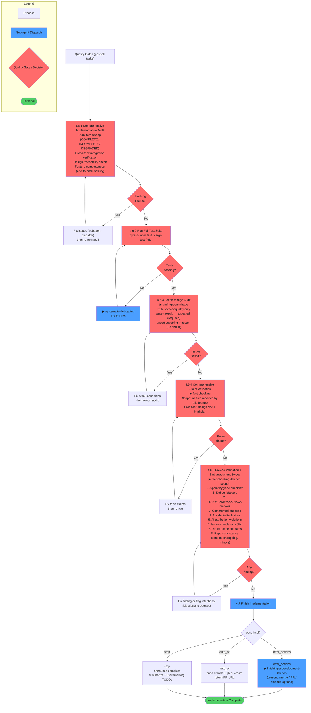

# /feature-implement

## Workflow Diagram

## Overview: `/feature-implement` (Phases 3–4)

Phases 3–4 of the develop workflow. Entry routing depends on `needs_design` flag and escape hatches detected in the user's initial message.


```mermaid
flowchart TD
    START(["/feature-implement\nPhases 3-4 of develop"])
    PREREQ["Prerequisite Verification\n(bash check script)"]
    ND{"needs_design?"}
    CHK["Verify: design doc exists\n+ design review done"]
    CHK_OK{"All checks pass?"}
    HALT(["STOP: return to\nappropriate phase"])
    EH{"Escape hatch\nin initial message?"}
    P3_31["3.1 Create Impl Plan\n▶ writing-plans"]
    P315["3.1.5 Checkability Pass\nMechanize decidable claims\nbefore review"]
    P3_32["3.2 Review Impl Plan\n▶ reviewing-impl-plans"]
    GATE33{"3.3 Approval Gate"}
    P3_34["3.4 Fix Impl Plan\n▶ executing-plans"]
    P3_345["3.4.5 Execution\nMode Analysis"]
    P3_347["3.4.7 One-Pager\nApproval Gate"]
    P3_P4_GATE{"Phase 3→4\nTransition Gate"}
    P4_SETUP["4.1 Setup Worktree(s)\n▶ using-git-worktrees"]
    P4_EXEC["4.2 Execute Plan\n(parallelization routing)"]
    PERTASK["Per-Task Cycle\n4.3 Implement → 4.4 Verify\n→ 4.5 Review → 4.5.1 Fact-check"]
    MERGE_CHK{"per_parallel\n_track?"}
    SMART_MERGE["4.2.5 Smart Merge\n▶ merging-worktrees"]
    QGATES["Quality Gates 4.6\n4.6.1 Audit → 4.6.2 Tests\n→ 4.6.3 Mirage → 4.6.4 Claims\n→ 4.6.5 Pre-PR Sweep"]
    FINISH["4.7 Finish Implementation\n▶ finishing-a-development-branch"]
    DONE(["Implementation Complete"])

    START --> PREREQ
    PREREQ --> ND
    ND -->|"false (zero-flag fast path)"| P4_SETUP
    ND -->|"true"| CHK
    CHK --> CHK_OK
    CHK_OK -->|"No"| HALT
    CHK_OK -->|"Yes"| EH
    EH -->|"none"| P3_31
    EH -->|"review first"| P3_32
    EH -->|"treat as ready"| P3_P4_GATE

    P3_31 --> P315
    P315 --> P3_32
    P3_32 --> GATE33
    GATE33 -->|"interactive ITERATE"| P3_31
    GATE33 -->|"interactive APPROVE"| P3_345
    GATE33 -->|"autonomous: critical / important"| P3_34
    GATE33 -->|"autonomous: minor only"| P3_345
    P3_34 --> P3_345
    P3_345 -->|"direct or small delegated"| P3_P4_GATE
    P3_345 -->|"large delegated"| P3_347
    P3_347 -->|"push back"| P3_31
    P3_347 -->|"approved"| P3_P4_GATE
    P3_P4_GATE -->|"unchecked items"| P3_31
    P3_P4_GATE -->|"all clear"| P4_SETUP

    P4_SETUP --> P4_EXEC
    P4_EXEC --> PERTASK
    PERTASK -->|"more tasks"| PERTASK
    PERTASK -->|"all tasks done"| MERGE_CHK
    MERGE_CHK -->|"Yes"| SMART_MERGE
    MERGE_CHK -->|"No"| QGATES
    SMART_MERGE --> QGATES
    QGATES --> FINISH
    FINISH --> DONE

    subgraph LEGEND["Legend"]
        direction LR
        L1["Process"]
        L2["Subagent Dispatch"]
        L3{"Quality Gate / Decision"}
        L4(["Terminal"])
    end

    style DONE fill:#51cf66,color:#1a1a1d
    style HALT fill:#ff6b6b,color:#1a1a1d
    style GATE33 fill:#ff6b6b,color:#1a1a1d
    style P3_P4_GATE fill:#ff6b6b,color:#1a1a1d
    style P3_347 fill:#ff6b6b,color:#1a1a1d
    style CHK_OK fill:#ff6b6b,color:#1a1a1d
    style QGATES fill:#ff6b6b,color:#1a1a1d
    style P3_31 fill:#4a9eff,color:#1a1a1d
    style P315 fill:#4a9eff,color:#1a1a1d
    style P3_32 fill:#4a9eff,color:#1a1a1d
    style P3_34 fill:#4a9eff,color:#1a1a1d
    style P4_SETUP fill:#4a9eff,color:#1a1a1d
    style P4_EXEC fill:#4a9eff,color:#1a1a1d
    style PERTASK fill:#4a9eff,color:#1a1a1d
    style SMART_MERGE fill:#4a9eff,color:#1a1a1d
    style FINISH fill:#4a9eff,color:#1a1a1d
    style L2 fill:#4a9eff,color:#1a1a1d
    style L3 fill:#ff6b6b,color:#1a1a1d
    style L4 fill:#51cf66,color:#1a1a1d
```

---

## Phase 3 Detail: Implementation Planning

Covers sections 3.1–3.4.7. Behavior is gated by escape hatch and autonomous/interactive mode.


```mermaid
flowchart TD
    P3_ENTRY["Enter Phase 3"]
    EH{"Escape hatch?"}
    P3_31["3.1 Create Impl Plan\n▶ writing-plans skill\nSave to plans/YYYY-MM-DD-slug-impl.md"]
    P315["3.1.5 Checkability Pass\nBuild + run checks for decidable claims\n(dep graph acyclic, tags valid, checks fail-capable)\nBuild Phase 4 verification tooling now if plan schedules it"]
    P3_32["3.2 Review Impl Plan\n▶ reviewing-impl-plans skill\nReturn: findings report + remediation plan"]
    GATE33{"3.3 Approval Gate\n(terminal or canvas-decision)"}
    MODE33{"Interactive or\nAutonomous?"}
    ASK_USER["AskUserQuestion:\nAPPROVE or ITERATE?"]
    AUTO_SEV{"Findings\nseverity?"}
    P3_34["3.4 Fix Impl Plan\n▶ executing-plans skill"]
    P3_345["3.4.5 Execution Mode Analysis\nParse: tracks, tasks,\ndependencies, file clusters"]
    EXEC_MODE{"Execution\nmode?"}
    DIRECT["direct\nMinimal delegation\n(small changes only)"]
    DELEGATED["delegated\nOne subagent per gate per task\n(default)"]
    DEL_SIZE{"Large\ndelegated run?"}
    P3_347["3.4.7 One-Pager Approval Gate\nNOT waived by autonomous mode"]
    GEN_OP["Generate one-pager (subagent)\nmax 200 lines: what / tasks / not-in-scope / risks\nSave to plans/YYYY-MM-DD-slug-one-pager.md"]
    PRESENT_OP["Present to operator\nAwait explicit scoped approval\n(silence does NOT count)"]
    OP_OK{"Operator\napproval?"}
    BACK_PHASE["Return to Phase 2 (design)\nor Phase 3.1 (planning)"]
    P4_ENTRY(["Proceed to Phase 4"])

    P3_ENTRY --> EH
    EH -->|"none"| P3_31
    EH -->|"review first"| P3_32
    EH -->|"treat as ready"| P4_ENTRY

    P3_31 --> P315
    P315 --> P3_32
    P3_32 --> GATE33
    GATE33 --> MODE33
    MODE33 -->|"interactive"| ASK_USER
    MODE33 -->|"autonomous"| AUTO_SEV
    ASK_USER -->|"ITERATE"| P3_31
    ASK_USER -->|"APPROVE"| P3_345
    AUTO_SEV -->|"critical / important"| P3_34
    AUTO_SEV -->|"minor only"| P3_345
    P3_34 --> P3_345
    P3_345 --> EXEC_MODE
    EXEC_MODE --> DIRECT
    EXEC_MODE --> DELEGATED
    DIRECT --> DEL_SIZE
    DELEGATED --> DEL_SIZE
    DEL_SIZE -->|"small"| P4_ENTRY
    DEL_SIZE -->|"large"| P3_347
    P3_347 --> GEN_OP
    GEN_OP --> PRESENT_OP
    PRESENT_OP --> OP_OK
    OP_OK -->|"approved"| P4_ENTRY
    OP_OK -->|"push back"| BACK_PHASE
    BACK_PHASE --> P3_31

    subgraph LEGEND["Legend"]
        direction LR
        L1["Process"]
        L2["Subagent Dispatch"]
        L3{"Quality Gate / Decision"}
        L4(["Terminal"])
    end

    style P4_ENTRY fill:#51cf66,color:#1a1a1d
    style GATE33 fill:#ff6b6b,color:#1a1a1d
    style P3_347 fill:#ff6b6b,color:#1a1a1d
    style OP_OK fill:#ff6b6b,color:#1a1a1d
    style AUTO_SEV fill:#ff6b6b,color:#1a1a1d
    style DEL_SIZE fill:#ff6b6b,color:#1a1a1d
    style P3_31 fill:#4a9eff,color:#1a1a1d
    style P315 fill:#4a9eff,color:#1a1a1d
    style P3_32 fill:#4a9eff,color:#1a1a1d
    style P3_34 fill:#4a9eff,color:#1a1a1d
    style GEN_OP fill:#4a9eff,color:#1a1a1d
    style L2 fill:#4a9eff,color:#1a1a1d
    style L3 fill:#ff6b6b,color:#1a1a1d
    style L4 fill:#51cf66,color:#1a1a1d
```

---

## Phase 4 Detail: Per-Task Execution Cycle

Covers worktree setup (4.1), parallelization routing (4.2), and the per-task quality gate loop (4.3–4.5.1).


```mermaid
flowchart TD
    P4_ENTRY["Phase 4: Implementation\n(both direct and delegated modes)"]
    WT_MODE{"worktree\nmode?"}
    WT_SINGLE["single\nCreate one worktree\n▶ using-git-worktrees"]
    WT_PARALLEL["per_parallel_track\n1. Complete setup/skeleton tasks\n2. Commit setup work\n3. Create one worktree per parallel group\n▶ using-git-worktrees"]
    WT_NONE["none\nWork in current directory"]
    PAR_ROUTE{"parallelization\nstrategy?"}
    PAR_TRACK["per_parallel_track\nEach track dispatched to own worktree\nrun_in_background: true\n▶ executing-plans per worktree"]
    PAR_MAX["maximize (single worktree)\n▶ dispatching-parallel-agents\nGroup tasks by Parallel Group"]
    PAR_CON["conservative\n▶ executing-plans (sequential)"]
    TASK_LOOP["FOR EACH TASK"]
    T43["4.3 Implement Task N\n▶ test-driven-development\nVerify working dir + branch\nCommit when done"]
    DM{"dialectic_mode?"}
    ROUNDTABLE["4.3.1 Dialectic Overlay\n▶ forge_roundtable_convene\n3 archetypes (planning_and_gates)\nor all 10 (full)"]
    T44["4.4 Implementation Completion Verification\nAuditor checks: acceptance criteria,\nexpected outputs, interface contracts, behaviors"]
    T44_OK{"All items\nCOMPLETE?"}
    FIX44["Return to task implementation\nFix incomplete items"]
    T45["4.5 Code Review\n▶ requesting-code-review"]
    T45_SEV{"Issue\nseverity?"}
    FIX_CRIT["Fix critical immediately"]
    FIX_IMP["Fix important before next task"]
    NOTE_MIN["Note minor for later"]
    T451["4.5.1 Claim Validation\n▶ fact-checking\n(docstrings, comments, test names,\ntype hints, error messages)"]
    T451_OK{"False claims\nfound?"}
    FIX451["Fix false claims immediately"]
    NEXT_TASK{"More tasks\nin plan?"}
    PT_CHK{"per_parallel\n_track?"}
    SMART_MERGE["4.2.5 Smart Merge\n▶ merging-worktrees\nVerify: all tests pass,\ninterface contracts, cleanup worktrees"]
    QGATES_ENTRY(["Proceed to Quality Gates 4.6"])

    P4_ENTRY --> WT_MODE
    WT_MODE -->|"single"| WT_SINGLE
    WT_MODE -->|"per_parallel_track"| WT_PARALLEL
    WT_MODE -->|"none"| WT_NONE
    WT_SINGLE --> PAR_ROUTE
    WT_PARALLEL --> PAR_ROUTE
    WT_NONE --> PAR_ROUTE
    PAR_ROUTE -->|"per_parallel_track"| PAR_TRACK
    PAR_ROUTE -->|"maximize"| PAR_MAX
    PAR_ROUTE -->|"conservative"| PAR_CON
    PAR_TRACK --> TASK_LOOP
    PAR_MAX --> TASK_LOOP
    PAR_CON --> TASK_LOOP
    TASK_LOOP --> T43
    T43 --> DM
    DM -->|"roundtable or full"| ROUNDTABLE
    DM -->|"planning_only or none"| T44
    ROUNDTABLE --> T44
    T44 --> T44_OK
    T44_OK -->|"INCOMPLETE / PARTIAL"| FIX44
    FIX44 --> T44
    T44_OK -->|"all COMPLETE"| T45
    T45 --> T45_SEV
    T45_SEV -->|"critical"| FIX_CRIT
    T45_SEV -->|"important"| FIX_IMP
    T45_SEV -->|"minor"| NOTE_MIN
    T45_SEV -->|"none"| T451
    FIX_CRIT --> T451
    FIX_IMP --> T451
    NOTE_MIN --> T451
    T451 --> T451_OK
    T451_OK -->|"Yes"| FIX451
    FIX451 --> NEXT_TASK
    T451_OK -->|"No"| NEXT_TASK
    NEXT_TASK -->|"Yes"| TASK_LOOP
    NEXT_TASK -->|"No"| PT_CHK
    PT_CHK -->|"Yes"| SMART_MERGE
    PT_CHK -->|"No"| QGATES_ENTRY
    SMART_MERGE --> QGATES_ENTRY

    subgraph LEGEND["Legend"]
        direction LR
        L1["Process"]
        L2["Subagent Dispatch"]
        L3{"Quality Gate / Decision"}
        L4(["Terminal"])
    end

    style QGATES_ENTRY fill:#51cf66,color:#1a1a1d
    style T44 fill:#ff6b6b,color:#1a1a1d
    style T44_OK fill:#ff6b6b,color:#1a1a1d
    style T45_SEV fill:#ff6b6b,color:#1a1a1d
    style T451_OK fill:#ff6b6b,color:#1a1a1d
    style T43 fill:#4a9eff,color:#1a1a1d
    style ROUNDTABLE fill:#4a9eff,color:#1a1a1d
    style T45 fill:#4a9eff,color:#1a1a1d
    style T451 fill:#4a9eff,color:#1a1a1d
    style WT_SINGLE fill:#4a9eff,color:#1a1a1d
    style WT_PARALLEL fill:#4a9eff,color:#1a1a1d
    style PAR_TRACK fill:#4a9eff,color:#1a1a1d
    style PAR_MAX fill:#4a9eff,color:#1a1a1d
    style PAR_CON fill:#4a9eff,color:#1a1a1d
    style SMART_MERGE fill:#4a9eff,color:#1a1a1d
    style L2 fill:#4a9eff,color:#1a1a1d
    style L3 fill:#ff6b6b,color:#1a1a1d
    style L4 fill:#51cf66,color:#1a1a1d
```

---

## Phase 4.6–4.7 Detail: Quality Gates and Finish

All gates are mandatory. Each gate loops until clean before the next gate begins.


```mermaid
flowchart TD
    QGATE_ENTRY["Quality Gates (post-all-tasks)"]

    G461["4.6.1 Comprehensive Implementation Audit\nPlan item sweep (COMPLETE / INCOMPLETE / DEGRADED)\nCross-task integration verification\nDesign traceability check\nFeature completeness (end-to-end usability)"]
    G461_OK{"Blocking\nissues?"}
    FIX461["Fix issues (subagent dispatch)\nthen re-run audit"]

    G462["4.6.2 Run Full Test Suite\npytest / npm test / cargo test / etc."]
    G462_OK{"Tests\npassing?"}
    DEBUG["▶ systematic-debugging\nFix failures"]

    G463["4.6.3 Green Mirage Audit\n▶ audit-green-mirage\nRule: exact equality only\nassert result == expected  (required)\nassert substring in result  (BANNED)"]
    G463_OK{"Issues\nfound?"}
    FIX463["Fix weak assertions\nthen re-run audit"]

    G464["4.6.4 Comprehensive Claim Validation\n▶ fact-checking\nScope: all files modified by this feature\nCross-ref: design doc + impl plan"]
    G464_OK{"False\nclaims?"}
    FIX464["Fix false claims\nthen re-run"]

    G465["4.6.5 Pre-PR Validation + Embarrassment Sweep\n▶ fact-checking (branch scope)\n+ 8-point hygiene checklist:\n1. Debug leftovers\n2. TODO/FIXME/XXX/HACK markers\n3. Commented-out code\n4. Accidental inclusions\n5. AI-attribution violations\n6. Issue-ref violations (#N)\n7. Out-of-scope file paths\n8. Repo consistency (version, changelog, mirrors)"]
    G465_OK{"Any\nfinding?"}
    FIX465["Fix finding or flag intentional\nride-along to operator"]

    FINISH["4.7 Finish Implementation"]
    FINISH_MODE{"post_impl?"}
    OPT_OFFER["offer_options\n▶ finishing-a-development-branch\n(present: merge / PR / cleanup options)"]
    OPT_PR["auto_pr\npush branch + gh pr create\nreturn PR URL"]
    OPT_STOP["stop\nannounce complete\nsummarize + list remaining TODOs"]
    DONE(["Implementation Complete"])

    QGATE_ENTRY --> G461
    G461 --> G461_OK
    G461_OK -->|"Yes"| FIX461
    FIX461 --> G461
    G461_OK -->|"No"| G462
    G462 --> G462_OK
    G462_OK -->|"No"| DEBUG
    DEBUG --> G462
    G462_OK -->|"Yes"| G463
    G463 --> G463_OK
    G463_OK -->|"Yes"| FIX463
    FIX463 --> G463
    G463_OK -->|"No"| G464
    G464 --> G464_OK
    G464_OK -->|"Yes"| FIX464
    FIX464 --> G464
    G464_OK -->|"No"| G465
    G465 --> G465_OK
    G465_OK -->|"Yes"| FIX465
    FIX465 --> G465
    G465_OK -->|"No"| FINISH
    FINISH --> FINISH_MODE
    FINISH_MODE -->|"offer_options"| OPT_OFFER
    FINISH_MODE -->|"auto_pr"| OPT_PR
    FINISH_MODE -->|"stop"| OPT_STOP
    OPT_OFFER --> DONE
    OPT_PR --> DONE
    OPT_STOP --> DONE

    subgraph LEGEND["Legend"]
        direction LR
        L1["Process"]
        L2["Subagent Dispatch"]
        L3{"Quality Gate / Decision"}
        L4(["Terminal"])
    end

    style DONE fill:#51cf66,color:#1a1a1d
    style G461 fill:#ff6b6b,color:#1a1a1d
    style G462 fill:#ff6b6b,color:#1a1a1d
    style G463 fill:#ff6b6b,color:#1a1a1d
    style G464 fill:#ff6b6b,color:#1a1a1d
    style G465 fill:#ff6b6b,color:#1a1a1d
    style G461_OK fill:#ff6b6b,color:#1a1a1d
    style G462_OK fill:#ff6b6b,color:#1a1a1d
    style G463_OK fill:#ff6b6b,color:#1a1a1d
    style G464_OK fill:#ff6b6b,color:#1a1a1d
    style G465_OK fill:#ff6b6b,color:#1a1a1d
    style DEBUG fill:#4a9eff,color:#1a1a1d
    style OPT_OFFER fill:#4a9eff,color:#1a1a1d
    style FINISH fill:#4a9eff,color:#1a1a1d
    style L2 fill:#4a9eff,color:#1a1a1d
    style L3 fill:#ff6b6b,color:#1a1a1d
    style L4 fill:#51cf66,color:#1a1a1d
```

---

## Cross-Reference Table

| Overview Node | Detail Diagram | Section |
|---|---|---|
| Phase 3 (3.1–3.4.7) | Phase 3 Detail | §3.1–§3.4.7 |
| Per-Task Cycle (4.3–4.5.1) | Phase 4 Per-Task Cycle | §4.1–§4.5.1 |
| Quality Gates 4.6 | Phase 4.6–4.7 Quality Gates | §4.6.1–§4.7 |
| 4.7 Finish | Phase 4.6–4.7 Quality Gates | §4.7 |

## Skills Dispatch Map

| Node | Skill Invoked |
|---|---|
| 3.1 Create Impl Plan | `writing-plans` |
| 3.1.5 Checkability Pass | `develop` SKILL.md "Checkability" protocol |
| 3.2 Review Impl Plan | `reviewing-impl-plans` |
| 3.4 Fix Impl Plan | `executing-plans` |
| 3.4.7 One-Pager (generate) | subagent (inline) |
| 4.1 Setup Worktrees | `using-git-worktrees` |
| 4.2 Maximize parallel | `dispatching-parallel-agents` |
| 4.2 Conservative | `executing-plans` |
| 4.2.5 Smart Merge | `merging-worktrees` |
| 4.3 Implement Task | `test-driven-development` |
| 4.3.1 Dialectic Overlay | `forge_roundtable_convene` (MCP) |
| 4.5 Code Review | `requesting-code-review` |
| 4.5.1 Claim Validation | `fact-checking` |
| 4.6.2 Debug failures | `systematic-debugging` |
| 4.6.3 Mirage Audit | `audit-green-mirage` |
| 4.6.4 Comprehensive Claims | `fact-checking` |
| 4.6.5 Pre-PR + Embarrassment Sweep | `fact-checking` + `finishing-a-development-branch` checklist |
| 4.7 Finish (offer_options) | `finishing-a-development-branch` |

## Command Content

````markdown
# /feature-implement

Phase 3 of the develop workflow. Run after `/feature-design` completes (Phase 2 approved).
Phase 4 (implementation execution) continues in `/feature-implement-execute`.

<CRITICAL>
## Prerequisite Verification

Before ANY Phase 3-4 work begins, run this verification:

```bash
# ══════════════════════════════════════════════════════════════
# PREREQUISITE CHECK: feature-implement (Phase 3-4)
# ══════════════════════════════════════════════════════════════

PROJECT_ROOT=$(git rev-parse --show-toplevel 2>/dev/null || pwd)
PROJECT_ENCODED=$(echo "$PROJECT_ROOT" | sed 's|^/||' | tr '/' '-')

echo "=== Phase 3-4 Prerequisites ==="

# CHECK 1: Determine entry path by need flags
NEEDS_DESIGN="[SESSION_PREFERENCES.need_flags.needs_design]"
echo "needs_design: $NEEDS_DESIGN"

if [ "$NEEDS_DESIGN" = "true" ]; then
  # CHECK 2 (needs_design): Design document must exist
  echo "Required: Design document exists"
  ls ~/.local/spellbook/docs/$PROJECT_ENCODED/plans/*-design.md 2>/dev/null || echo "FAIL: No design document found"

  # CHECK 3 (needs_design): Design review must be complete
  echo "Required: Design review completed"
else
  echo "Zero-flag fast path: no external design required"
  echo "Required: Inline plan confirmed by user (<=5 steps)"
  echo "Invoke /feature-implement-execute and navigate to its '## Phase 4: Implementation' header."
  echo "Skip the Phase 3 design-derived steps. Entering at Phase 4 directly."
fi

# CHECK 4 (all paths): No escape hatch conflict
echo "Verify: escape_hatch routing is consistent with current entry point"
```

**If ANY check fails:** STOP. Return to the appropriate phase.

**Anti-rationalization:** "Simple enough to hold in your head" or "plan as we go" = Pattern 3 (Time Pressure) or Pattern 5 (Competence Assertion). Implementation without a plan must be re-done.
</CRITICAL>

## Invariant Principles

1. **Design precedes implementation** - Never implement without an approved design document and implementation plan
2. **Delegate actual work** - Main context orchestrates; subagents write code, run tests, perform reviews
3. **Quality gates are mandatory** - Code review, fact-checking, and green mirage audit after every task; no exceptions
4. **Behavior preservation in refactoring** - Test verification at every transformation; no behavior changes without approval

---

## Phase 3: Implementation Planning

<CRITICAL>
Phase behavior depends on escape hatch:
- **No escape hatch:** Run full Phase 3
- **Impl plan with "review first":** Skip 3.1, start at 3.2
- **Impl plan with "treat as ready":** Skip entire Phase 3
</CRITICAL>

### 3.1 Create Implementation Plan

<RULE>Subagent MUST invoke writing-plans.</RULE>

```
Task (or subagent simulation):
  description: "Create implementation plan"
  prompt: |
    First, invoke the writing-plans skill using the Skill tool.
    Then follow its complete workflow.

    ## Context for the Skill

    Design document: ~/.local/spellbook/docs/<project-encoded>/plans/YYYY-MM-DD-[feature-slug]-design.md
    Parallelization preference: [maximize/conservative/ask]

    Save to: ~/.local/spellbook/docs/<project-encoded>/plans/YYYY-MM-DD-[feature-slug]-impl.md
```

### 3.1.5 Checkability Pass (before the review gate)

<RULE>Dispatch subagent. Do NOT do this work in main context.</RULE>

An implementation plan declares a dependency graph, wave assignments, tags, and
check commands. Those claims are mechanically decidable. Decide them with a
machine before a reviewer reads the plan — a language model reading a dependency
graph four times still misses a cycle.

Run the Checkability protocol in `develop` SKILL.md ("Checkability") against the
plan before you dispatch 3.2:

1. Build and run checks for the decidable claims: the dependency graph is
   acyclic; every declared dependency exists; wave and ordering assignments agree
   with the graph; every tag comes from the declared vocabulary; every cited path
   and symbol exists; every declared check command goes red on a known-bad input
   (a command that passes when its target does not exist decides nothing).
2. **If the plan schedules its own lint, assertion script, or checker as a Phase
   4 task, build that tooling NOW.** Verification the plan already designed must
   not land after the gate it was designed to close. Move it ahead of 3.2.
3. Prove each check can fail before you trust its green. Record which rule fired
   on which line, not only how many fired.
4. Repair what the checks find, then name the decided claims in the 3.2 dispatch
   prompt.

**Author ≠ Judge applies here.** The agent that wrote the plan may build the
checks; a different dispatch runs them and reports the result. No agent edits a
check that measures its own repair.

If the plan is a short inline list with no dependency graph, record that in one
line and proceed to 3.2. This pass does not run on the zero-flag fast path.

### 3.2 Review Implementation Plan

<RULE>Subagent MUST invoke reviewing-impl-plans.</RULE>

```
Task (or subagent simulation):
  description: "Review implementation plan"
  prompt: |
    First, invoke the reviewing-impl-plans skill using the Skill tool.
    Then follow its complete workflow.

    ## Context for the Skill

    Implementation plan: ~/.local/spellbook/docs/<project-encoded>/plans/YYYY-MM-DD-[feature-slug]-impl.md
    Parent design document: ~/.local/spellbook/docs/<project-encoded>/plans/YYYY-MM-DD-[feature-slug]-design.md

    Return complete findings report with remediation plan.
```

### 3.3 Approval Gate

**Decision surface (honors `SESSION_PREFERENCES.decision_surface`):** the
plan-approval prompt is presented via `AskUserQuestion` when
`decision_surface == "terminal"` (default). When `decision_surface == "canvas"`
AND this approval meets the boundary in the "When to Use (testable boundary)"
section of the canvas-decision skill (context-heavy: several plan options or
trade-offs, a diagram that aids the call, or a hard-to-reverse plan
commitment), invoke the `canvas-decision` skill instead — render the
plan/one-pager approval as a canvas page and await the operator's submission.
This wraps the gate; it does NOT change it: the never-auto-proceed contract
holds, and quick yes/no acknowledgments stay terminal even under `canvas`. Map
the submitted decision to the gate's outcomes — the approve/affirmative value →
APPROVE (proceed); declined/reject value → ITERATE (return to 3.1/3.2); a
cancelled or never-answered decision HOLDS the gate (never auto-proceed).

**Canvas page CONTENT (when rendered via `canvas`):** the plan-approval page
MUST follow the "Decision Page Anatomy" section of the canvas-decision skill —
do NOT ship a bare approve button. Top-to-bottom: a plan-summary callout framing
the commitment → a task-list of the plan's steps → an optional `<collapsible>`
carrying the full plan/one-pager detail → the `<approve>`/`<choice>` control
LAST. This is a CONTENT prescription only; it does not change the gate's
behavior, the outcome mapping, or the never-auto-proceed contract above.

**Interactive mode:** Present findings to user. Ask: APPROVE (proceed to 3.4.5) or ITERATE (return to 3.1/3.2).
**Autonomous mode:** If findings are critical/important → fix automatically (dispatch executing-plans subagent). If minor → proceed.

### 3.4 Fix Implementation Plan

Dispatch subagent to invoke executing-plans skill. Pass: impl plan path, specific findings to fix, design doc for reference.

**Round discipline for the 3.2 ↔ 3.4 loop** (full rules in `develop` SKILL.md,
"Review-Round Convergence" and "Author ≠ Judge"):

- Number each round. Record the blocking-finding count, and how many findings
  round N's repairs caused.
- If the majority of a round's blocking findings come from the previous round's
  repairs, STOP reviewing. The plan's engineering is probably sound and the
  process is thrashing. Mechanize that class of finding (3.1.5), repair against
  the check, then run ONE more review round for the claims the check cannot
  decide.
- From round 2 on, carry an `ESTABLISHED FACTS` block in the 3.2 dispatch prompt:
  one line per measured fact, with the command and result and the round that
  measured it. Fresh reviewers must not re-derive the dependency graph or
  re-measure a tool's behavior every round.
- The 3.4 fix subagent NEVER supplies the verdict on its own repair, and never
  edits the checks built at 3.1.5. Round N+1's review is a separate dispatch.

### 3.4.5 Execution Mode Analysis

<CRITICAL>
Determine execution strategy from plan structure and parallelization preference.
spellbook runs a single orchestrator: the only modes are `direct` and `delegated`.
</CRITICAL>

<analysis>
**Plan Structure Analysis:**

1. Parse implementation plan for track markers (`## Track N:` headers)
2. Count tasks (`- [ ] Task N.M:` lines)
3. Check for dependency markers (`<!-- depends-on: -->`)
4. Count distinct file-ownership clusters (files that no other task touches)

**Execution Mode Decision (evaluated in order; first match wins):**

```
if size_estimate is very small AND no parallelization requested:
    direct      (stay in session, minimal delegation)
else:
    delegated   (stay in session, one subagent per gate per task)
```

**Modes:**

- **direct**: Stay in session, minimal delegation. Only for the smallest changes
  where dispatching a subagent per gate would cost more than it saves.
- **delegated**: Stay in session, delegate to subagents (one subagent per gate per
  task). The default. For larger plans, gate dispatches are batched per the
  parallelization preference, but the orchestrator stays resident the whole time.

**Routing:** Both `direct` and `delegated` proceed to Phase 4 (the existing flow).
There is no fan-out into separate sessions; a single orchestrator carries the whole
plan. For efforts too large for one session, checkpoint the `develop_gate_ledger`
and hand off to a fresh session (see `finishing-a-development-branch`).
</analysis>

### 3.4.7 One-Pager Approval Gate (large delegated runs)

<CRITICAL>
For a large delegated run, no implementation dispatch begins UNTIL the operator has
explicitly approved a one-pager describing the planned implementation. This gate is
NOT waived by autonomous mode. See `~/.claude/CLAUDE.md` "Autonomous Mode and Scope
Discipline".
</CRITICAL>

**When this gate applies:** delegated runs large enough that the operator should see
the shape of the work before subagent dispatch begins. Small `direct` runs and small
delegated runs proceed directly to Phase 4.

**One-pager spec:**

- ≤ 200 lines
- Plain English, no architecture jargon
- Sections: (1) what we are building in 1-2 sentences, (2) the tasks (or task groups)
  by name and one-line purpose, (3) what is explicitly NOT in scope, (4) anything the
  operator should push back on before implementation begins
- Saved to `~/.local/spellbook/docs/<project-encoded>/plans/YYYY-MM-DD-[feature-slug]-one-pager.md`

**Approval mechanics:**

1. Generate the one-pager (dispatch a subagent — do not write inline)
2. Present to operator
3. Wait for explicit `approved` / `go` / `proceed` / equivalent
4. Silence does NOT count. A generic `ok` issued in response to a
   different question does NOT count. Only an explicit, scoped
   approval of THIS one-pager counts.
5. In autonomous mode: the orchestrator MUST still pause here. Surface
   the one-pager and request approval. Autonomous mode does not waive
   approval; it only waives trivial confirmations.

If the operator pushes back, return to Phase 2 (design) or Phase 3.1
(planning) as appropriate. Fix the root design or plan first, then regenerate the
one-pager.

<FORBIDDEN>
- Beginning implementation dispatch before one-pager approval (large delegated runs)
- Treating autonomous mode as approval
- Treating an unrelated `ok` from the operator as approval of the one-pager
</FORBIDDEN>

---

## ═══════════════════════════════════════════════════════════════════
## STOP AND VERIFY: Phase 3 → Phase 4 Transition
## ═══════════════════════════════════════════════════════════════════

Before proceeding to Phase 4, verify Phase 3 is complete:

```bash
# Verify implementation plan exists
ls ~/.local/spellbook/docs/<project-encoded>/plans/*-impl.md
```

- [ ] Writing-plans subagent DISPATCHED (not done in main context)
- [ ] Implementation plan created and saved
- [ ] Checkability pass (3.1.5) run BEFORE the 3.2 dispatch; any verification tooling the plan specifies was built ahead of this gate
- [ ] Reviewing-impl-plans subagent DISPATCHED
- [ ] Approval gate handled per autonomous_mode
- [ ] All critical/important findings fixed (if any)
- [ ] Execution mode analyzed (delegated / direct)
- [ ] If large delegated run: one-pager approved by operator (3.4.7)

If ANY unchecked: Go back to Phase 3. Do NOT proceed.

---

## Next: Phase 4 (Implementation Execution)

Phase 3 ends here. Phase 4 — implementation execution, per-task quality gates,
Refactoring Mode, the Skills Invoked table, the anti-pattern catalogue, and the
completion self-check — lives in `/feature-implement-execute`.

<CRITICAL>
Invoke `/feature-implement-execute` to continue. A phase boundary is not a turn
boundary: in autonomous mode invoke it in the SAME turn; in interactive mode,
confirm first. Do NOT declare the develop workflow complete at the end of Phase 3.
</CRITICAL>
````
