# /feature-research

## Workflow Diagram

# Feature Research (Phase 1) - Flow Diagram

Phase 1 of develop: prerequisite verification, parallel subagent dispatch for codebase research and tooling discovery, ambiguity extraction, quality scoring with a 100% threshold gate, and completion checklist.

```mermaid
flowchart TD
    subgraph Legend [Legend]
        direction LR
        L1[Process]
        L2{{Decision}}
        L3([Terminal])
        L4[Subagent Dispatch]:::subagent
        L5[Quality Gate]:::gate
        L6([Success Terminal]):::success
    end

    START([Phase 1 Invoked]) --> PREREQ

    %% ── Prerequisite Verification ──────────────────────────────
    subgraph PREREQ_GROUP [Prerequisite Verification]
        PREREQ{{complexity_tier<br>in STANDARD or COMPLEX?}}
        PREREQ -- No --> HALT_TIER([STOP: Wrong tier.<br>TRIVIAL/SIMPLE do not<br>run this phase.])
        PREREQ -- Yes --> CHK_P0{{Phase 0<br>100% complete?}}
        CHK_P0 -- No --> HALT_P0([STOP: Return to Phase 0])
        CHK_P0 -- Yes --> CHK_ESC{{No impl_plan<br>escape hatch active?}}
        CHK_ESC -- No --> HALT_ESC([STOP: Escape hatch active,<br>skip to Phase 3+])
    end

    CHK_ESC -- Yes --> STRAT

    %% ── 1.1 Research Strategy Planning ─────────────────────────
    subgraph STRAT_GROUP [1.1 Research Strategy Planning]
        STRAT[Analyze feature request<br>for technical domains]
        STRAT --> GEN_Q[Generate codebase questions:<br>similar features, patterns,<br>integration points, edge cases]
        GEN_Q --> ID_GAPS[Identify knowledge gaps]
    end

    ID_GAPS --> DISPATCH_BOTH

    %% ── 1.2 + 1.2b Parallel Subagent Dispatch ─────────────────
    subgraph DISPATCH_BOTH [Parallel Subagent Dispatch]
        direction LR
        SA_RESEARCH[1.2 Research Subagent:<br>Systematic search, read files,<br>extract patterns, flag ambiguities,<br>mark confidence per finding<br>HIGH / MEDIUM / LOW / UNKNOWN]:::subagent
        SA_TOOLING[1.2b Tooling Scout Subagent:<br>Invoke tooling-discovery skill,<br>detect domain tools,<br>surface trust warnings]:::subagent
    end

    %% ── Error Handling for 1.2 ─────────────────────────────────
    SA_RESEARCH --> SA_OK{{Research subagent<br>succeeded?}}
    SA_OK -- Yes --> MERGE
    SA_OK -- No --> RETRY[Retry once with<br>same instructions]:::subagent
    RETRY --> RETRY_OK{{Retry succeeded?}}
    RETRY_OK -- Yes --> MERGE
    RETRY_OK -- No --> FALLBACK[Return all findings<br>as UNKNOWN, note failure.<br>Do NOT block.]

    SA_TOOLING --> MERGE
    FALLBACK --> MERGE

    MERGE[Merge codebase findings<br>+ tooling discovery results]

    %% ── 1.3 Ambiguity Extraction ──────────────────────────────
    MERGE --> AMBIG_EXTRACT

    subgraph AMBIG_GROUP [1.3 Ambiguity Extraction]
        AMBIG_EXTRACT[Extract all MEDIUM / LOW /<br>UNKNOWN confidence items<br>and flagged ambiguities]
        AMBIG_EXTRACT --> CATEGORIZE[Categorize by type:<br>Technical, Scope,<br>Integration, Terminology]
        CATEGORIZE --> PRIORITIZE[Prioritize by<br>design impact:<br>HIGH / MEDIUM / LOW]
    end

    PRIORITIZE --> SCORE

    %% ── 1.4 Research Quality Score ────────────────────────────
    subgraph SCORE_GROUP [1.4 Research Quality Score]
        SCORE[Compute four score components]:::gate
        SCORE --> S1[Coverage:<br>HIGH findings / total questions]
        SCORE --> S2[Ambiguity Resolution:<br>categorized / total ambiguities]
        SCORE --> S3[Evidence Quality:<br>findings with refs / answerable]
        SCORE --> S4[Unknown Detection:<br>flagged unknowns / LOW+UNKNOWN]
        S1 --> OVERALL[Overall = min of all four]:::gate
        S2 --> OVERALL
        S3 --> OVERALL
        S4 --> OVERALL
    end

    OVERALL --> GATE

    %% ── Gate Decision ─────────────────────────────────────────
    GATE{{Score = 100%?}}:::gate
    GATE -- Yes --> CHECKLIST
    GATE -- No --> USER_CHOICE

    USER_CHOICE{{User chooses}}
    USER_CHOICE -- "A) Continue anyway<br>(bypass gate, accept risk)" --> CHECKLIST
    USER_CHOICE -- "B) Iterate: add more<br>questions, re-dispatch" --> STRAT
    USER_CHOICE -- "C) Skip ambiguous areas<br>(reduce scope)" --> CHECKLIST

    %% ── Phase Complete Checklist ──────────────────────────────
    CHECKLIST[Phase 1 Complete Checklist:<br>1. Research subagent dispatched<br>2. Score 100% or user bypass<br>3. Ambiguities categorized<br>4. Findings stored in SESSION_CONTEXT]:::gate

    CHECKLIST --> COMPLETE_OK{{All items<br>checked?}}
    COMPLETE_OK -- No --> INCOMPLETE([STOP: Complete<br>remaining Phase 1 items])
    COMPLETE_OK -- Yes --> DONE([Phase 1 Complete:<br>Proceed to /feature-discover<br>- Phase 1.5 -]):::success

    %% ── Styles ────────────────────────────────────────────────
    classDef subagent fill:#4a9eff,stroke:#2d7cd6,color:#fff
    classDef gate fill:#ff6b6b,stroke:#d94f4f,color:#fff
    classDef success fill:#51cf66,stroke:#3aad4e,color:#fff
```



## Cross-References

| Diagram Node | Source Section | Lines |
|---|---|---|
| Prerequisite Verification (3 checks) | Prerequisite Verification | 11-40 |
| 1.1 Research Strategy Planning | 1.1 Research Strategy Planning | 53-77 |
| 1.2 Research Subagent | 1.2 Execute Research (Subagent) | 79-127 |
| Error Handling / Retry / Fallback | Error Handling | 128-132 |
| 1.2b Tooling Scout Subagent | 1.2b Parallel Tooling Discovery | 134-153 |
| 1.3 Ambiguity Extraction | 1.3 Ambiguity Extraction | 155-181 |
| 1.4 Quality Score (4 components) | 1.4 Research Quality Score | 183-237 |
| Gate Decision (A/B/C) | Gate Behavior | 239-257 |
| Phase 1 Complete Checklist | Phase 1 Complete | 269-278 |
| Proceed to /feature-discover | Next | 280 |

## External References

| Reference | Type | Description |
|---|---|---|
| `/feature-discover` | Command | Phase 1.5 of develop; invoked after this phase completes |
| `tooling-discovery` | Skill | Invoked by the 1.2b Tooling Scout subagent |
| `develop` | Skill | Parent skill; this command is Phase 1 |

## Command Content

``````````markdown
# Feature Research (Phase 1)

<ROLE>
Research Strategist. Your reputation depends on surfacing unknowns BEFORE design begins. A research phase that misses a critical ambiguity poisons every downstream decision. This is very important to my career.
</ROLE>

<CRITICAL>
## Prerequisite Verification

Before ANY Phase 1 work begins, run this verification:

```bash
# ══════════════════════════════════════════════════════════════
# PREREQUISITE CHECK: feature-research (Phase 1)
# ══════════════════════════════════════════════════════════════

echo "=== Phase 1 Prerequisites ==="

# CHECK 1: Complexity tier must be STANDARD or COMPLEX
echo "Required: complexity_tier in (standard, complex)"
echo "Current tier: [SESSION_PREFERENCES.complexity_tier]"
# TRIVIAL exits the skill; SIMPLE uses lightweight inline research — neither runs this phase.

# CHECK 2: Phase 0 must be complete
echo "Required: Phase 0 checklist 100% complete"
echo "Verify: motivation, feature_essence, preferences all populated"

# CHECK 3: No escape hatch skipping to Phase 3+
echo "Required: No impl plan escape hatch active"
echo "Verify: SESSION_PREFERENCES.escape_hatch.type != 'impl_plan'"
```

**If ANY check fails:** STOP. Do not proceed. Return to the appropriate phase.

**Anti-rationalization:** Tempted to skip because "you already know the tier" or "Phase 0 was obviously complete"? That is Pattern 2 (Expertise Override). Run the check. It takes 5 seconds.
</CRITICAL>

## Invariant Principles

1. **Research before design** — Understand the codebase and surface unknowns before any design work begins
2. **100% quality score required** — All research questions need HIGH confidence answers; bypass requires explicit user consent
3. **Evidence with confidence levels** — Every finding includes evidence and confidence rating; UNKNOWN is a valid answer
4. **Ambiguity extraction** — Low-confidence and unknown items become explicit ambiguities for disambiguation

<CRITICAL>
Systematically explore codebase and surface unknowns BEFORE design work. All research findings must achieve 100% quality score to proceed.
</CRITICAL>

### 1.1 Research Strategy Planning

**INPUT:** User feature request + motivation
**OUTPUT:** Research strategy with specific questions

1. Analyze feature request for technical domains
2. Generate codebase questions:
   - Which files/modules handle similar features?
   - What patterns exist for this type of work?
   - What integration points are relevant?
   - What edge cases have been handled before?
3. Identify knowledge gaps explicitly

**Example Questions:**

```
Feature: "Add JWT authentication for mobile API"

Generated Questions:
1. Where is authentication currently handled in the codebase?
2. Are there existing JWT implementations we can reference?
3. What mobile API endpoints exist that will need auth?
4. How are other features securing API access?
5. What session management patterns exist?
```

### 1.2 Execute Research (Subagent)

**SUBAGENT DISPATCH:** YES
**REASON:** Exploration with uncertain scope. Subagent reads N files, returns synthesis.

```
Task:
  description: "Research Agent - Codebase Patterns"
  prompt: |
    You are a research agent. Answer these specific questions about the codebase.
    For each question:

    1. Search systematically using search tools (grep, glob, search_file_content)
    2. Read relevant files
    3. Extract patterns, conventions, precedents
    4. FLAG any ambiguities or conflicting patterns
    5. EXPLICITLY state 'UNKNOWN' if evidence is insufficient

    CRITICAL: Mark confidence level for each answer:
    - HIGH: Direct evidence found (specific file references)
    - MEDIUM: Inferred from related code
    - LOW: Educated guess based on conventions
    - UNKNOWN: No evidence found

    QUESTIONS TO ANSWER:
    [Insert questions from 1.1]

    RETURN FORMAT (strict JSON):
    {
      "findings": [
        {
          "question": "...",
          "answer": "...",
          "confidence": "HIGH|MEDIUM|LOW|UNKNOWN",
          "evidence": ["file:line", ...],
          "ambiguities": ["..."]
        }
      ],
      "patterns_discovered": [
        {
          "name": "...",
          "files": ["..."],
          "description": "..."
        }
      ],
      "unknowns": ["..."]
    }
```

**ERROR HANDLING:**

- Subagent fails: retry once with same instructions
- Second failure: return all findings marked UNKNOWN; note "Research failed after 2 attempts: [error]"; do NOT block — user chooses to proceed or retry
- **TIMEOUT:** 120 seconds per subagent

### 1.3 Ambiguity Extraction

**INPUT:** Research findings from subagent
**OUTPUT:** Categorized ambiguities

1. Extract all MEDIUM/LOW/UNKNOWN confidence items
2. Extract all flagged ambiguities
3. Categorize by type:
   - **Technical:** How it works (e.g., "Two auth patterns found — which to use?")
   - **Scope:** What to include (e.g., "Unclear if feature includes password reset")
   - **Integration:** How it connects (e.g., "Multiple integration points — which is primary?")
   - **Terminology:** What terms mean (e.g., "'Session' used inconsistently")
4. Prioritize by impact on design: HIGH/MEDIUM/LOW

**Example Output:**

```
TECHNICAL (HIGH impact):
- Ambiguity: Two authentication patterns found (JWT in 8 files, OAuth in 5 files)
  Source: Research finding #3 (MEDIUM confidence)
  Impact: Determines entire auth architecture

SCOPE (MEDIUM impact):
- Ambiguity: Similar features handle password reset; unclear if in scope
  Source: Research finding #7 (LOW confidence)
  Impact: Affects feature completeness
```

### 1.4 Research Quality Score

**SCORING FORMULAS:**

```typescript
// 1. COVERAGE SCORE
function coverageScore(findings: Finding[], questions: string[]): number {
  const highCount = findings.filter(f => f.confidence === "HIGH").length;
  if (questions.length === 0) return 100;
  return (highCount / questions.length) * 100;
}

// 2. AMBIGUITY RESOLUTION SCORE
function ambiguityResolutionScore(ambiguities: Ambiguity[]): number {
  if (ambiguities.length === 0) return 100;
  const categorized = ambiguities.filter(a => a.category && a.impact);
  return (categorized.length / ambiguities.length) * 100;
}

// 3. EVIDENCE QUALITY SCORE
function evidenceQualityScore(findings: Finding[]): number {
  const answerable = findings.filter(f => f.confidence !== "UNKNOWN");
  if (answerable.length === 0) return 0;
  const withEvidence = answerable.filter(f => f.evidence.length > 0);
  return (withEvidence.length / answerable.length) * 100;
}

// 4. UNKNOWN DETECTION SCORE
function unknownDetectionScore(findings: Finding[], flaggedUnknowns: string[]): number {
  const lowOrUnknown = findings.filter(
    f => f.confidence === "UNKNOWN" || f.confidence === "LOW",
  );
  if (lowOrUnknown.length === 0) return 100;
  return (flaggedUnknowns.length / lowOrUnknown.length) * 100;
}

// OVERALL SCORE: Weakest link determines quality — ALL must be 100%
function overallScore(...scores: number[]): number {
  return Math.min(...scores);
}
```

**DISPLAY FORMAT:**

```
Research Quality Score: [X]%

Breakdown:
✓/✗ Coverage: [X]% ([N]/[M] questions with HIGH confidence)
✓/✗ Ambiguity Resolution: [X]% ([N]/[M] ambiguities categorized)
✓/✗ Evidence Quality: [X]% ([N]/[M] findings have file references)
✓/✗ Unknown Detection: [X]% ([N]/[M] unknowns explicitly flagged)

Overall: [X]% (minimum of all criteria)
```

**GATE BEHAVIOR:**

IF SCORE < 100%:

```
Research Quality Score: [X]% - Below threshold

OPTIONS:
A) Continue anyway (bypass gate, accept risk)
B) Iterate: Add more research questions and re-dispatch
C) Skip ambiguous areas (reduce scope, remove low-confidence items)

Your choice: ___
```

IF SCORE = 100%:

- Display: "✓ Research Quality Score: 100% - All criteria met"
- Proceed to Phase 1.5

<FORBIDDEN>
- Doing research work in main context instead of dispatching a subagent
- Proceeding when any prerequisite check fails
- Running this phase when complexity_tier is TRIVIAL or SIMPLE
- Proceeding past the quality gate without a 100% score or explicit user bypass
- Blocking progress after two subagent failures (return UNKNOWN findings; do not halt)
</FORBIDDEN>

---

## Phase 1 Complete

Before proceeding to Phase 1.5, verify:

- [ ] Research subagent was DISPATCHED (not done in main context)
- [ ] Research Quality Score = 100% (or user bypassed with consent)
- [ ] All ambiguities extracted and categorized
- [ ] Findings stored in SESSION_CONTEXT.research_findings

If ANY unchecked: Complete Phase 1. Do NOT proceed.

**Next:** Run `/feature-discover` to begin Phase 1.5.

<FINAL_EMPHASIS>
Research is the foundation every downstream decision rests on. A gap here propagates through design, implementation, and review. Surface unknowns now — not during code review. Your reputation depends on delivering a research phase where nothing critical was missed.
</FINAL_EMPHASIS>
``````````
