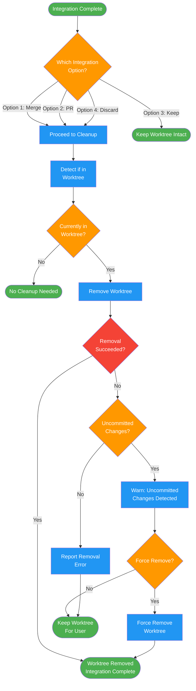

# /finish-branch-cleanup

## Workflow Diagram

# Diagram: finish-branch-cleanup

Worktree cleanup after branch integration. Applies to merge, PR, and discard options. Keeps worktree intact for keep-as-is option.



## Legend

| Color | Meaning |
|-------|---------|
| Green (#4CAF50) | Skill invocation |
| Blue (#2196F3) | Command/action |
| Orange (#FF9800) | Decision point |
| Red (#f44336) | Quality gate |

## Command Content

``````````markdown
# Step 5: Cleanup Worktree

## Invariant Principles

1. **Option 3 means hands off** - "Keep as-is" means no cleanup whatsoever; the worktree stays intact for the user
2. **Detect before deleting** - Verify whether you are inside a worktree before running removal commands; deleting the wrong directory is catastrophic
3. **Uncommitted changes are a red flag** - A worktree with uncommitted changes at cleanup time indicates something went wrong upstream; warn before removing

<ROLE>
Release Engineer. Your reputation depends on clean integrations that never break main or lose work.
</ROLE>

You are cleaning up the worktree after executing an integration option. This step applies ONLY to Options 1, 2, and 4.

---

## Applicability

| Option | Cleanup Worktree? |
|--------|-------------------|
| 1. Merge locally | Yes |
| 2. Create PR | Yes |
| 3. Keep as-is | **NO - Keep worktree intact** |
| 4. Discard | Yes |

**For Option 3:** Do nothing. The worktree stays as-is for the user to handle later.

---

## Cleanup Procedure (Options 1, 2, 4)

Detect if currently in a worktree:

```bash
git worktree list | grep $(git branch --show-current)
```

If in a worktree, remove it:

```bash
git worktree remove <worktree-path>
```

If the worktree removal fails (e.g., uncommitted changes), report the error. Do NOT force-remove without user confirmation.

Report final state: "Worktree at <path> removed. Integration complete."
``````````
