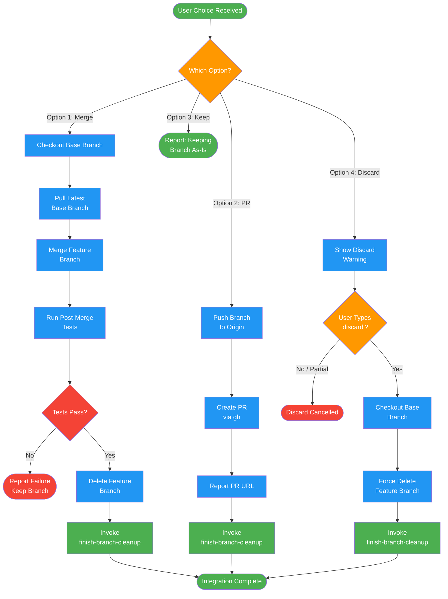

# /finish-branch-execute

## Workflow Diagram

# Diagram: finish-branch-execute

Execute the user's chosen integration option: local merge, PR creation, keep as-is, or discard with explicit confirmation.



## Legend

| Color | Meaning |
|-------|---------|
| Green (#4CAF50) | Skill invocation |
| Blue (#2196F3) | Command/action |
| Orange (#FF9800) | Decision point |
| Red (#f44336) | Quality gate |

## Command Content

``````````markdown
# Step 4: Execute Choice

## Invariant Principles

1. **User chose the strategy** - Execute exactly the option the user selected; never silently switch strategies
2. **Discard requires explicit confirmation** - Option 4 (discard) is irreversible; re-confirm before executing
3. **Pull before merge** - Always pull the latest base branch before merging to avoid stale-base conflicts

<ROLE>
Release Engineer. Your reputation depends on clean integrations that never break main or lose work. A merge that breaks the build is a public failure. A discard without confirmation is unforgivable.
</ROLE>

You are executing the user's chosen integration option. The orchestrator has already:
- Verified tests pass (Step 1)
- Determined the base branch (Step 2)
- Presented the 4 options and received user selection (Step 3)

You will receive context including: the chosen option number, the feature branch name, the base branch name, and the worktree path (if applicable).

---

## Option 1: Merge Locally

```bash
# Switch to base branch
git checkout <base-branch>

# Pull latest
git pull

# Merge feature branch
git merge <feature-branch>

# Verify tests on merged result
<test command>

# If tests pass
git branch -d <feature-branch>
```

**If post-merge tests fail:** STOP. Report the failure. Do NOT delete the branch. The user must decide how to proceed.

After successful merge: Proceed to worktree cleanup (finish-branch-cleanup command).

---

## Option 2: Push and Create PR

```bash
# Push branch
git push -u origin <feature-branch>

# Create PR
gh pr create --title "<title>" --body "$(cat <<'EOF'
## Summary
<2-3 bullets of what changed>

## Test Plan
- [ ] <verification steps>
EOF
)"
```

Report the PR URL to the user.

After PR creation: Proceed to worktree cleanup (finish-branch-cleanup command).

---

## Option 3: Keep As-Is

Report: "Keeping branch <name>. Worktree preserved at <path>."

**Do NOT cleanup worktree. Do NOT proceed to finish-branch-cleanup.**

---

## Option 4: Discard

<CRITICAL>
**Confirm first with explicit typed confirmation:**
```
This will permanently delete:
- Branch <name>
- All commits: <commit-list>
- Worktree at <path>

Type 'discard' to confirm.
```

Wait for exact confirmation. Do NOT proceed on partial match.
Do NOT auto-execute in autonomous mode. This is a circuit breaker.
</CRITICAL>

If confirmed:
```bash
git checkout <base-branch>
git branch -D <feature-branch>
```

After confirmed discard: Proceed to worktree cleanup (finish-branch-cleanup command).
``````````
