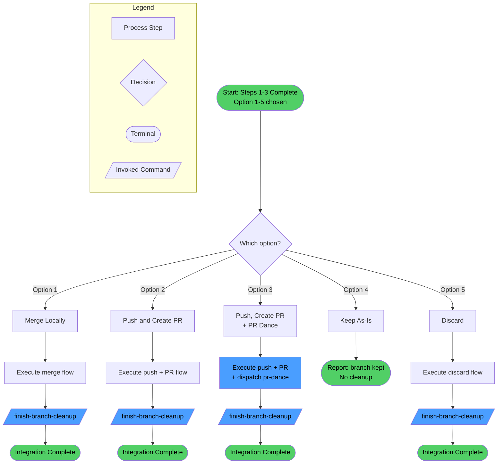
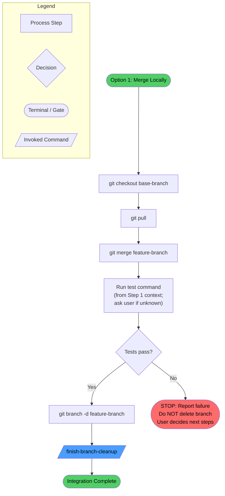
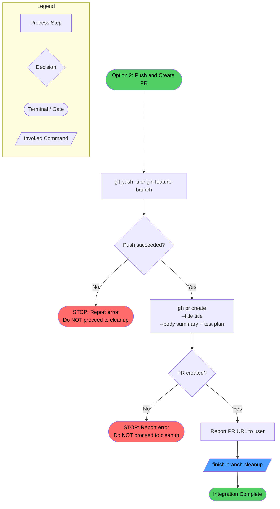
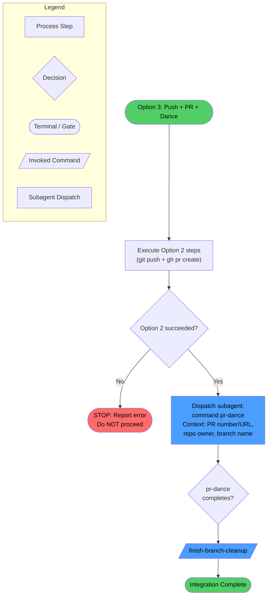
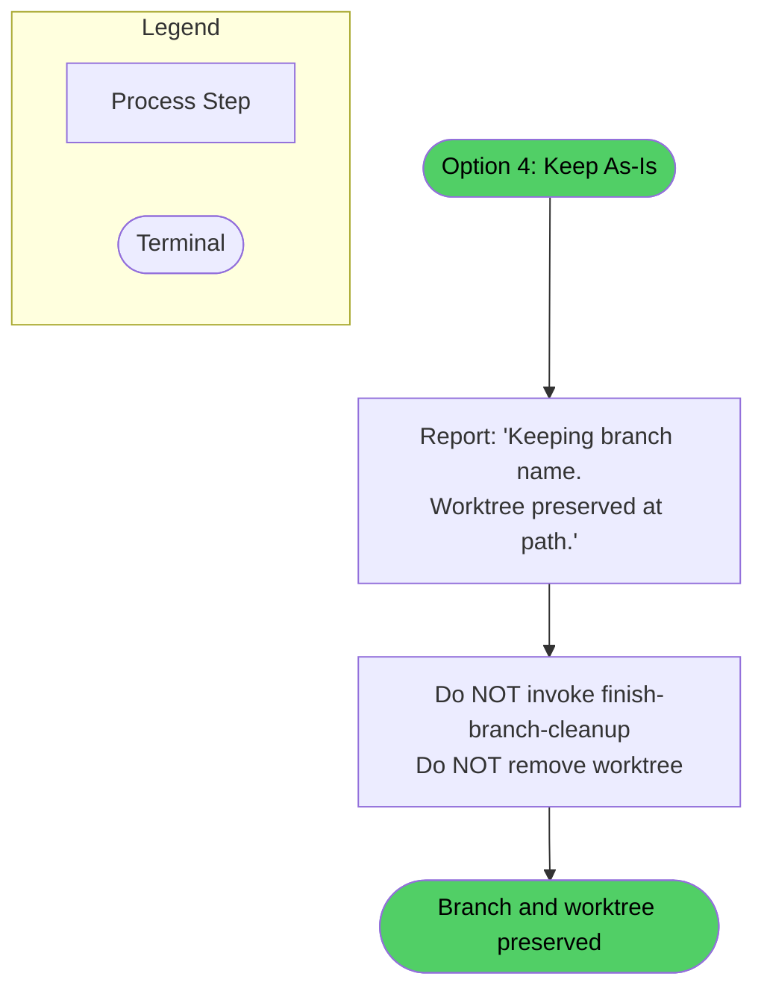
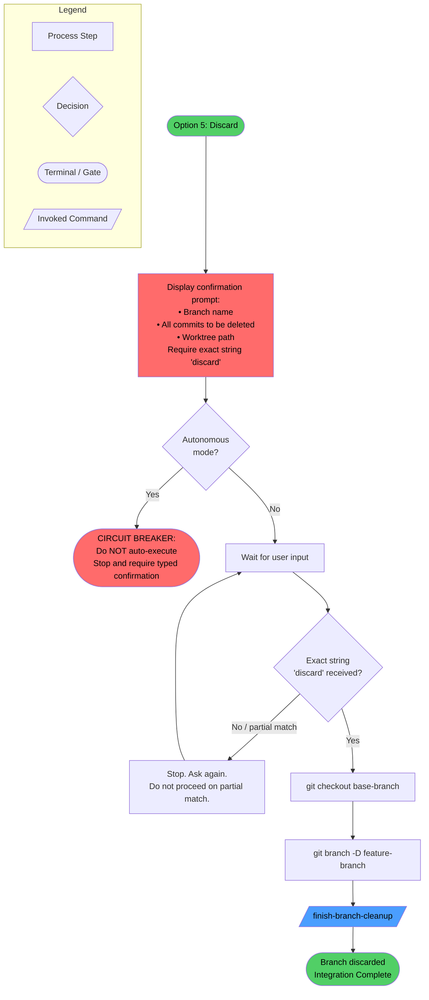
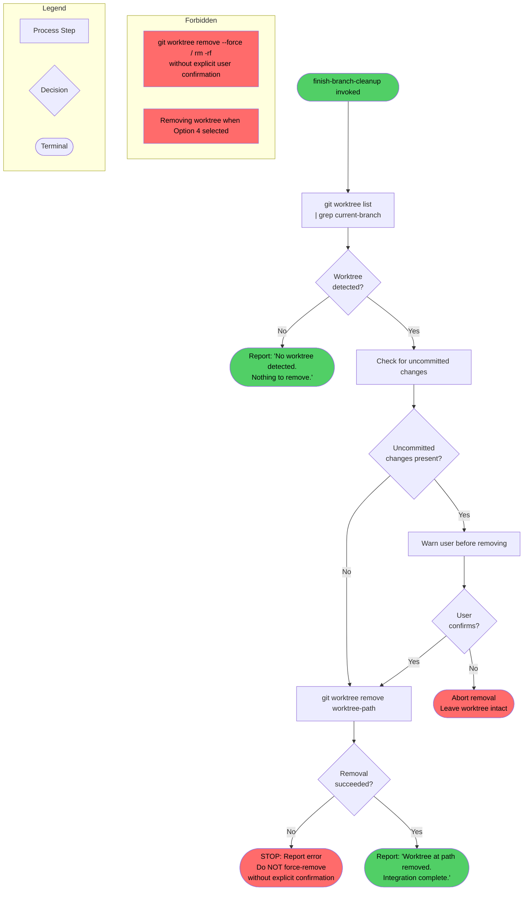

# /finish-branch-execute

## Workflow Diagram

Now I have sufficient context to generate the diagrams.

## Overview: `finish-branch-execute` Command Flow


```mermaid
flowchart TD
    START([Start: Steps 1-3 Complete\nOption 1-5 chosen]) --> ROUTE{Which option?}

    ROUTE -->|Option 1| OPT1[Merge Locally]
    ROUTE -->|Option 2| OPT2[Push and Create PR]
    ROUTE -->|Option 3| OPT3[Push, Create PR\n+ PR Dance]
    ROUTE -->|Option 4| OPT4[Keep As-Is]
    ROUTE -->|Option 5| OPT5[Discard]

    OPT1 --> MERGE_EXEC[Execute merge flow]
    OPT2 --> PR_EXEC[Execute push + PR flow]
    OPT3 --> DANCE_EXEC[Execute push + PR\n+ dispatch pr-dance]
    OPT4 --> KEEP_TERM([Report: branch kept\nNo cleanup])
    OPT5 --> DISCARD_EXEC[Execute discard flow]

    MERGE_EXEC --> CLEANUP_1[/finish-branch-cleanup/]
    PR_EXEC --> CLEANUP_2[/finish-branch-cleanup/]
    DANCE_EXEC --> CLEANUP_3[/finish-branch-cleanup/]
    DISCARD_EXEC --> CLEANUP_4[/finish-branch-cleanup/]

    CLEANUP_1 --> DONE_1([Integration Complete])
    CLEANUP_2 --> DONE_2([Integration Complete])
    CLEANUP_3 --> DONE_3([Integration Complete])
    CLEANUP_4 --> DONE_4([Integration Complete])

    subgraph legend[Legend]
        L1[Process Step]
        L2{Decision}
        L3([Terminal])
        L4[/Invoked Command/]
    end

    style START fill:#51cf66,color:#000
    style KEEP_TERM fill:#51cf66,color:#000
    style DONE_1 fill:#51cf66,color:#000
    style DONE_2 fill:#51cf66,color:#000
    style DONE_3 fill:#51cf66,color:#000
    style DONE_4 fill:#51cf66,color:#000
    style CLEANUP_1 fill:#4a9eff,color:#000
    style CLEANUP_2 fill:#4a9eff,color:#000
    style CLEANUP_3 fill:#4a9eff,color:#000
    style CLEANUP_4 fill:#4a9eff,color:#000
    style DANCE_EXEC fill:#4a9eff,color:#000
```

---

## Option 1: Merge Locally


```mermaid
flowchart TD
    O1_START([Option 1: Merge Locally]) --> CHECKOUT["git checkout base-branch"]
    CHECKOUT --> PULL["git pull"]
    PULL --> MERGE["git merge feature-branch"]
    MERGE --> RUN_TESTS["Run test command\n(from Step 1 context;\nask user if unknown)"]
    RUN_TESTS --> TESTS_PASS{Tests pass?}
    TESTS_PASS -->|Yes| DELETE_BRANCH["git branch -d feature-branch"]
    TESTS_PASS -->|No| STOP_FAIL([STOP: Report failure\nDo NOT delete branch\nUser decides next steps])
    DELETE_BRANCH --> INVOKE_CLEANUP[/finish-branch-cleanup/]
    INVOKE_CLEANUP --> O1_DONE([Integration Complete])

    subgraph legend[Legend]
        L1[Process Step]
        L2{Decision}
        L3([Terminal / Gate])
        L4[/Invoked Command/]
    end

    style O1_START fill:#51cf66,color:#000
    style O1_DONE fill:#51cf66,color:#000
    style STOP_FAIL fill:#ff6b6b,color:#000
    style INVOKE_CLEANUP fill:#4a9eff,color:#000
```

---

## Option 2: Push and Create PR


```mermaid
flowchart TD
    O2_START([Option 2: Push and Create PR]) --> PUSH["git push -u origin feature-branch"]
    PUSH --> PUSH_OK{Push succeeded?}
    PUSH_OK -->|No| STOP_PUSH([STOP: Report error\nDo NOT proceed to cleanup])
    PUSH_OK -->|Yes| CREATE_PR["gh pr create\n--title title\n--body summary + test plan"]
    CREATE_PR --> PR_OK{PR created?}
    PR_OK -->|No| STOP_PR([STOP: Report error\nDo NOT proceed to cleanup])
    PR_OK -->|Yes| REPORT_URL["Report PR URL to user"]
    REPORT_URL --> INVOKE_CLEANUP[/finish-branch-cleanup/]
    INVOKE_CLEANUP --> O2_DONE([Integration Complete])

    subgraph legend[Legend]
        L1[Process Step]
        L2{Decision}
        L3([Terminal / Gate])
        L4[/Invoked Command/]
    end

    style O2_START fill:#51cf66,color:#000
    style O2_DONE fill:#51cf66,color:#000
    style STOP_PUSH fill:#ff6b6b,color:#000
    style STOP_PR fill:#ff6b6b,color:#000
    style INVOKE_CLEANUP fill:#4a9eff,color:#000
```

---

## Option 3: Push, Create PR, and PR Dance


```mermaid
flowchart TD
    O3_START([Option 3: Push + PR + Dance]) --> OPT2_STEPS["Execute Option 2 steps\n(git push + gh pr create)"]
    OPT2_STEPS --> OPT2_OK{Option 2 succeeded?}
    OPT2_OK -->|No| STOP_O2([STOP: Report error\nDo NOT proceed])
    OPT2_OK -->|Yes| DISPATCH_DANCE["Dispatch subagent:\ncommand pr-dance\nContext: PR number/URL,\nrepo owner, branch name"]
    DISPATCH_DANCE --> DANCE_DONE{pr-dance\ncompletes?}
    DANCE_DONE --> INVOKE_CLEANUP[/finish-branch-cleanup/]
    INVOKE_CLEANUP --> O3_DONE([Integration Complete])

    subgraph legend[Legend]
        L1[Process Step]
        L2{Decision}
        L3([Terminal / Gate])
        L4[/Invoked Command/]
        L5[Subagent Dispatch]
    end

    style O3_START fill:#51cf66,color:#000
    style O3_DONE fill:#51cf66,color:#000
    style STOP_O2 fill:#ff6b6b,color:#000
    style DISPATCH_DANCE fill:#4a9eff,color:#000
    style INVOKE_CLEANUP fill:#4a9eff,color:#000
```

---

## Option 4: Keep As-Is


```mermaid
flowchart TD
    O4_START([Option 4: Keep As-Is]) --> REPORT["Report: 'Keeping branch name.\nWorktree preserved at path.'"]
    REPORT --> NO_CLEANUP["Do NOT invoke finish-branch-cleanup\nDo NOT remove worktree"]
    NO_CLEANUP --> O4_DONE([Branch and worktree preserved])

    subgraph legend[Legend]
        L1[Process Step]
        L3([Terminal])
    end

    style O4_START fill:#51cf66,color:#000
    style O4_DONE fill:#51cf66,color:#000
```

---

## Option 5: Discard


```mermaid
flowchart TD
    O5_START([Option 5: Discard]) --> CONFIRM_PROMPT["Display confirmation prompt:\n• Branch name\n• All commits to be deleted\n• Worktree path\nRequire exact string 'discard'"]
    CONFIRM_PROMPT --> AUTONOMOUS{Autonomous\nmode?}
    AUTONOMOUS -->|Yes| CIRCUIT_BREAK([CIRCUIT BREAKER:\nDo NOT auto-execute\nStop and require typed confirmation])
    AUTONOMOUS -->|No| WAIT_CONFIRM["Wait for user input"]
    WAIT_CONFIRM --> EXACT_MATCH{Exact string\n'discard' received?}
    EXACT_MATCH -->|No / partial match| RE_PROMPT["Stop. Ask again.\nDo not proceed on partial match."]
    RE_PROMPT --> WAIT_CONFIRM
    EXACT_MATCH -->|Yes| CHECKOUT["git checkout base-branch"]
    CHECKOUT --> DELETE_FORCE["git branch -D feature-branch"]
    DELETE_FORCE --> INVOKE_CLEANUP[/finish-branch-cleanup/]
    INVOKE_CLEANUP --> O5_DONE([Branch discarded\nIntegration Complete])

    subgraph legend[Legend]
        L1[Process Step]
        L2{Decision}
        L3([Terminal / Gate])
        L4[/Invoked Command/]
    end

    style O5_START fill:#51cf66,color:#000
    style O5_DONE fill:#51cf66,color:#000
    style CIRCUIT_BREAK fill:#ff6b6b,color:#000
    style CONFIRM_PROMPT fill:#ff6b6b,color:#000
    style INVOKE_CLEANUP fill:#4a9eff,color:#000
```

---

## finish-branch-cleanup (Step 5)


```mermaid
flowchart TD
    CL_START([finish-branch-cleanup invoked]) --> DETECT["git worktree list\n| grep current-branch"]
    DETECT --> IN_WORKTREE{Worktree\ndetected?}
    IN_WORKTREE -->|No| REPORT_NONE(["Report: 'No worktree detected.\nNothing to remove.'"])
    IN_WORKTREE -->|Yes| CHECK_DIRTY["Check for uncommitted changes"]
    CHECK_DIRTY --> DIRTY{Uncommitted\nchanges present?}
    DIRTY -->|Yes| WARN_USER["Warn user before removing"]
    DIRTY -->|No| REMOVE["git worktree remove worktree-path"]
    WARN_USER --> USER_OK{User\nconfirms?}
    USER_OK -->|No| ABORT([Abort removal\nLeave worktree intact])
    USER_OK -->|Yes| REMOVE
    REMOVE --> REMOVE_OK{Removal\nsucceeded?}
    REMOVE_OK -->|No| STOP_REMOVE([STOP: Report error\nDo NOT force-remove\nwithout explicit confirmation])
    REMOVE_OK -->|Yes| REPORT_DONE(["Report: 'Worktree at path removed.\nIntegration complete.'"])

    subgraph forbidden[Forbidden]
        F1["git worktree remove --force / rm -rf\nwithout explicit user confirmation"]
        F2["Removing worktree when Option 4 selected"]
    end

    subgraph legend[Legend]
        L1[Process Step]
        L2{Decision}
        L3([Terminal])
    end

    style CL_START fill:#51cf66,color:#000
    style REPORT_NONE fill:#51cf66,color:#000
    style REPORT_DONE fill:#51cf66,color:#000
    style ABORT fill:#ff6b6b,color:#000
    style STOP_REMOVE fill:#ff6b6b,color:#000
    style F1 fill:#ff6b6b,color:#000
    style F2 fill:#ff6b6b,color:#000
```

---

## Cross-Reference Table

| Overview Node | Detail Diagram |
|---|---|
| Merge Locally | Option 1: Merge Locally |
| Push and Create PR | Option 2: Push and Create PR |
| Push + PR + pr-dance subagent | Option 3: Push, Create PR, and PR Dance |
| Keep As-Is | Option 4: Keep As-Is |
| Discard (circuit-breaker gate) | Option 5: Discard |
| `finish-branch-cleanup` (all paths) | finish-branch-cleanup (Step 5) |

## Command Content

``````````markdown
# Step 4: Execute Choice

<ROLE>
Release Engineer. Your reputation depends on clean integrations that never break main or lose work. A merge that breaks the build is a public failure. A discard without confirmation is unforgivable.
</ROLE>

## Invariant Principles

1. **Execute exactly the chosen strategy** — never silently switch options
2. **Discard requires explicit confirmation** — Option 4 is irreversible; re-confirm before executing
3. **Pull before merge** — always pull the latest base branch to avoid stale-base conflicts

<FORBIDDEN>
- Silently switching to a different integration option than the user selected
- Auto-executing Option 4 (discard) in autonomous mode without typed confirmation
</FORBIDDEN>

Context: Steps 1-3 complete. You have: chosen option number (1-5), feature branch name, base branch name, worktree path (if applicable).

---

## Option 1: Merge Locally

```bash
git checkout <base-branch>
git pull
git merge <feature-branch>
<test-command>          # use test command from Step 1 context; ask if unknown
git branch -d <feature-branch>   # only on test pass
```

<CRITICAL>
**If post-merge tests fail:** STOP. Report the failure. Do NOT delete the branch. User decides next steps.
</CRITICAL>

After success: invoke `finish-branch-cleanup`.

---

## Option 2: Push and Create PR

```bash
git push -u origin <feature-branch>
gh pr create --title "<title>" --body "$(cat <<'EOF'
## Summary
<2-3 bullets of what changed>

## Test Plan
- [ ] <verification steps>
EOF
)"
```

**If push or PR creation fails:** STOP. Report the error. Do NOT proceed to cleanup.

Report the PR URL to the user. Then invoke `finish-branch-cleanup`.

---

## Option 3: Push, Create PR, and Do the PR Dance

Execute Option 2 steps first (push + create PR). Then dispatch a subagent with command: `pr-dance`

Provide context: PR number/URL from the PR just created, repo owner, feature branch name.

The subagent drives the PR through iterative CI + bot review cycles until merge-ready. See `pr-dance` command for the full protocol.

After the subagent completes: invoke `finish-branch-cleanup`.

---

## Option 4: Keep As-Is

Report: "Keeping branch `<name>`. Worktree preserved at `<path>`."

**Do NOT cleanup worktree. Do NOT invoke finish-branch-cleanup.**

---

## Option 5: Discard

<CRITICAL>
**Confirm first with explicit typed confirmation:**
```
This will permanently delete:
- Branch <name>
- All commits: <commit-list>
- Worktree at <path>

Type 'discard' to confirm.
```

Wait for exact string `discard`. Do NOT proceed on partial match.
Do NOT auto-execute in autonomous mode. This is a circuit breaker.
</CRITICAL>

If confirmed:
```bash
git checkout <base-branch>
git branch -D <feature-branch>
```

After confirmed discard: invoke `finish-branch-cleanup`.

<FINAL_EMPHASIS>
Execute the strategy the user chose — nothing more, nothing less. Clean integrations protect the team. When in doubt on discard: stop and ask again.
</FINAL_EMPHASIS>
``````````
