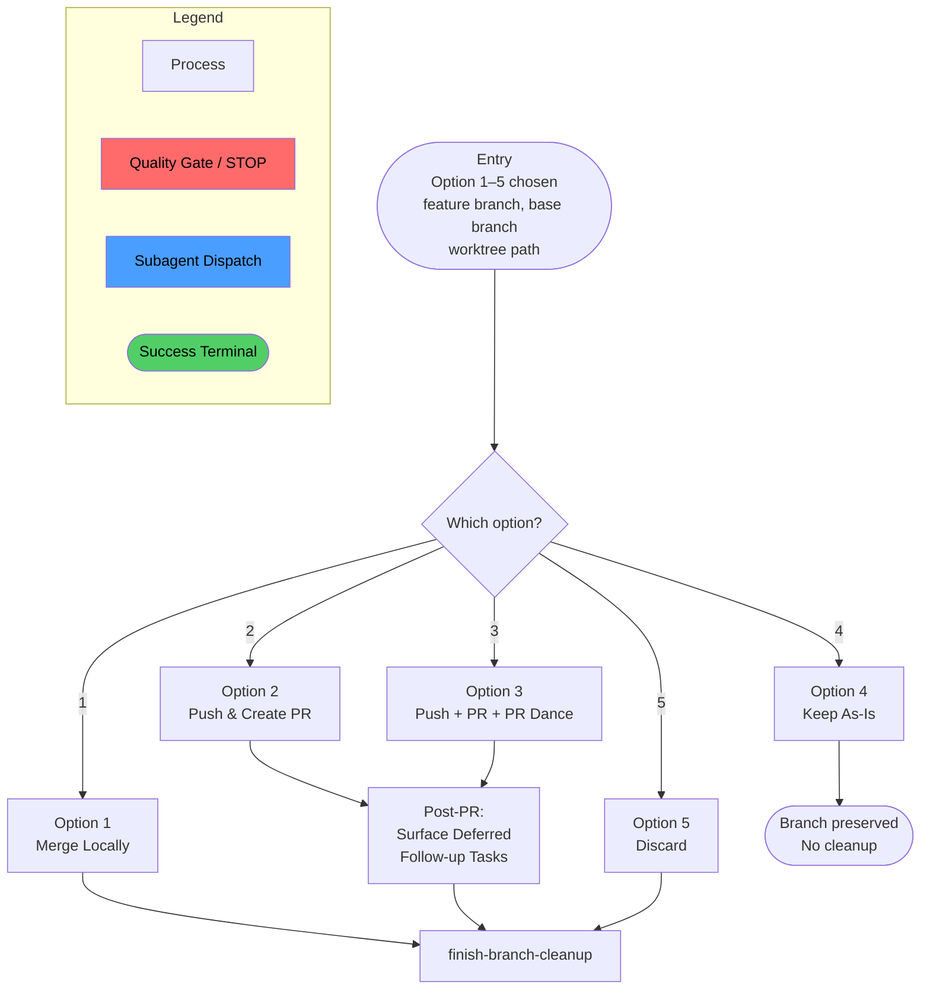
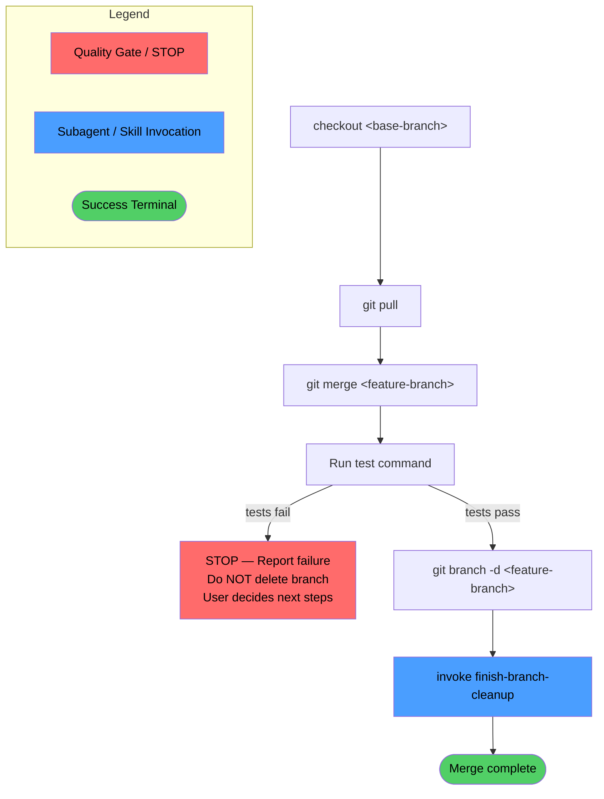
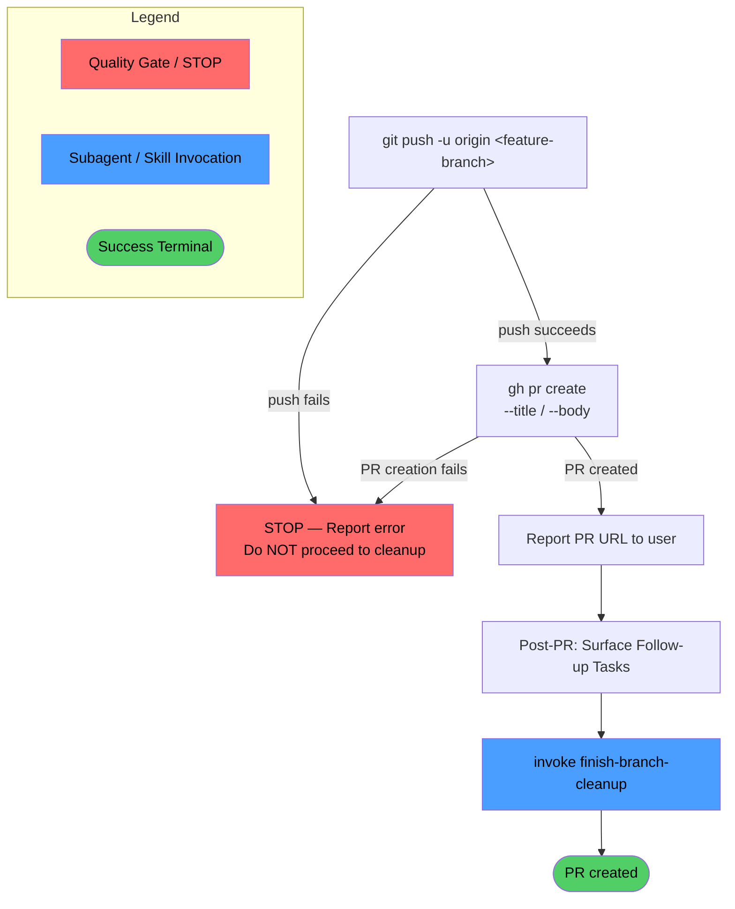
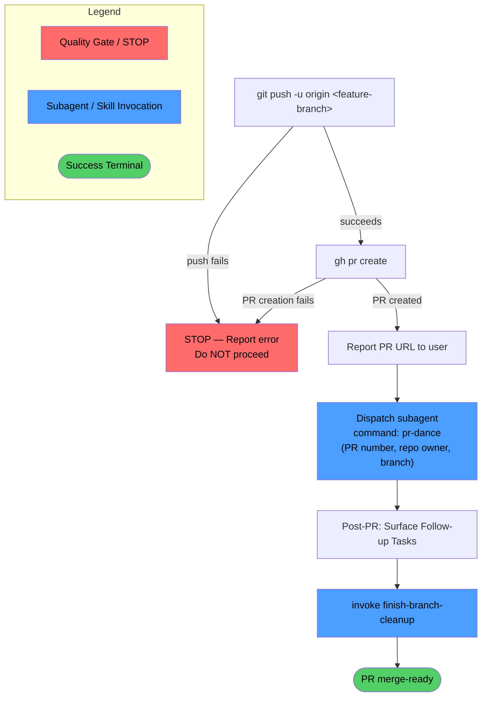
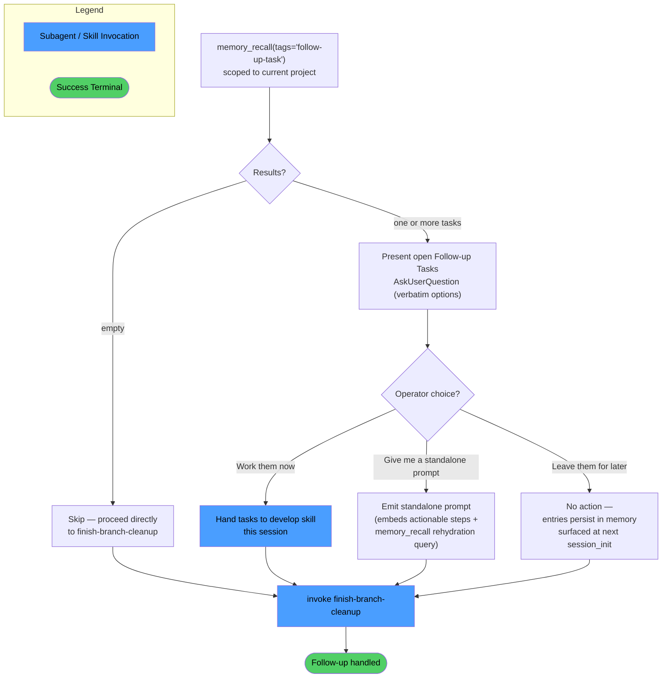
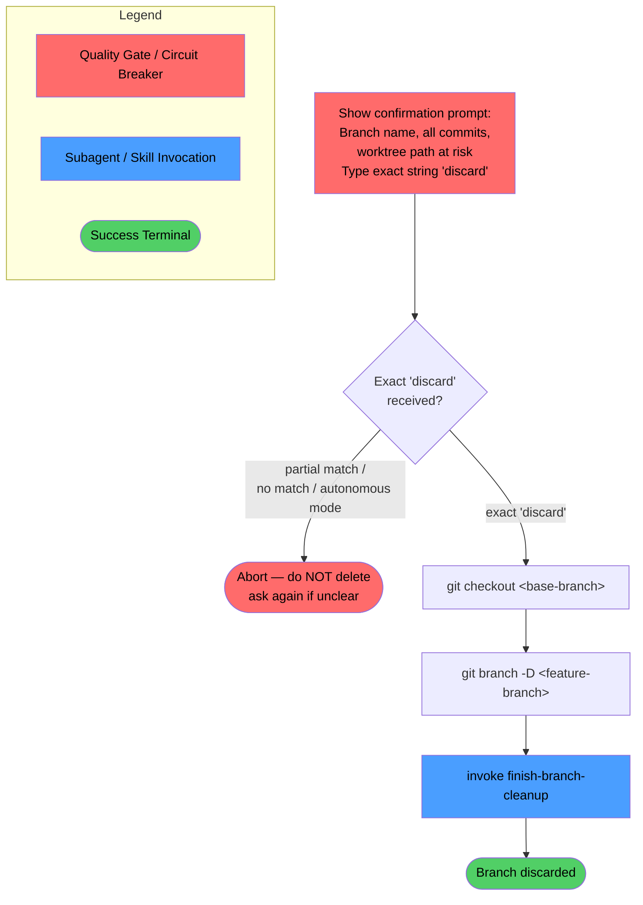

# /finish-branch-execute

## Workflow Diagram

Now I'll generate the diagrams based on the command's workflow.

## Overview Diagram


```mermaid
flowchart TD
    START(["Entry\nOption 1–5 chosen\nfeature branch, base branch\nworktree path"])

    DECIDE{Which option?}

    OPT1["Option 1\nMerge Locally"]
    OPT2["Option 2\nPush & Create PR"]
    OPT3["Option 3\nPush + PR + PR Dance"]
    OPT4["Option 4\nKeep As-Is"]
    OPT5["Option 5\nDiscard"]

    POST_PR["Post-PR:\nSurface Deferred\nFollow-up Tasks"]

    CLEANUP["finish-branch-cleanup"]

    KEEP_END(["Branch preserved\nNo cleanup"])

    START --> DECIDE
    DECIDE -->|"1"| OPT1
    DECIDE -->|"2"| OPT2
    DECIDE -->|"3"| OPT3
    DECIDE -->|"4"| OPT4
    DECIDE -->|"5"| OPT5

    OPT1 --> CLEANUP
    OPT2 --> POST_PR
    OPT3 --> POST_PR
    POST_PR --> CLEANUP
    OPT4 --> KEEP_END
    OPT5 --> CLEANUP

    subgraph LEGEND["Legend"]
        L_PROC["Process"]
        L_GATE["Quality Gate / STOP"]:::gate
        L_SUB["Subagent Dispatch"]:::subagent
        L_OK(["Success Terminal"]):::success
    end

    classDef gate fill:#ff6b6b,color:#000
    classDef subagent fill:#4a9eff,color:#000
    classDef success fill:#51cf66,color:#000
```

---

## Detail: Option 1 — Merge Locally


```mermaid
flowchart TD
    A["checkout &lt;base-branch&gt;"]
    B["git pull"]
    C["git merge &lt;feature-branch&gt;"]
    D["Run test command"]
    FAIL_GATE["STOP — Report failure\nDo NOT delete branch\nUser decides next steps"]:::gate
    DEL["git branch -d &lt;feature-branch&gt;"]
    CLEANUP["invoke finish-branch-cleanup"]:::subagent
    DONE(["Merge complete"]):::success

    A --> B --> C --> D
    D -->|"tests fail"| FAIL_GATE
    D -->|"tests pass"| DEL --> CLEANUP --> DONE

    subgraph LEGEND["Legend"]
        L_GATE["Quality Gate / STOP"]:::gate
        L_SUB["Subagent / Skill Invocation"]:::subagent
        L_OK(["Success Terminal"]):::success
    end

    classDef gate fill:#ff6b6b,color:#000
    classDef subagent fill:#4a9eff,color:#000
    classDef success fill:#51cf66,color:#000
```

---

## Detail: Option 2 — Push & Create PR


```mermaid
flowchart TD
    PUSH["git push -u origin &lt;feature-branch&gt;"]
    PR["gh pr create\n--title / --body"]
    FAIL_GATE["STOP — Report error\nDo NOT proceed to cleanup"]:::gate
    REPORT["Report PR URL to user"]
    POST["Post-PR: Surface Follow-up Tasks"]
    CLEANUP["invoke finish-branch-cleanup"]:::subagent
    DONE(["PR created"]):::success

    PUSH -->|"push fails"| FAIL_GATE
    PUSH -->|"push succeeds"| PR
    PR -->|"PR creation fails"| FAIL_GATE
    PR -->|"PR created"| REPORT --> POST --> CLEANUP --> DONE

    subgraph LEGEND["Legend"]
        L_GATE["Quality Gate / STOP"]:::gate
        L_SUB["Subagent / Skill Invocation"]:::subagent
        L_OK(["Success Terminal"]):::success
    end

    classDef gate fill:#ff6b6b,color:#000
    classDef subagent fill:#4a9eff,color:#000
    classDef success fill:#51cf66,color:#000
```

---

## Detail: Option 3 — Push + PR + PR Dance


```mermaid
flowchart TD
    PUSH["git push -u origin &lt;feature-branch&gt;"]
    PR["gh pr create"]
    FAIL_GATE["STOP — Report error\nDo NOT proceed"]:::gate
    REPORT["Report PR URL to user"]
    DANCE["Dispatch subagent\ncommand: pr-dance\n(PR number, repo owner, branch)"]:::subagent
    POST["Post-PR: Surface Follow-up Tasks"]
    CLEANUP["invoke finish-branch-cleanup"]:::subagent
    DONE(["PR merge-ready"]):::success

    PUSH -->|"push fails"| FAIL_GATE
    PUSH -->|"succeeds"| PR
    PR -->|"PR creation fails"| FAIL_GATE
    PR -->|"PR created"| REPORT --> DANCE --> POST --> CLEANUP --> DONE

    subgraph LEGEND["Legend"]
        L_GATE["Quality Gate / STOP"]:::gate
        L_SUB["Subagent / Skill Invocation"]:::subagent
        L_OK(["Success Terminal"]):::success
    end

    classDef gate fill:#ff6b6b,color:#000
    classDef subagent fill:#4a9eff,color:#000
    classDef success fill:#51cf66,color:#000
```

---

## Detail: Post-PR — Surface Deferred Follow-up Tasks


```mermaid
flowchart TD
    QUERY["memory_recall(tags='follow-up-task')\nscoped to current project"]
    EMPTY{Results?}
    SKIP["Skip — proceed directly\nto finish-branch-cleanup"]
    PRESENT["Present open Follow-up Tasks\nAskUserQuestion (verbatim options)"]
    CHOICE{Operator choice?}
    WORK["Hand tasks to develop skill\nthis session"]:::subagent
    PROMPT["Emit standalone prompt\n(embeds actionable steps +\nmemory_recall rehydration query)"]
    LATER["No action —\nentries persist in memory\nsurfaced at next session_init"]
    CLEANUP["invoke finish-branch-cleanup"]:::subagent
    DONE(["Follow-up handled"]):::success

    QUERY --> EMPTY
    EMPTY -->|"empty"| SKIP --> CLEANUP
    EMPTY -->|"one or more tasks"| PRESENT --> CHOICE
    CHOICE -->|"Work them now"| WORK --> CLEANUP
    CHOICE -->|"Give me a standalone prompt"| PROMPT --> CLEANUP
    CHOICE -->|"Leave them for later"| LATER --> CLEANUP
    CLEANUP --> DONE

    subgraph LEGEND["Legend"]
        L_SUB["Subagent / Skill Invocation"]:::subagent
        L_OK(["Success Terminal"]):::success
    end

    classDef subagent fill:#4a9eff,color:#000
    classDef success fill:#51cf66,color:#000
```

---

## Detail: Option 5 — Discard


```mermaid
flowchart TD
    CONFIRM_GATE["Show confirmation prompt:\nBranch name, all commits,\nworktree path at risk\nType exact string 'discard'"]:::gate
    WAIT{Exact 'discard'\nreceived?}
    ABORT(["Abort — do NOT delete\nask again if unclear"]):::gate
    CHECKOUT["git checkout &lt;base-branch&gt;"]
    DELETE["git branch -D &lt;feature-branch&gt;"]
    CLEANUP["invoke finish-branch-cleanup"]:::subagent
    DONE(["Branch discarded"]):::success

    CONFIRM_GATE --> WAIT
    WAIT -->|"partial match /\nno match / autonomous mode"| ABORT
    WAIT -->|"exact 'discard'"| CHECKOUT --> DELETE --> CLEANUP --> DONE

    subgraph LEGEND["Legend"]
        L_GATE["Quality Gate / Circuit Breaker"]:::gate
        L_SUB["Subagent / Skill Invocation"]:::subagent
        L_OK(["Success Terminal"]):::success
    end

    classDef gate fill:#ff6b6b,color:#000
    classDef subagent fill:#4a9eff,color:#000
    classDef success fill:#51cf66,color:#000
```

---

## Cross-Reference Table

| Overview Node | Detail Diagram |
|---|---|
| Option 1: Merge Locally | Detail: Option 1 — Merge Locally |
| Option 2: Push & Create PR | Detail: Option 2 — Push & Create PR |
| Option 3: Push + PR + PR Dance | Detail: Option 3 — Push + PR + PR Dance |
| Post-PR: Surface Deferred Follow-up Tasks | Detail: Post-PR — Surface Deferred Follow-up Tasks |
| Option 5: Discard | Detail: Option 5 — Discard |
| Option 4: Keep As-Is | Trivial — report and stop; no cleanup invoked |

## Command Content

``````````markdown
# Step 4: Execute Choice

<ROLE>
Release Engineer. Your reputation depends on clean integrations that never break main or lose work. A merge that breaks the build is a public failure. A discard without confirmation is unforgivable.
</ROLE>

## Invariant Principles

1. **Execute exactly the chosen strategy** — never silently switch options
2. **Discard requires explicit confirmation** — Option 4 is irreversible; re-confirm before executing
3. **Pull before merge** — always pull the latest base branch to avoid stale-base conflicts

<FORBIDDEN>
- Silently switching to a different integration option than the user selected
- Auto-executing Option 4 (discard) in autonomous mode without typed confirmation
</FORBIDDEN>

Context: Steps 1-3 complete. You have: chosen option number (1-5), feature branch name, base branch name, worktree path (if applicable).

---

## Option 1: Merge Locally

```bash
git checkout <base-branch>
git pull
git merge <feature-branch>
<test-command>          # use test command from Step 1 context; ask if unknown
git branch -d <feature-branch>   # only on test pass
```

<CRITICAL>
**If post-merge tests fail:** STOP. Report the failure. Do NOT delete the branch. User decides next steps.
</CRITICAL>

After success: invoke `finish-branch-cleanup`.

---

## Option 2: Push and Create PR

```bash
git push -u origin <feature-branch>
gh pr create --title "<title>" --body "$(cat <<'EOF'
## Summary
<2-3 bullets of what changed>

## Test Plan
- [ ] <verification steps>
EOF
)"
```

**If push or PR creation fails:** STOP. Report the error. Do NOT proceed to cleanup.

Report the PR URL to the user. After PR creation: run **Post-PR: Surface Deferred Follow-up Tasks** (below), then invoke `finish-branch-cleanup`.

---

## Option 3: Push, Create PR, and Do the PR Dance

Execute Option 2 steps first (push + create PR). Then dispatch a subagent with command: `pr-dance`

Provide context: PR number/URL from the PR just created, repo owner, feature branch name.

The subagent drives the PR through iterative CI + bot review cycles until merge-ready. See `pr-dance` command for the full protocol.

After the subagent completes: run **Post-PR: Surface Deferred Follow-up Tasks** (below), then invoke `finish-branch-cleanup`.

---

## Post-PR: Surface Deferred Follow-up Tasks

<CRITICAL>
This step is **additive** and runs after the PR URL is reported (Option 2 and Option 3). It does NOT gate cleanup — if the operator declines or no Follow-up Tasks exist, proceed directly to `finish-branch-cleanup`.
</CRITICAL>

Follow-up Tasks are concrete, durable deferrals recorded during develop via `memory_store` (type `project`, kind `decision`, tags `follow-up-task, develop-deferred`). The memory entries — not the branch-local plan — are the source of truth, so they survive branch deletion and are queryable from a fresh session.

**Steps:**

1. Query `memory_recall(tags="follow-up-task")` scoped to the current project.
2. If the result is empty, skip this section entirely and proceed to `finish-branch-cleanup`. Do NOT prompt.
3. If one or more open Follow-up Tasks are returned, present them and ask the operator using AskUserQuestion with these options VERBATIM:

   > **Follow-up Tasks deferred during this work (N):**
   > [list each item's short title]
   > Do you want to (a) work them now in this session, or (b) get a standalone prompt you can paste into a fresh session to tackle them later?

   Options (VERBATIM):
   - `Work them now`
   - `Give me a standalone prompt`
   - `Leave them for later`

4. Act on the choice:
   - **`Work them now`** — Hand the open Follow-up Tasks to the develop skill in this session (each item's *Actionable next step* is the entry point). This is independent of cleanup; still proceed to `finish-branch-cleanup` per step 5.
   - **`Give me a standalone prompt`** — Emit a self-contained prompt the operator can paste into a cold session. It MUST embed, for each open item, the item's *Actionable next step*, AND the rehydration query `memory_recall(tags="follow-up-task")` so a fresh session can re-fetch the full entries. Example shape:

     > Resume deferred Follow-up Tasks for `<project>`. First run `memory_recall(tags="follow-up-task")` to load the durable entries, then work these:
     > 1. `<title>` — `<actionable next step>`
     > 2. ...

   - **`Leave them for later`** — Do nothing further; the entries remain in memory and will be surfaced again at the next `session_init` (open Follow-up Tasks count).

5. Proceed to `finish-branch-cleanup` regardless of the choice.

---

## Option 4: Keep As-Is

Report: "Keeping branch `<name>`. Worktree preserved at `<path>`."

**Do NOT cleanup worktree. Do NOT invoke finish-branch-cleanup.**

---

## Option 5: Discard

<CRITICAL>
**Confirm first with explicit typed confirmation:**
```
This will permanently delete:
- Branch <name>
- All commits: <commit-list>
- Worktree at <path>

Type 'discard' to confirm.
```

Wait for exact string `discard`. Do NOT proceed on partial match.
Do NOT auto-execute in autonomous mode. This is a circuit breaker.
</CRITICAL>

If confirmed:
```bash
git checkout <base-branch>
git branch -D <feature-branch>
```

After confirmed discard: invoke `finish-branch-cleanup`.

<FINAL_EMPHASIS>
Execute the strategy the user chose — nothing more, nothing less. Clean integrations protect the team. When in doubt on discard: stop and ask again.
</FINAL_EMPHASIS>
``````````
