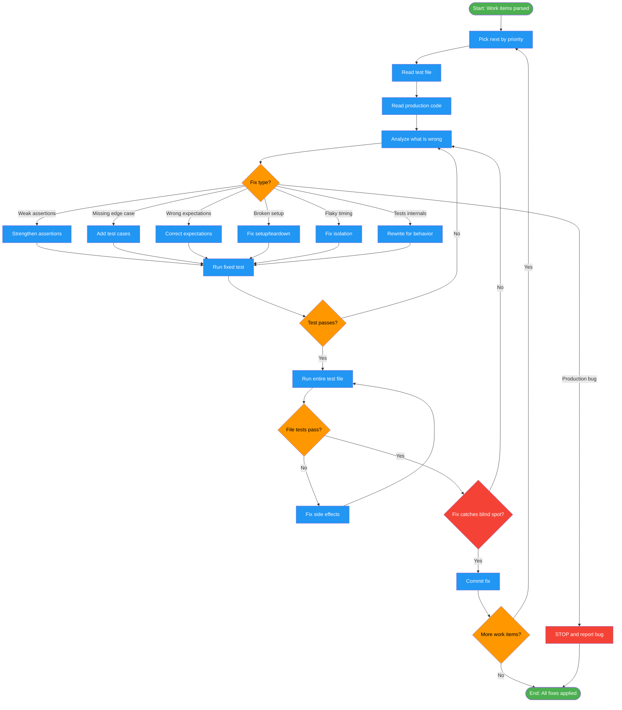

# /fix-tests-execute

## Workflow Diagram

# Diagram: fix-tests-execute

Execute test fixes by priority: investigate each work item, classify the fix type, apply the fix, verify it catches the original blind spot, and commit independently.



## Legend

| Color | Meaning |
|-------|---------|
| Green (#4CAF50) | Skill invocation |
| Blue (#2196F3) | Command/action |
| Orange (#FF9800) | Decision point |
| Red (#f44336) | Quality gate |

## Command Content

``````````markdown
# Phase 2: Fix Execution

## Invariant Principles

1. **Read before fixing** - Always read the test file and production code before making any changes; never guess at code structure
2. **Verify the fix, not just the pass** - A test that passes after modification must be confirmed to catch the originally identified blind spot
3. **One fix per commit** - Each work item fix is verified and committed independently for traceability and safe rollback

Process by priority: critical > important > minor.

## 2.1 Investigation

<analysis>
For EACH work item:
- What does test claim to do? (name, docstring)
- What is actually wrong? (error, audit finding)
- What production code involved?
</analysis>

<RULE>Always read before fixing. Never guess at code structure.</RULE>

1. Read test file (specific function + setup/teardown)
2. Read production code being tested
3. If audit_report: suggested fix is starting point, verify it makes sense

## 2.2 Fix Type Classification

| Situation | Fix Type |
|-----------|----------|
| Weak assertions (green mirage) | Strengthen assertions |
| Missing edge cases | Add test cases |
| Wrong expectations | Correct expectations |
| Broken setup | Fix setup, not weaken test |
| Flaky (timing/ordering) | Fix isolation/determinism |
| Tests implementation details | Rewrite to test behavior |
| **Production code buggy** | STOP and report |

## 2.4 Fix Examples

**Green Mirage Fix (Pattern 2: Partial Assertions):**

```python
# BEFORE: Checks existence only
def test_generate_report():
    report = generate_report(data)
    assert report is not None
    assert len(report) > 0

# AFTER: Validates actual content
def test_generate_report():
    report = generate_report(data)
    assert report == {
        "title": "Expected Title",
        "sections": [...expected sections...],
        "generated_at": mock_timestamp
    }
    # OR at minimum:
    assert report["title"] == "Expected Title"
    assert len(report["sections"]) == 3
    assert all(s["valid"] for s in report["sections"])
```

**Edge Case Addition:**

```python
def test_generate_report_empty_data():
    """Edge case: empty input."""
    with pytest.raises(ValueError, match="Data cannot be empty"):
        generate_report([])

def test_generate_report_malformed_data():
    """Edge case: malformed input."""
    result = generate_report({"invalid": "structure"})
    assert result["error"] == "Invalid data format"
```

**Flaky Test Fix:**

```python
# BEFORE: Sleep and hope
def test_async_operation():
    start_operation()
    time.sleep(1)  # Hope it's done!
    assert get_result() is not None

# AFTER: Deterministic waiting
def test_async_operation():
    start_operation()
    result = wait_for_result(timeout=5)  # Polls with timeout
    assert result == expected_value
```

**Implementation-Coupling Fix:**

```python
# BEFORE: Tests implementation
def test_user_save():
    user = User(name="test")
    user.save()
    assert user._db_connection.execute.called_with("INSERT...")

# AFTER: Tests behavior
def test_user_save():
    user = User(name="test")
    user.save()
    loaded = User.find_by_name("test")
    assert loaded is not None
    assert loaded.name == "test"
```

## 2.5 Verify Fix

```bash
# Run fixed test
pytest path/to/test.py::test_function -v

# Check file for side effects
pytest path/to/test.py -v
```

Verification checklist:
- [ ] Specific test passes
- [ ] Other tests in file still pass
- [ ] Fix would actually catch the failure it should catch

## 2.6 Commit (per-fix strategy)

```bash
git add path/to/test.py
git commit -m "fix(tests): strengthen assertions in test_function

- [What was weak/broken]
- [What fix does]
- Pattern: N - [Pattern name] (if from audit)
"
```
``````````
