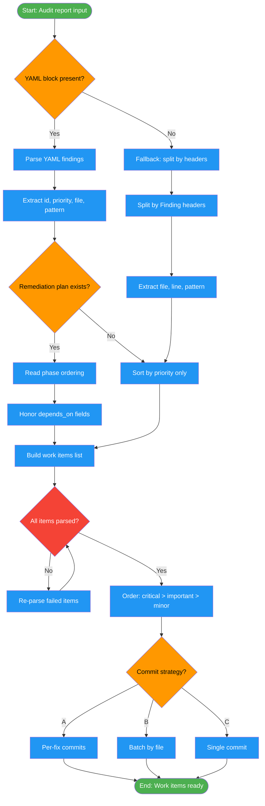

# /fix-tests-parse

## Workflow Diagram

# Diagram: fix-tests-parse

Parse audit reports or test failure output into structured work items, honor dependency ordering from remediation plans, and select a commit strategy before execution begins.



## Legend

| Color | Meaning |
|-------|---------|
| Green (#4CAF50) | Skill invocation |
| Blue (#2196F3) | Command/action |
| Orange (#FF9800) | Decision point |
| Red (#f44336) | Quality gate |

## Command Content

``````````markdown
# Phase 0: Input Processing

## Invariant Principles

1. **Honor dependency order** - Work items with `depends_on` fields must be resolved in the order specified by the remediation plan
2. **Parse completely before acting** - All YAML findings must be parsed and work items built before any fix execution begins
3. **Priority drives execution order** - Critical findings are processed before important, important before minor; never reorder for convenience

## For audit_report mode

Parse YAML block between `---` markers:

```yaml
findings:
  - id: "finding-1"
    priority: critical
    test_file: "tests/test_auth.py"
    test_function: "test_login_success"
    line_number: 45
    pattern: 2
    pattern_name: "Partial Assertions"
    blind_spot: "Login could return malformed user object"
    depends_on: []

remediation_plan:
  phases:
    - phase: 1
      findings: ["finding-1"]
```

Use `remediation_plan.phases` for execution order. Honor `depends_on` dependencies.

**Fallback parsing** (if no YAML block):
1. Split by `**Finding #N:**` headers
2. Extract priority from section header
3. Parse file/line from `**File:**`
4. Extract pattern from `**Pattern:**`
5. Extract code blocks for current_code, suggested_fix
6. Extract blind_spot from `**Blind Spot:**`

## Commit strategy (optional ask)

A) Per-fix (recommended) - each fix separate commit
B) Batch by file
C) Single commit

Default to (A).
``````````
