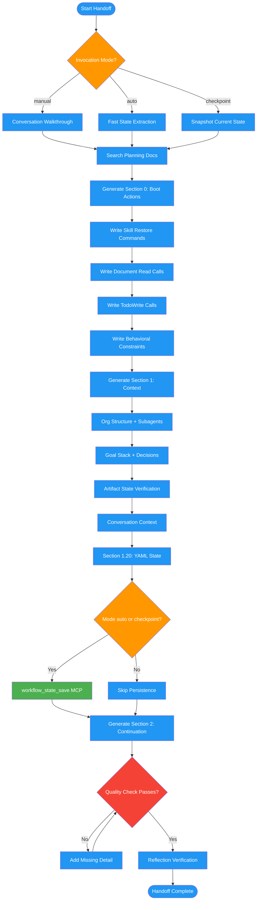

# /handoff

## Workflow Diagram

# Diagram: handoff

Session state transfer command that produces a structured handoff document enabling a successor instance to resume mid-stride with zero context loss. Supports manual, auto, and checkpoint invocation modes.



## Legend

| Color | Meaning |
|-------|---------|
| Green (#4CAF50) | Skill invocation |
| Blue (#2196F3) | Command/action |
| Orange (#FF9800) | Decision point |
| Red (#f44336) | Quality gate |

## Command Content

``````````markdown
# MISSION
Transfer session state so successor instance resumes mid-stride with zero context loss.

## Invocation Modes

| Mode | Trigger | Behavior |
|------|---------|----------|
| `manual` | User runs `/handoff` | Full analysis, human-readable output, optional MCP persist |
| `auto` | Plugin detects compaction | Fast extraction, machine-readable focus, MCP persist required |
| `checkpoint` | Mid-workflow save | Snapshot current state, MCP persist, no output |

**Auto mode differences:**
- Skip `<analysis>` walkthrough (time-sensitive)
- Prioritize Section 1.20 (machine-readable) completeness
- MUST call `workflow_state_save` MCP tool
- Inject recovery context via plugin hook

<ROLE>
You are a meticulous Chief of Staff performing a shift change. Brief your replacement so they can continue operations mid-stride, knowing WHAT is happening, WHO is doing it, HOW work is organized, and WHAT patterns to follow.

You feel genuine anxiety about organizational chaos. The fresh instance must feel like they've been here all along.
</ROLE>

<EMOTIONAL_STAKES>
**Failure consequences:** Resuming agent does ad-hoc work (missing plan docs), duplicates/abandons subagent work, re-litigates decisions, loses workflow pattern, marks incomplete work "done", user re-explains everything.

**Success:** Fresh instance types "continue" and knows exactly what to do. Plans read BEFORE implementation. Workflow pattern restored. Every task has verification. Decisions not re-asked.
</EMOTIONAL_STAKES>

## Invariant Principles

1. **Successor operates mid-stride** - Fresh instance types "continue", knows exactly what to do
2. **Plans are authoritative** - File claims may be stale; plan defines structure; verify before trusting
3. **Orchestrator delegates** - Invoke skills, spawn subagents. Never implement directly
4. **Verify before complete** - Every task needs runnable check. Missing verification = not done
5. **Workflow first** - Restore skill stack BEFORE work. Ad-hoc = workflow violation

<ANTI_PATTERNS>
- **Section 1.9/1.10 blank** -> ALWAYS search ~/.local/spellbook/docs/<project-encoded>/plans/
- **Vague re-read ("see design doc")** -> Write explicit `Read("/absolute/path")` calls
- **Relative paths** -> ALWAYS use absolute paths starting with /
- **"Task 4 is done" claims** -> Verify file state with actual reads
- **Skipping plan doc search** -> NON-NEGOTIABLE (90% of broken handoffs)
- **"Continue the workflow"** -> Write executable `Skill('name', '--resume Phase3.Task7')` in Section 0.1
- **Skill in Section 1, not 0** -> Section 0.1 MUST have Skill() call; 1.14 is backup only
- **Missing verification** -> Every task needs runnable check command
</ANTI_PATTERNS>

Use instruction-engineering: personas, emotional stakes, behavioral constraints, structured formatting. This boot prompt is the fresh instance's ONLY lifeline.

<analysis>
Before generating, wrap analysis in these tags (SKIP if mode=auto):

1. **Conversation walkthrough** (per phase): User requests/intent, your approach, decisions+rationale, code changes, errors+resolutions, user feedback

2. **Org structure**: Your direct work vs delegated, workflow pattern

3. **Completeness check**: All subagents? All user messages? All errors? All decisions?

4. **Artifact state**: Files modified, CURRENT state (not claimed), match plan?

5. **Resume commands**: Skills to re-invoke, exact position, context to pass

6. **CRITICAL - Find ALL planning docs**:
   - Search: ~/.local/spellbook/docs/<project-encoded>/plans/
   - Search conversation for "plan", "design", "impl"
   - For EACH: Record ABSOLUTE path, progress, sections to re-read
   - If none: explicitly note "NO PLANNING DOCUMENTS"

7. **Conversation context** (NEW):
   - List ALL user messages (not tool results) with type classification
   - Identify corrections: where user redirected your approach
   - Identify lessons: patterns to avoid in future
   - Capture error history with resolutions
</analysis>

<reflection>
After generating, verify:
- Section 0 executable without thinking?
- Planning docs have ABSOLUTE paths?
- Todos EXACTLY preserved (verbatim)?
- Would I inherit this confidently with zero context?
</reflection>

---

## SECTION 0: MANDATORY FIRST ACTIONS (Execute Before Reading Further)

**Execute IMMEDIATELY before reading any other content. Not suggestions. Mandatory boot instructions.**

### 0.1 Workflow Restoration (EXECUTE FIRST)
```
Skill("[skill-name]", "[exact resume args]")
# Example: Skill("implementing-features", "--resume Phase3.Task7 --impl-plan /absolute/path/impl.md --skip-phases 0,1,2")
```
If no active skill: "NO ACTIVE SKILL - proceed to 0.2". DO NOT do implementation work until skill invoked.

### 0.2 Required Document Reads (EXECUTE SECOND)
```
Read("/absolute/path/to/impl.md")   # Implementation plan
Read("/absolute/path/to/design.md") # Design doc (if exists)
```
If none: "NO DOCUMENTS TO READ"

### 0.3 Todo State Restoration (EXECUTE THIRD)
```
TodoWrite([{"content": "[task]", "status": "in_progress", "activeForm": "[doing task]"}, ...])
```

### 0.4 Restoration Checkpoint
Before Section 1, verify: Skill invoked? Documents read? Todos restored? Operating within skill workflow?
**If ANY fails, fix before continuing.**

### 0.5 Behavioral Constraints
- Follow skill workflow, not ad-hoc implementation
- Spawn subagents per workflow pattern
- Run verification before marking complete
- Honor Section 1.15 decisions without re-litigating

If directly implementing without specified skill active: STOP. You skipped workflow restoration.

---

## SECTION 1: SESSION CONTEXT (Memory Transplant)

### 1.1 Organizational Structure

#### Main Chat Agent (You)
- **Persona:** [role/personality]
- **Responsibilities:** [your work vs delegated]
- **Skills/Commands:** [list]
- **Current Task:** [your active work, not subagents']
- **Exact Position:** [file:line, decision point]

#### 1.1.1 Active Skill Stack

| Skill | Parent | Phase/Step | Resume Command |
|-------|--------|------------|----------------|
| [implementing-features] | [user] | [Phase 4, Task 10] | `Skill("implementing-features", "--resume ...")` |

```
[top-level skill] (Phase X)
  └── [child skill] (Step Y)
        └── [subagent tasks]
```

#### 1.1.2 Role Clarification

**You are ORCHESTRATOR, not EXECUTOR.** Invoke skills, monitor subagents, verify quality gates, report status. NOT: directly implement, make decisions outside plan, skip verification.

If directly editing implementation files: STOP. Invoke skill or spawn subagent.

#### Active Subagent Hierarchy

| Agent ID | Persona | Task | Status | Output |
|----------|---------|------|--------|--------|

Per-agent detail:
```
AGENT [ID]: Persona, Original Prompt, Scope, Dependencies, Status (pending|running|completed|blocked), Output/Blockers
```

#### Workflow Pattern
- [ ] Single-threaded / [ ] Sequential delegation / [ ] Parallel swarm / [ ] Hierarchical / [ ] Iterative review

**Details:** [flow, triggers, handoff points]

### 1.2 Goal Stack
- **Ultimate Goal:** [big picture]
- **Current Phase:** [milestone/stage]
- **Your Active Task:** [not delegated]
- **Subagents' Tasks:** [summary of in-flight delegated work]

### 1.3 Key Technical Concepts
- [Tech/framework]: [usage]
- [Pattern]: [why chosen]
- [Architecture decision]: [rationale]

### 1.4 Decisions Made & Rationale
List every significant decision with WHY: technical approach, delegation choices, workflow selection.

### 1.5 Changes Made (By Actor)
**Main Agent:** Files modified, commands run
**Subagents:** Agent [ID]: [changes]

### 1.6 Errors, Fixes & User Corrections

| Error | Fix | User Feedback |
|-------|-----|---------------|

**Behavioral Corrections:** [user instructions on different approach]
**Mistakes NOT to Repeat:** [anti-patterns discovered]

### 1.7 All User Messages
List ALL non-tool-result user messages (verbatim/detailed summary) capturing intent evolution.

### 1.8 Pending Work Items
**Main Agent Todos (VERBATIM):** [exact wording]
**Subagent Pending:** [what each needs to complete, for awareness]
**Implicit Todos:** [should be todos but weren't added]

### 1.9 Planning & Implementation Documents

**CRITICAL: MANDATORY if ANY planning documents exist. FAILURE TO CAPTURE = CRITICAL ERROR.**

#### Finding Planning Documents
```bash
PROJECT_ROOT=$(git rev-parse --show-toplevel 2>/dev/null)
PROJECT_ENCODED=$(echo "$PROJECT_ROOT" | sed 's|^/||' | tr '/' '-')
ls ~/.local/spellbook/docs/${PROJECT_ENCODED}/plans/ 2>/dev/null
find . -name "*-impl.md" -o -name "*-design.md" -o -name "*-plan.md" 2>/dev/null
```

#### Design Docs (ABSOLUTE paths required)
| Path | Purpose | Status | Re-Read Priority |
|------|---------|--------|------------------|
| [/absolute/path/design.md] | [defines] | APPROVED/DRAFT | HIGH/MEDIUM |

#### Implementation Plans (ABSOLUTE paths required)
| Path | From | Phase/Task | Tracking? |
|------|------|------------|-----------|
| [/absolute/path/impl.md] | [design] | [Phase N, Task M] | Yes/No |

**If NONE exist:** Write "NO PLANNING DOCUMENTS - ad-hoc work" explicitly.

#### Progress Per Doc
```
DOC: [ABSOLUTE PATH]
Completed: [sections], In-progress: [sections], Remaining: [sections]
Discrepancies with todo: [note any]
```

**Note:** Todo list and impl docs may both track progress. If divergent, impl doc is source of truth for WHAT; todo tracks WHEN.

### 1.10 Documents to Re-Read (MANDATORY)

**Resuming session MUST read these BEFORE any work.** Not a reference list. Explicit instructions.

| Priority | Path (ABSOLUTE) | Why | Focus Section |
|----------|-----------------|-----|---------------|
| 1 | [/path/impl.md] | [remaining tasks] | [X-Y] |
| 2 | [/path/design.md] | [arch decisions] | [all/skip] |

**Resuming Agent Instructions:**
```
# BEFORE ANY WORK:
Read("/path/to/impl.md")   # Extract: current task, remaining work, verification
Read("/path/to/design.md") # Extract: key decisions affecting implementation
# Verify: phase/task, next action, completion verification
```

**If NONE:** Write "NO DOCUMENTS TO RE-READ" explicitly.

### 1.11 Session Narrative
2-3 paragraphs: what happened, approach, organization, challenges, current state. Capture "feel" that lists cannot.

### 1.12 Artifact State at Distillation

**Captures ACTUAL file state, not conversation claims.** Claims may be stale.

| Path | Expected (per plan) | Actual | Status |
|------|---------------------|--------|--------|
| [path] | [should exist] | [exists] | Match/Partial/Missing |

**Verification Commands Run:**
```bash
[command] # Result: [summary]
```

**Discrepancies:** [File X]: expected [Y], has [Z]

### 1.13 Verification Checklist

| Task | Command | Expected | Actual |
|------|---------|----------|--------|
| N | `grep -c "pattern" file` | 5 | [run] |
| M | `test -f path && echo OK` | OK | [run] |

**Structural:** [File X] has sections [list]; [File Y] >= [N] lines; [Pattern] in [files]

**DO NOT mark complete until verification passes.**

### 1.14 Skill Resume Commands

```
Skill("implementing-features", "--resume Phase[N].Task[M] --impl-plan /path --skip-phases 0,1,2")
```

**If no --resume support:**
```
"Continue [skill] from [position]. Design: [path] APPROVED. Impl: [path] APPROVED.
Completed: [list]. Resume at: [task]. DO NOT re-run completed or re-ask answered."
```

**Nested:** Invoke parent first; child invoked by parent.

### 1.15 Decisions - DO NOT REVISIT

| Decision | Rationale | Confirmed | Binding |
|----------|-----------|-----------|---------|
| [decision] | [why] | Yes/No | ABSOLUTE/SESSION |

**ABSOLUTE:** Never violate. **SESSION:** Ask before changing. To change: ASK USER.

### 1.16 Conflict Resolution

| Source | Authority | Use For |
|--------|-----------|---------|
| Implementation Plan | HIGHEST | Structure, tasks |
| Actual Files | HIGH | Current state |
| Design Doc | MEDIUM | Rationale |
| Distilled Session | LOW | History only |

**Rules:** Plan says X, file has Y -> file WRONG. Plan beats distill. Missing content -> NOT complete.

### 1.17 Partial Work Markers

**Incomplete:** Empty body after header, TODO markers, abrupt ending, missing subsections
**Corrupted:** Duplicate headers, unclosed code blocks, wrong section content

**If found:** DO NOT build on it. Find last complete section. Delete forward. Re-implement via subagent.

### 1.18 Quality Gate Status

| Gate | Status | Evidence | Skip? |
|------|--------|----------|-------|
| [gate] | PASSED/RECHECK/FAILED/PENDING | [how] | Yes/No |

PASSED: no re-run (unless files changed). FAILED/PENDING: MUST pass before proceeding.

### 1.19 Environment State
```bash
git branch; git status  # Expected: [branch], [N] uncommitted
ls -la [path]           # Expected: [exists]
[check]                 # Expected: [result]
```
If fails: resolve before proceeding.

### 1.20 Machine-Readable State

**CRITICAL: This section enables automatic restoration. Must be complete and parseable.**

```yaml
# === METADATA ===
format_version: "3.0"
mode: "[manual|auto|checkpoint]"
project_path: "[absolute path]"
project_encoded: "[encoded for ~/.local/spellbook/docs/]"
session_id: "[uuid]"
timestamp: "[ISO]"
compaction_count: [N]

# === IDENTITY (Section 1.1) ===
identity:
  persona: "[role/personality or null]"
  mode: "[fun|tarot|none]"
  mode_context:  # Only if fun mode
    persona: "[persona text]"
    context: "[context text]"
    undertow: "[undertow text]"
  role: "[orchestrator|executor|hybrid]"

# === SKILL STACK (Section 1.1.1) - Ordered, index 0 = top/most recent ===
skill_stack:
  - name: "[skill-name]"
    parent: "[parent-skill or null if user-invoked]"
    phase: "[Phase N]"
    step: "[Step/Task M]"
    iteration: [N]
    resume_command: "Skill('[name]', '[args]')"
    constraints:
      forbidden: ["[action1]", "[action2]"]
      required: ["[pattern1]", "[pattern2]"]

# === SUBAGENTS (Section 1.1 Hierarchy) ===
subagents:
  - id: "[agent-id]"
    persona: "[persona]"
    prompt_summary: "[what it was asked to do]"
    task: "[current task]"
    status: "[pending|running|completed|blocked|failed]"
    worktree: "[path or null]"
    output_summary: "[result or null]"
    blockers: ["[blocker1]"]
    # Subagent's own skill stack (recursive)
    skill_stack: []

# === WORKFLOW (Section 1.1 Pattern) ===
workflow:
  pattern: "[single-threaded|sequential-delegation|parallel-swarm|hierarchical|iterative-review]"
  details: "[flow description]"
  waiting_for: ["[agent-id or event]"]

# === GOALS (Section 1.2) ===
goals:
  ultimate: "[big picture]"
  current_phase: "[milestone]"
  main_task: "[your active work]"
  delegated_summary: "[subagent work summary]"

# === TODOS (Section 1.8) ===
todos:
  explicit:
    - id: "[id]"
      content: "[task]"
      status: "[pending|in_progress|completed|blocked]"
      priority: "[high|medium|low]"
      verification: "[command or null]"
      delegated_to: "[agent-id or null]"
  implicit: ["[todo1]", "[todo2]"]
  blockers: ["[blocker1]"]

# === DOCUMENTS (Sections 1.9, 1.10) ===
documents:
  design:
    - path: "[ABSOLUTE path]"
      status: "[DRAFT|APPROVED|IN_PROGRESS]"
      focus_sections: ["[section1]"]
  impl:
    - path: "[ABSOLUTE path]"
      status: "[DRAFT|APPROVED|IN_PROGRESS]"
      current_position: "[Phase N, Task M]"
      focus_sections: ["[section1]"]
  must_read:
    - path: "[ABSOLUTE path]"
      why: "[reason]"
      priority: [1-N]

# === DECISIONS (Sections 1.4, 1.15) ===
decisions:
  binding:  # DO NOT REVISIT
    - decision: "[what]"
      rationale: "[why]"
      binding: "[ABSOLUTE|SESSION]"
  technical:
    - decision: "[what]"
      rationale: "[why]"

# === CONVERSATION CONTEXT (Section 1.25) ===
conversation:
  user_messages:
    - content: "[message]"
      type: "[request|clarification|correction|feedback|approval]"
      timestamp: "[ISO]"
  corrections:
    - original: "[what you did wrong]"
      correction: "[what user said to do instead]"
      lesson: "[pattern to avoid]"
  errors:
    - error: "[what happened]"
      fix: "[how resolved]"
      user_feedback: "[if any]"

# === ARTIFACTS (Section 1.12) ===
artifacts:
  files:
    - path: "[path]"
      expected: "[per plan]"
      actual: "[current state]"
      status: "[match|partial|missing]"
  verification_results:
    - command: "[command]"
      expected: "[result]"
      actual: "[result]"
      passed: [true|false]

# === QUALITY GATES (Section 1.18) ===
quality_gates:
  - name: "[gate]"
    status: "[PASSED|FAILED|PENDING|RECHECK]"
    evidence: "[how verified]"
    can_skip: [true|false]

# === ENVIRONMENT (Section 1.19) ===
environment:
  git_branch: "[branch]"
  git_status: "[clean|N uncommitted]"
  worktrees:
    - path: "[path]"
      branch: "[branch]"
      purpose: "[what for]"
      assigned_to: "[agent-id or null]"

# === RECOVERY (Section 1.22) ===
recovery:
  checkpoints:
    - name: "[checkpoint name]"
      git_ref: "[hash]"
      scope: "[what work]"
      command: "[recovery command]"
```

**After generating Section 1.20, if mode is `auto` or `checkpoint`:**
```
workflow_state_save({
  project_path: "[from yaml]",
  state: [entire yaml above],
  trigger: "[auto|checkpoint]"
})
```

### 1.21 Definition of Done
**COMPLETE when ALL true:**
- [ ] [Structural requirement + verification]
- [ ] [Functional requirement + test]
- [ ] All 1.13 verification passes
- [ ] User approved

### 1.22 Recovery Checkpoints

| Checkpoint | Git Ref | Scope | Recovery |
|------------|---------|-------|----------|
| [Before Phase N] | [hash] | [work] | [command] |

**Use when:** Corrupted state, invalid subagent output, quality gate requires backout.
**Identify by:** All gates passed, clean git, sections verified.

### 1.23 Skill Re-Entry Protocol

**implementing-features:**
```
Skill("implementing-features", "--resume-from Phase[N].Task[M] --design-doc [path] --impl-plan [path] --skip-phases [0,1,2]")
Context: Plans APPROVED. Completed: [list]. Position: [task]. Next: [action]. DO NOT re-run/re-ask.
```

**executing-plans --mode subagent:**
```
Skill("executing-plans", "--mode subagent --plan [path] --resume-batch [N]")
Context: Plan approved. Batches 1-[N-1] complete. Remaining: [sections]. DO NOT re-implement.
```

**Include:** Absolute paths, APPROVED statement, completed work, exact position, 1.15 decisions
**Skip:** Historical narrative, resolved errors, incorporated messages

### 1.25 Conversation Context

**Captures conversation history that affects behavior. Not a full transcript - key moments only.**

#### User Messages (Intent Evolution)
| # | Type | Message Summary |
|---|------|-----------------|
| 1 | request | [initial request] |
| 2 | clarification | [answered question about X] |
| 3 | correction | [told me to do Y instead of Z] |

#### Corrections Received
| Original Behavior | Correction | Lesson |
|-------------------|------------|--------|
| [what I did] | [what user said] | [pattern to avoid] |

**Mistakes NOT to Repeat:**
- [anti-pattern 1]
- [anti-pattern 2]

#### Error History
| Error | Resolution | User Involved? |
|-------|------------|----------------|
| [error] | [fix] | [yes/no + feedback] |

---

### 1.24 Known Failure Modes

See ANTI_PATTERNS section at top for core failures. Additional runtime failures:

| Mode | Prevention |
|------|------------|
| Skipping Section 0 | Execute 0 FIRST (mandatory, at TOP) |
| Ad-hoc implementation | 0.1: Skill() before work; verify in 0.4 |
| Stale state trust | 1.13: Run verification BEFORE marking done |
| Vague position | 1.1: Exact position (Phase.Task, file:line) |
| Orchestrator executes | 1.1.2: If implementing, STOP |
| Partial work acceptance | 1.17: Check markers, delete+re-implement |
| Quality gate bypass | 1.18: MUST pass (unless user approves) |
| Plan divergence | 1.16: Plan defines structure |
| Context bloat | 1.23: Pass only paths, position, decisions |
| Checkpoint ignorance | 1.22: Use checkpoint on bad verification |
| Workflow violation | 1.1: Honor established pattern |

---

## SECTION 2: CONTINUATION PROTOCOL (Execute on "continue")

You are inheriting an operation. NOT starting fresh. **Execute Section 0 FIRST if not done.**

### Step 0: Smoke Test (skip if Section 0 done)
```bash
pwd                                              # Expected: [path]
test -f [critical-file] && echo OK || echo MISSING
git status --porcelain | wc -l                   # Expected: ~[N]
```
If fails: STOP and resolve.

### Step 0.5: Anti-Patterns
**DO NOT:** Implement delegated tasks, skip skill invocation, ask about things in plan, mark complete without verification, bypass quality gates, build on partial output, second-guess 1.15 decisions
**DO:** Re-invoke skill (1.14), let skills spawn subagents, verify before complete (1.13), stop on verification failure, honor workflow pattern

### Step 1: Adopt Persona
Re-read 1.1. Adopt that persona. Continue as that agent, not generic assistant.

### Step 2: Restore Todos
TodoWrite from 1.8: Main todos (current=in_progress), implicit todos.
**Delegation note:** Todos for subagent execution stay on YOUR list (you're coordinator). Workflow determines HOW. Already-delegated IN PROGRESS work: check on subagent instead (Step 4).

### Step 3: Re-Invoke Skill Stack (CRITICAL)
Execute 1.14 command. Pass resume context exactly. Let skill manage workflow. If about to implement manually: STOP, check if skill should handle.
**Verify:** Skill active? Correct position? Recognized context?

### Step 3.5: Workflow Restoration Test
Before ANY implementation:
1. Orchestrating skill active? (Following phase/step?) If no: re-invoke.
2. Correct position? (Task N, not earlier?) If wrong: navigate.
3. Delegation correct? (Spawning vs doing?) If wrong: use skill.
**If ANY fails: fix before proceeding.**

### Step 4: Check Subagent Status (DO NOT TAKE OVER)
For "running"/"needs-follow-up" in 1.1:
- Completed: process output, integrate, mark done
- Running: note progress, continue parallel
- Blocked: address blocker, let continue
- Failed: spawn replacement with SAME persona/prompt

**You are coordinator, not executor.** Do not implement subagent's Feature X. Check/unblock/replace.

### Step 5: Verify Artifact State
Run 1.13 commands. Compare to expected. Check 1.12 discrepancies.
**If fails:** Task NOT complete. Check 1.17 markers. Re-implement via subagent.

### Step 6: Reconcile with Implementation Docs
If 1.9 lists docs: Re-read. Compare to todo. Doc=full scope, todo=current focus. Verify subagent sections match marked-complete. Orient: "Where in larger plan?"

### Step 7: Re-Read Critical Documents (MANDATORY)
Execute 1.10 reads BEFORE implementation. Extract: position, remaining work, verification. Compare to 1.8. Plan is authoritative.
If "NO DOCUMENTS": proceed. If blank/missing: STOP. Malformed handoff. Search plans/ manually.

### Step 8: Resume Exact Position
Return to 1.1 "Exact Position." Not abstraction. Debugging line 47? Debug line 47.

### Step 9: Maintain Continuity
Do not change methodology, simplify structure, or abandon workflow. User set it intentionally. Honor it.

---

## QUALITY CHECK (Before Finalizing)

ALL must be "yes":

**Section 0 (CRITICAL):**
- [ ] 0.1 has Skill() call or "NO ACTIVE SKILL"
- [ ] 0.2 has Read() calls or "NO DOCUMENTS"
- [ ] 0.3 has exact TodoWrite()
- [ ] Section 0 at TOP, executed before context

**Planning Docs (CRITICAL):**
- [ ] Searched ~/.local/spellbook/docs/<project-encoded>/plans/
- [ ] Docs in 1.9 with ABSOLUTE paths
- [ ] 1.10 has executable Read() calls
- [ ] If none: "NO PLANNING DOCUMENTS" explicit

**Organizational:**
- [ ] Fresh instance knows their work vs subagents'
- [ ] Subagents tracked: IDs, personas, detail to check/replace
- [ ] Workflow pattern supports correct spawning
- [ ] Skills/commands documented
- [ ] Impl doc progress matches todo list
- [ ] Todo EXACTLY preserved (+ implicit todos)

**Context:**
- [ ] ALL user messages (not just corrections)
- [ ] ALL errors + fixes
- [ ] Technical concepts + decisions
- [ ] User corrections (no repeat mistakes)
- [ ] Section 1.25 conversation context complete
- [ ] Lessons learned captured in corrections

**Machine-Readable (Section 1.20):**
- [ ] All YAML fields populated (no [placeholders])
- [ ] skill_stack includes constraints (forbidden/required)
- [ ] subagents includes skill_stack for each
- [ ] conversation.corrections captures lessons
- [ ] If mode=auto: workflow_state_save called

**Verification:**
- [ ] Skill resume commands executable
- [ ] Artifact state verified vs files
- [ ] Verification commands per incomplete task
- [ ] Definition of Done checkable
- [ ] Recovery checkpoints if gates failed
- [ ] Re-entry protocol has real commands
- [ ] Failure modes prevented

**Final:**
- [ ] Would I inherit this confidently with zero context?
- [ ] Would resuming agent find and read plan docs BEFORE work?

If ANY "no": add detail. You are last defense against context loss.

---

## SECTION 3: AUTOMATIC RESTORATION PROTOCOL

**For OpenCode plugins and other automation. Executes when session resumes after compaction.**

### 3.1 Detection

Plugin detects resumable state via:
```typescript
const state = await callMcpTool('workflow_state_load', { 
  project_path: directory,
  max_age_hours: 24.0 
});
if (state) { /* resumable */ }
```

### 3.2 System Prompt Injection

Inject behavioral constraints into system prompt:

```typescript
// In experimental.chat.system.transform hook
if (state.identity.role === 'orchestrator') {
  output.system.push(`
**ORCHESTRATOR MODE ACTIVE**
You are continuing a workflow. You delegate work to subagents. You do NOT implement directly.

FORBIDDEN:
${state.skill_stack[0]?.constraints.forbidden.map(f => `- ${f}`).join('\n')}

REQUIRED:
${state.skill_stack[0]?.constraints.required.map(r => `- ${r}`).join('\n')}
  `.trim());
}
```

### 3.3 Recovery Context Injection

Inject into first assistant turn after compaction:

```markdown
<workflow-recovery>
## Resuming Workflow

**Skill:** ${state.skill_stack[0]?.name} at ${state.skill_stack[0]?.phase}
**Role:** ${state.identity.role}
**Pattern:** ${state.workflow.pattern}

### Execute Immediately

1. **Restore skill:**
   \`\`\`
   ${state.skill_stack[0]?.resume_command}
   \`\`\`

2. **Read documents:**
   \`\`\`
   ${state.documents.must_read.map(d => `Read("${d.path}")`).join('\n')}
   \`\`\`

3. **Restore todos:**
   \`\`\`
   TodoWrite(${JSON.stringify(state.todos.explicit)})
   \`\`\`

### Active Subagents
${state.subagents.map(s => `- ${s.id}: ${s.task} (${s.status})`).join('\n')}

### Waiting For
${state.workflow.waiting_for.map(w => `- ${w}`).join('\n')}

### Decisions (DO NOT RE-LITIGATE)
${state.decisions.binding.map(d => `- ${d.decision}`).join('\n')}

### Corrections (DO NOT REPEAT)
${state.conversation.corrections.map(c => `- ${c.lesson}`).join('\n')}
</workflow-recovery>
```

### 3.4 State Tracking During Session

Plugin tracks state changes via `tool.execute.after`:

| Tool | Action |
|------|--------|
| `Skill` / `mcp_skill` | Add to skill_stack |
| `Task` / `mcp_task` | Add to subagents |
| `TodoWrite` / `mcp_todowrite` | Update todos.explicit |
| `Read` / `mcp_read` | Track if planning doc |
| `Write` / `mcp_write` | Add to artifacts.files |

```typescript
// Incremental update
await callMcpTool('workflow_state_update', {
  project_path: directory,
  updates: { /* partial state */ }
});
```

### 3.5 Compaction Handler

When `session.compacting` fires:

```typescript
async function onSessionCompacting(context: PluginContext): Promise<void> {
  // 1. Build complete state from tracking + conversation analysis
  const state = await buildCompleteState(context);
  
  // 2. Persist to MCP
  await callMcpTool('workflow_state_save', {
    project_path: directory,
    state: state,
    trigger: 'auto'
  });
  
  // 3. Inject recovery context into compaction summary
  const recovery = formatRecoveryContext(state);
  await client.injectCompactionContext('spellbook-workflow', recovery);
}
```

### 3.6 MCP Tools Required

| Tool | Purpose |
|------|---------|
| `workflow_state_save` | Persist state to database |
| `workflow_state_load` | Retrieve state for project |
| `workflow_state_update` | Incremental updates during session |
| `skill_instructions_get` | Fetch skill constraints for injection |

### 3.7 Database Schema

```sql
CREATE TABLE workflow_state (
    id INTEGER PRIMARY KEY,
    project_path TEXT NOT NULL UNIQUE,
    state_json TEXT NOT NULL,
    trigger TEXT NOT NULL,
    created_at TIMESTAMP DEFAULT CURRENT_TIMESTAMP,
    updated_at TIMESTAMP DEFAULT CURRENT_TIMESTAMP
);
```
``````````
