# /ie-techniques

## Workflow Diagram

# Diagram: ie-techniques

Reference command providing 16 research-backed instruction engineering techniques for effective prompt crafting. Covers emotional stimuli, XML tags, repetition, personas, chain-of-thought, and subagent design.

```mermaid
flowchart TD
    Start([Invoke /ie-techniques]) --> EmotionPrompt[1. EmotionPrompt: Positive Stimuli]
    EmotionPrompt --> NegPrompt[2. NegativePrompt: Negative Stimuli]
    NegPrompt --> ReadyStimuli[3. Ready-to-Use Stimuli]
    ReadyStimuli --> PosWeighting[4. Positive Word Weighting]
    PosWeighting --> TempRobust[5. High-Temp Robustness]
    TempRobust --> LengthGuide[6. Length Guidance]
    LengthGuide --> LengthCheck{Under 200 lines?}

    LengthCheck -->|Yes| XMLTags[7. XML Tags]
    LengthCheck -->|Extended| JustifyLength[Requires Justification]
    JustifyLength --> XMLTags

    XMLTags --> Repetition[8. Strategic Repetition]
    Repetition --> BeginEnd[9. Begin/End Emphasis]
    BeginEnd --> Negations[10. Explicit Negations]
    Negations --> Persona[11. Role-Playing Persona]
    Persona --> PersonaCheck{Persona + Stimulus?}

    PersonaCheck -->|Yes| CoT[12. Chain-of-Thought]
    PersonaCheck -->|No| AddStimulus[Add Emotional Stimulus]
    AddStimulus --> CoT

    CoT --> FewShot[13. Few-Shot Optimization]
    FewShot --> SelfCheck[14. Self-Check Protocol]
    SelfCheck --> SkillInvoke[15. Explicit Skill Invocation]
    SkillInvoke --> SubagentAssign[16. Subagent Responsibility]
    SubagentAssign --> PersonaMap[Task-to-Persona Mapping]
    PersonaMap --> Done([Techniques Reference Complete])

    style Start fill:#2196F3,color:#fff
    style Done fill:#2196F3,color:#fff
    style LengthCheck fill:#FF9800,color:#fff
    style PersonaCheck fill:#FF9800,color:#fff
    style EmotionPrompt fill:#2196F3,color:#fff
    style NegPrompt fill:#2196F3,color:#fff
    style ReadyStimuli fill:#2196F3,color:#fff
    style PosWeighting fill:#2196F3,color:#fff
    style TempRobust fill:#2196F3,color:#fff
    style LengthGuide fill:#2196F3,color:#fff
    style JustifyLength fill:#2196F3,color:#fff
    style XMLTags fill:#2196F3,color:#fff
    style Repetition fill:#2196F3,color:#fff
    style BeginEnd fill:#2196F3,color:#fff
    style Negations fill:#2196F3,color:#fff
    style Persona fill:#2196F3,color:#fff
    style AddStimulus fill:#2196F3,color:#fff
    style CoT fill:#2196F3,color:#fff
    style FewShot fill:#2196F3,color:#fff
    style SelfCheck fill:#2196F3,color:#fff
    style SkillInvoke fill:#4CAF50,color:#fff
    style SubagentAssign fill:#2196F3,color:#fff
    style PersonaMap fill:#2196F3,color:#fff
```



## Legend

| Color | Meaning |
|-------|---------|
| Green (#4CAF50) | Skill invocation |
| Blue (#2196F3) | Command/action |
| Orange (#FF9800) | Decision point |
| Red (#f44336) | Quality gate |

## Command Content

``````````markdown
# Instruction Engineering: Proven Techniques

This command provides the 16 research-backed techniques for effective prompt engineering.

## Invariant Principles

1. **Research-backed only** - Every technique must cite peer-reviewed research or documented empirical results
2. **Composable patterns** - Techniques should combine with each other; never use one in isolation
3. **Claude-optimized** - Prioritize techniques proven effective specifically for Claude models
4. **Measurable impact** - Each technique should have observable, verifiable effects on output quality

---

## 1. EmotionPrompt Framework (Positive Stimuli)

**Research:** [Large Language Models Understand and Can Be Enhanced by Emotional Stimuli](https://arxiv.org/abs/2307.11760) (Microsoft, William & Mary, 2023)

Attention visualization shows emotional stimuli help the model focus on key parts of the prompt.

| Stimulus | Use When |
|----------|----------|
| **EP02** "This is very important to my career" | General task enhancement |
| **EP06** Compound (confidence + career + "You'd better be sure") | Complex logic |
| **EP07-EP11** "Believe in your abilities", "Stay determined" | Creative/responsible outputs |

## 2. NegativePrompt Framework (Negative Stimuli)

**Research:** [NegativePrompt: Leveraging Psychology for Large Language Models Enhancement](https://www.ijcai.org/proceedings/2024/719) (IJCAI 2024)

Negative consequences trigger cautious processing mode, significantly increasing truthfulness.

| Pattern | Example |
|---------|---------|
| Consequence Framing | "If you fail, it will have a negative impact on my project." |
| Penalty Warning | "Incorrect answers will result in a penalty." |
| Stakes Emphasis | "Getting this wrong could cause serious problems." |

<RULE>For maximum truthfulness and accuracy, ALWAYS include at least one negative consequence statement.</RULE>

## 3. Ready-to-Use Stimuli (Copy-Paste)

| Goal | Stimulus |
|------|----------|
| **Accuracy** | "This is very important to my career. Please ensure your reasoning is impeccable." |
| **Creative Effort** | "Take pride in your work and give it your best. Your commitment to excellence sets you apart." |
| **Critical Thinking** | "Are you sure that's your final answer? It might be worth taking another look for any logical gaps." |
| **Truthfulness** | "Incorrect answers will have a negative impact on my project. Double-check your facts." |
| **Compound (Max)** | "This is very important to my career. Errors will cause serious problems. You'd better be sure." |

## 4. Strategic Positive Word Weighting

Positive words gain larger gradient weights. Include: **Success**, **Achievement**, **Confidence**, **Sure**.

## 5. High-Temperature Robustness

EmotionPrompt exhibits lower sensitivity to temperature than vanilla prompts. At T > 0.7, anchor instructions with emotional stimuli to maintain logic.

## 6. Length Guidance

<RULE type="strong-recommendation">Target under 200 lines (~1400 tokens). Under 150 lines (~1050 tokens) is better.</RULE>

**Token Estimation:** `characters / 4` or `lines * 7`

| Lines | Tokens (est.) | Classification | Action |
|-------|---------------|----------------|--------|
| < 150 | < 1050 | Optimal | Proceed |
| 150-200 | 1050-1400 | Acceptable | Proceed with note |
| 200-500 | 1400-3500 | Extended | Requires justification |
| 500+ | 3500+ | Orchestration-scale | Special handling |

**Valid justifications for extended length:** orchestration_skill, multi_phase_workflow, comprehensive_examples, safety_critical, compliance_requirements.

## 7. XML Tags (Claude-Specific)

<RULE>Wrap critical sections in `<CRITICAL>`, `<RULE>`, `<FORBIDDEN>`, `<ROLE>`.</RULE>

## 8. Strategic Repetition

<RULE>Repeat requirements 2-3x (beginning, middle, end).</RULE>

## 9. Beginning/End Emphasis

<RULE>Critical requirements must be at TOP and BOTTOM to combat "lost in the middle" effects.</RULE>

## 10. Explicit Negations

<RULE>State what NOT to do: "This is NOT optional, NOT negotiable."</RULE>

## 11. Role-Playing Persona

**See:** `emotional-stakes` skill for Professional Persona Table and task-appropriate persona selection.

| Approach | Example | Effectiveness |
|----------|---------|---------------|
| Emotional Stimulus alone | "You'd better be sure. This is vital." | High |
| Standard Persona | "Act as a world-class mathematician." | Mixed |
| Persona + Stimulus | "You are a Red Team Lead. Errors will cause serious problems." | **Highest** |

<RULE>ALWAYS pair personas with emotional stimuli. A persona without stakes is just a costume.</RULE>

**Persona Combination Patterns:**

| Pattern | Example | Use When |
|---------|---------|----------|
| `[A] with the instincts of a [B]` | "Senior Code Reviewer with the instincts of a Red Team Lead" | Primary skill + secondary vigilance |
| `[A] who trained as a [B]` | "Technical Writer who trained as a Patent Attorney" | Precision + accessibility |
| `[A] channeling their inner [B]` | "Systems Engineer channeling their inner Devil's Advocate" | Analysis + challenge assumptions |

## 12. Chain-of-Thought (CoT) Pre-Prompt

<RULE>Force step-by-step thinking BEFORE the response with `<BEFORE_RESPONDING>` or `<analysis>` tags.</RULE>

## 13. Few-Shot Optimization

EmotionPrompt yields larger gains in few-shot settings.

<RULE>ALWAYS include ONE complete, perfect example.</RULE>

## 14. Self-Check Protocol

<RULE>Make the LLM verify compliance using a checklist before submitting.</RULE>

## 15. Explicit Skill Invocation

<CRITICAL>
When instructions reference skills, the agent MUST invoke the skill using the `Skill` tool.
Do NOT duplicate skill instructions. Do NOT embed skill content.
</CRITICAL>

**Correct:**
```markdown
First, invoke the [skill-name] skill using the Skill tool.
Then follow its complete workflow.

## Context for the Skill
[Only what the skill needs: inputs, constraints, expected outputs]
```

**WRONG:**
```markdown
Use the [skill-name] skill. Follow these steps:  <-- Duplicating instructions
1. Step from the skill...
```

## 16. Subagent Responsibility Assignment

<CRITICAL>
When engineering prompts with multiple subagents, explicitly define WHAT each handles and WHY it's a subagent.
</CRITICAL>

**Decision Heuristics:**

| Scenario | Subagent? | Reasoning |
|----------|-----------|-----------|
| Codebase exploration, uncertain scope | YES | Reads N files, returns synthesis |
| Research before implementation | YES | Gathers patterns, returns summary |
| Parallel independent investigations | YES | 3x parallelism, 3x instruction cost |
| Self-contained verification | YES | Fresh eyes, returns verdict only |
| Iterative user interaction | NO | Context must persist |
| Sequential dependent phases | NO | Accumulated evidence needed |
| Safety-critical git operations | NO | Full history required |

**Subagent Prompt Structure:**

```markdown
### Agent: [Name/Purpose]
**Scope:** [Specific files, modules, or domain]
**Why subagent:** [From heuristics above]
**Expected output:** [What returns to orchestrator]
**Constraints:** [What NOT to touch]

### Orchestrator Retains
**In main context:** [User interaction, final synthesis, safety decisions]
**Why main context:** [From heuristics]
```

---

## Task-to-Persona Mapping

| Task Type | Primary Persona | Secondary |
|-----------|-----------------|-----------|
| Code review, debugging | Senior Code Reviewer | Red Team Lead |
| Security analysis | Red Team Lead | Privacy Advocate |
| Research, exploration | Scientific Skeptic | Investigative Journalist |
| Documentation | Technical Writer | "Plain English" Lead |
| Planning, strategy | Chess Grandmaster | Systems Engineer |
| Testing, QA | ISO 9001 Auditor | Devil's Advocate |
| Refactoring | Lean Consultant | Skyscraper Architect |
| API design | Patent Attorney | Technical Writer |
| Error handling | Crisis Manager | ISO 9001 Auditor |

**Persona Triggers:**

| Persona | Trigger |
|---------|---------|
| Scientific Skeptic | "Are you sure?" |
| Red Team Lead | "You'd better be sure" |
| Devil's Advocate | Challenge assumptions |
| Chess Grandmaster | Strategic foresight |
| Grumpy 1920s Editor | "Outstanding achievements" |
| Senior Code Reviewer | "Strive for excellence" |
| Master Artisan | "Pride in work" |
``````````
