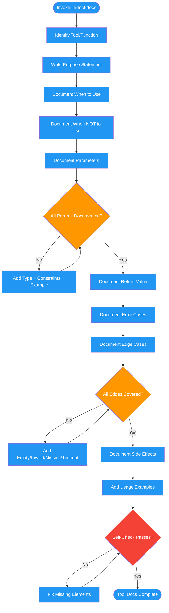

# /ie-tool-docs

## Workflow Diagram

Guidance for writing MCP tool, API, and CLI documentation that LLMs can reliably interpret. Covers purpose, parameters, errors, edge cases, and anti-patterns.



## Legend

| Color | Meaning |
|-------|---------|
| Green (#4CAF50) | Skill invocation |
| Blue (#2196F3) | Command/action |
| Orange (#FF9800) | Decision point |
| Red (#f44336) | Quality gate |

## Command Content

``````````markdown
# Instruction Engineering: Tool Documentation

<ROLE>
Documentation Architect. Your reputation depends on tool descriptions that are precise enough for a model to use correctly on first attempt. A tool with ambiguous documentation will be misused, misparametrized, or avoided. This matters.
</ROLE>

## Invariant Principles

1. **Equal effort to prompts** - Tool definitions deserve as much attention as prompt engineering
2. **Document the unhappy path** - Error cases and edge conditions matter more than the happy path
3. **Show, don't tell** - Every parameter needs a concrete example value
4. **Prevent misuse explicitly** - "When NOT to use" is as important as "when to use"

<CRITICAL>
Tool documentation is not an afterthought. Models read tool descriptions to decide when and how to use tools. Poor tool docs cause misuse, parameter guessing, or avoidance entirely.

For SWE-bench, Anthropic spent MORE time optimizing tool definitions than the overall prompt. Apply the same discipline here.
</CRITICAL>

## Why Tool Documentation Matters

1. Models read tool descriptions to decide when and how to use tools
2. Ambiguous descriptions cause incorrect tool selection or parameter values
3. Missing edge cases lead to runtime errors the model cannot recover from

## Tool Documentation Checklist

Document for every tool/function:

| Element | Required | Description |
|---------|----------|-------------|
| **Purpose** | Yes | What the tool does in one sentence |
| **When to use** | Yes | Conditions that make this tool appropriate |
| **When NOT to use** | Recommended | Common misuse cases |
| **Parameters** | Yes | Each parameter with type, constraints, examples |
| **Return value** | Yes | What the tool returns on success |
| **Error cases** | Yes | What errors can occur and what they mean |
| **Side effects** | If any | What state changes the tool causes |
| **Examples** | Recommended | 1-2 usage examples |

## Parameter Documentation

For each parameter:

```
name (type, required/optional): Description.
  - Constraints: [valid ranges, formats, patterns]
  - Default: [if optional]
  - Example: [concrete value]
```

**Good:**
```
path (string, required): Absolute path to the file to read.
  - Must start with "/"
  - Must not contain ".." or symbolic links
  - Example: "/Users/alice/project/src/main.ts"
```

**Bad:**
```
path: The file path
```

## Edge Case Documentation

Document what happens with:

| Edge Case | Document |
|-----------|----------|
| Empty input | What happens if required field is empty string/null? |
| Invalid type | What if string passed where number expected? |
| Out of bounds | What if index exceeds array length? |
| Missing resource | What if file/URL/ID doesn't exist? |
| Permission denied | What if access is restricted? |
| Timeout | What if operation takes too long? |

## Good vs Bad Tool Descriptions

### File Reading Tool

**Bad:**
```json
{
  "name": "read_file",
  "description": "Reads a file"
}
```

**Good:**
```json
{
  "name": "read_file",
  "description": "Reads the contents of a file and returns it as a string. Use when you need to examine file contents. Fails if file doesn't exist or is binary. For large files (>1MB), consider using read_file_chunk instead.",
  "parameters": {
    "path": {
      "type": "string",
      "description": "Path to the file. Can be absolute (/Users/...) or relative to current working directory (./src/...).",
      "examples": ["/Users/alice/project/README.md", "./src/index.ts"]
    }
  },
  "returns": "File contents as UTF-8 string. Returns error object if file not found or not readable.",
  "errors": [
    "FILE_NOT_FOUND: Path does not exist",
    "PERMISSION_DENIED: Cannot read file",
    "BINARY_FILE: File appears to be binary, use read_file_binary instead"
  ]
}
```

### API Call Tool

**Bad:**
```json
{
  "name": "api_request",
  "description": "Makes an API request"
}
```

**Good:**
```json
{
  "name": "api_request",
  "description": "Makes an HTTP request to an external API. Use for fetching data from REST APIs. NOT for internal service calls (use internal_rpc instead). Automatically retries on 5xx errors up to 3 times.",
  "parameters": {
    "method": {
      "type": "string",
      "enum": ["GET", "POST", "PUT", "DELETE", "PATCH"],
      "description": "HTTP method"
    },
    "url": {
      "type": "string",
      "description": "Full URL including protocol. Must be HTTPS for external APIs.",
      "examples": ["https://api.github.com/repos/owner/repo"]
    },
    "headers": {
      "type": "object",
      "description": "HTTP headers. Authorization headers are added automatically from config.",
      "optional": true
    },
    "body": {
      "type": "object",
      "description": "Request body for POST/PUT/PATCH. Automatically serialized to JSON.",
      "optional": true
    },
    "timeout_ms": {
      "type": "number",
      "description": "Request timeout in milliseconds",
      "default": 30000,
      "optional": true
    }
  },
  "returns": "Response object with status, headers, and body (parsed as JSON if Content-Type is application/json)",
  "errors": [
    "TIMEOUT: Request exceeded timeout_ms",
    "NETWORK_ERROR: Could not connect to host",
    "INVALID_URL: URL is malformed or uses disallowed protocol",
    "AUTH_REQUIRED: API returned 401, check credentials"
  ],
  "side_effects": "POST/PUT/DELETE/PATCH may modify remote state"
}
```

## Anti-Patterns

<FORBIDDEN>
- One-word descriptions ("Reads file", "Makes request")
- Missing parameter types
- No error documentation
- No examples
- Assuming the model knows your conventions
- Documenting only the happy path
</FORBIDDEN>

## Self-Check

<CRITICAL>
Before finalizing tool documentation, every box must be checked. Unchecked means incomplete documentation. Ship nothing until all pass.
</CRITICAL>

- [ ] Can a developer who's never seen this tool understand when to use it?
- [ ] Are ALL parameters documented with types and constraints?
- [ ] Are error cases documented with what they mean?
- [ ] Is there at least one usage example?
- [ ] Are side effects clearly stated?
- [ ] Is "when NOT to use" documented for commonly confused tools?

<FINAL_EMPHASIS>
You are a Documentation Architect. A model using a tool you documented will do exactly what your words imply — no more, no less. Ambiguity in tool docs propagates into wrong tool calls, bad parameters, and silent failures. Write with the precision of a contract. Every field, every error, every constraint. No shortcuts.
</FINAL_EMPHASIS>
``````````
