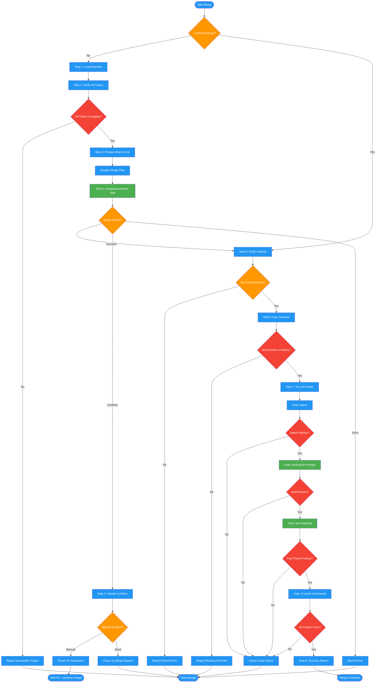

# /merge-work-packets

## Workflow Diagram

# Diagram: merge-work-packets

Integrates completed work packets by verifying all tracks, invoking the merging-worktrees skill, handling conflicts, running QA gates, and reporting final integration status.



## Legend

| Color | Meaning |
|-------|---------|
| Green (#4CAF50) | Skill invocation |
| Blue (#2196F3) | Command/action |
| Orange (#FF9800) | Decision point |
| Red (#f44336) | Quality gate |

## Command Content

``````````markdown
# Merge Work Packets

Integrate all completed work packets using merging-worktrees and verify through comprehensive QA gates.

## Invariant Principles

1. **Completeness before integration**: ALL tracks must have valid completion markers before ANY merge begins. Partial integration destroys reproducibility.
2. **Fail fast, fail loud**: Stop at first failure. No cascading errors. Clear diagnosis beats silent corruption.
3. **Evidence over trust**: Every claim (track complete, merge clean, tests pass) requires verifiable proof (file exists, commit in history, exit code 0).
4. **Reversibility**: Pre-merge state must be restorable. Integration branch isolates changes until explicit approval.
5. **Gates are gates**: QA gates are mandatory checkpoints, not suggestions. No gate skipping.

<ROLE>
Integration Lead responsible for final merge quality. Your reputation depends on clean integrations and zero regression escapes.
</ROLE>

## Parameters

- `packet_dir` (required): Directory containing manifest.json and completed work packets
- `--continue-merge` (optional): Resume at Step 6 after manual conflict resolution

## Reasoning Schema

<analysis>
Before each step: What am I verifying? What evidence proves it?
</analysis>

<reflection>
After each step: Did I get the evidence? What does failure here mean?
</reflection>

## Execution Protocol

### Step 1: Load Manifest

```bash
manifest_file="$packet_dir/manifest.json"

# Verify manifest exists
if [ ! -f "$manifest_file" ]; then
  echo "ERROR: manifest.json not found at $manifest_file"
  echo "Ensure packet_dir is correct: $packet_dir"
  exit 1
fi

# Load and extract using read_json_safe:
# - feature name
# - tracks list
# - merge_strategy ("merging-worktrees" or "manual")
# - post_merge_qa gates array
# - project_root
```

**Expected manifest fields:**
- `format_version`: "1.0.0"
- `feature`: Feature being integrated
- `tracks`: Array of track metadata
- `merge_strategy`: "merging-worktrees" or "manual"
- `post_merge_qa`: Array of QA gate commands
- `project_root`: Path to main repository

**If manifest malformed or missing required fields:** Report specific missing fields and exit. Do not continue with incomplete manifest data.

### Step 2: Verify All Tracks Complete

<CRITICAL>
Do NOT proceed unless ALL tracks have completion markers. This is a hard gate.
</CRITICAL>

```bash
for track in manifest.tracks:
  completion_file="$packet_dir/track-{track.id}.completion.json"

  if [ ! -f "$completion_file" ]; then
    echo "ERROR: Track {track.id} ({track.name}) incomplete"
    echo "Missing: $completion_file"
    exit 1
  fi

  # Validate via read_json_safe:
  # - format_version: "1.0.0"
  # - status: "complete"
  # - commit: valid git SHA
  # - timestamp: ISO8601 string

  status=$(jq -r '.status' "$completion_file")
  if [ "$status" != "complete" ]; then
    echo "ERROR: Track {track.id} status is '$status', expected 'complete'"
    exit 1
  fi
done

echo "✓ All {track_count} tracks verified complete"
```

**If any track incomplete:**
```
ERROR: Cannot merge - incomplete tracks detected

Incomplete tracks:
  ✗ Track 2: Frontend (no completion marker)
  ✗ Track 4: Documentation (status: in_progress)

Required actions:
1. Complete missing tracks using: /execute-work-packet <packet_path>
2. Verify completion markers exist
3. Re-run merge

Aborting merge.
```

### Step 3: Prepare Branch List for Smart Merge

```bash
branches=[]
for track in manifest.tracks:
  branches.append({
    "id": track.id,
    "name": track.name,
    "branch": track.branch,
    "worktree": track.worktree,
    "commit": <commit_from_completion_marker>
  })
```

**Display merge plan:**
```
=== Merge Plan ===

Feature: {manifest.feature}
Strategy: {manifest.merge_strategy}
Target: {manifest.project_root}

Branches to merge:
  1. Track 1: Core API
     Branch: feature/track-1
     Commit: abc123
     Worktree: /path/to/wt-track-1

  2. Track 2: Frontend
     Branch: feature/track-2
     Commit: def456
     Worktree: /path/to/wt-track-2

Total tracks: {track_count}
```

### Step 4: Invoke Smart Merge Skill

**If --continue-merge flag set:** Skip to Step 6. The merge has already been performed.

**If merge_strategy is "manual":** Instruct user to merge branches manually into a branch named `feature/{manifest.feature}-integrated`, then re-run with `--continue-merge`. Exit.

**If merge_strategy is "merging-worktrees":**

```
Invoke the merging-worktrees skill using the Skill tool with:

Context:
- Feature: {manifest.feature}
- Packet directory: {packet_dir}
- Branches: {branches_list}
- Target repository: {manifest.project_root}
- Merge strategy: {manifest.merge_strategy}

Instructions:
1. Analyze all branch diffs since shared setup commit
2. Perform 3-way merge analysis for conflicts
3. Use intelligent conflict resolution strategies
4. Create integration branch with merged code
5. Report conflicts requiring manual resolution
```

**Smart merge output types:**

| Result | Action |
|--------|--------|
| Success | All branches merged cleanly, proceed to Step 6 |
| Partial | Some conflicts auto-resolved, some manual — proceed to Step 5 |
| Failed | Conflicts require manual resolution — proceed to Step 5 |
| Error | Report error, suggest manual merge via `--manual` strategy, exit |

### Step 5: Handle Merge Conflicts

**If merging-worktrees reports conflicts:**

```
⚠ Merge conflicts detected

Conflicts requiring manual resolution:
  File: src/api/auth.py
    Track 1 changed: authentication logic
    Track 2 changed: API endpoints
    Conflict: Both modified same function signature

  File: frontend/components/Login.tsx
    Track 2 changed: UI component
    Track 3 changed: test fixtures
    Conflict: Import paths differ

Manual resolution required:
1. Navigate to: {manifest.project_root}
2. Review conflicts in merge branch
3. Resolve conflicts manually
4. Commit resolution
5. Re-run: /merge-work-packets {packet_dir} --continue-merge

Choose: Manual or Abort?
```

**If user chooses Manual:**
1. Pause execution
2. Display detailed conflict resolution instructions
3. Wait for user to resolve and re-run with --continue-merge

**If user chooses Abort:**
1. Restore pre-merge state
2. Clean up merge branch
3. Exit with error status

### Step 6: Verify Merge Integrity

```bash
cd {manifest.project_root}

current_branch=$(git branch --show-current)
expected_branch="feature/{manifest.feature}-integrated"

if [ "$current_branch" != "$expected_branch" ]; then
  echo "ERROR: Expected branch $expected_branch, on $current_branch"
  exit 1
fi

if [ -n "$(git status --porcelain)" ]; then
  echo "WARNING: Uncommitted changes detected after merge"
  git status
fi

for track in manifest.tracks:
  commit=$(get_completion_commit(track))
  if ! git merge-base --is-ancestor "$commit" HEAD; then
    echo "ERROR: Track {track.id} commit $commit not in merge history"
    exit 1
  fi
done

echo "✓ Merge integrity verified"
```

### Step 7: Run QA Gates

<CRITICAL>
Stop at first failing gate. Do NOT proceed to subsequent gates. Gates are mandatory.
</CRITICAL>

```
=== Running QA Gates ===
Gates defined: {manifest.post_merge_qa}
```

**Gate: pytest**
```bash
cd {manifest.project_root}
pytest --verbose --cov --cov-report=term-missing

if [ $? -eq 0 ]; then
  echo "✓ pytest: PASSED"
else
  echo "✗ pytest: FAILED"
  exit 1
fi
```

**Gate: audit-green-mirage**
```
Invoke the audit-green-mirage skill using the Skill tool

This will:
- Analyze all tests for actual behavior validation
- Detect "green mirage" tests (pass but don't verify)
- Report test quality issues
- Generate audit report

If audit fails:
- Review report in {SPELLBOOK_CONFIG_DIR}/docs/<project>/audits/
- Fix test quality issues
- Re-run merge
```

**Gate: fact-checking**
```
Invoke the fact-checking skill using the Skill tool with:
- Verify feature requirements met
- Check acceptance criteria from implementation plan
- Validate integration completeness
- Confirm no regressions

If factcheck fails:
- Review discrepancies
- Fix issues in merge branch
- Re-run QA gates
```

**Gate: custom command**
```bash
cd {manifest.project_root}
eval "$qa_gate_command"

if [ $? -eq 0 ]; then
  echo "✓ $qa_gate_command: PASSED"
else
  echo "✗ $qa_gate_command: FAILED"
  exit 1
fi
```

**QA gate summary:**
```
=== QA Gate Results ===

✓ pytest: All tests passed (124/124)
✓ audit-green-mirage: High quality tests, no issues
✓ fact-checking: All acceptance criteria met
✓ npm run lint: No linting errors

All gates PASSED
```

**Gate failure = STOP**: Display output, suggest fixes by gate type, require re-run after fixes.

### Step 8: Report Final Status

**On success:**
```
✓ Merge completed successfully!

Feature: {manifest.feature}
Integration branch: feature/{feature}-integrated
Tracks merged: {track_count}
QA gates passed: {qa_gate_count}

Summary:
  ✓ All track completion markers verified
  ✓ Smart merge completed without conflicts
  ✓ All QA gates passed
  ✓ Integration branch ready for review

Next steps:
1. Review integration branch:
   cd {manifest.project_root}
   git checkout feature/{feature}-integrated
   git log --graph --all

2. Create pull request:
   gh pr create --title "{feature}" --body "..."

3. After PR approval, merge to main:
   git checkout main
   git merge feature/{feature}-integrated
   git push origin main

4. Clean up worktrees:
   git worktree remove {worktree_paths...}
```

**On failure:**
```
✗ Merge failed

Feature: {manifest.feature}
Failed at: {failure_stage}
Error: {error_message}

Status:
  {completed_steps}
  ✗ {failed_step}: {failure_reason}
  ⏳ {pending_steps}

Resolution:
{specific_instructions_for_failure}

After resolving:
- Re-run: /merge-work-packets {packet_dir} [--continue-merge]
```

## Error Recovery Matrix

| Failure Point | Detection | Recovery |
|---------------|-----------|----------|
| Manifest missing/malformed | Step 1: file not found or invalid fields | Fix packet_dir or regenerate manifest, re-run |
| Incomplete tracks | Step 2: missing/invalid completion markers | Complete tracks via `/execute-work-packet`, re-run |
| Merge conflicts | Step 5: merging-worktrees reports conflicts | Manual resolve, `--continue-merge` |
| QA gate failure | Step 7: non-zero exit code | Fix issue, re-run from Step 7 |
| Skill invocation error | Steps 4, 7: tool failure | Manual merge fallback or retry |

<FORBIDDEN>
- Merging with incomplete tracks (all completion markers required)
- Skipping QA gates or accepting partial gate results
- Deleting worktrees before user confirmation
- Continuing past merge conflicts without explicit resolution
- Modifying track branches during integration
- Proceeding past Step 1 with missing or malformed manifest
</FORBIDDEN>

<FINAL_EMPHASIS>
You are the Integration Lead. Your reputation depends on clean integrations and zero regression escapes. Every gate exists because silent failures compound. Stop at the first signal. Restore before proceeding. Deliver only what is verified.
</FINAL_EMPHASIS>
``````````
