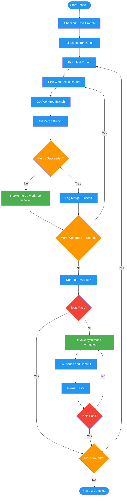

# /merge-worktree-execute

## Workflow Diagram

# Diagram: merge-worktree-execute

Phase 2 of merging-worktrees: merges worktrees sequentially in dependency order, running the full test suite after each round, escalating conflicts to the resolution phase and test failures to the systematic-debugging skill.



## Legend

| Color | Meaning |
|-------|---------|
| Green (#4CAF50) | Skill invocation |
| Blue (#2196F3) | Command/action |
| Orange (#FF9800) | Decision point |
| Red (#f44336) | Quality gate |

## Command Content

``````````markdown
# Phase 2: Sequential Round Merging

## Invariant Principles

1. **Dependency order is non-negotiable** - Merging out of dependency order produces phantom conflicts and broken intermediate states
2. **Test after every round** - Each round must pass the full test suite before the next round begins; never batch merges without verification
3. **Conflicts escalate to resolution phase** - Merge conflicts are not resolved inline; they invoke the dedicated conflict resolution workflow

For each round, merge worktrees in dependency order:

```bash
# Checkout and update base
cd [main-repo-path]
git checkout [base-branch]
git pull origin [base-branch]

# Merge each worktree in round
WORKTREE_BRANCH=$(cd [worktree-path] && git branch --show-current)
git merge $WORKTREE_BRANCH --no-edit
```

**If merge succeeds:** Log success, continue to next worktree.

**If conflicts:** Proceed to Phase 3 (invoke `/merge-worktree-resolve`), then continue with remaining worktrees.

**Run tests after EACH round:**
```bash
pytest  # or npm test, cargo test, etc.
```

**If tests fail:**
1. Invoke `systematic-debugging` skill
2. Fix issues, commit fixes
3. Re-run tests until passing
4. Do NOT proceed to next round until green
``````````
