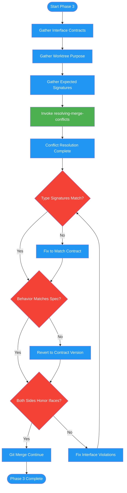

# /merge-worktree-resolve

## Workflow Diagram

# Diagram: merge-worktree-resolve

Phase 3 of merging-worktrees: delegates merge conflicts to the resolving-merge-conflicts skill with interface contract context, then verifies that resolved code matches contract specifications for type signatures and function behavior before continuing.



## Legend

| Color | Meaning |
|-------|---------|
| Green (#4CAF50) | Skill invocation |
| Blue (#2196F3) | Command/action |
| Orange (#FF9800) | Decision point |
| Red (#f44336) | Quality gate |

## Command Content

``````````markdown
# Phase 3: Conflict Resolution

## Invariant Principles

1. **Synthesize both sides, never pick one** - Conflict resolution must integrate both changesets; either/or resolution loses work
2. **Interface contracts are the arbiter** - When both sides claim different behavior, the implementation plan's interface contract is ground truth
3. **Verify contracts after every resolution** - Type signatures and function behavior must match the contract spec before continuing

<RULE>When merge conflicts occur, delegate to `resolving-merge-conflicts` skill with interface contract context.</RULE>

Invoke resolving-merge-conflicts with:
- Interface contracts (from implementation plan)
- Worktree purpose (what this worktree implemented)
- Expected interfaces (type signatures, function contracts)

**After resolution - Contract Verification:**

| Check | Action if Failed |
|-------|------------------|
| Type signatures match contract | Fix to match contract spec |
| Function behavior matches spec | Revert to contract-compliant version |
| Both sides honor interfaces | Synthesis is valid |

<reflection>
After EVERY conflict resolution:
- Type signatures match contract?
- Function behavior matches spec?
- Both sides honor interfaces?

Violation = fix before `git merge --continue`
</reflection>
``````````
