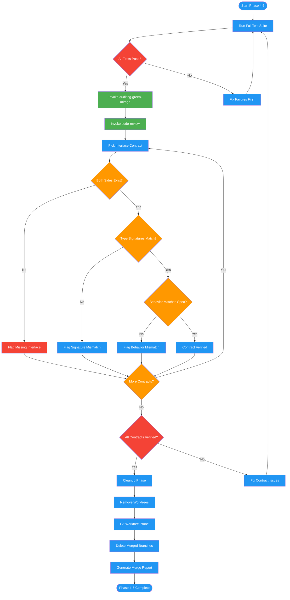

# /merge-worktree-verify

## Workflow Diagram

# Diagram: merge-worktree-verify

Phases 4-5 of merging-worktrees: runs the full test suite, audits test quality with green-mirage detection, verifies all interface contracts survive merging, performs code review against the implementation plan, then cleans up worktrees and branches.



## Legend

| Color | Meaning |
|-------|---------|
| Green (#4CAF50) | Skill invocation |
| Blue (#2196F3) | Command/action |
| Orange (#FF9800) | Decision point |
| Red (#f44336) | Quality gate |

## Command Content

``````````markdown
# Phase 4: Final Verification

## Invariant Principles

1. **Full suite, no shortcuts** - Final verification runs the complete test suite, not a subset; partial verification misses cross-worktree regressions
2. **Contracts survive merging** - Both sides of every interface must exist with matching type signatures and behavior after the final merge
3. **Cleanup only after verification passes** - Worktree deletion is irreversible; never clean up before the full test suite and contract checks pass

After all worktrees merged:

1. **Full test suite** - All tests must pass
2. **auditing-green-mirage** - Invoke on all modified test files
3. **Code review** - Invoke `code-reviewer` against implementation plan, verify all contracts honored
4. **Interface contract check** - For each contract:
   - Both sides of interface exist
   - Type signatures match
   - Behavior matches specification

# Phase 5: Cleanup

```bash
# Delete worktrees
git worktree remove [worktree-path] --force

# If worktree has uncommitted changes (shouldn't happen)
rm -rf [worktree-path]
git worktree prune

# Delete branches if no longer needed
git branch -d [worktree-branch]
```

**Report template:**
```
Worktree merge complete

Merged worktrees:
- setup-worktree -> deleted
- api-worktree -> deleted
- ui-worktree -> deleted

Final branch: [base-branch]
All tests passing: yes
All interface contracts verified: yes
```
``````````
