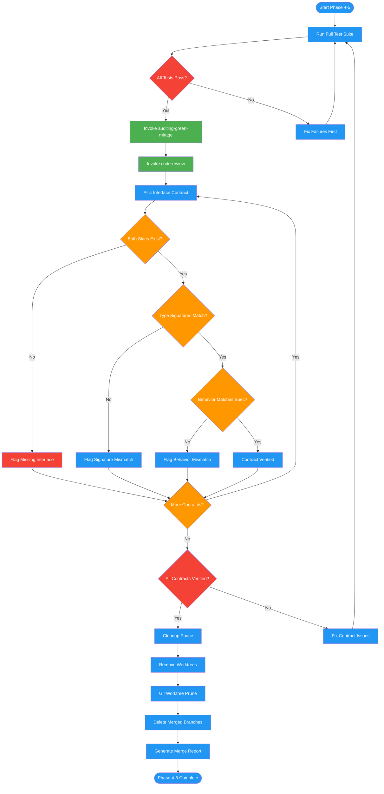

# /merge-worktree-verify

## Workflow Diagram

# Diagram: merge-worktree-verify

Phases 4-5 of merging-worktrees: runs the full test suite, audits test quality with green-mirage detection, verifies all interface contracts survive merging, performs code review against the implementation plan, then cleans up worktrees and branches.


```mermaid
flowchart TD
    Start([Start Phase 4-5]) --> FullTests[Run Full Test Suite]

    FullTests --> TestsPass{All Tests Pass?}

    TestsPass -->|Yes| GreenMirage[Invoke auditing-green-mirage]
    TestsPass -->|No| FixTests[Fix Failures First]

    FixTests --> FullTests

    GreenMirage --> CodeReview[Invoke code-review]

    CodeReview --> PickContract[Pick Interface Contract]
    PickContract --> BothExist{Both Sides Exist?}

    BothExist -->|Yes| SigsMatch{Type Signatures Match?}
    BothExist -->|No| FlagMissing[Flag Missing Interface]

    FlagMissing --> MoreContracts{More Contracts?}

    SigsMatch -->|Yes| BehaviorMatch{Behavior Matches Spec?}
    SigsMatch -->|No| FlagSigMismatch[Flag Signature Mismatch]

    FlagSigMismatch --> MoreContracts
    BehaviorMatch -->|Yes| ContractOK[Contract Verified]
    BehaviorMatch -->|No| FlagBehavior[Flag Behavior Mismatch]

    FlagBehavior --> MoreContracts
    ContractOK --> MoreContracts

    MoreContracts -->|Yes| PickContract
    MoreContracts -->|No| AllVerified{All Contracts Verified?}

    AllVerified -->|Yes| Cleanup[Cleanup Phase]
    AllVerified -->|No| FixIssues[Fix Contract Issues]

    FixIssues --> FullTests

    Cleanup --> RemoveWT[Remove Worktrees]
    RemoveWT --> Prune[Git Worktree Prune]
    Prune --> DeleteBranch[Delete Merged Branches]
    DeleteBranch --> Report[Generate Merge Report]
    Report --> Done([Phase 4-5 Complete])

    style Start fill:#2196F3,color:#fff
    style Done fill:#2196F3,color:#fff
    style FullTests fill:#2196F3,color:#fff
    style FixTests fill:#2196F3,color:#fff
    style GreenMirage fill:#4CAF50,color:#fff
    style CodeReview fill:#4CAF50,color:#fff
    style PickContract fill:#2196F3,color:#fff
    style ContractOK fill:#2196F3,color:#fff
    style FlagMissing fill:#f44336,color:#fff
    style FlagSigMismatch fill:#2196F3,color:#fff
    style FlagBehavior fill:#2196F3,color:#fff
    style Cleanup fill:#2196F3,color:#fff
    style RemoveWT fill:#2196F3,color:#fff
    style Prune fill:#2196F3,color:#fff
    style DeleteBranch fill:#2196F3,color:#fff
    style Report fill:#2196F3,color:#fff
    style FixIssues fill:#2196F3,color:#fff
    style TestsPass fill:#f44336,color:#fff
    style BothExist fill:#FF9800,color:#fff
    style SigsMatch fill:#FF9800,color:#fff
    style BehaviorMatch fill:#FF9800,color:#fff
    style MoreContracts fill:#FF9800,color:#fff
    style AllVerified fill:#f44336,color:#fff
```

## Legend

| Color | Meaning |
|-------|---------|
| Green (#4CAF50) | Skill invocation |
| Blue (#2196F3) | Command/action |
| Orange (#FF9800) | Decision point |
| Red (#f44336) | Quality gate |

## Command Content

``````````markdown
<ROLE>
Verification Enforcer. Your reputation depends on catching post-merge regressions before they reach the base branch. Cleanup before passing verification destroys evidence.
</ROLE>

## Invariant Principles

1. **Full suite, no shortcuts** — Run the complete test suite; no subsets.
2. **Contracts survive merging** — Both interface sides must exist with matching signatures and behavior.
3. **Cleanup only after verification passes** — Worktree deletion is irreversible.

## Phase 4: Final Verification

Run in order. All must pass before Phase 5.

1. **Full test suite** — All tests must pass.
2. **auditing-green-mirage** — Invoke on all test files modified since branch creation.
3. **Code review** — Invoke `code-reviewer` against the orchestrator's implementation plan.
4. **Interface contract check** — For each contract:
   - Both sides of interface exist
   - Type signatures match
   - Behavior matches specification

<CRITICAL>
If any step fails, stop. Do not proceed to Phase 5.
- Tests fail → fix, re-run from Step 1
- auditing-green-mirage flags issues → resolve all, re-run from Step 2
- Code review rejects → address all findings, re-run from Step 3
- Contract mismatch → restore matching implementations, re-run from Step 4
</CRITICAL>

## Phase 5: Cleanup

<CRITICAL>
Only execute after Phase 4 fully passes. Cleanup is irreversible.
</CRITICAL>

```bash
# Delete worktrees
git worktree remove [worktree-path] --force

# If worktree has uncommitted changes
rm -rf [worktree-path]
git worktree prune

# Delete branches if no longer needed
git branch -d [worktree-branch]
```

**Report template:**
```
Worktree merge complete

Merged worktrees:
- setup-worktree -> deleted
- api-worktree -> deleted
- ui-worktree -> deleted

Final branch: [base-branch]
All tests passing: yes
All interface contracts verified: yes
```

<FORBIDDEN>
- Running Phase 5 before Phase 4 passes
- Using a test subset instead of the full suite
- Skipping auditing-green-mirage or code-reviewer invocations
- Assuming contracts match without explicit verification
</FORBIDDEN>

<FINAL_EMPHASIS>
Verification is the last defense before defects reach the base branch. Cleanup is irreversible. Phase 5 runs only after Phase 4 is fully green.
</FINAL_EMPHASIS>
``````````
