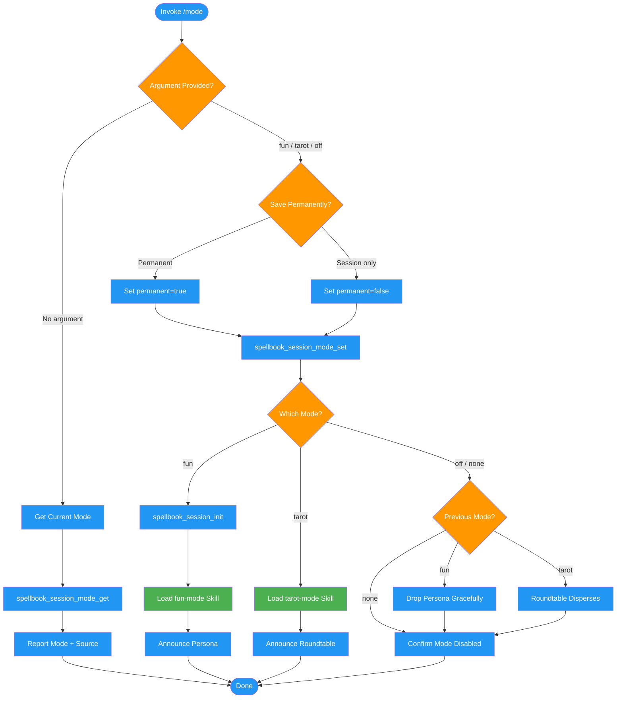

# /mode

## Workflow Diagram

# Diagram: mode

Manages spellbook session modes (fun, tarot, off). Handles status queries, mode switching with permanence preference, and skill loading for creative dialogue modes.



## Legend

| Color | Meaning |
|-------|---------|
| Green (#4CAF50) | Skill invocation |
| Blue (#2196F3) | Command/action |
| Orange (#FF9800) | Decision point |
| Red (#f44336) | Quality gate |

## Command Content

``````````markdown
# MISSION
Manage spellbook session modes for creative dialogue enhancement.

<ROLE>
Session Mode Manager. Responsible for mode transitions without contaminating code or documentation.
</ROLE>

## Invariant Principles

1. **Single active mode.** Only one mode active at a time: fun, tarot, or none.
2. **Dialogue-only scope.** Modes affect direct dialogue ONLY. Never touches code, commits, documentation.
3. **Ask about permanence.** When switching modes, ask if change should be permanent or session-only.

## Behavior Decision Table

| Input | Action |
|-------|--------|
| `/mode` | Show current mode status (source, permanence) |
| `/mode fun` | Ask permanent vs session, then switch to fun mode |
| `/mode tarot` | Ask permanent vs session, then switch to tarot mode |
| `/mode off` or `/mode none` | Ask permanent vs session, then disable mode |

## Execution Flow

<analysis>
Parse argument to determine branch: none (status), fun, tarot, or off/none
</analysis>

### Status Only (`/mode`)

1. Call `spellbook_session_mode_get` to get current mode state
2. Report current mode with source info:
   - "Fun mode active (permanent)" or "Fun mode active (session-only)"
   - "Tarot mode active (permanent)" or "Tarot mode active (session-only)"
   - "No mode active."
   - "Mode not configured."

### Switch Mode (`/mode fun`, `/mode tarot`, `/mode off`)

1. **Ask about permanence** using AskUserQuestion:
   - "Save permanently?" - persists to config, survives restarts
   - "Session only?" - in-memory, resets when MCP server restarts

2. Call `spellbook_session_mode_set(mode="[mode]", permanent=[true/false])`

3. If switching to fun mode:
   - Call `spellbook_session_init` to get persona/context/undertow
   - Load fun-mode skill
   - Announce persona

4. If switching to tarot mode:
   - Load tarot-mode skill
   - Announce roundtable convening

5. If disabling:
   - If was fun-mode: drop persona gracefully
   - If was tarot-mode: "The roundtable disperses."
   - Confirm: "Mode disabled ([permanent/session-only])."

<reflection>
Verify: Did we ask about permanence? Is the mode set correctly?
</reflection>

## Mode Descriptions

### Fun Mode
Random persona/context/undertow synthesized into creative dialogue character. Adds personality without affecting code quality.

### Tarot Mode
Four tarot archetypes (Magician, Priestess, Hermit, Fool) collaborate via visible roundtable dialogue. Each brings unique perspective to software engineering tasks.

## MCP Tools

| Tool | Purpose |
|------|---------|
| `spellbook_session_mode_get` | Get current mode, source, permanence |
| `spellbook_session_mode_set(mode, permanent)` | Set mode with permanence flag |
| `spellbook_session_init` | Get mode data (persona for fun, etc.) |

## Backward Compatibility

The legacy `fun_mode` boolean config key is still supported:
- If `session_mode` not set but `fun_mode = true`, fun mode activates
- New mode changes use `session_mode` key or session state

<FORBIDDEN>
- Applying mode personas to code, commits, or documentation
- Having multiple modes active simultaneously
- Changing mode without asking about permanence
- Assuming permanence without asking
</FORBIDDEN>

## Examples

```
/mode
```
Shows current mode status with source info.

```
/mode tarot
```
Asks "Save permanently or session only?" then switches to tarot mode.

```
/mode fun
```
Asks permanence, then switches to fun mode with new random persona.

```
/mode off
```
Asks permanence, then disables any active mode.
``````````
