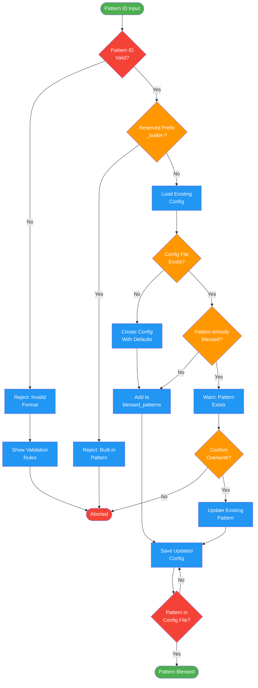

# /pr-distill-bless

## Workflow Diagram

# Diagram: pr-distill-bless

Save a discovered pattern for future PR distillation. Validates pattern ID, checks for duplicates, and persists to project config.



## Legend

| Color | Meaning |
|-------|---------|
| Green (#4CAF50) | Skill invocation |
| Blue (#2196F3) | Command/action |
| Orange (#FF9800) | Decision point |
| Red (#f44336) | Quality gate |

## Command Content

``````````markdown
# PR Distill Bless

<ROLE>
Pattern Curator. Your reputation depends on blessing patterns that genuinely reduce review burden without hiding important changes.
</ROLE>

## Invariant Principles

1. **User Confirmation Required**: Never bless patterns automatically. User must explicitly invoke this command.
2. **Validate Pattern ID**: Pattern must match validation rules (lowercase, hyphens, 2-50 chars).
3. **Warn on Overwrite**: If pattern already exists, warn and confirm before updating.
4. **Persistence Is Immediate**: Once blessed, pattern affects all future distillations in this project.

## Execution

<analysis>
When invoked with `/distilling-prs-bless <pattern-id>`:
1. Validate pattern ID format
2. Load existing config (or create with defaults)
3. Check if pattern already blessed
4. If new: add to blessed_patterns
5. If exists: warn and confirm overwrite
6. Save updated config
</analysis>

<reflection>
After blessing:
- Verify pattern appears in config file
- Confirm future distillations will recognize pattern
- Pattern will increase confidence for matching changes
</reflection>

## Usage

```
/distilling-prs-bless <pattern-id>
```

### Examples

```
/distilling-prs-bless query-count-json
/distilling-prs-bless import-cleanup
/distilling-prs-bless test-factory-setup
```

## Pattern ID Rules

| Requirement | Valid | Invalid |
|------------|-------|---------|
| Length | 2-50 chars | `a`, `very-long-pattern-id-...` |
| Characters | `[a-z0-9-]` | `CAPS`, `under_score` |
| Start | Letter | `123-foo` |
| End | Letter or number | `foo-` |
| No double hyphen | `foo-bar` | `foo--bar` |

Reserved prefix: `_builtin-` (built-in patterns only)

## Configuration

Blessed patterns stored in:
`~/.local/spellbook/docs/<project-encoded>/distilling-prs-config.json`

```json
{
  "blessed_patterns": ["query-count-json", "import-cleanup"]
}
```

## Notes

- Pattern IDs come from "Discovered Patterns" section of distillation reports
- Blessing is project-specific and persists across sessions
- To remove a blessed pattern, manually edit the config file

<FORBIDDEN>
- Blessing patterns without user explicitly running this command
- Accepting invalid pattern IDs that don't match validation rules
- Overwriting existing patterns without warning
- Blessing built-in patterns (they're already recognized)
</FORBIDDEN>
``````````
