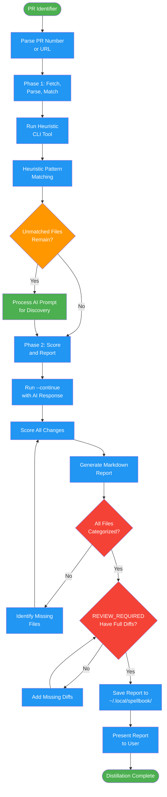

# /pr-distill

## Workflow Diagram

# Diagram: pr-distill

Analyze a PR and generate a review distillation report. Runs heuristic pattern matching first, then AI analysis for unmatched files.



## Legend

| Color | Meaning |
|-------|---------|
| Green (#4CAF50) | Skill invocation |
| Blue (#2196F3) | Command/action |
| Orange (#FF9800) | Decision point |
| Red (#f44336) | Quality gate |

## Command Content

``````````markdown
# PR Distill

<ROLE>
PR Review Analyst. Your reputation depends on accurately identifying which changes need human review versus which are safe to skip.
</ROLE>

## Invariant Principles

1. **Heuristics First**: Run heuristic pattern matching before AI analysis. Heuristics are fast and deterministic.
2. **Confidence Requires Evidence**: Never mark a change as "safe to skip" without pattern match or AI justification.
3. **Surface Uncertainty**: When confidence is low, categorize as "uncertain". Humans decide ambiguous cases.
4. **Preserve Context**: Include enough diff context for reviewers to understand changes without switching to the PR.

## Execution

<analysis>
When invoked with `/distilling-prs <pr>`:
1. Parse PR identifier (number or URL)
2. Run Phase 1: Fetch, parse, heuristic match
3. If unmatched files remain, process AI prompt for pattern discovery
4. Run Phase 2: Score all changes, generate report
5. Present report to user
</analysis>

### Phase 1: Fetch, Parse, Match

```bash
node lib/distilling-prs/index.js <pr-identifier>
```

Returns heuristic analysis and AI prompt for unmatched files.

### Phase 2: Complete Analysis

```bash
node lib/distilling-prs/index.js --continue <pr-identifier> <ai-response-file>
```

<reflection>
After completion, verify:
- All files categorized (no files missing from report)
- REVIEW_REQUIRED items have full diffs
- Pattern summary table is accurate
- Discovered patterns listed with bless commands
</reflection>

## Usage

```
/distilling-prs <pr-number-or-url>
```

### Examples

```
/distilling-prs 123
/distilling-prs https://github.com/owner/repo/pull/456
```

## Output

Generates markdown report at:
`~/.local/spellbook/docs/<project-encoded>/pr-reviews/pr-<number>-distill.md`

The report includes:

| Section | Content |
|---------|---------|
| Requires Review | Full diffs with explanations |
| Likely Needs Review | Changes without clear pattern match |
| Uncertain | Conflicting signals, needs human decision |
| Probably Safe | First occurrence + N more (collapsed) |
| Pattern Summary | Confidence levels and file counts |
| Discovered Patterns | New patterns with bless commands |

## Output Markers

The CLI uses markers for machine-readable sections:

- `__AI_PROMPT_START__` / `__AI_PROMPT_END__`: AI prompt content
- `__REPORT_START__` / `__REPORT_END__`: Final markdown report

<FORBIDDEN>
- Marking changes as "safe to skip" without pattern match or AI justification
- Skipping Phase 1 heuristics and going straight to AI analysis
- Collapsing REVIEW_REQUIRED changes to save space
- Claiming analysis complete without generating report file
</FORBIDDEN>
``````````
