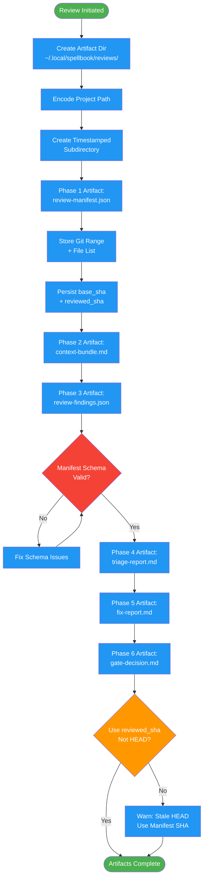

# /request-review-artifacts

## Workflow Diagram

# Diagram: request-review-artifacts

Artifact contract for code review workflow. Defines directory structure, phase outputs, manifest schema, and SHA persistence for traceability.



## Legend

| Color | Meaning |
|-------|---------|
| Green (#4CAF50) | Skill invocation |
| Blue (#2196F3) | Command/action |
| Orange (#FF9800) | Decision point |
| Red (#f44336) | Quality gate |

## Command Content

``````````markdown
# Artifact Contract

Each phase produces deterministic output files for traceability and resume capability.

## Invariant Principles

1. **Every phase produces a deterministic artifact** - Artifacts enable resume, audit, and traceability across sessions
2. **SHA persistence enables idempotency** - Storing commit SHAs in the manifest prevents duplicate reviews and enables diff comparisons
3. **Artifacts live outside the project** - Review artifacts are stored in `~/.local/spellbook/reviews/`, never inside the project directory

## Artifact Directory

```
~/.local/spellbook/reviews/<project-encoded>/<timestamp>/
```

Where `<project-encoded>` follows spellbook conventions (path with slashes replaced by dashes).

## Phase Artifacts

| Phase | Artifact | Description |
|-------|----------|-------------|
| 1 | `review-manifest.json` | Git range, file list, metadata |
| 2 | `context-bundle.md` | Plan excerpts, code context |
| 3 | `review-findings.json` | Raw findings from agent |
| 4 | `triage-report.md` | Prioritized, grouped findings |
| 5 | `fix-report.md` | What was fixed, what deferred |
| 6 | `gate-decision.md` | Final verdict with rationale |

## Manifest Schema

```json
{
  "timestamp": "ISO 8601",
  "project": "project name",
  "branch": "branch name",
  "base_sha": "merge base commit",
  "reviewed_sha": "head commit at review time",
  "files": ["list of reviewed files"],
  "complexity": {
    "file_count": 0,
    "line_count": 0,
    "estimated_effort": "small|medium|large"
  }
}
```

## SHA Persistence

<CRITICAL>
Always use `reviewed_sha` from manifest for inline comments.
Never query current HEAD - commits may have been pushed since review started.
</CRITICAL>
``````````
