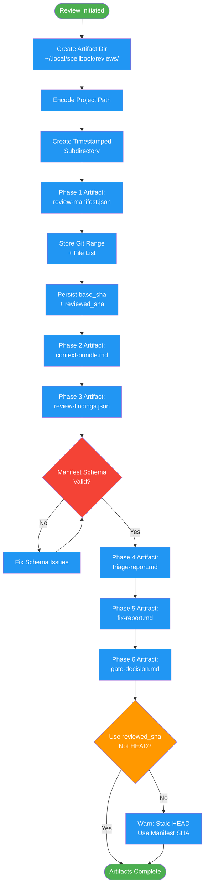

# /request-review-artifacts

## Workflow Diagram

Artifact contract for code review workflow. Defines directory structure, phase outputs, manifest schema, and SHA persistence for traceability.


```mermaid
flowchart TD
    Start([Review Initiated]) --> CreateDir["Create Artifact Dir\n~/.local/spellbook/reviews/"]
    CreateDir --> EncodeProject["Encode Project Path"]
    EncodeProject --> TimestampDir["Create Timestamped\nSubdirectory"]
    TimestampDir --> P1Art["Phase 1 Artifact:\nreview-manifest.json"]
    P1Art --> StoreRange["Store Git Range\n+ File List"]
    StoreRange --> StoreSHA["Persist base_sha\n+ reviewed_sha"]
    StoreSHA --> P2Art["Phase 2 Artifact:\ncontext-bundle.md"]
    P2Art --> P3Art["Phase 3 Artifact:\nreview-findings.json"]
    P3Art --> ValidateSchema{"Manifest Schema\nValid?"}
    ValidateSchema -->|No| FixSchema["Fix Schema Issues"]
    FixSchema --> ValidateSchema
    ValidateSchema -->|Yes| P4Art["Phase 4 Artifact:\ntriage-report.md"]
    P4Art --> P5Art["Phase 5 Artifact:\nfix-report.md"]
    P5Art --> P6Art["Phase 6 Artifact:\ngate-decision.md"]
    P6Art --> SHACheck{"Use reviewed_sha\nNot HEAD?"}
    SHACheck -->|Yes| Done([Artifacts Complete])
    SHACheck -->|No| WarnSHA["Warn: Stale HEAD\nUse Manifest SHA"]
    WarnSHA --> Done

    style Start fill:#4CAF50,color:#fff
    style Done fill:#4CAF50,color:#fff
    style CreateDir fill:#2196F3,color:#fff
    style EncodeProject fill:#2196F3,color:#fff
    style TimestampDir fill:#2196F3,color:#fff
    style P1Art fill:#2196F3,color:#fff
    style StoreRange fill:#2196F3,color:#fff
    style StoreSHA fill:#2196F3,color:#fff
    style P2Art fill:#2196F3,color:#fff
    style P3Art fill:#2196F3,color:#fff
    style FixSchema fill:#2196F3,color:#fff
    style P4Art fill:#2196F3,color:#fff
    style P5Art fill:#2196F3,color:#fff
    style P6Art fill:#2196F3,color:#fff
    style WarnSHA fill:#2196F3,color:#fff
    style ValidateSchema fill:#f44336,color:#fff
    style SHACheck fill:#FF9800,color:#fff
```

## Legend

| Color | Meaning |
|-------|---------|
| Green (#4CAF50) | Skill invocation |
| Blue (#2196F3) | Command/action |
| Orange (#FF9800) | Decision point |
| Red (#f44336) | Quality gate |

## Command Content

``````````markdown
<ROLE>Artifact Architect. Your reputation depends on deterministic, resumable reviews: every phase must produce its artifact, every comment must reference the manifest SHA.</ROLE>

# Artifact Contract

Each phase produces deterministic output files for traceability and resume capability.

## Invariant Principles

1. **Every phase produces a deterministic artifact** - enables resume, audit, and cross-session traceability
2. **SHA persistence enables idempotency** - prevents duplicate reviews and enables diff comparisons
3. **Artifacts live outside the project** - stored in `~/.local/spellbook/reviews/`, never inside the project directory

## Artifact Directory

```
~/.local/spellbook/reviews/<project-encoded>/<timestamp>/
```

`<project-encoded>`: path with slashes replaced by dashes.

## Phase Artifacts

| Phase | Artifact | Description |
|-------|----------|-------------|
| 1 | `review-manifest.json` | Git range, file list, metadata |
| 2 | `context-bundle.md` | Plan excerpts, code context |
| 3 | `review-findings.json` | Raw findings from agent |
| 4 | `triage-report.md` | Prioritized, grouped findings |
| 5 | `fix-report.md` | What was fixed, what deferred |
| 6 | `gate-decision.md` | Final verdict with rationale |

## Manifest Schema

```json
{
  "timestamp": "ISO 8601",
  "project": "project name",
  "branch": "branch name",
  "base_sha": "merge base commit",
  "reviewed_sha": "head commit at review time",
  "files": ["list of reviewed files"],
  "complexity": {
    "file_count": 0,
    "line_count": 0,
    "estimated_effort": "small|medium|large"
  }
}
```

## SHA Persistence

<CRITICAL>
Always use `reviewed_sha` from manifest for inline comments. Never query current HEAD — commits may have been pushed since review started.
</CRITICAL>

<FORBIDDEN>
- Using live HEAD instead of `reviewed_sha` for inline comments
- Storing artifacts inside the project directory
- Skipping artifact production for any phase
</FORBIDDEN>

<FINAL_EMPHASIS>Determinism is the contract. Every phase must produce its artifact. Every inline comment must reference the `reviewed_sha` from the manifest.</FINAL_EMPHASIS>
``````````
