# /request-review-execute

## Workflow Diagram

# Diagram: request-review-execute

Dispatch, triage, execute, and gate phases for code review. Invokes code-reviewer agent, triages findings by severity, applies fixes, and enforces quality gate.

```mermaid
flowchart TD
    Start([Context Bundle]) --> P3["Phase 3: Dispatch"]
    P3 --> InvokeAgent["Invoke Code-Reviewer\nAgent"]
    InvokeAgent --> WaitFindings["Block Until\nFindings Returned"]
    WaitFindings --> ValidateFields{"Findings Have\nRequired Fields?"}
    ValidateFields -->|No| DiscardFinding["Discard Invalid"]
    ValidateFields -->|Yes| Gate3{"Valid Findings\nReceived?"}
    DiscardFinding --> Gate3
    Gate3 -->|No| InvokeAgent
    Gate3 -->|Yes| P4["Phase 4: Triage"]
    P4 --> SortSeverity["Sort by Severity"]
    SortSeverity --> GroupFile["Group by File"]
    GroupFile --> IdentifyQuickWins["Identify Quick Wins"]
    IdentifyQuickWins --> FlagClarify["Flag Needing\nClarification"]
    FlagClarify --> Gate4{"Findings Triaged?"}
    Gate4 -->|No| P4
    Gate4 -->|Yes| P5["Phase 5: Execute"]
    P5 --> FixCritical["Fix Critical First"]
    FixCritical --> FixHigh["Fix High Findings"]
    FixHigh --> FixMedLow["Fix Medium/Low\nAs Time Permits"]
    FixMedLow --> DocDeferred["Document Deferred\nItems"]
    DocDeferred --> Gate5{"Blocking Findings\nAddressed?"}
    Gate5 -->|No| FixCritical
    Gate5 -->|Yes| P6["Phase 6: Gate"]
    P6 --> ApplyRules["Apply Severity\nGate Rules"]
    ApplyRules --> ReReview{"Re-Review\nNeeded?"}
    ReReview -->|Yes| InvokeAgent
    ReReview -->|No| FinalVerdict["Report Final Verdict"]
    FinalVerdict --> Approve{"Verdict?"}
    Approve -->|Proceed| Done([Review Passed])
    Approve -->|Block| Blocked([Review Blocked])

    style Start fill:#4CAF50,color:#fff
    style Done fill:#4CAF50,color:#fff
    style Blocked fill:#f44336,color:#fff
    style InvokeAgent fill:#4CAF50,color:#fff
    style P3 fill:#2196F3,color:#fff
    style P4 fill:#2196F3,color:#fff
    style P5 fill:#2196F3,color:#fff
    style P6 fill:#2196F3,color:#fff
    style WaitFindings fill:#2196F3,color:#fff
    style DiscardFinding fill:#2196F3,color:#fff
    style SortSeverity fill:#2196F3,color:#fff
    style GroupFile fill:#2196F3,color:#fff
    style IdentifyQuickWins fill:#2196F3,color:#fff
    style FlagClarify fill:#2196F3,color:#fff
    style FixCritical fill:#2196F3,color:#fff
    style FixHigh fill:#2196F3,color:#fff
    style FixMedLow fill:#2196F3,color:#fff
    style DocDeferred fill:#2196F3,color:#fff
    style ApplyRules fill:#2196F3,color:#fff
    style FinalVerdict fill:#2196F3,color:#fff
    style ValidateFields fill:#FF9800,color:#fff
    style ReReview fill:#FF9800,color:#fff
    style Approve fill:#FF9800,color:#fff
    style Gate3 fill:#f44336,color:#fff
    style Gate4 fill:#f44336,color:#fff
    style Gate5 fill:#f44336,color:#fff
```



## Legend

| Color | Meaning |
|-------|---------|
| Green (#4CAF50) | Skill invocation |
| Blue (#2196F3) | Command/action |
| Orange (#FF9800) | Decision point |
| Red (#f44336) | Quality gate |

## Command Content

``````````markdown
# Phases 3-6: Dispatch + Triage + Execute + Gate

## Invariant Principles

1. **Findings require evidence** - Every finding must include location and evidence fields; unsubstantiated observations are discarded
2. **Triage before action** - All findings are categorized and prioritized before any fix is attempted
3. **Quality gate is non-negotiable** - The final gate decision (approve, iterate, escalate) is based on remaining unresolved findings, not subjective confidence

## Phase 3: DISPATCH

**Input:** Phase 2 context
**Output:** Review findings from agent

Agent: `agents/code-reviewer.md`

The code-reviewer agent provides:
- Approval Decision Matrix (verdict determination)
- Evidence Collection Protocol (systematic evidence gathering)
- Review Gates (ordered checklist: Security, Correctness, Plan Compliance, Quality, Polish)
- Suggestion Format (GitHub suggestion blocks)
- Collaborative communication style

1. Invoke code-reviewer agent with context
2. Pass: files, plan reference, git range, description
3. Block until agent returns findings
4. Validate findings have required fields (location, evidence)

**Exit criteria:** Valid findings received

## Phase 4: TRIAGE

**Input:** Phase 3 findings
**Output:** Categorized, prioritized findings

1. Sort findings by severity (Critical first)
2. Group by file for efficient fixing
3. Identify quick wins vs substantial fixes
4. Flag any findings needing clarification

**Exit criteria:** Findings triaged and prioritized

## Phase 5: EXECUTE

**Input:** Phase 4 triaged findings
**Output:** Fixes applied

1. Address Critical findings first (blocking)
2. Address High findings (blocking threshold)
3. Address Medium/Low as time permits
4. Document deferred items with rationale

**Exit criteria:** Blocking findings addressed

## Phase 6: GATE

**Input:** Phase 5 fix status
**Output:** Proceed/block decision

1. Apply severity gate rules (see Gate Rules in orchestrator SKILL.md)
2. Determine if re-review needed
3. Update review status
4. Report final verdict

**Exit criteria:** Clear proceed/block decision with rationale

## Re-Review Triggers

**MUST re-review when:**
- Critical finding was fixed (verify fix correctness)
- >=3 High findings fixed (check for regressions)
- Fix adds >100 lines of new code
- Fix modifies files outside original review scope

**MAY skip re-review when:**
- Only Low/Nit/Medium addressed
- Fix is mechanical (rename, formatting, typo)

## Deferral Documentation

When deferring a High finding, document:
1. Finding ID and summary
2. Reason for deferral (time constraint, follow-up planned, risk accepted)
3. Follow-up tracking (ticket number, target date)
4. Explicit acknowledgment of risk

<CRITICAL>
No Critical finding may be deferred. Critical = must fix before merge.
</CRITICAL>
``````````
