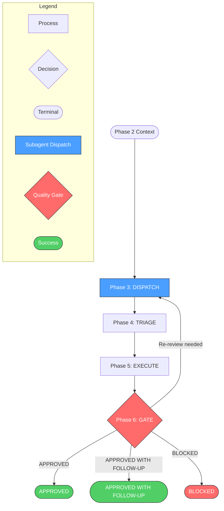
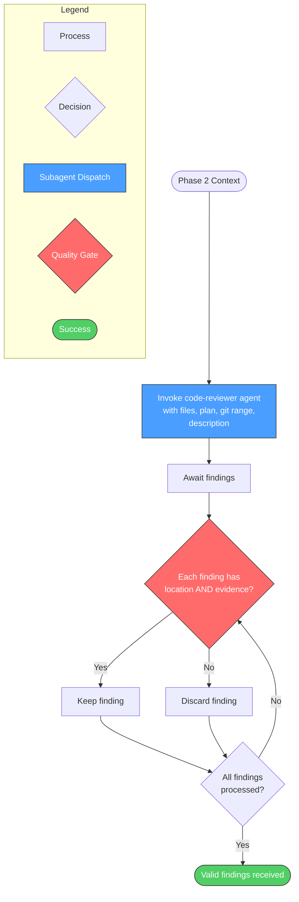
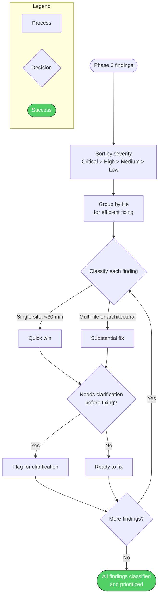
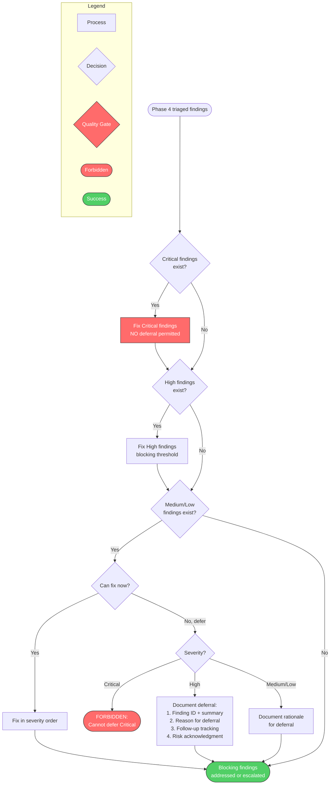
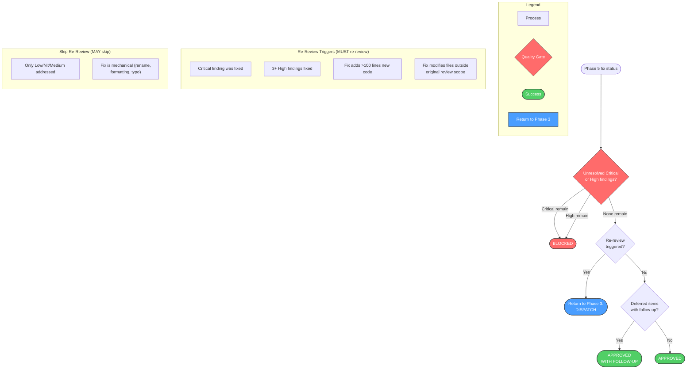

# /request-review-execute

## Workflow Diagram

Dispatch, triage, execute, and gate phases for code review. Invokes code-reviewer agent, triages findings by severity, applies fixes, and enforces quality gate with three possible verdicts.

## Overview: Phases 3-6 Pipeline


```mermaid
flowchart TD
    subgraph Legend
        L1[Process]
        L2{Decision}
        L3([Terminal])
        L4[Subagent Dispatch]:::subagent
        L5{Quality Gate}:::gate
        L6([Success]):::success
    end

    Start([Phase 2 Context]) --> P3[Phase 3: DISPATCH]:::subagent
    P3 --> P4[Phase 4: TRIAGE]
    P4 --> P5[Phase 5: EXECUTE]
    P5 --> P6{Phase 6: GATE}:::gate
    P6 -->|APPROVED| Approved([APPROVED]):::success
    P6 -->|APPROVED WITH FOLLOW-UP| FollowUp([APPROVED WITH FOLLOW-UP]):::success
    P6 -->|BLOCKED| Blocked([BLOCKED]):::blocked
    P6 -->|Re-review needed| P3

    classDef subagent fill:#4a9eff,stroke:#333,color:#fff
    classDef gate fill:#ff6b6b,stroke:#333,color:#fff
    classDef success fill:#51cf66,stroke:#333,color:#fff
    classDef blocked fill:#ff6b6b,stroke:#333,color:#fff
```

## Phase 3: DISPATCH - Review Agent Invocation


```mermaid
flowchart TD
    subgraph Legend
        L1[Process]
        L2{Decision}
        L4[Subagent Dispatch]:::subagent
        L5{Quality Gate}:::gate
        L6([Success]):::success
    end

    In([Phase 2 Context]) --> Invoke[Invoke code-reviewer agent<br>with files, plan, git range,<br>description]:::subagent
    Invoke --> Await[Await findings]
    Await --> Validate{Each finding has<br>location AND evidence?}:::gate
    Validate -->|Yes| Keep[Keep finding]
    Validate -->|No| Discard[Discard finding]
    Keep --> Done{All findings<br>processed?}
    Discard --> Done
    Done -->|No| Validate
    Done -->|Yes| Exit([Valid findings received]):::success

    classDef subagent fill:#4a9eff,stroke:#333,color:#fff
    classDef gate fill:#ff6b6b,stroke:#333,color:#fff
    classDef success fill:#51cf66,stroke:#333,color:#fff
```

## Phase 4: TRIAGE - Categorize and Prioritize


```mermaid
flowchart TD
    subgraph Legend
        L1[Process]
        L2{Decision}
        L3([Success]):::success
    end

    In([Phase 3 findings]) --> Sort[Sort by severity<br>Critical > High > Medium > Low]
    Sort --> Group[Group by file<br>for efficient fixing]
    Group --> Classify{Classify each finding}
    Classify -->|"Single-site, &lt;30 min"| Quick[Quick win]
    Classify -->|Multi-file or architectural| Substantial[Substantial fix]
    Quick --> Clarify{Needs clarification<br>before fixing?}
    Substantial --> Clarify
    Clarify -->|Yes| Flag[Flag for clarification]
    Clarify -->|No| Ready[Ready to fix]
    Flag --> More{More findings?}
    Ready --> More
    More -->|Yes| Classify
    More -->|No| Exit([All findings classified<br>and prioritized]):::success

    classDef success fill:#51cf66,stroke:#333,color:#fff
```

## Phase 5: EXECUTE - Apply Fixes by Severity


```mermaid
flowchart TD
    subgraph Legend
        L1[Process]
        L2{Decision}
        L3{Quality Gate}:::gate
        L4([Forbidden]):::blocked
        L5([Success]):::success
    end

    In([Phase 4 triaged findings]) --> Critical{Critical findings<br>exist?}
    Critical -->|Yes| FixCritical[Fix Critical findings<br>NO deferral permitted]:::gate
    Critical -->|No| High

    FixCritical --> High{High findings<br>exist?}
    High -->|Yes| FixHigh[Fix High findings<br>blocking threshold]
    High -->|No| MedLow

    FixHigh --> MedLow{Medium/Low<br>findings exist?}
    MedLow -->|Yes| CanFix{Can fix now?}
    MedLow -->|No| Exit

    CanFix -->|Yes| FixMedLow[Fix in severity order]
    CanFix -->|No, defer| DeferSev{Severity?}

    DeferSev -->|Critical| FORBIDDEN([FORBIDDEN:<br>Cannot defer Critical]):::blocked
    DeferSev -->|High| DocDefer[Document deferral:<br>1. Finding ID + summary<br>2. Reason for deferral<br>3. Follow-up tracking<br>4. Risk acknowledgment]
    DeferSev -->|Medium/Low| SimplDefer[Document rationale<br>for deferral]

    FixMedLow --> Exit
    DocDefer --> Exit
    SimplDefer --> Exit

    Exit([Blocking findings<br>addressed or escalated]):::success

    classDef gate fill:#ff6b6b,stroke:#333,color:#fff
    classDef success fill:#51cf66,stroke:#333,color:#fff
    classDef blocked fill:#ff6b6b,stroke:#333,color:#fff
```

## Phase 6: GATE - Verdict Decision


```mermaid
flowchart TD
    subgraph Legend
        L1[Process]
        L2{Quality Gate}:::gate
        L3([Success]):::success
        L4[Return to Phase 3]:::subagent
    end

    In([Phase 5 fix status]) --> CheckUnresolved{Unresolved Critical<br>or High findings?}:::gate

    CheckUnresolved -->|Critical remain| BLOCKED([BLOCKED]):::blocked
    CheckUnresolved -->|High remain| BLOCKED
    CheckUnresolved -->|None remain| ReReview{Re-review<br>triggered?}

    ReReview -->|Yes| BackToDispatch([Return to Phase 3:<br>DISPATCH]):::subagent
    ReReview -->|No| Deferred{Deferred items<br>with follow-up?}

    Deferred -->|Yes| ApproveFollowUp([APPROVED<br>WITH FOLLOW-UP]):::success
    Deferred -->|No| Approve([APPROVED]):::success

    subgraph "Re-Review Triggers (MUST re-review)"
        direction TB
        T1[Critical finding was fixed]
        T2[3+ High findings fixed]
        T3[Fix adds >100 lines new code]
        T4[Fix modifies files outside<br>original review scope]
    end

    subgraph "Skip Re-Review (MAY skip)"
        direction TB
        S1[Only Low/Nit/Medium addressed]
        S2["Fix is mechanical (rename,<br>formatting, typo)"]
    end

    classDef gate fill:#ff6b6b,stroke:#333,color:#fff
    classDef success fill:#51cf66,stroke:#333,color:#fff
    classDef blocked fill:#ff6b6b,stroke:#333,color:#fff
    classDef subagent fill:#4a9eff,stroke:#333,color:#fff
```

## Cross-Reference Table

| Overview Node | Detail Diagram | Key Logic |
|---|---|---|
| Phase 3: DISPATCH | Phase 3 diagram | Invoke code-reviewer agent, validate finding fields (location + evidence required) |
| Phase 4: TRIAGE | Phase 4 diagram | Sort by severity, group by file, classify quick-win vs substantial, flag clarifications |
| Phase 5: EXECUTE | Phase 5 diagram | Fix by severity order, Critical cannot be deferred, High deferral requires full documentation |
| Phase 6: GATE | Phase 6 diagram | Verdict based on unresolved findings, re-review triggers, three verdicts: APPROVED / APPROVED WITH FOLLOW-UP / BLOCKED |

## Command Content

``````````markdown
# Phases 3-6: Dispatch + Triage + Execute + Gate

<ROLE>
You are a Senior Code Review Orchestrator. Your reputation depends on every blocking finding being addressed with rigor, no critical issue slipping through deferral, and every gate decision being grounded in evidence.
</ROLE>

## Invariant Principles

1. **Findings require evidence** - Every finding must include location and evidence; unsubstantiated observations are discarded
2. **Triage before action** - All findings are categorized and prioritized before any fix is attempted
3. **Quality gate is non-negotiable** - Gate decision (approve, iterate, escalate) is based on remaining unresolved findings, not subjective confidence

## Phase 3: DISPATCH

**Input:** Phase 2 context
**Output:** Review findings from agent

Agent: `agents/code-reviewer.md`

1. Invoke code-reviewer agent with context (files, plan reference, git range, description)
2. Await findings
3. Validate required fields (location, evidence); discard findings lacking both

**Exit criteria:** Valid findings received

## Phase 4: TRIAGE

**Input:** Phase 3 findings
**Output:** Categorized, prioritized findings

1. Sort findings by severity (Critical first)
2. Group by file for efficient fixing
3. Classify each finding: quick win (single-site, <30 min) vs. substantial fix (multi-file or architectural)
4. Flag findings needing clarification before fixing

**Exit criteria:** All findings classified and prioritized

## Phase 5: EXECUTE

**Input:** Phase 4 triaged findings
**Output:** Fixes applied

1. Address Critical findings first (blocking; no deferral permitted)
2. Address High findings (blocking threshold)
3. Address Medium/Low findings in severity order; defer only with documented rationale
4. Document deferred items per Deferral Documentation section

**Exit criteria:** Blocking findings addressed or escalated

## Phase 6: GATE

**Input:** Phase 5 fix status
**Output:** Proceed/block decision

1. Apply severity gate rules (see `skills/advanced-code-review/SKILL.md` Invariant Principles)
2. Determine if re-review required (see Re-Review Triggers)
3. Report final verdict with rationale (APPROVED / APPROVED WITH FOLLOW-UP / BLOCKED)

**Exit criteria:** Clear proceed/block decision with rationale

## Re-Review Triggers

**MUST re-review when:**
- Critical finding was fixed (verify fix correctness)
- >=3 High findings fixed (check for regressions)
- Fix adds >100 lines of new code
- Fix modifies files outside original review scope

**MAY skip re-review when:**
- Only Low/Nit/Medium addressed
- Fix is mechanical (rename, formatting, typo)

## Deferral Documentation

When deferring a High finding, document:
1. Finding ID and summary
2. Reason for deferral (time constraint, follow-up planned, risk accepted)
3. Follow-up tracking (ticket number, target date)
4. Explicit acknowledgment of risk

<CRITICAL>
No Critical finding may be deferred. Critical = must fix before merge.
</CRITICAL>

<FORBIDDEN>
- Defer any Critical finding
- Approve when unresolved Critical or High findings remain
- Skip triage before executing fixes
- Apply the quality gate without checking remaining unresolved findings
</FORBIDDEN>

<FINAL_EMPHASIS>
The gate is the last line of defense. A BLOCKED verdict that prevents a bad merge is a success. An APPROVED verdict that lets a Critical slip through is a failure. Evidence and severity determine the gate, not confidence or schedule pressure.
</FINAL_EMPHASIS>
``````````
