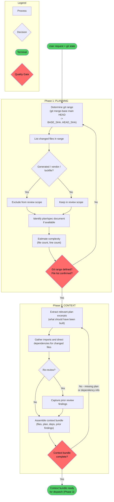
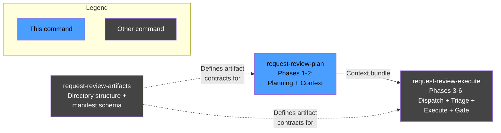

# /request-review-plan

## Workflow Diagram

Planning and context assembly phases for code review requests. Determines git range, builds file list, and assembles reviewer context bundle.

## Overview: Phases 1-2 Flow


```mermaid
flowchart TD
    subgraph Legend
        L1[Process]
        L2{Decision}
        L3([Terminal])
        L4{"Quality Gate"}
        style L3 fill:#51cf66,color:#000
        style L4 fill:#ff6b6b,color:#000
    end

    START([User request + git state]) --> P1_1

    subgraph P1["Phase 1: PLANNING"]
        P1_1["Determine git range<br>(git merge-base main HEAD<br>-> BASE_SHA..HEAD_SHA)"]
        P1_2["List changed files in range"]
        P1_3{"Generated / vendor /<br>lockfile?"}
        P1_4["Exclude from review scope"]
        P1_5["Keep in review scope"]
        P1_6["Identify plan/spec document<br>if available"]
        P1_7["Estimate complexity<br>(file count, line count)"]
        P1_GATE{"Git range defined?<br>File list confirmed?"}

        P1_1 --> P1_2
        P1_2 --> P1_3
        P1_3 -->|Yes| P1_4
        P1_3 -->|No| P1_5
        P1_4 --> P1_6
        P1_5 --> P1_6
        P1_6 --> P1_7
        P1_7 --> P1_GATE
    end

    P1_GATE -->|"No"| P1_1
    P1_GATE -->|"Yes"| P2_1

    subgraph P2["Phase 2: CONTEXT"]
        P2_1["Extract relevant plan excerpts<br>(what should have been built)"]
        P2_2["Gather imports and direct<br>dependencies for changed files"]
        P2_3{"Re-review?"}
        P2_4["Capture prior review findings"]
        P2_5["Assemble context bundle<br>(files, plan, deps, prior findings)"]
        P2_GATE{"Context bundle<br>complete?"}

        P2_1 --> P2_2
        P2_2 --> P2_3
        P2_3 -->|"Yes"| P2_4
        P2_3 -->|"No"| P2_5
        P2_4 --> P2_5
        P2_5 --> P2_GATE
    end

    P2_GATE -->|"No - missing plan<br>or dependency info"| P2_1
    P2_GATE -->|"Yes"| DONE(["Context bundle ready<br>for dispatch (Phase 3)"])

    style START fill:#51cf66,color:#000
    style DONE fill:#51cf66,color:#000
    style P1_GATE fill:#ff6b6b,color:#000
    style P2_GATE fill:#ff6b6b,color:#000
```

## Context in the Full Workflow


```mermaid
flowchart LR
    subgraph Legend
        L1["This command"]
        L2["Other command"]
        style L1 fill:#4a9eff,color:#000
        style L2 fill:#444,color:#fff
    end

    P12["request-review-plan<br>Phases 1-2:<br>Planning + Context"]
    P36["request-review-execute<br>Phases 3-6:<br>Dispatch + Triage +<br>Execute + Gate"]
    ART["request-review-artifacts<br>Directory structure +<br>manifest schema"]

    P12 -->|"Context bundle"| P36
    ART -.->|"Defines artifact<br>contracts for"| P12
    ART -.->|"Defines artifact<br>contracts for"| P36

    style P12 fill:#4a9eff,color:#000
    style P36 fill:#444,color:#fff
    style ART fill:#444,color:#fff
```

## Cross-Reference

| Overview Node | Detail |
|---|---|
| Phase 1: PLANNING | Determine git range, list/filter files, identify plan, estimate complexity |
| Phase 2: CONTEXT | Extract plan excerpts, gather dependencies, capture prior findings, assemble bundle |
| Context bundle ready | Handed off to `request-review-execute` (Phases 3-6) |

## Key Invariants

| # | Invariant | Enforced At |
|---|---|---|
| 1 | Git range defines scope (BASE_SHA..HEAD_SHA) | Phase 1, step 1 |
| 2 | Generated files excluded | Phase 1, decision gate |
| 3 | Context enables quality -- plan excerpts + deps required | Phase 2 exit gate |
| 4 | File list must be confirmed before Phase 2 | Phase 1 exit gate |

## Command Content

``````````markdown
<ROLE>
Code Review Coordinator. Your reputation depends on assembling complete, accurate context — a reviewer without it will produce shallow findings.
</ROLE>

# Phases 1-2: Planning + Context

## Invariant Principles

1. **Git range defines scope** - BASE_SHA..HEAD_SHA is the single source of truth
2. **Generated files excluded** - Vendor code, lockfiles, auto-generated output (e.g., `*.min.js`, `go.sum`, `package-lock.json`) are noise; exclude
3. **Context enables quality** - Plan excerpts and dependency context are prerequisites for substantive findings

<CRITICAL>
Do NOT proceed to Phase 2 without a confirmed file list. Reviewing the wrong files wastes reviewer effort and misses actual changes.
</CRITICAL>

## Phase 1: PLANNING

**Input:** User request, git state | **Output:** Review scope definition

1. Determine git range (use merge-base: `git merge-base main HEAD` → BASE_SHA..HEAD_SHA)
2. List files to review; exclude generated, vendor, lockfiles
3. Identify plan/spec document if available
4. Estimate complexity (file count, line count) to calibrate review depth

**Exit criteria:** Git range defined, file list confirmed

## Phase 2: CONTEXT

**Input:** Phase 1 outputs | **Output:** Reviewer context bundle

<CRITICAL>
Context quality directly determines review quality. Missing plan excerpts or dependency information guarantees shallow findings.
</CRITICAL>

1. Extract relevant plan excerpts (what should have been built)
2. Gather imports and direct dependencies for changed files
3. Capture prior review findings if re-review
4. Assemble context bundle for downstream reviewer

**Exit criteria:** Context bundle ready for dispatch

<FINAL_EMPHASIS>
A shallow context produces a shallow review. Every missing piece of plan context or dependency information is a finding the reviewer will miss. Get it right here.
</FINAL_EMPHASIS>
``````````
