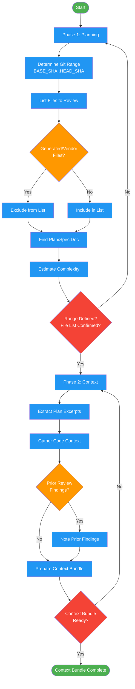

# /request-review-plan

## Workflow Diagram

# Diagram: request-review-plan

Planning and context assembly phases for code review requests. Determines git range, builds file list, and assembles reviewer context bundle.



## Legend

| Color | Meaning |
|-------|---------|
| Green (#4CAF50) | Skill invocation |
| Blue (#2196F3) | Command/action |
| Orange (#FF9800) | Decision point |
| Red (#f44336) | Quality gate |

## Command Content

``````````markdown
# Phases 1-2: Planning + Context

## Invariant Principles

1. **Git range defines review scope** - The BASE_SHA..HEAD_SHA range is the single source of truth for what is under review
2. **Generated files are excluded** - Vendor code, lockfiles, and generated output are noise; exclude them from the review file list
3. **Context enables quality** - A reviewer without plan excerpts and dependency context will produce shallow findings

## Phase 1: PLANNING

**Input:** User request, git state
**Output:** Review scope definition

1. Determine git range (BASE_SHA..HEAD_SHA)
2. List files to review (exclude generated, vendor, lockfiles)
3. Identify plan/spec document if available
4. Estimate review complexity (file count, line count)

**Exit criteria:** Git range defined, file list confirmed

## Phase 2: CONTEXT

**Input:** Phase 1 outputs
**Output:** Reviewer context bundle

1. Extract relevant plan excerpts (what should have been built)
2. Gather related code context (imports, dependencies)
3. Note any prior review findings if re-review
4. Prepare context for code-reviewer agent

**Exit criteria:** Context bundle ready for dispatch
``````````
