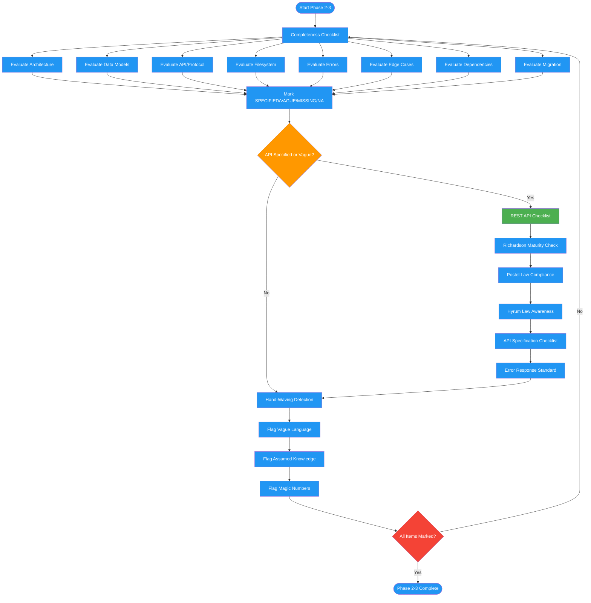

# /review-design-checklist

## Workflow Diagram

# Diagram: review-design-checklist

Phases 2-3 of reviewing-design-docs: runs a completeness checklist across eight architecture categories, applies REST API design checks, then detects hand-waving language and unjustified magic numbers.



## Legend

| Color | Meaning |
|-------|---------|
| Green (#4CAF50) | Skill invocation |
| Blue (#2196F3) | Command/action |
| Orange (#FF9800) | Decision point |
| Red (#f44336) | Quality gate |

## Command Content

``````````markdown
# Phase 2: Completeness Checklist

## Invariant Principles

1. **VAGUE is worse than MISSING** - A vague specification misleads implementers; a missing one at least forces a question
2. **N/A requires justification** - Every item marked N/A must explain why it does not apply; unjustified N/A is equivalent to MISSING
3. **Checklists are exhaustive by design** - Do not skip categories because they seem unlikely to apply; surface area is the point

Mark each item: **SPECIFIED** | **VAGUE** | **MISSING** | **N/A** (justify N/A)

| Category | Items |
|----------|-------|
| Architecture | System diagram, component boundaries, data flow, control flow, state management, sync/async boundaries |
| Data | Models with field specs, schema, validation rules, transformations, storage formats |
| API/Protocol | Endpoints, request/response schemas, error codes, auth, rate limits, versioning |
| Filesystem | Directory structure, module responsibilities, naming conventions, key classes, imports |
| Errors | Categories, propagation paths, recovery mechanisms, retry policies, failure modes |
| Edge Cases | Enumerated cases, boundary conditions, null handling, max limits, concurrency |
| Dependencies | All listed, version constraints, fallback behavior, API contracts |
| Migration | Steps, rollback, data migration, backwards compat (or `N/A - BREAKING OK`) |

## REST API Design Checklist

<RULE>
Apply this checklist when API/Protocol category is marked SPECIFIED or VAGUE. These items encode Richardson Maturity Model, Postel's Law, and Hyrum's Law considerations.
</RULE>

**Richardson Maturity Model (Level 2+ required for "SPECIFIED"):**

| Level | Requirement | Check |
|-------|-------------|-------|
| L0 | Single endpoint, POST everything | Reject as VAGUE |
| L1 | Resources identified by URIs | `/users/123` not `/getUser?id=123` |
| L2 | HTTP verbs used correctly | GET=read, POST=create, PUT=replace, PATCH=update, DELETE=remove |
| L3 | HATEOAS (hypermedia) | Optional but note if claimed |

**Postel's Law Compliance:**

```
"Be conservative in what you send, be liberal in what you accept"
```

| Aspect | Check |
|--------|-------|
| Request validation | Specified: required fields, optional fields, extra field handling |
| Response structure | Specified: guaranteed fields, optional fields, extension points |
| Versioning | Specified: how backwards compatibility maintained |
| Deprecation | Specified: how deprecated fields/endpoints communicated |

**Hyrum's Law Awareness:**

```
"With sufficient users, all observable behaviors become dependencies"
```

Flag these as requiring explicit specification:
- Response field ordering (clients may depend on it)
- Error message text (clients may parse it)
- Timing/performance characteristics (clients may assume them)
- Default values (clients may rely on them)

**API Specification Checklist:**

```
[ ] HTTP methods match CRUD semantics
[ ] Resource URIs are nouns, not verbs
[ ] Versioning strategy specified (URL, header, or content-type)
[ ] Authentication mechanism documented
[ ] Rate limiting specified (limits, headers, retry-after)
[ ] Error response schema consistent across endpoints
[ ] Pagination strategy for list endpoints
[ ] Filtering/sorting parameters documented
[ ] Request size limits specified
[ ] Timeout expectations documented
[ ] Idempotency requirements for non-GET methods
[ ] CORS policy if browser-accessible
```

**Error Response Standard:**

Verify error responses specify:
```json
{
  "error": {
    "code": "VALIDATION_ERROR",
    "message": "Human-readable message",
    "details": [{"field": "email", "issue": "invalid format"}]
  }
}
```

Mark VAGUE if: error format varies by endpoint or leaves structure to implementation.

---

# Phase 3: Hand-Waving Detection

## Vague Language

Flag: "etc.", "as needed", "TBD", "implementation detail", "standard approach", "straightforward", "details omitted"

Format: `**Vague #N** | Loc: [X] | Text: "[quote]" | Missing: [specific]`

## Assumed Knowledge

Unspecified: algorithm choices, data structures, config values, naming conventions

## Magic Numbers

Unjustified: buffer sizes, timeouts, retry counts, rate limits, thresholds
``````````
