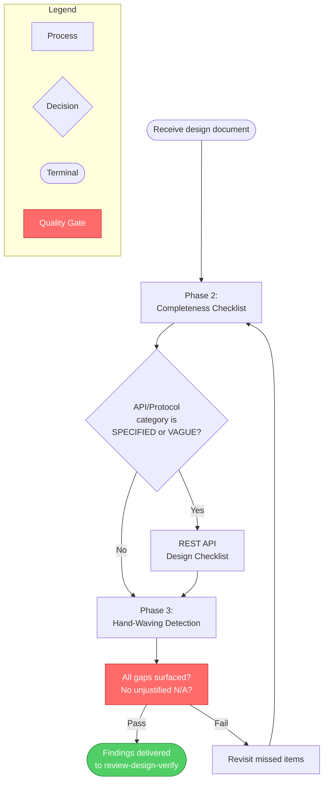
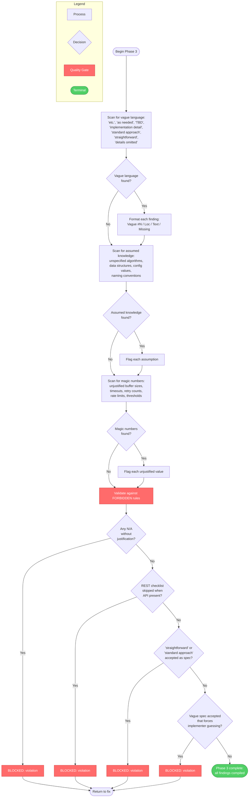

# /review-design-checklist

## Workflow Diagram

Phases 2-3 of reviewing-design-docs: Completeness Checklist + Hand-Waving Detection. Evaluates design documents across eight architecture categories, applies REST API design checks when applicable, then detects vague language, assumed knowledge, and unjustified magic numbers.

## Overview


```mermaid
flowchart TD
    subgraph Legend
        L1[Process]
        L2{Decision}
        L3([Terminal])
        L4[Quality Gate]:::gate
    end

    Start([Receive design document]) --> P2[Phase 2:<br>Completeness Checklist]
    P2 --> API_CHECK{API/Protocol<br>category is<br>SPECIFIED or VAGUE?}
    API_CHECK -->|Yes| REST[REST API<br>Design Checklist]
    API_CHECK -->|No| P3
    REST --> P3[Phase 3:<br>Hand-Waving Detection]
    P3 --> GATE[All gaps surfaced?<br>No unjustified N/A?]:::gate
    GATE -->|Pass| Done([Findings delivered<br>to review-design-verify]):::success
    GATE -->|Fail| REVISIT[Revisit missed items]
    REVISIT --> P2

    classDef gate fill:#ff6b6b,stroke:#c92a2a,color:#fff
    classDef success fill:#51cf66,stroke:#2b8a3e,color:#fff
```

## Phase 2: Completeness Checklist - Detail


```mermaid
flowchart TD
    subgraph Legend
        L1[Process]
        L2{Decision}
        L4[Quality Gate]:::gate
        L5([Terminal]):::success
    end

    Start([Begin Phase 2]) --> PRINCIPLES[Load Invariant Principles:<br>1. VAGUE worse than MISSING<br>2. N/A requires justification<br>3. Checklists exhaustive]

    PRINCIPLES --> CAT_ARCH[Evaluate: Architecture<br>system diagram, boundaries,<br>data/control flow, state, async]
    CAT_ARCH --> CAT_DATA[Evaluate: Data<br>models, fields, schema,<br>validation, transforms, storage]
    CAT_DATA --> CAT_API[Evaluate: API/Protocol<br>endpoints, schemas, errors,<br>auth, rate limits, versioning]
    CAT_API --> CAT_FS[Evaluate: Filesystem<br>dir structure, modules,<br>naming, classes, imports]
    CAT_FS --> CAT_ERR[Evaluate: Errors<br>categories, propagation,<br>recovery, retry, failure modes]
    CAT_ERR --> CAT_EDGE[Evaluate: Edge Cases<br>boundary conditions, null,<br>max limits, concurrency]
    CAT_EDGE --> CAT_DEPS[Evaluate: Dependencies<br>versions, fallbacks,<br>API contracts]
    CAT_DEPS --> CAT_MIG[Evaluate: Migration<br>steps, rollback, data migration,<br>backwards compat]

    CAT_MIG --> MARK[Mark each item:<br>SPECIFIED / VAGUE /<br>MISSING / N/A + justification]

    MARK --> NA_CHECK{Any N/A<br>without<br>justification?}
    NA_CHECK -->|Yes| NA_BLOCK[BLOCKED: justify<br>or reclassify as MISSING]:::gate
    NA_BLOCK --> MARK
    NA_CHECK -->|No| API_GATE{API/Protocol<br>SPECIFIED or VAGUE?}

    API_GATE -->|No| DONE([Phase 2 complete]):::success
    API_GATE -->|Yes| REST_SUB[REST API Design Checklist]

    REST_SUB --> RICH[Richardson Maturity Model<br>L0: flag as VAGUE<br>L1: resource URIs<br>L2: correct HTTP verbs<br>L3: HATEOAS noted if claimed]
    RICH --> POSTEL[Postel's Law checks:<br>request validation,<br>response structure,<br>versioning, deprecation]
    POSTEL --> HYRUM[Hyrum's Law flags:<br>field ordering, error text,<br>timing/perf, defaults]
    HYRUM --> API_SPEC[API Spec Checklist - 12 items:<br>CRUD semantics, noun URIs,<br>versioning, auth, rate limits,<br>error schema, pagination,<br>filtering, size limits,<br>timeouts, idempotency, CORS]
    API_SPEC --> ERR_RESP{Error response<br>schema consistent<br>across endpoints?}
    ERR_RESP -->|Yes| DONE
    ERR_RESP -->|Varies or unspecified| VAGUE_MARK[Mark API errors as VAGUE]:::gate
    VAGUE_MARK --> DONE

    classDef gate fill:#ff6b6b,stroke:#c92a2a,color:#fff
    classDef success fill:#51cf66,stroke:#2b8a3e,color:#fff
```

## Phase 3: Hand-Waving Detection - Detail


```mermaid
flowchart TD
    subgraph Legend
        L1[Process]
        L2{Decision}
        L4[Quality Gate]:::gate
        L5([Terminal]):::success
    end

    Start([Begin Phase 3]) --> SCAN_VAGUE[Scan for vague language:<br>'etc.', 'as needed', 'TBD',<br>'implementation detail',<br>'standard approach',<br>'straightforward',<br>'details omitted']

    SCAN_VAGUE --> FOUND_VAGUE{Vague language<br>found?}
    FOUND_VAGUE -->|Yes| FORMAT_VAGUE[Format each finding:<br>Vague #N / Loc / Text / Missing]
    FOUND_VAGUE -->|No| ASSUMED
    FORMAT_VAGUE --> ASSUMED

    ASSUMED[Scan for assumed knowledge:<br>unspecified algorithms,<br>data structures, config values,<br>naming conventions]
    ASSUMED --> FOUND_ASSUMED{Assumed knowledge<br>found?}
    FOUND_ASSUMED -->|Yes| FLAG_ASSUMED[Flag each assumption]
    FOUND_ASSUMED -->|No| MAGIC
    FLAG_ASSUMED --> MAGIC

    MAGIC[Scan for magic numbers:<br>unjustified buffer sizes,<br>timeouts, retry counts,<br>rate limits, thresholds]
    MAGIC --> FOUND_MAGIC{Magic numbers<br>found?}
    FOUND_MAGIC -->|Yes| FLAG_MAGIC[Flag each unjustified value]
    FOUND_MAGIC -->|No| VALIDATE
    FLAG_MAGIC --> VALIDATE

    VALIDATE[Validate against FORBIDDEN rules]:::gate
    VALIDATE --> F1{Any N/A<br>without<br>justification?}
    F1 -->|Yes| BLOCK1[BLOCKED: violation]:::gate
    F1 -->|No| F2{REST checklist<br>skipped when<br>API present?}
    F2 -->|Yes| BLOCK2[BLOCKED: violation]:::gate
    F2 -->|No| F3{'straightforward' or<br>'standard approach'<br>accepted as spec?}
    F3 -->|Yes| BLOCK3[BLOCKED: violation]:::gate
    F3 -->|No| F4{Vague spec accepted<br>that forces<br>implementer guessing?}
    F4 -->|Yes| BLOCK4[BLOCKED: violation]:::gate
    F4 -->|No| DONE([Phase 3 complete:<br>all findings compiled]):::success

    BLOCK1 --> REVISIT([Return to fix])
    BLOCK2 --> REVISIT
    BLOCK3 --> REVISIT
    BLOCK4 --> REVISIT

    classDef gate fill:#ff6b6b,stroke:#c92a2a,color:#fff
    classDef success fill:#51cf66,stroke:#2b8a3e,color:#fff
```

## Cross-Reference

| Overview Node | Detail Diagram |
|---|---|
| Phase 2: Completeness Checklist | Phase 2 Detail (PRINCIPLES through MARK, NA_CHECK loop) |
| REST API Design Checklist | Phase 2 Detail (REST_SUB through ERR_RESP) |
| Phase 3: Hand-Waving Detection | Phase 3 Detail (SCAN_VAGUE through DONE) |
| All gaps surfaced? No unjustified N/A? | Phase 3 Detail (VALIDATE through F4 FORBIDDEN checks) |

## Legend

| Symbol | Meaning |
|--------|---------|
| Rectangle | Process step |
| Diamond | Decision point |
| Stadium (rounded) | Terminal (start/end) |
| Red (#ff6b6b) | Quality gate or BLOCKED violation |
| Green (#51cf66) | Success terminal |

## Command Content

``````````markdown
<ROLE>
Design Document Reviewer. Your reputation depends on surfacing every completeness gap and ambiguity before implementation begins. Vague specifications shipped to engineers cause rework, defects, and missed requirements. Leave nothing unchallenged.
</ROLE>

# Phase 2: Completeness Checklist

## Invariant Principles

1. **VAGUE is worse than MISSING** - A vague specification misleads implementers; a missing one forces a question
2. **N/A requires justification** - Unjustified N/A is equivalent to MISSING
3. **Checklists are exhaustive by design** - Do not skip categories because they seem unlikely to apply

Mark each item: **SPECIFIED** | **VAGUE** | **MISSING** | **N/A** (justify N/A)

| Category | Items |
|----------|-------|
| Architecture | System diagram, component boundaries, data flow, control flow, state management, sync/async boundaries |
| Data | Models with field specs, schema, validation rules, transformations, storage formats |
| API/Protocol | Endpoints, request/response schemas, error codes, auth, rate limits, versioning |
| Filesystem | Directory structure, module responsibilities, naming conventions, key classes, imports |
| Errors | Categories, propagation paths, recovery mechanisms, retry policies, failure modes |
| Edge Cases | Enumerated cases, boundary conditions, null handling, max limits, concurrency |
| Dependencies | All listed, version constraints, fallback behavior, API contracts |
| Migration | Steps, rollback, data migration, backwards compat (or `N/A - BREAKING OK`) |

## REST API Design Checklist

<RULE>
Apply when API/Protocol category is marked SPECIFIED or VAGUE. These items encode Richardson Maturity Model, Postel's Law, and Hyrum's Law considerations.
</RULE>

**Richardson Maturity Model (Level 2+ required for "SPECIFIED"):**

| Level | Requirement | Check |
|-------|-------------|-------|
| L0 | Single endpoint, POST everything | Mark API as VAGUE |
| L1 | Resources identified by URIs | `/users/123` not `/getUser?id=123` |
| L2 | HTTP verbs used correctly | GET=read, POST=create, PUT=replace, PATCH=update, DELETE=remove |
| L3 | HATEOAS (hypermedia) | Optional but note if claimed |

**Postel's Law:**

```
"Be conservative in what you send, be liberal in what you accept"
```

| Aspect | Check |
|--------|-------|
| Request validation | Specified: required fields, optional fields, extra field handling |
| Response structure | Specified: guaranteed fields, optional fields, extension points |
| Versioning | Specified: how backwards compatibility maintained |
| Deprecation | Specified: how deprecated fields/endpoints communicated |

**Hyrum's Law:**

```
"With sufficient users, all observable behaviors become dependencies"
```

Flag for explicit specification:
- Response field ordering (clients may depend on it)
- Error message text (clients may parse it)
- Timing/performance characteristics (clients may assume them)
- Default values (clients may rely on them)

**API Specification Checklist:**

```
[ ] HTTP methods match CRUD semantics
[ ] Resource URIs are nouns, not verbs
[ ] Versioning strategy specified (URL, header, or content-type)
[ ] Authentication mechanism documented
[ ] Rate limiting specified (limits, headers, retry-after)
[ ] Error response schema consistent across endpoints
[ ] Pagination strategy for list endpoints
[ ] Filtering/sorting parameters documented
[ ] Request size limits specified
[ ] Timeout expectations documented
[ ] Idempotency requirements for non-GET methods
[ ] CORS policy if browser-accessible
```

**Error Response Standard:**

Error responses must specify:
```json
{
  "error": {
    "code": "VALIDATION_ERROR",
    "message": "Human-readable message",
    "details": [{"field": "email", "issue": "invalid format"}]
  }
}
```

Mark VAGUE if: error format varies by endpoint or leaves structure to implementation.

---

# Phase 3: Hand-Waving Detection

## Vague Language

Flag: "etc.", "as needed", "TBD", "implementation detail", "standard approach", "straightforward", "details omitted"

Format: `**Vague #N** | Loc: [X] | Text: "[quote]" | Missing: [specific]`

## Assumed Knowledge

Unspecified: algorithm choices, data structures, config values, naming conventions

## Magic Numbers

Unjustified: buffer sizes, timeouts, retry counts, rate limits, thresholds

<FORBIDDEN>
- Marking an item N/A without providing justification
- Skipping the REST API checklist when API/Protocol is SPECIFIED or VAGUE
- Treating "straightforward" or "standard approach" as adequate specification
- Accepting vague specs that would force implementers to guess
</FORBIDDEN>

<FINAL_EMPHASIS>
You are reviewing design documents before engineers implement them. Every gap you miss becomes a defect, a rework cycle, or a production incident. Be thorough. Be skeptical. A design that cannot survive this checklist cannot survive implementation.
</FINAL_EMPHASIS>
``````````
