# /review-design-report

## Workflow Diagram

# Diagram: review-design-report

Phases 6-7 of reviewing-design-docs: compiles a scored findings report with reproducible category counts, then generates a prioritized remediation plan with P1/P2/P3 items and factcheck verification tasks.

```mermaid
flowchart TD
    Start([Start Phase 6-7]) --> Tally[Tally Category Scores]

    Tally --> ScoreTable[Build Score Table]
    ScoreTable --> CountHW[Count Hand-Waving]
    CountHW --> CountA[Count Assumed]
    CountA --> CountMN[Count Magic Numbers]
    CountMN --> CountE[Count Escalated]

    CountE --> Findings[Compile Findings]
    Findings --> ForEach[For Each Finding]
    ForEach --> Loc[Record Location]
    Loc --> Current[Record Current Text]
    Current --> Problem[Describe Problem]
    Problem --> WouldGuess[What Implementer Guesses]
    WouldGuess --> Required[Specify Exact Fix]

    Required --> MoreF{More Findings?}
    MoreF -->|Yes| ForEach
    MoreF -->|No| Reproducible{Scores Reproducible?}

    Reproducible -->|No| Tally
    Reproducible -->|Yes| Remediation[Build Remediation Plan]

    Remediation --> P1[P1 Critical Blockers]
    P1 --> P2[P2 Important Items]
    P2 --> P3[P3 Minor Items]
    P3 --> FactV[Factcheck Verification]
    FactV --> Additions[Diagrams/Tables/Sections]

    Additions --> Complete{Report Complete?}
    Complete -->|Yes| Done([Phase 6-7 Complete])
    Complete -->|No| Findings

    style Start fill:#2196F3,color:#fff
    style Done fill:#2196F3,color:#fff
    style Tally fill:#2196F3,color:#fff
    style ScoreTable fill:#2196F3,color:#fff
    style CountHW fill:#2196F3,color:#fff
    style CountA fill:#2196F3,color:#fff
    style CountMN fill:#2196F3,color:#fff
    style CountE fill:#2196F3,color:#fff
    style Findings fill:#2196F3,color:#fff
    style ForEach fill:#2196F3,color:#fff
    style Loc fill:#2196F3,color:#fff
    style Current fill:#2196F3,color:#fff
    style Problem fill:#2196F3,color:#fff
    style WouldGuess fill:#2196F3,color:#fff
    style Required fill:#2196F3,color:#fff
    style Remediation fill:#2196F3,color:#fff
    style P1 fill:#f44336,color:#fff
    style P2 fill:#2196F3,color:#fff
    style P3 fill:#2196F3,color:#fff
    style FactV fill:#4CAF50,color:#fff
    style Additions fill:#2196F3,color:#fff
    style MoreF fill:#FF9800,color:#fff
    style Reproducible fill:#f44336,color:#fff
    style Complete fill:#FF9800,color:#fff
```



## Legend

| Color | Meaning |
|-------|---------|
| Green (#4CAF50) | Skill invocation |
| Blue (#2196F3) | Command/action |
| Orange (#FF9800) | Decision point |
| Red (#f44336) | Quality gate |

## Command Content

``````````markdown
# Phase 6: Findings Report

## Invariant Principles

1. **Findings require exact remediation** - "Needs more detail" is not actionable; specify precisely what must be added and where
2. **Scores must be reproducible** - Another reviewer following the same checklist should arrive at the same category counts
3. **Remediation plans are ordered by dependency** - Fix structural gaps before detail gaps; interfaces before implementations

## Score

```
## Score
| Category | Specified | Vague | Missing | N/A |
|----------|-----------|-------|---------|-----|

Hand-Waving: N | Assumed: M | Magic Numbers: P | Escalated: Q
```

## Findings Format

```
**#N: [Title]**
Loc: [X]
Current: [quote]
Problem: [why insufficient]
Would guess: [decisions]
Required: [exact fix]
```

---

# Phase 7: Remediation Plan

```
### P1: Critical (Blocks Implementation)
1. [ ] [addition + acceptance criteria]

### P2: Important
1. [ ] [clarification]

### P3: Minor
1. [ ] [improvement]

### Factcheck Verification
1. [ ] [claim] - [category] - [depth]

### Additions
- [ ] Diagram: [type] showing [what]
- [ ] Table: [topic] specifying [what]
- [ ] Section: [name] covering [what]
```
``````````
