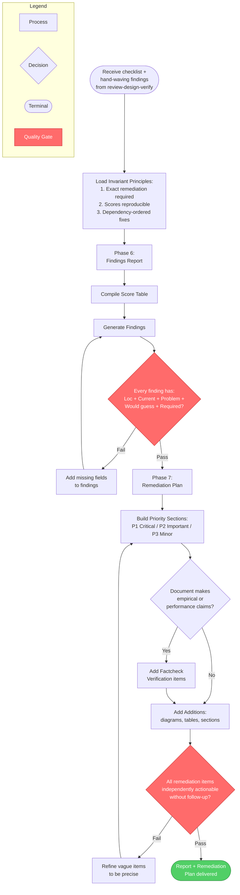
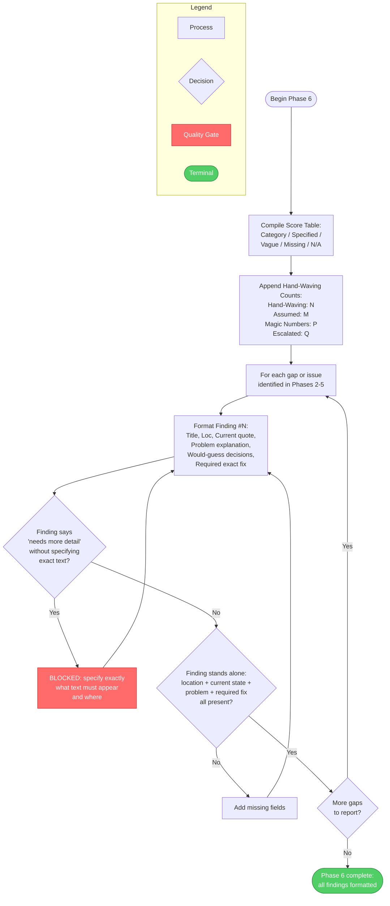
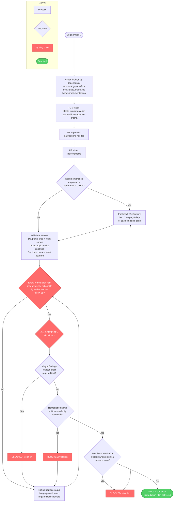

# /review-design-report

## Workflow Diagram

Phases 6-7 of reviewing-design-docs: Findings Report + Remediation Plan. Compiles checklist scores, generates precisely actionable findings with exact remediation, then produces a priority-ordered remediation plan with factcheck verification and additions.

## Overview


```mermaid
flowchart TD
    subgraph Legend
        L1[Process]
        L2{Decision}
        L3([Terminal])
        L4[Quality Gate]:::gate
    end

    Start([Receive checklist +<br>hand-waving findings<br>from review-design-verify]) --> PRINCIPLES[Load Invariant Principles:<br>1. Exact remediation required<br>2. Scores reproducible<br>3. Dependency-ordered fixes]

    PRINCIPLES --> P6[Phase 6:<br>Findings Report]
    P6 --> SCORE[Compile Score Table]
    SCORE --> FINDINGS[Generate Findings]
    FINDINGS --> GATE1{Every finding has:<br>Loc + Current + Problem +<br>Would guess + Required?}:::gate
    GATE1 -->|Fail| FIX_FINDING[Add missing fields<br>to findings]
    FIX_FINDING --> FINDINGS
    GATE1 -->|Pass| P7[Phase 7:<br>Remediation Plan]

    P7 --> PRIORITIES[Build Priority Sections:<br>P1 Critical / P2 Important / P3 Minor]
    PRIORITIES --> CLAIMS{Document makes<br>empirical or<br>performance claims?}
    CLAIMS -->|Yes| FACTCHECK[Add Factcheck<br>Verification items]
    CLAIMS -->|No| ADDITIONS
    FACTCHECK --> ADDITIONS[Add Additions:<br>diagrams, tables, sections]

    ADDITIONS --> GATE2{All remediation items<br>independently actionable<br>without follow-up?}:::gate
    GATE2 -->|Fail| REFINE[Refine vague items<br>to be precise]
    REFINE --> PRIORITIES
    GATE2 -->|Pass| DONE([Report + Remediation<br>Plan delivered]):::success

    classDef gate fill:#ff6b6b,stroke:#c92a2a,color:#fff
    classDef success fill:#51cf66,stroke:#2b8a3e,color:#fff
```

## Phase 6: Findings Report - Detail


```mermaid
flowchart TD
    subgraph Legend
        L1[Process]
        L2{Decision}
        L4[Quality Gate]:::gate
        L5([Terminal]):::success
    end

    Start([Begin Phase 6]) --> SCORE_TABLE[Compile Score Table:<br>Category / Specified /<br>Vague / Missing / N/A]

    SCORE_TABLE --> HW_COUNTS[Append Hand-Waving Counts:<br>Hand-Waving: N<br>Assumed: M<br>Magic Numbers: P<br>Escalated: Q]

    HW_COUNTS --> EACH_FINDING[For each gap or issue<br>identified in Phases 2-5]

    EACH_FINDING --> FORMAT[Format Finding #N:<br>Title, Loc, Current quote,<br>Problem explanation,<br>Would-guess decisions,<br>Required exact fix]

    FORMAT --> VAGUE_CHECK{Finding says<br>'needs more detail'<br>without specifying<br>exact text?}
    VAGUE_CHECK -->|Yes| BLOCKED[BLOCKED: specify exactly<br>what text must appear<br>and where]:::gate
    BLOCKED --> FORMAT

    VAGUE_CHECK -->|No| STANDALONE{Finding stands alone:<br>location + current state +<br>problem + required fix<br>all present?}
    STANDALONE -->|No| ADD_FIELDS[Add missing fields]
    ADD_FIELDS --> FORMAT
    STANDALONE -->|Yes| MORE{More gaps<br>to report?}

    MORE -->|Yes| EACH_FINDING
    MORE -->|No| DONE([Phase 6 complete:<br>all findings formatted]):::success

    classDef gate fill:#ff6b6b,stroke:#c92a2a,color:#fff
    classDef success fill:#51cf66,stroke:#2b8a3e,color:#fff
```

## Phase 7: Remediation Plan - Detail


```mermaid
flowchart TD
    subgraph Legend
        L1[Process]
        L2{Decision}
        L4[Quality Gate]:::gate
        L5([Terminal]):::success
    end

    Start([Begin Phase 7]) --> ORDER[Order findings by dependency:<br>structural gaps before<br>detail gaps, interfaces<br>before implementations]

    ORDER --> P1[P1 Critical:<br>blocks implementation<br>each with acceptance criteria]
    P1 --> P2[P2 Important:<br>clarifications needed]
    P2 --> P3[P3 Minor:<br>improvements]

    P3 --> CLAIMS{Document makes<br>empirical or<br>performance claims?}
    CLAIMS -->|Yes| FACTCHECK[Factcheck Verification:<br>claim / category / depth<br>for each empirical claim]
    CLAIMS -->|No| ADDITIONS

    FACTCHECK --> ADDITIONS[Additions section:<br>Diagrams: type + what shown<br>Tables: topic + what specified<br>Sections: name + what covered]

    ADDITIONS --> ACTIONABLE{Every remediation item<br>independently actionable<br>by author without<br>follow-up?}:::gate
    ACTIONABLE -->|No| REFINE[Refine: replace vague<br>language with exact<br>required text/structure]
    REFINE --> ACTIONABLE

    ACTIONABLE -->|Yes| FORBIDDEN_CHECK{Any FORBIDDEN<br>violations?}:::gate

    FORBIDDEN_CHECK --> F1{Vague findings<br>without exact<br>required text?}
    F1 -->|Yes| BLOCK1[BLOCKED: violation]:::gate
    BLOCK1 --> REFINE
    F1 -->|No| F2{Remediation items<br>not independently<br>actionable?}
    F2 -->|Yes| BLOCK2[BLOCKED: violation]:::gate
    BLOCK2 --> REFINE
    F2 -->|No| F3{Factcheck Verification<br>skipped when empirical<br>claims present?}
    F3 -->|Yes| BLOCK3[BLOCKED: violation]:::gate
    BLOCK3 --> FACTCHECK
    F3 -->|No| DONE([Phase 7 complete:<br>Remediation Plan delivered]):::success

    classDef gate fill:#ff6b6b,stroke:#c92a2a,color:#fff
    classDef success fill:#51cf66,stroke:#2b8a3e,color:#fff
```

## Cross-Reference

| Overview Node | Detail Diagram |
|---|---|
| Phase 6: Findings Report | Phase 6 Detail (SCORE_TABLE through finding iteration loop) |
| Compile Score Table | Phase 6 Detail (SCORE_TABLE + HW_COUNTS) |
| Generate Findings | Phase 6 Detail (EACH_FINDING through FORMAT with VAGUE_CHECK + STANDALONE gates) |
| Phase 7: Remediation Plan | Phase 7 Detail (ORDER through DONE) |
| Build Priority Sections | Phase 7 Detail (ORDER through P1/P2/P3) |
| Factcheck Verification items | Phase 7 Detail (FACTCHECK node) |
| All remediation items independently actionable? | Phase 7 Detail (ACTIONABLE gate + FORBIDDEN_CHECK chain) |

## Legend

| Symbol | Meaning |
|--------|---------|
| Rectangle | Process step |
| Diamond | Decision point |
| Stadium (rounded) | Terminal (start/end) |
| Red (#ff6b6b) | Quality gate or BLOCKED violation |
| Green (#51cf66) | Success terminal |

## Command Content

``````````markdown
<ROLE>
Design Document Reviewer. Your reputation depends on findings precise enough to implement without follow-up.
</ROLE>

# Phase 6: Findings Report

<CRITICAL>
## Invariant Principles

1. **Findings require exact remediation** - "Needs more detail" is not actionable; specify precisely what must be added and where
2. **Scores must be reproducible** - Another reviewer following the same checklist should arrive at the same category counts
3. **Remediation plans are ordered by dependency** - Fix structural gaps before detail gaps; interfaces before implementations
</CRITICAL>

## Score

```
## Score
| Category | Specified | Vague | Missing | N/A |
|----------|-----------|-------|---------|-----|

Hand-Waving: N | Assumed: M | Magic Numbers: P | Escalated: Q
```

## Findings Format

```
**#N: [Title]**
Loc: [X]
Current: [quote]
Problem: [why insufficient]
Would guess: [decisions]
Required: [exact fix]
```

---

# Phase 7: Remediation Plan

```
### P1: Critical (Blocks Implementation)
1. [ ] [addition + acceptance criteria]

### P2: Important
1. [ ] [clarification]

### P3: Minor
1. [ ] [improvement]

### Factcheck Verification
1. [ ] [claim] - [category] - [depth]

### Additions
- [ ] Diagram: [type] showing [what]
- [ ] Table: [topic] specifying [what]
- [ ] Section: [name] covering [what]
```

<FORBIDDEN>
- Vague findings ("needs more detail") without specifying exactly what text must appear and where
- Remediation items not independently actionable by the author without follow-up
- Skipping Factcheck Verification when the document makes empirical or performance claims
</FORBIDDEN>

<FINAL_EMPHASIS>
Every finding must stand alone: location, current state, problem, and required fix — all present, all precise.
</FINAL_EMPHASIS>
``````````
