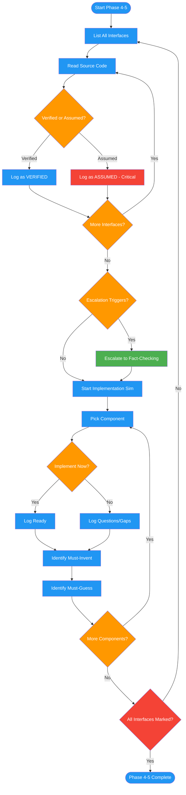

# /review-design-verify

## Workflow Diagram

# Diagram: review-design-verify

Phases 4-5 of reviewing-design-docs: verifies all interface claims against actual source code, escalates unverifiable claims to fact-checking, then simulates implementation per component to surface specification gaps.



## Legend

| Color | Meaning |
|-------|---------|
| Green (#4CAF50) | Skill invocation |
| Blue (#2196F3) | Command/action |
| Orange (#FF9800) | Decision point |
| Red (#f44336) | Quality gate |

## Command Content

``````````markdown
# Phase 4: Interface Verification

## Invariant Principles

1. **Read source before accepting any interface claim** - Assumed behavior from method names is the root cause of fabrication loops
2. **Every interface must be marked VERIFIED or ASSUMED** - No unmarked entries; the distinction drives the risk assessment
3. **Usage examples trump documentation** - When docs and actual usage diverge, actual usage is ground truth

<analysis>
INFERRED BEHAVIOR IS NOT VERIFIED BEHAVIOR.
`assert_model_updated(model, field=value)` might assert only those fields, require ALL changes, or behave differently.
</analysis>

<reflection>
YOU DO NOT KNOW until you READ THE SOURCE.
</reflection>

## Fabrication Anti-Pattern

| Wrong | Right |
|-------|-------|
| Assume from name | Read docstring, source |
| Code fails -> invent parameter | Find usage examples |
| Keep inventing | Write from VERIFIED behavior |

## Verification Table

| Interface | Verified/Assumed | Source Read | Notes |
|-----------|-----------------|-------------|-------|

**Every ASSUMED = critical gap.**

## Factchecker Escalation

Trigger: security claims, performance claims, concurrency claims, numeric claims, external references

Format: `**Escalate:** [claim] | Loc: [X] | Category: [Y] | Depth: SHALLOW/MEDIUM/DEEP`

---

# Phase 5: Implementation Simulation

Per component:
```
### Component: [name]
**Implement now?** YES/NO
**Questions:** [list]
**Must invent:** [what] - should specify: [why]
**Must guess:** [shape] - should specify: [why]
```

**Fractal exploration (optional):** When a component has 3+ "Must invent" items, invoke fractal-thinking with intensity `pulse` and seed: "What implementation decisions would be forced into guessing when coding [component]?". Use the synthesis to expand the list of specification gaps.
``````````
