# /review-plan-behavior

## Workflow Diagram

# Diagram: review-plan-behavior

Phase 3 of reviewing-impl-plans: audits every code reference in the plan to ensure behaviors are verified from source rather than assumed from method names, flags the fabrication anti-pattern, and detects trial-and-error loop indicators.

```mermaid
flowchart TD
    Start([Start Phase 3]) --> CollectRefs[Collect Code References]

    CollectRefs --> PickRef[Pick Next Reference]
    PickRef --> HasCitation{Has file:line Citation?}

    HasCitation -->|Yes| ReadSrc[Read Actual Source]
    HasCitation -->|No| FlagNoCite[Flag Missing Citation]

    ReadSrc --> MatchBehavior{Behavior Matches Claim?}

    MatchBehavior -->|Yes| LogVerified[Log as VERIFIED]
    MatchBehavior -->|No| LogAssumed[Log as ASSUMED - Critical]

    FlagNoCite --> LogAssumed

    LogVerified --> CheckPatterns[Check Dangerous Patterns]
    LogAssumed --> CheckPatterns

    CheckPatterns --> ConvParam{Assumes Convenience Params?}
    ConvParam -->|Yes| FlagConv[Flag Unverified Param]
    ConvParam -->|No| FlexBehavior{Assumes Flexible Behavior?}

    FlagConv --> FlexBehavior
    FlexBehavior -->|Yes| FlagFlex[Flag Unverified Flexibility]
    FlexBehavior -->|No| LibAssume{Assumes Library Behavior?}

    FlagFlex --> LibAssume
    LibAssume -->|Yes| FlagLib[Flag Unverified Library]
    LibAssume -->|No| TestUtil{Assumes Test Utility?}

    FlagLib --> TestUtil
    TestUtil -->|Yes| FlagTest[Flag Unverified Utility]
    TestUtil -->|No| MoreRefs{More References?}

    FlagTest --> MoreRefs

    MoreRefs -->|Yes| PickRef
    MoreRefs -->|No| LoopDetect[Loop Detection Scan]

    LoopDetect --> HasLoops{Trial-and-Error Found?}

    HasLoops -->|Yes| FlagLoop[RED FLAG: No Verification]
    HasLoops -->|No| GateAll{All Refs Audited?}

    FlagLoop --> GateAll

    GateAll -->|Yes| Deliver[Deliver Behavior Audit]
    GateAll -->|No| PickRef

    Deliver --> Done([Phase 3 Complete])

    style Start fill:#2196F3,color:#fff
    style Done fill:#2196F3,color:#fff
    style CollectRefs fill:#2196F3,color:#fff
    style PickRef fill:#2196F3,color:#fff
    style ReadSrc fill:#2196F3,color:#fff
    style FlagNoCite fill:#f44336,color:#fff
    style LogVerified fill:#2196F3,color:#fff
    style LogAssumed fill:#f44336,color:#fff
    style CheckPatterns fill:#2196F3,color:#fff
    style FlagConv fill:#2196F3,color:#fff
    style FlagFlex fill:#2196F3,color:#fff
    style FlagLib fill:#2196F3,color:#fff
    style FlagTest fill:#2196F3,color:#fff
    style LoopDetect fill:#2196F3,color:#fff
    style FlagLoop fill:#f44336,color:#fff
    style Deliver fill:#2196F3,color:#fff
    style HasCitation fill:#FF9800,color:#fff
    style MatchBehavior fill:#FF9800,color:#fff
    style ConvParam fill:#FF9800,color:#fff
    style FlexBehavior fill:#FF9800,color:#fff
    style LibAssume fill:#FF9800,color:#fff
    style TestUtil fill:#FF9800,color:#fff
    style MoreRefs fill:#FF9800,color:#fff
    style HasLoops fill:#FF9800,color:#fff
    style GateAll fill:#f44336,color:#fff
```



## Legend

| Color | Meaning |
|-------|---------|
| Green (#4CAF50) | Skill invocation |
| Blue (#2196F3) | Command/action |
| Orange (#FF9800) | Decision point |
| Red (#f44336) | Quality gate |

## Command Content

``````````markdown
# Phase 3: Behavior Verification Audit

You are executing Phase 3 of the implementation plan review. Your job is to verify that all referenced existing code behaviors are based on verified source, not assumptions.

## Invariant Principles

1. **Inferred behavior is not verified behavior** - Method names suggest intent but do not guarantee it; only reading source confirms behavior
2. **Fabrication is the root failure** - Inventing parameters, return types, or behaviors that do not exist in source leads to cascading waste
3. **Every code reference needs a file:line citation** - Plans that reference existing code without specifying where they read it are unverified

<CRITICAL>
INFERRED BEHAVIOR IS NOT VERIFIED BEHAVIOR.

When a plan references existing code, the plan MUST be based on VERIFIED behavior, not ASSUMED behavior from method names.
</CRITICAL>

## The Fabrication Anti-Pattern

```
# FORBIDDEN: The Fabrication Loop
1. Plan assumes method does X based on name
2. Agent writes code, fails because method actually does Y
3. Agent INVENTS parameter: method(..., partial=True)
4. Fails because parameter doesn't exist
5. Agent enters debugging loop, never reads source
6. Hours wasted on fabricated solutions

# REQUIRED in Plan
1. "Behavior verified by reading [file:line]"
2. Actual method signatures from source
3. Constraints discovered from reading source
4. Executing agents follow verified behavior, no guessing
```

## Dangerous Assumption Patterns

Flag when plan:

**1. Assumes convenience parameters exist:**
- "Pass `partial=True` to allow partial matching" (VERIFY THIS EXISTS)
- "Use `strict_mode=False` to relax validation" (VERIFY THIS EXISTS)

**2. Assumes flexible behavior from strict interfaces:**
- "The test context allows partial assertions" (VERIFY: many require exhaustive assertions)
- "The validator accepts subset of fields" (VERIFY: many require complete objects)

**3. Assumes library behavior from method names:**
- "The `update()` method will merge fields" (VERIFY: might replace entirely)
- "The `validate()` method returns errors" (VERIFY: might raise exceptions)

**4. Assumes test utilities work "conveniently":**
- "Our `assert_model_updated()` checks specified fields" (VERIFY: might require ALL changes)
- "Our `mock_service()` auto-mocks everything" (VERIFY: might require explicit setup)

## Verification Requirements

For each existing interface/library/utility referenced:

| Interface | Verified/Assumed | Source Read | Actual Behavior | Constraints |
|-----------|------------------|-------------|-----------------|-------------|
| [name] | VERIFIED/ASSUMED | [file:line] | [what it does] | [limitations] |

**Flag every ASSUMED entry as CRITICAL gap.**

## Loop Detection

If plan describes:
- "Try X, if that fails try Y, if that fails try Z"
- "Experiment with different parameter combinations"
- "Adjust until tests pass"

**RED FLAG**: Plan author did not verify behavior. Require source citation instead.

## Deliverable

Populate the following sections of the review report:
- Behavior verifications: D verified, E assumed (assumed = CRITICAL)
- All CRITICAL findings for assumed behaviors
- All loop detection red flags
- Specific remediation: which source files must be read, which citations must be added

Return your completed behavior audit as structured output for the orchestrator.
``````````
