# /review-plan-completeness

## Workflow Diagram

# Diagram: review-plan-completeness

Phases 4-5 of reviewing-impl-plans: verifies definitions of done, risk assessments, QA checkpoints, agent responsibility matrices, and dependency graphs for completeness, then escalates unverifiable claims to the fact-checking skill.

```mermaid
flowchart TD
    Start([Start Phase 4-5]) --> PickWI[Pick Work Item]

    PickWI --> HasDoD{Definition of Done?}

    HasDoD -->|Yes| VerifyDoD[Verify Testable Criteria]
    HasDoD -->|No| FlagDoD[Flag Missing DoD]
    HasDoD -->|Partial| FlagPartial[Flag Partial DoD]

    VerifyDoD --> Testable{Measurable & Pass/Fail?}
    Testable -->|Yes| DoDOK[DoD Acceptable]
    Testable -->|No| FlagSubjective[Flag Subjective Criteria]

    FlagDoD --> MoreWI{More Work Items?}
    FlagPartial --> MoreWI
    DoDOK --> MoreWI
    FlagSubjective --> MoreWI

    MoreWI -->|Yes| PickWI
    MoreWI -->|No| RiskPhase[Risk Assessment Audit]

    RiskPhase --> PickPhase[Pick Phase]
    PickPhase --> HasRisk{Risks Documented?}

    HasRisk -->|Yes| CheckMit[Check Mitigations]
    HasRisk -->|No| FlagRisk[Flag Missing Risk Docs]

    CheckMit --> HasRollback{Rollback Points?}
    HasRollback -->|Yes| RiskOK[Risk Acceptable]
    HasRollback -->|No| FlagRollback[Flag Missing Rollback]

    FlagRisk --> MorePhase{More Phases?}
    RiskOK --> MorePhase
    FlagRollback --> MorePhase

    MorePhase -->|Yes| PickPhase
    MorePhase -->|No| QA[QA Checkpoint Audit]

    QA --> CheckQA[Verify Test Types]
    CheckQA --> CheckSkills[Check Skill Integrations]
    CheckSkills --> AgentMatrix[Agent Responsibility Matrix]

    AgentMatrix --> CheckClarity{Responsibilities Clear?}
    CheckClarity -->|Yes| DepGraph[Dependency Graph]
    CheckClarity -->|No| FlagAmbig[Flag Ambiguity]

    FlagAmbig --> DepGraph
    DepGraph --> Circular{Circular Dependencies?}

    Circular -->|Yes| CritCirc[CRITICAL: Circular Dep]
    Circular -->|No| Escalate[Escalation Phase]

    CritCirc --> Escalate

    Escalate --> ScanClaims[Scan Technical Claims]
    ScanClaims --> FactCheck[Invoke Fact-Checking]

    FactCheck --> GateDone{All Checks Complete?}
    GateDone -->|Yes| Done([Phase 4-5 Complete])
    GateDone -->|No| PickWI

    style Start fill:#2196F3,color:#fff
    style Done fill:#2196F3,color:#fff
    style PickWI fill:#2196F3,color:#fff
    style VerifyDoD fill:#2196F3,color:#fff
    style FlagDoD fill:#f44336,color:#fff
    style FlagPartial fill:#2196F3,color:#fff
    style DoDOK fill:#2196F3,color:#fff
    style FlagSubjective fill:#2196F3,color:#fff
    style RiskPhase fill:#2196F3,color:#fff
    style PickPhase fill:#2196F3,color:#fff
    style CheckMit fill:#2196F3,color:#fff
    style FlagRisk fill:#f44336,color:#fff
    style RiskOK fill:#2196F3,color:#fff
    style FlagRollback fill:#2196F3,color:#fff
    style QA fill:#2196F3,color:#fff
    style CheckQA fill:#2196F3,color:#fff
    style CheckSkills fill:#4CAF50,color:#fff
    style AgentMatrix fill:#2196F3,color:#fff
    style FlagAmbig fill:#2196F3,color:#fff
    style DepGraph fill:#2196F3,color:#fff
    style CritCirc fill:#f44336,color:#fff
    style Escalate fill:#2196F3,color:#fff
    style ScanClaims fill:#2196F3,color:#fff
    style FactCheck fill:#4CAF50,color:#fff
    style HasDoD fill:#FF9800,color:#fff
    style Testable fill:#FF9800,color:#fff
    style MoreWI fill:#FF9800,color:#fff
    style HasRisk fill:#FF9800,color:#fff
    style HasRollback fill:#FF9800,color:#fff
    style MorePhase fill:#FF9800,color:#fff
    style CheckClarity fill:#FF9800,color:#fff
    style Circular fill:#FF9800,color:#fff
    style GateDone fill:#f44336,color:#fff
```



## Legend

| Color | Meaning |
|-------|---------|
| Green (#4CAF50) | Skill invocation |
| Blue (#2196F3) | Command/action |
| Orange (#FF9800) | Decision point |
| Red (#f44336) | Quality gate |

## Command Content

``````````markdown
# Phase 4: Completeness Checks

You are executing Phases 4-5 of the implementation plan review. Your job is to verify completeness of definitions of done, risk assessments, QA checkpoints, agent responsibilities, and dependency graphs, then escalate claims requiring fact-checking.

## Invariant Principles

1. **Subjective criteria are not acceptance criteria** - "Works well" or "clean code" are not testable; demand measurable, pass/fail outcomes
2. **Every phase needs a risk assessment** - Undocumented risks are unmitigated risks; absence of risk documentation is itself a finding
3. **Escalate what you cannot verify** - Technical claims that require execution or external validation must be forwarded to fact-checking, not assumed correct

## Definition of Done per Work Item

For EACH work item:
```
Work Item: [name]
Definition of Done: YES / NO / PARTIAL

If YES, verify:
[ ] Testable criteria (not subjective)
[ ] Measurable outcomes
[ ] Specific outputs enumerated
[ ] Clear pass/fail determination

If NO/PARTIAL: [what acceptance criteria must be added]
```

## Risk Assessment per Phase

For EACH phase:
```
Phase: [name]
Risks documented: YES / NO

If NO, identify:
1. [Risk] - likelihood H/M/L, impact H/M/L
Mitigation: [required]
Rollback point: [required]
```

## QA Checkpoints

| Phase | QA Checkpoint | Test Types | Pass Criteria | Failure Procedure |
|-------|---------------|------------|---------------|-------------------|
| | YES/NO | | | |

Required skill integrations:
- [ ] auditing-green-mirage after tests pass
- [ ] systematic-debugging on failures
- [ ] fact-checking for security/performance/behavior claims

## Agent Responsibility Matrix

For each agent/work stream:
```
Agent: [name]
Responsibilities: [specific deliverables]
Inputs (depends on): [deliverables from others]
Outputs (provides to): [deliverables to others]
Interfaces owned: [specifications]

Clarity: CLEAR / AMBIGUOUS
If ambiguous: [what needs clarification]
```

## Dependency Graph

```
Agent A (Setup)
    |
Agent B (Core)  ->  Agent C (API)
    |                  |
Agent D (Tests) <- - - -

All dependencies explicit: YES/NO
Circular dependencies: YES/NO (if yes: CRITICAL)
Missing declarations: [list]
```

# Phase 5: Escalation

Claims requiring `fact-checking` skill (do NOT self-verify):

| Category | Examples |
|----------|----------|
| Security | "Input sanitized", "tokens cryptographically random" |
| Performance | "O(n) complexity", "queries optimized", "cached" |
| Concurrency | "Thread-safe", "atomic operations", "no race conditions" |
| Test utility behavior | Claims about how helpers, mocks, fixtures behave |
| Library behavior | Specific claims about third-party behavior |

For each escalated claim:
```
Claim: [quote]
Location: [section/line]
Category: [Security/Performance/etc.]
Depth: SHALLOW / MEDIUM / DEEP
```

<RULE>
After review, invoke `fact-checking` skill with pre-flagged claims. Do NOT implement your own fact-checking.
</RULE>

## Deliverable

Populate the following sections of the review report:
- Claims escalated to fact-checking: F
- Definition of done gaps
- Risk assessment gaps
- QA checkpoint gaps
- Agent responsibility clarity issues
- Dependency graph issues (especially circular dependencies)
- All escalated claims with category and depth

Return your completed completeness and escalation audit as structured output for the orchestrator.
``````````
