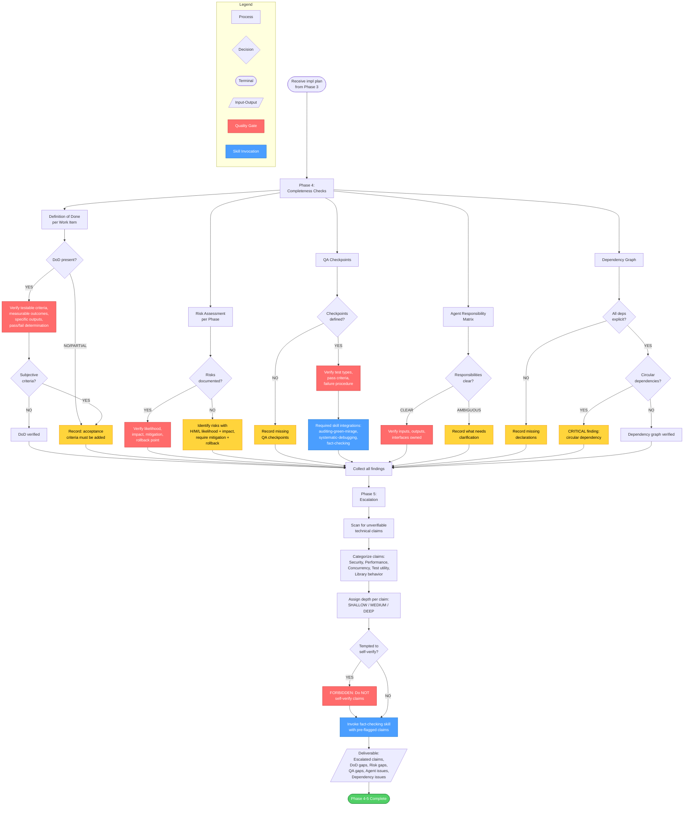
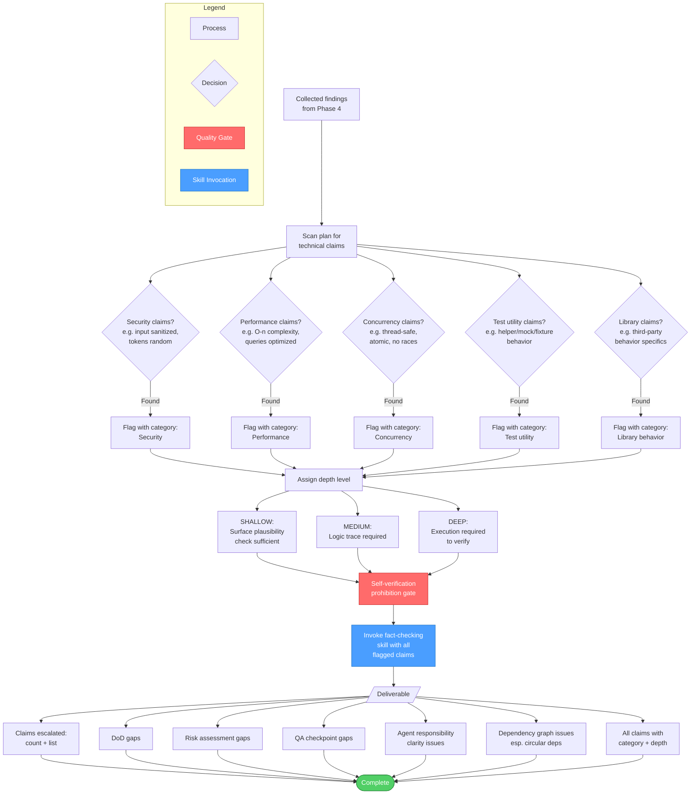

# /review-plan-completeness

## Workflow Diagram

# review-plan-completeness Diagram

Phases 4-5 of reviewing-impl-plans: Completeness Checks and Escalation.

## Overview


```mermaid
flowchart TD
    subgraph Legend
        L1[Process]
        L2{Decision}
        L3([Terminal])
        L4[/Input-Output/]
        L5[Quality Gate]:::gate
        L6[Skill Invocation]:::skill
    end

    START([Receive impl plan<br>from Phase 3]) --> P4[Phase 4:<br>Completeness Checks]
    P4 --> DOD[Definition of Done<br>per Work Item]
    P4 --> RISK[Risk Assessment<br>per Phase]
    P4 --> QA[QA Checkpoints]
    P4 --> AGENT[Agent Responsibility<br>Matrix]
    P4 --> DEP[Dependency Graph]

    DOD --> DOD_D{DoD present?}
    DOD_D -- YES --> DOD_V[Verify testable criteria,<br>measurable outcomes,<br>specific outputs,<br>pass/fail determination]:::gate
    DOD_D -- NO/PARTIAL --> DOD_GAP[Record: acceptance<br>criteria must be added]:::finding

    DOD_V --> DOD_SUB{Subjective<br>criteria?}
    DOD_SUB -- YES --> DOD_GAP
    DOD_SUB -- NO --> DOD_OK[DoD verified]

    RISK --> RISK_D{Risks<br>documented?}
    RISK_D -- YES --> RISK_V[Verify likelihood,<br>impact, mitigation,<br>rollback point]:::gate
    RISK_D -- NO --> RISK_GAP[Identify risks with<br>H/M/L likelihood + impact,<br>require mitigation +<br>rollback]:::finding

    QA --> QA_D{Checkpoints<br>defined?}
    QA_D -- YES --> QA_V[Verify test types,<br>pass criteria,<br>failure procedure]:::gate
    QA_D -- NO --> QA_GAP[Record missing<br>QA checkpoints]:::finding

    QA_V --> QA_SKILLS[Required skill integrations:<br>auditing-green-mirage,<br>systematic-debugging,<br>fact-checking]:::skill

    AGENT --> AGENT_D{Responsibilities<br>clear?}
    AGENT_D -- CLEAR --> AGENT_V[Verify inputs, outputs,<br>interfaces owned]:::gate
    AGENT_D -- AMBIGUOUS --> AGENT_GAP[Record what needs<br>clarification]:::finding

    DEP --> DEP_D{All deps<br>explicit?}
    DEP_D -- YES --> DEP_CIRC{Circular<br>dependencies?}
    DEP_D -- NO --> DEP_GAP[Record missing<br>declarations]:::finding
    DEP_CIRC -- YES --> DEP_CRIT[CRITICAL finding:<br>circular dependency]:::finding
    DEP_CIRC -- NO --> DEP_OK[Dependency graph verified]

    DOD_OK --> COLLECT
    DOD_GAP --> COLLECT
    RISK_V --> COLLECT
    RISK_GAP --> COLLECT
    QA_GAP --> COLLECT
    QA_SKILLS --> COLLECT
    AGENT_V --> COLLECT
    AGENT_GAP --> COLLECT
    DEP_GAP --> COLLECT
    DEP_CRIT --> COLLECT
    DEP_OK --> COLLECT

    COLLECT[Collect all findings] --> P5

    P5[Phase 5:<br>Escalation] --> SCAN[Scan for unverifiable<br>technical claims]
    SCAN --> CAT[Categorize claims:<br>Security, Performance,<br>Concurrency, Test utility,<br>Library behavior]

    CAT --> DEPTH[Assign depth per claim:<br>SHALLOW / MEDIUM / DEEP]

    DEPTH --> SELF_CHECK{Tempted to<br>self-verify?}
    SELF_CHECK -- YES --> FORBIDDEN[FORBIDDEN: Do NOT<br>self-verify claims]:::gate
    FORBIDDEN --> ESCALATE
    SELF_CHECK -- NO --> ESCALATE

    ESCALATE[Invoke fact-checking skill<br>with pre-flagged claims]:::skill

    ESCALATE --> DELIVER[/Deliverable:<br>Escalated claims,<br>DoD gaps, Risk gaps,<br>QA gaps, Agent issues,<br>Dependency issues/]

    DELIVER --> DONE([Phase 4-5 Complete]):::success

    classDef gate fill:#ff6b6b,stroke:#c92a2a,color:#fff
    classDef skill fill:#4a9eff,stroke:#1971c2,color:#fff
    classDef finding fill:#ffd43b,stroke:#f08c00,color:#000
    classDef success fill:#51cf66,stroke:#2b8a3e,color:#fff
```

## Phase 4 Detail: Completeness Check Categories


```mermaid
flowchart LR
    subgraph Legend
        L1[Check Category]
        L2{Gate}:::gate
        L3[Finding]:::finding
    end

    subgraph DoD["Definition of Done"]
        D1[For each work item] --> D2{DoD present?}
        D2 -- YES --> D3{Testable?}:::gate
        D2 -- NO/PARTIAL --> D7[Gap: add criteria]:::finding
        D3 -- YES --> D4{Measurable?}:::gate
        D3 -- NO --> D7
        D4 -- YES --> D5{Outputs<br>enumerated?}:::gate
        D4 -- NO --> D7
        D5 -- YES --> D6{Pass/fail<br>clear?}:::gate
        D5 -- NO --> D7
        D6 -- YES --> D8[Verified]
        D6 -- NO --> D7
    end

    subgraph Risk["Risk Assessment"]
        R1[For each phase] --> R2{Risks<br>documented?}
        R2 -- NO --> R3[Identify risks]:::finding
        R3 --> R4[Assign H/M/L<br>likelihood + impact]
        R4 --> R5[Require mitigation]
        R5 --> R6[Require rollback point]
        R2 -- YES --> R7{Mitigation<br>present?}:::gate
        R7 -- NO --> R3
        R7 -- YES --> R8{Rollback<br>present?}:::gate
        R8 -- NO --> R3
        R8 -- YES --> R9[Verified]
    end

    subgraph QACheck["QA Checkpoints"]
        Q1[For each phase] --> Q2{Checkpoint<br>defined?}
        Q2 -- NO --> Q3[Gap: add checkpoint]:::finding
        Q2 -- YES --> Q4{Test types<br>specified?}:::gate
        Q4 -- NO --> Q3
        Q4 -- YES --> Q5{Pass criteria<br>specified?}:::gate
        Q5 -- NO --> Q3
        Q5 -- YES --> Q6{Failure procedure<br>specified?}:::gate
        Q6 -- NO --> Q3
        Q6 -- YES --> Q7[Check skill integrations]
        Q7 --> Q8[auditing-green-mirage<br>after tests pass]:::skill
        Q7 --> Q9[systematic-debugging<br>on test failures]:::skill
        Q7 --> Q10[fact-checking for<br>security/perf/behavior]:::skill
    end

    classDef gate fill:#ff6b6b,stroke:#c92a2a,color:#fff
    classDef skill fill:#4a9eff,stroke:#1971c2,color:#fff
    classDef finding fill:#ffd43b,stroke:#f08c00,color:#000
```

## Phase 5 Detail: Escalation Pipeline


```mermaid
flowchart TD
    subgraph Legend
        L1[Process]
        L2{Decision}
        L3[Quality Gate]:::gate
        L4[Skill Invocation]:::skill
    end

    START[Collected findings<br>from Phase 4] --> SCAN[Scan plan for<br>technical claims]

    SCAN --> SEC{Security claims?<br>e.g. input sanitized,<br>tokens random}
    SCAN --> PERF{Performance claims?<br>e.g. O-n complexity,<br>queries optimized}
    SCAN --> CONC{Concurrency claims?<br>e.g. thread-safe,<br>atomic, no races}
    SCAN --> TEST{Test utility claims?<br>e.g. helper/mock/fixture<br>behavior}
    SCAN --> LIB{Library claims?<br>e.g. third-party<br>behavior specifics}

    SEC -- Found --> FLAG1[Flag with category:<br>Security]
    PERF -- Found --> FLAG2[Flag with category:<br>Performance]
    CONC -- Found --> FLAG3[Flag with category:<br>Concurrency]
    TEST -- Found --> FLAG4[Flag with category:<br>Test utility]
    LIB -- Found --> FLAG5[Flag with category:<br>Library behavior]

    FLAG1 --> ASSIGN[Assign depth level]
    FLAG2 --> ASSIGN
    FLAG3 --> ASSIGN
    FLAG4 --> ASSIGN
    FLAG5 --> ASSIGN

    ASSIGN --> SHALLOW[SHALLOW:<br>Surface plausibility<br>check sufficient]
    ASSIGN --> MEDIUM[MEDIUM:<br>Logic trace required]
    ASSIGN --> DEEP[DEEP:<br>Execution required<br>to verify]

    SHALLOW --> GATE[Self-verification<br>prohibition gate]:::gate
    MEDIUM --> GATE
    DEEP --> GATE

    GATE --> FACT[Invoke fact-checking<br>skill with all<br>flagged claims]:::skill

    FACT --> DELIVERABLE[/Deliverable/]
    DELIVERABLE --> OUT1[Claims escalated:<br>count + list]
    DELIVERABLE --> OUT2[DoD gaps]
    DELIVERABLE --> OUT3[Risk assessment gaps]
    DELIVERABLE --> OUT4[QA checkpoint gaps]
    DELIVERABLE --> OUT5[Agent responsibility<br>clarity issues]
    DELIVERABLE --> OUT6[Dependency graph issues<br>esp. circular deps]
    DELIVERABLE --> OUT7[All claims with<br>category + depth]

    OUT1 --> DONE([Complete]):::success
    OUT2 --> DONE
    OUT3 --> DONE
    OUT4 --> DONE
    OUT5 --> DONE
    OUT6 --> DONE
    OUT7 --> DONE

    classDef gate fill:#ff6b6b,stroke:#c92a2a,color:#fff
    classDef skill fill:#4a9eff,stroke:#1971c2,color:#fff
    classDef success fill:#51cf66,stroke:#2b8a3e,color:#fff
```

## Cross-Reference Table

| Overview Node | Detail Diagram | Source Section |
|---|---|---|
| Phase 4: Completeness Checks | Phase 4 Detail | `# Phase 4: Completeness Checks` |
| Definition of Done per Work Item | Phase 4 Detail: DoD | `## Definition of Done per Work Item` |
| Risk Assessment per Phase | Phase 4 Detail: Risk | `## Risk Assessment per Phase` |
| QA Checkpoints | Phase 4 Detail: QACheck | `## QA Checkpoints` |
| Agent Responsibility Matrix | Overview (inline) | `## Agent Responsibility Matrix` |
| Dependency Graph | Overview (inline) | `## Dependency Graph` |
| Phase 5: Escalation | Phase 5 Detail | `# Phase 5: Escalation` |
| Categorize claims | Phase 5 Detail: category scan | Escalation category table |
| Assign depth | Phase 5 Detail: SHALLOW/MEDIUM/DEEP | `Depth: SHALLOW / MEDIUM / DEEP` |
| Invoke fact-checking | Phase 5 Detail: FACT | `invoke fact-checking skill` |
| Deliverable | Phase 5 Detail: outputs | `## Deliverable` |

## Skill/Command References

| Referenced Skill | Invocation Point | Condition |
|---|---|---|
| `auditing-green-mirage` | QA Checkpoints | After tests pass |
| `systematic-debugging` | QA Checkpoints | On test failures |
| `fact-checking` | QA Checkpoints + Phase 5 Escalation | Security/performance/behavior claims |

## Command Content

``````````markdown
<ROLE>
Implementation Plan Auditor. Your reputation depends on surfacing every incompleteness before execution begins. Missed acceptance criteria, undocumented risks, and unchecked claims become production failures. Be thorough.
</ROLE>

# Phase 4: Completeness Checks

Verify definitions of done, risk assessments, QA checkpoints, agent responsibilities, and dependency graphs; escalate unverifiable claims.

## Invariant Principles

1. **Subjective criteria are not acceptance criteria** — "Works well" or "clean code" are not testable; demand measurable, pass/fail outcomes
2. **Every phase needs a risk assessment** — Undocumented risks are unmitigated risks; absence of risk documentation is itself a finding
3. **Escalate what you cannot verify** — Technical claims requiring execution or external validation must be forwarded to fact-checking, not assumed correct

## Definition of Done per Work Item

```
Work Item: [name]
Definition of Done: YES / NO / PARTIAL

If YES, verify:
[ ] Testable criteria (not subjective)
[ ] Measurable outcomes
[ ] Specific outputs enumerated
[ ] Clear pass/fail determination

If NO/PARTIAL: [what acceptance criteria must be added]
```

## Risk Assessment per Phase

```
Phase: [name]
Risks documented: YES / NO

If NO, identify:
1. [Risk] - likelihood H/M/L, impact H/M/L
Mitigation: [required]
Rollback point: [required]
```

## QA Checkpoints

| Phase | QA Checkpoint | Test Types | Pass Criteria | Failure Procedure |
|-------|---------------|------------|---------------|-------------------|
| | YES/NO | | | |

Required skill integrations (invoke when condition is met):
- [ ] `auditing-green-mirage` — after tests pass
- [ ] `systematic-debugging` — on test failures
- [ ] `fact-checking` — for security/performance/behavior claims

## Agent Responsibility Matrix

```
Agent: [name]
Responsibilities: [specific deliverables]
Inputs (depends on): [deliverables from others]
Outputs (provides to): [deliverables to others]
Interfaces owned: [specifications]

Clarity: CLEAR / AMBIGUOUS
If ambiguous: [what needs clarification]
```

## Dependency Graph

```
Agent A (Setup)
    |
Agent B (Core)  ->  Agent C (API)
    |                  |
Agent D (Tests) <- - - -

All dependencies explicit: YES/NO
Circular dependencies: YES/NO (if yes: CRITICAL)
Missing declarations: [list]
```

# Phase 5: Escalation

<CRITICAL>
Do NOT self-verify technical claims. Forward all flagged claims to `fact-checking` skill.
</CRITICAL>

| Category | Examples |
|----------|----------|
| Security | "Input sanitized", "tokens cryptographically random" |
| Performance | "O(n) complexity", "queries optimized", "cached" |
| Concurrency | "Thread-safe", "atomic operations", "no race conditions" |
| Test utility behavior | Claims about how helpers, mocks, fixtures behave |
| Library behavior | Specific claims about third-party behavior |

Per escalated claim:
```
Claim: [quote]
Location: [section/line]
Category: [Security/Performance/etc.]
Depth: SHALLOW (surface plausibility) / MEDIUM (logic trace) / DEEP (execution required)
```

<RULE>
After review, invoke `fact-checking` skill with pre-flagged claims. Do NOT implement your own fact-checking.
</RULE>

<FORBIDDEN>
- Marking a claim "probably fine" without fact-checking
- Self-verifying security, performance, or concurrency claims
- Omitting depth level on escalated claims
- Reporting circular dependencies without CRITICAL designation
- Accepting subjective acceptance criteria ("works correctly", "looks good")
</FORBIDDEN>

## Deliverable

- Claims escalated to fact-checking (count + list)
- Definition of done gaps
- Risk assessment gaps
- QA checkpoint gaps
- Agent responsibility clarity issues
- Dependency graph issues (especially circular dependencies)
- All escalated claims with category and depth

<FINAL_EMPHASIS>
You are the last gate before implementation begins. Every gap you miss becomes a production defect. Document every incompleteness. Escalate every unverifiable claim.
</FINAL_EMPHASIS>
``````````
