# /review-plan-contracts

## Workflow Diagram

# Diagram: review-plan-contracts

Phase 2 of reviewing-impl-plans: audits every interface contract between parallel work tracks, verifying request/response/error formats, shared type schemas, event/message contracts, and file/resource access patterns for completeness.

```mermaid
flowchart TD
    Start([Start Phase 2]) --> ListIf[List All Interfaces]

    ListIf --> PickIf[Pick Next Interface]
    PickIf --> CheckContract[Check Contract Location]

    CheckContract --> HasReq{Request Format?}
    HasReq -->|Specified| HasResp{Response Format?}
    HasReq -->|Missing| FlagReq[Flag CRITICAL: Missing Req]

    FlagReq --> HasResp
    HasResp -->|Specified| HasErr{Error Format?}
    HasResp -->|Missing| FlagResp[Flag CRITICAL: Missing Resp]

    FlagResp --> HasErr
    HasErr -->|Specified| HasProto{Protocol Specified?}
    HasErr -->|Missing| FlagErr[Flag CRITICAL: Missing Err]

    FlagErr --> HasProto
    HasProto -->|Specified| IfOK[Interface Fully Specified]
    HasProto -->|Missing| FlagProto[Flag CRITICAL: Missing Proto]

    FlagProto --> IfOK
    IfOK --> MoreIf{More Interfaces?}

    MoreIf -->|Yes| PickIf
    MoreIf -->|No| TypeAudit[Type/Schema Audit]

    TypeAudit --> PickType[Pick Shared Type]
    PickType --> SingleSrc{Single Source of Truth?}

    SingleSrc -->|Yes| CheckFields[Check Field Completeness]
    SingleSrc -->|No| FlagDup[Flag Duplicate Definitions]

    CheckFields --> FieldsOK{All Fields Specified?}
    FieldsOK -->|Yes| MoreType{More Types?}
    FieldsOK -->|No| FlagFields[Flag Incomplete Schema]

    FlagDup --> MoreType
    FlagFields --> MoreType

    MoreType -->|Yes| PickType
    MoreType -->|No| EventAudit[Event/Message Audit]

    EventAudit --> CheckEvents[Check Schema/Ordering/Delivery]
    CheckEvents --> FileAudit[File/Resource Audit]

    FileAudit --> CheckConflict{Writer/Reader Conflict?}
    CheckConflict -->|Yes| FlagConflict[Flag CRITICAL: Conflict]
    CheckConflict -->|No| GateAll{All Contracts Audited?}

    FlagConflict --> GateAll
    GateAll -->|Yes| Deliver[Deliver Contract Audit]
    GateAll -->|No| PickIf

    Deliver --> Done([Phase 2 Complete])

    style Start fill:#2196F3,color:#fff
    style Done fill:#2196F3,color:#fff
    style ListIf fill:#2196F3,color:#fff
    style PickIf fill:#2196F3,color:#fff
    style CheckContract fill:#2196F3,color:#fff
    style FlagReq fill:#f44336,color:#fff
    style FlagResp fill:#f44336,color:#fff
    style FlagErr fill:#f44336,color:#fff
    style FlagProto fill:#f44336,color:#fff
    style IfOK fill:#2196F3,color:#fff
    style TypeAudit fill:#2196F3,color:#fff
    style PickType fill:#2196F3,color:#fff
    style CheckFields fill:#2196F3,color:#fff
    style FlagDup fill:#2196F3,color:#fff
    style FlagFields fill:#2196F3,color:#fff
    style EventAudit fill:#2196F3,color:#fff
    style CheckEvents fill:#2196F3,color:#fff
    style FileAudit fill:#2196F3,color:#fff
    style FlagConflict fill:#f44336,color:#fff
    style Deliver fill:#2196F3,color:#fff
    style HasReq fill:#FF9800,color:#fff
    style HasResp fill:#FF9800,color:#fff
    style HasErr fill:#FF9800,color:#fff
    style HasProto fill:#FF9800,color:#fff
    style MoreIf fill:#FF9800,color:#fff
    style SingleSrc fill:#FF9800,color:#fff
    style FieldsOK fill:#FF9800,color:#fff
    style MoreType fill:#FF9800,color:#fff
    style CheckConflict fill:#FF9800,color:#fff
    style GateAll fill:#f44336,color:#fff
```



## Legend

| Color | Meaning |
|-------|---------|
| Green (#4CAF50) | Skill invocation |
| Blue (#2196F3) | Command/action |
| Orange (#FF9800) | Decision point |
| Red (#f44336) | Quality gate |

## Command Content

``````````markdown
# Phase 2: Interface Contract Audit

You are executing Phase 2 of the implementation plan review. This is the most critical phase.

## Invariant Principles

1. **Missing contract fields are critical defects** - Any interface without fully specified request, response, and error formats will produce incompatible code
2. **Shared types must have single source of truth** - Type definitions used across parallel tracks must be defined in one location, not duplicated
3. **Ambiguity is worse than absence** - A vaguely specified contract misleads more than a missing one; flag both but prioritize vagueness

<CRITICAL>
This is the most important phase. Parallel work FAILS when agents hallucinate incompatible interfaces.
</CRITICAL>

For EACH interface between parallel work:

```
Interface: [Component A] <-> [Component B]
Developed by: [Agent/Track A] and [Agent/Track B]

Contract location: [section/line or MISSING]
Request format: SPECIFIED / MISSING
Response format: SPECIFIED / MISSING
Error format: SPECIFIED / MISSING
Protocol (method/endpoint/auth): SPECIFIED / MISSING

If ANY missing: Flag as CRITICAL. Agents will produce incompatible code.
Required addition: [exact specification needed]
```

## Type/Schema Contracts

For each shared type or schema:

```
Type: [name]
Used by: [list components]
Defined where: [location or MISSING]

| Field | Type | Required | Default | Validation | Specified |
|-------|------|----------|---------|------------|-----------|
| | | | | | Y/N |

If incomplete: [what must be added]
```

## Event/Message Contracts

For each event or message between components:

```
Event: [name]
Publisher: [component]
Subscribers: [components]
Schema: SPECIFIED / MISSING
Ordering guarantees: SPECIFIED / MISSING
Delivery guarantees: SPECIFIED / MISSING
```

## File/Resource Contracts

For each shared file, directory, or resource:

```
Resource: [path or pattern]
Writers: [list components that write]
Readers: [list components that read]
Format: SPECIFIED / MISSING
Locking: NONE / ADVISORY / EXCLUSIVE / N/A
Merge strategy: OVERWRITE / APPEND / MERGE / N/A
Conflict resolution: SPECIFIED / MISSING

If ANY writer/reader conflict possible: Flag as CRITICAL.
Required addition: [exact specification needed]
```

## Deliverable

Populate the following sections of the review report:
- Interfaces: A total, B fully specified, C MISSING
- All CRITICAL findings for missing/incomplete contracts
- Specific remediation for each gap (exact specification needed)

Return your completed contract audit as structured output for the orchestrator.
``````````
