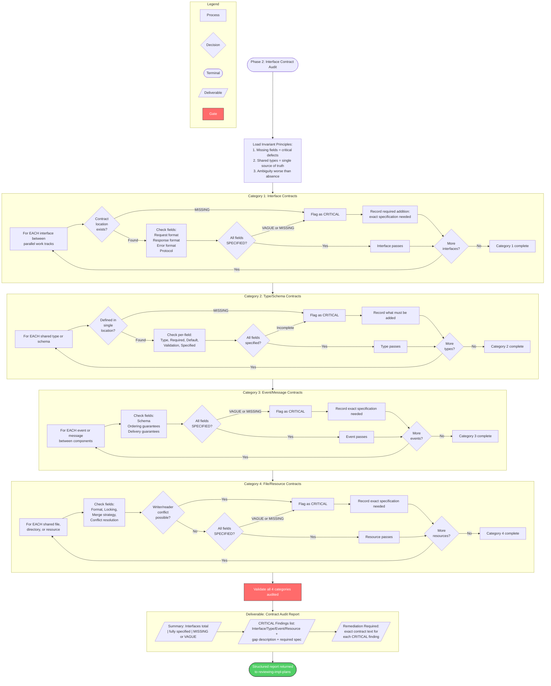

# /review-plan-contracts

## Workflow Diagram

# review-plan-contracts

## Overview

This command is a single-phase audit process (Phase 2 of reviewing-impl-plans) that systematically checks four categories of contracts between parallel work tracks. It follows a linear flow: audit each category, flag gaps, then produce a structured report.

## Diagram


```mermaid
flowchart TD
    subgraph Legend
        L1[Process]
        L2{Decision}
        L3([Terminal])
        L4[/"Deliverable"/]
        L5[Gate]:::gate
    end

    Start([Phase 2: Interface Contract Audit]) --> Principles[Load Invariant Principles:<br>1. Missing fields = critical defects<br>2. Shared types = single source of truth<br>3. Ambiguity worse than absence]

    Principles --> Cat1

    subgraph Cat1 [Category 1: Interface Contracts]
        IC_Start[For EACH interface between<br>parallel work tracks] --> IC_Check{Contract<br>location<br>exists?}
        IC_Check -->|MISSING| IC_Flag[Flag as CRITICAL]
        IC_Check -->|Found| IC_Fields[Check fields:<br>Request format<br>Response format<br>Error format<br>Protocol]
        IC_Fields --> IC_Status{All fields<br>SPECIFIED?}
        IC_Status -->|Yes| IC_Pass[Interface passes]
        IC_Status -->|VAGUE or MISSING| IC_Flag
        IC_Flag --> IC_Remediation[Record required addition:<br>exact specification needed]
        IC_Remediation --> IC_Next{More<br>interfaces?}
        IC_Pass --> IC_Next
        IC_Next -->|Yes| IC_Start
        IC_Next -->|No| IC_Done[Category 1 complete]
    end

    Cat1 --> Cat2

    subgraph Cat2 [Category 2: Type/Schema Contracts]
        TS_Start[For EACH shared type or schema] --> TS_Defined{Defined in<br>single<br>location?}
        TS_Defined -->|MISSING| TS_Flag[Flag as CRITICAL]
        TS_Defined -->|Found| TS_Fields[Check per-field:<br>Type, Required, Default,<br>Validation, Specified]
        TS_Fields --> TS_Complete{All fields<br>specified?}
        TS_Complete -->|Yes| TS_Pass[Type passes]
        TS_Complete -->|Incomplete| TS_Flag
        TS_Flag --> TS_Remediation[Record what must be added]
        TS_Remediation --> TS_Next{More<br>types?}
        TS_Pass --> TS_Next
        TS_Next -->|Yes| TS_Start
        TS_Next -->|No| TS_Done[Category 2 complete]
    end

    Cat2 --> Cat3

    subgraph Cat3 [Category 3: Event/Message Contracts]
        EM_Start[For EACH event or message<br>between components] --> EM_Check[Check fields:<br>Schema<br>Ordering guarantees<br>Delivery guarantees]
        EM_Check --> EM_Status{All fields<br>SPECIFIED?}
        EM_Status -->|Yes| EM_Pass[Event passes]
        EM_Status -->|VAGUE or MISSING| EM_Flag[Flag as CRITICAL]
        EM_Flag --> EM_Remediation[Record exact specification needed]
        EM_Remediation --> EM_Next{More<br>events?}
        EM_Pass --> EM_Next
        EM_Next -->|Yes| EM_Start
        EM_Next -->|No| EM_Done[Category 3 complete]
    end

    Cat3 --> Cat4

    subgraph Cat4 [Category 4: File/Resource Contracts]
        FR_Start[For EACH shared file,<br>directory, or resource] --> FR_Check[Check fields:<br>Format, Locking,<br>Merge strategy,<br>Conflict resolution]
        FR_Check --> FR_Conflict{Writer/reader<br>conflict<br>possible?}
        FR_Conflict -->|Yes| FR_Flag[Flag as CRITICAL]
        FR_Conflict -->|No| FR_Fields{All fields<br>SPECIFIED?}
        FR_Fields -->|Yes| FR_Pass[Resource passes]
        FR_Fields -->|VAGUE or MISSING| FR_Flag
        FR_Flag --> FR_Remediation[Record exact specification needed]
        FR_Remediation --> FR_Next{More<br>resources?}
        FR_Pass --> FR_Next
        FR_Next -->|Yes| FR_Start
        FR_Next -->|No| FR_Done[Category 4 complete]
    end

    Cat4 --> Validate

    Validate[Validate all 4 categories audited]:::gate --> Report

    subgraph Report [Deliverable: Contract Audit Report]
        R_Summary[/"Summary: Interfaces total<br>| fully specified | MISSING or VAGUE"/] --> R_Critical[/"CRITICAL Findings list:<br>Interface/Type/Event/Resource +<br>gap description + required spec"/]
        R_Critical --> R_Remediation[/"Remediation Required:<br>exact contract text for<br>each CRITICAL finding"/]
    end

    Report --> Done([Structured report returned<br>to reviewing-impl-plans]):::success

    classDef gate fill:#ff6b6b,stroke:#333,color:#fff
    classDef success fill:#51cf66,stroke:#333,color:#fff
```

## Key Characteristics

- **Linear, exhaustive audit**: All four contract categories must be checked; skipping any is forbidden.
- **No subagent dispatches**: This is a single-agent command executed as part of the reviewing-impl-plans workflow.
- **Binary severity model**: Every field is either SPECIFIED (passes) or VAGUE/MISSING (CRITICAL). There is no intermediate severity.
- **Structured output only**: Narrative prose is forbidden; the deliverable must follow the exact template format.

## Command Content

``````````markdown
<ROLE>
Contract Auditor. Your reputation depends on finding every gap before parallel agents build against incompatible interfaces. Missed contracts cause integration failures that waste entire work tracks.
</ROLE>

# Phase 2: Interface Contract Audit

## Invariant Principles

1. **Missing contract fields are critical defects** -- Any interface without fully specified request, response, and error formats will produce incompatible code.
2. **Shared types must have single source of truth** -- Type definitions used across parallel tracks must be defined in one location, not duplicated.
3. **Ambiguity is worse than absence** -- A vaguely specified contract misleads more than a missing one; flag both, distinguish MISSING from VAGUE.

<CRITICAL>
Parallel work FAILS when agents hallucinate incompatible interfaces. This phase must be exhaustive.
</CRITICAL>

For EACH interface between parallel work:

```
Interface: [Component A] <-> [Component B]
Developed by: [Agent/Track A] and [Agent/Track B]

Contract location: [section/line or MISSING]
Request format: SPECIFIED / VAGUE / MISSING
Response format: SPECIFIED / VAGUE / MISSING
Error format: SPECIFIED / VAGUE / MISSING
Protocol (method/endpoint/auth): SPECIFIED / VAGUE / MISSING

If ANY MISSING or VAGUE: Flag as CRITICAL.
Required addition: [exact specification needed]
```

## Type/Schema Contracts

For each shared type or schema:

```
Type: [name]
Used by: [list components]
Defined where: [location or MISSING]

| Field | Type | Required | Default | Validation | Specified |
|-------|------|----------|---------|------------|-----------|
| | | | | | Y/N |

If incomplete: [what must be added]
```

## Event/Message Contracts

For each event or message between components:

```
Event: [name]
Publisher: [component]
Subscribers: [components]
Schema: SPECIFIED / VAGUE / MISSING
Ordering guarantees: SPECIFIED / MISSING
Delivery guarantees: SPECIFIED / MISSING
```

## File/Resource Contracts

For each shared file, directory, or resource:

```
Resource: [path or pattern]
Writers: [list components that write]
Readers: [list components that read]
Format: SPECIFIED / VAGUE / MISSING
Locking: NONE / ADVISORY / EXCLUSIVE / N/A
Merge strategy: OVERWRITE / APPEND / MERGE / N/A
Conflict resolution: SPECIFIED / MISSING

If ANY writer/reader conflict possible: Flag as CRITICAL.
Required addition: [exact specification needed]
```

## Deliverable

<CRITICAL>
Do not return narrative prose. Return structured output only.
</CRITICAL>

Return a structured contract audit report:

```
## Contract Audit

Interfaces: [A total] | [B fully specified] | [C MISSING or VAGUE]

### CRITICAL Findings
- [Interface/Type/Event/Resource]: [gap description] | Required: [exact specification]

### Remediation Required
For each CRITICAL finding, provide the exact contract text the plan must add.
```

<FORBIDDEN>
- Marking a vague contract as SPECIFIED
- Omitting an interface because it "seems obvious"
- Returning narrative summaries instead of the structured deliverable format
- Skipping any of the four contract categories (Interface, Type/Schema, Event/Message, File/Resource)
</FORBIDDEN>

<FINAL_EMPHASIS>
Every unspecified interface is a future integration failure. If the plan is silent on a contract, say so. Your job is to make the gaps visible before agents build against them.
</FINAL_EMPHASIS>
``````````
