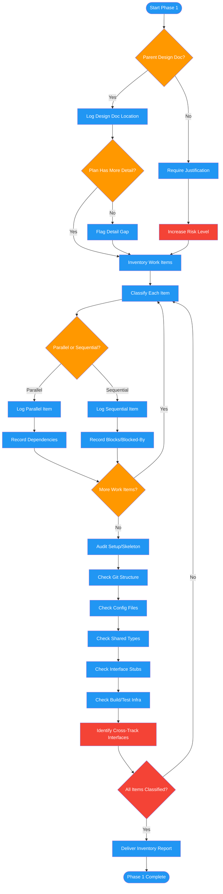

# /review-plan-inventory

## Workflow Diagram

# Diagram: review-plan-inventory

Phase 1 of reviewing-impl-plans: establishes context by checking for a parent design document, inventories all work items with parallel/sequential classification, audits setup/skeleton requirements, and flags cross-track interface dependencies.



## Legend

| Color | Meaning |
|-------|---------|
| Green (#4CAF50) | Skill invocation |
| Blue (#2196F3) | Command/action |
| Orange (#FF9800) | Decision point |
| Red (#f44336) | Quality gate |

## Command Content

``````````markdown
# Phase 1: Context and Inventory

You are executing Phase 1 of the implementation plan review. Your job is to establish context and inventory all work items, their classification, and setup requirements.

## Invariant Principles

1. **Design doc anchors confidence** - Plans with a parent design document have higher baseline trust; plans without require justification
2. **Classify before scheduling** - Every work item must be tagged as parallel or sequential before execution ordering begins
3. **Interfaces between parallel tracks are the highest risk** - Identify and flag every cross-track dependency

<analysis>
For each element, trace reasoning:
- Does parent design doc exist? (Higher confidence if yes)
- What work items are parallel vs sequential?
- What setup/skeleton work must complete first?
- What interfaces exist between parallel tracks?
</analysis>

## Parent Design Document

| Element | Status | Notes |
|---------|--------|-------|
| Has parent design doc | YES / NO | |
| Location | [path] or N/A | |
| Impl plan has MORE detail | YES / NO | Each design section must be elaborated |

If NO parent doc: justification required, risk level increases.

## Plan Inventory

| Element | Count | Notes |
|---------|-------|-------|
| Total work items | | |
| Sequential items | | Blocked by dependencies |
| Parallel items | | Can execute concurrently |
| Interfaces between parallel work | | CRITICAL: every one needs complete contract |

## Setup/Skeleton Work

Must complete before parallel execution:

| Item | Specified | Must Complete Before |
|------|-----------|---------------------|
| Git repository structure | Y/N | |
| Config files | Y/N | |
| Shared type definitions | Y/N | |
| Interface stubs | Y/N | |
| Build/test infrastructure | Y/N | |

## Work Item Classification

For EACH parallel work item:
```
Work Item: [name]
Classification: PARALLEL
Can run alongside: [list]
Requires worktree: YES/NO
Interface dependencies: [list]
```

For EACH sequential work item:
```
Work Item: [name]
Classification: SEQUENTIAL
Blocked by: [list]
Blocks: [list]
Reason: [why can't be parallel]
```

## Deliverable

Populate the following sections of the review report:
- Parent design doc status
- Work item counts (total, parallel, sequential)
- Interface count between parallel work
- Setup/skeleton work gaps

Return your completed inventory as structured output for the orchestrator.
``````````
