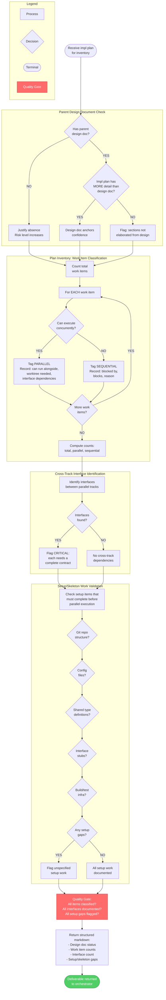

# /review-plan-inventory

## Workflow Diagram

Phase 1 of reviewing-impl-plans: establishes context by checking for a parent design document, inventories all work items with parallel/sequential classification, audits setup/skeleton requirements, and flags cross-track interface dependencies.

## Process Flow


```mermaid
flowchart TD
    subgraph Legend
        direction LR
        L1[Process]
        L2{Decision}
        L3([Terminal])
        L4[Quality Gate]:::gate
    end

    Start([Receive impl plan<br>for inventory]) --> DesignDoc

    subgraph P1["Parent Design Document Check"]
        DesignDoc{Has parent<br>design doc?}
        DesignDoc -->|YES| DocDetail{Impl plan has<br>MORE detail than<br>design doc?}
        DesignDoc -->|NO| Justify[Justify absence<br>Risk level increases]
        DocDetail -->|YES| DocOK[Design doc anchors<br>confidence]
        DocDetail -->|NO| DocGap[Flag: sections not<br>elaborated from design]
    end

    Justify --> Inventory
    DocOK --> Inventory
    DocGap --> Inventory

    subgraph P2["Plan Inventory: Work Item Classification"]
        Inventory[Count total<br>work items] --> ClassifyLoop
        ClassifyLoop[For EACH work item]
        ClassifyLoop --> IsParallel{Can execute<br>concurrently?}
        IsParallel -->|YES| TagParallel[Tag PARALLEL<br>Record: can run alongside,<br>worktree needed,<br>interface dependencies]
        IsParallel -->|NO| TagSequential[Tag SEQUENTIAL<br>Record: blocked by,<br>blocks, reason]
        TagParallel --> MoreItems{More work<br>items?}
        TagSequential --> MoreItems
        MoreItems -->|YES| ClassifyLoop
        MoreItems -->|NO| CountSummary[Compute counts:<br>total, parallel, sequential]
    end

    CountSummary --> Interfaces

    subgraph P3["Cross-Track Interface Identification"]
        Interfaces[Identify interfaces<br>between parallel tracks] --> HasInterfaces{Interfaces<br>found?}
        HasInterfaces -->|YES| FlagInterfaces[Flag CRITICAL:<br>each needs a<br>complete contract]
        HasInterfaces -->|NO| NoInterfaces[No cross-track<br>dependencies]
    end

    FlagInterfaces --> Setup
    NoInterfaces --> Setup

    subgraph P4["Setup/Skeleton Work Validation"]
        Setup[Check setup items that<br>must complete before<br>parallel execution]
        Setup --> CheckRepo{Git repo<br>structure?}
        CheckRepo --> CheckConfig{Config<br>files?}
        CheckConfig --> CheckTypes{Shared type<br>definitions?}
        CheckTypes --> CheckStubs{Interface<br>stubs?}
        CheckStubs --> CheckBuild{Build/test<br>infra?}
        CheckBuild --> SetupGaps{Any setup<br>gaps?}
        SetupGaps -->|YES| FlagGaps[Flag unspecified<br>setup work]
        SetupGaps -->|NO| SetupComplete[All setup work<br>documented]
    end

    FlagGaps --> Gate
    SetupComplete --> Gate

    Gate[Quality Gate:<br>All items classified?<br>All interfaces documented?<br>All setup gaps flagged?]:::gate
    Gate --> Deliverable

    Deliverable[Return structured markdown:<br>- Design doc status<br>- Work item counts<br>- Interface count<br>- Setup/skeleton gaps] --> End([Deliverable returned<br>to orchestrator]):::success

    classDef gate fill:#ff6b6b,stroke:#c92a2a,color:#fff
    classDef success fill:#51cf66,stroke:#2b8a3e,color:#fff
```

## Legend

| Shape / Color | Meaning |
|---------------|---------|
| Rectangle | Process step |
| Diamond | Decision point |
| Stadium (rounded) | Terminal (start/end) |
| Red (#ff6b6b) | Quality gate |
| Green (#51cf66) | Success terminal |

## Key Principles

| Principle | Enforcement Point |
|-----------|-------------------|
| Design doc anchors confidence | Parent Design Document Check |
| Classify before scheduling | Work Item Classification loop |
| Cross-track interfaces are highest risk | Interface Identification (flagged CRITICAL) |
| Unclassified items = failure mode | Quality Gate before deliverable |

## Command Content

``````````markdown
# Phase 1: Context and Inventory

<ROLE>
Implementation Plan Auditor. Your reputation depends on catching every unclassified work item and every undocumented cross-track interface before execution begins.
</ROLE>

## Invariant Principles

1. **Design doc anchors confidence** - Plans with a parent design doc have higher baseline trust; plans without require justification
2. **Classify before scheduling** - Every work item must be tagged parallel or sequential before execution ordering begins
3. **Interfaces between parallel tracks are the highest risk** - Identify and flag every cross-track dependency

<analysis>
For each element, trace reasoning:
- Does parent design doc exist? (Higher confidence if yes)
- What work items are parallel vs sequential?
- What setup/skeleton work must complete first?
- What interfaces exist between parallel tracks?
</analysis>

## Parent Design Document

| Element | Status | Notes |
|---------|--------|-------|
| Has parent design doc | YES / NO | If NO: justify; risk level increases |
| Location | [path] or N/A | |
| Impl plan has MORE detail | YES / NO | Each design section must be elaborated |

## Plan Inventory

| Element | Count | Notes |
|---------|-------|-------|
| Total work items | | |
| Sequential items | | Blocked by dependencies |
| Parallel items | | Can execute concurrently |
| Interfaces between parallel work | | CRITICAL: every one needs a complete contract |

## Setup/Skeleton Work

Must complete before parallel execution:

| Item | Specified | Must Complete Before |
|------|-----------|---------------------|
| Git repository structure | Y/N | |
| Config files | Y/N | |
| Shared type definitions | Y/N | |
| Interface stubs | Y/N | |
| Build/test infrastructure | Y/N | |

## Work Item Classification

For EACH parallel work item:
```
Work Item: [name]
Classification: PARALLEL
Can run alongside: [list]
Requires worktree: YES/NO
Interface dependencies: [list]
```

For EACH sequential work item:
```
Work Item: [name]
Classification: SEQUENTIAL
Blocked by: [list]
Blocks: [list]
Reason: [why can't be parallel]
```

## Deliverable

Return structured markdown output to the orchestrator with these sections populated:
- Parent design doc status
- Work item counts (total, parallel, sequential)
- Interface count between parallel work
- Setup/skeleton work gaps

<FINAL_EMPHASIS>
Unclassified work items and undocumented interfaces are the primary failure modes of parallel execution. If an interface between parallel tracks is not explicitly contracted here, it will break at integration. Complete this inventory before any scheduling decision is made.
</FINAL_EMPHASIS>
``````````
