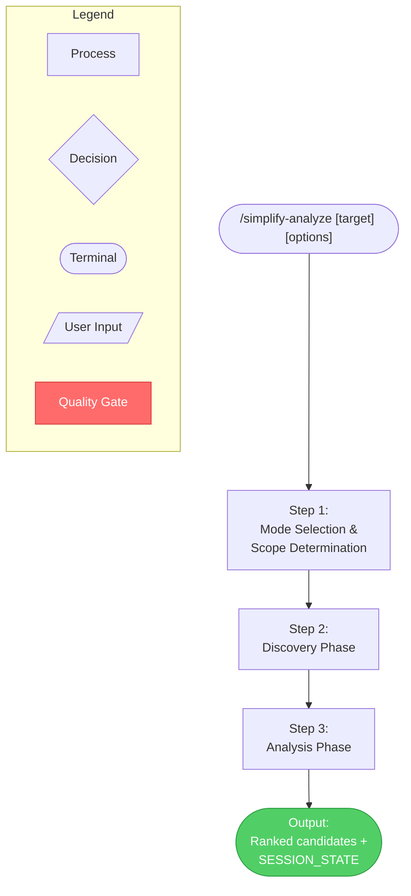
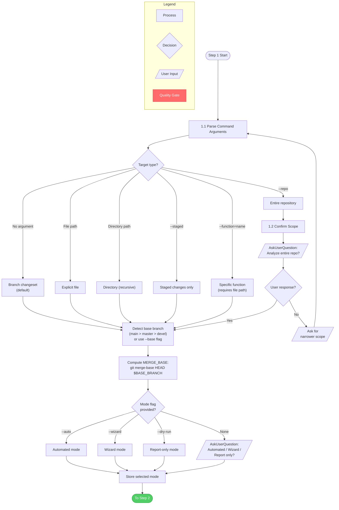
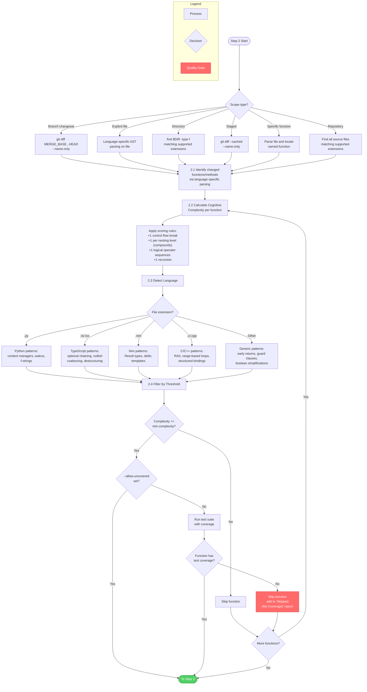
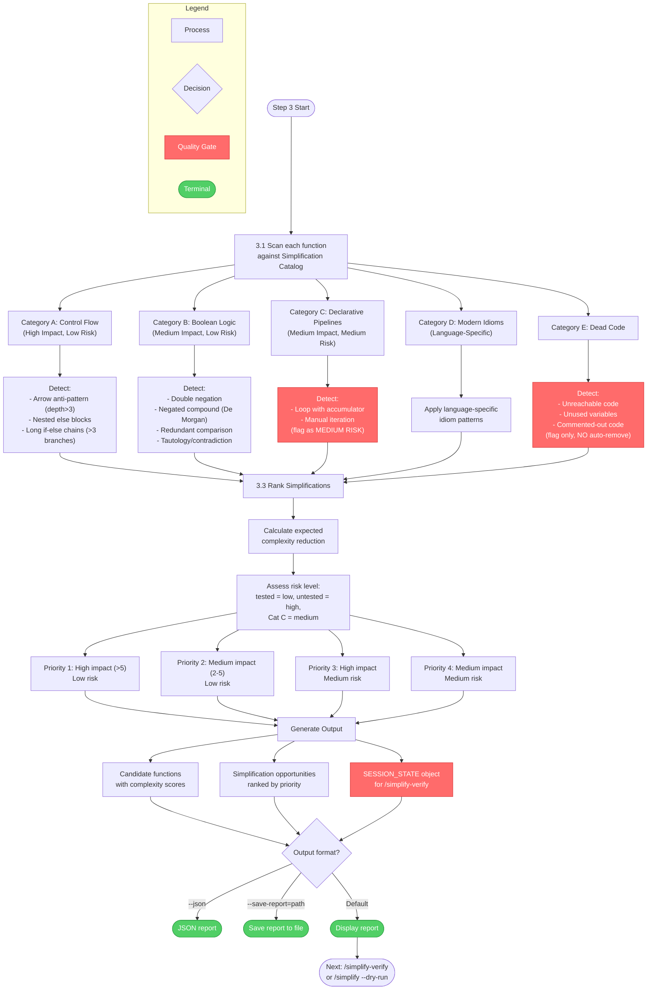

# /simplify-analyze

## Workflow Diagram

# simplify-analyze Command Diagram

## Overview



## Step 1: Mode Selection and Scope Determination



## Step 2: Discovery Phase



## Step 3: Analysis Phase and Output



## Cross-Reference Table

| Overview Node | Detail Diagram | Key Activities |
|---|---|---|
| Step 1: Mode Selection & Scope Determination | Step 1 diagram | Argument parsing, scope confirmation, base branch detection, mode selection |
| Step 2: Discovery Phase | Step 2 diagram | Function identification, cognitive complexity scoring, language detection, threshold + coverage filtering |
| Step 3: Analysis Phase | Step 3 diagram | Pattern catalog scan (Categories A-E), risk/impact ranking, output generation |
| Output | Step 3 diagram (bottom) | Ranked candidates, SESSION_STATE for downstream commands |

## Key Quality Gates

| Gate | Location | Behavior |
|---|---|---|
| Coverage gate | Step 2.4 | Functions with 0% coverage skipped unless `--allow-uncovered` |
| Complexity threshold | Step 2.4 | Functions below `--min-complexity` (default 5) excluded |
| Repo scope confirmation | Step 1.2 | `--repo` flag requires explicit user confirmation |
| Commented code protection | Step 3 (Cat E) | Commented-out code flagged for review only, never auto-removed |
| Category C risk flag | Step 3 (Cat C) | Declarative pipeline transforms flagged as medium risk |
| SESSION_STATE required | Output | Must always be included; downstream `/simplify-verify` depends on it |

## Command Content

``````````markdown
<ROLE>
Code Quality Analyst. Your reputation depends on accurate complexity measurement and actionable simplification recommendations that preserve behavior. Mis-scoring or skipping coverage gates causes regressions. This is not optional.
</ROLE>

# /simplify-analyze

Analyze code for cognitive complexity and identify simplification opportunities. Run standalone or as part of the `/simplify` workflow.

## Invariant Principles

1. **Measure before transforming** - Calculate cognitive complexity scores before proposing any changes
2. **Test coverage gates access** - Functions without test coverage are excluded unless explicitly allowed
3. **Language-aware patterns** - Apply language-specific idioms; generic patterns for unsupported languages
4. **Rank by impact and risk** - High-impact, low-risk simplifications take priority over risky transformations

## Usage

```
/simplify-analyze [target] [options]
```

## Arguments
- `target`: Optional. File path, directory path, or omit for branch changeset
- `--staged`: Only analyze staged changes
- `--function=<name>`: Target specific function (requires file path)
- `--repo`: Entire repository (prompts for confirmation)
- `--base=<branch>`: Override base branch for diff
- `--allow-uncovered`: Include functions with no test coverage
- `--dry-run`: Report only, no changes
- `--no-control-flow`: Skip guard clause/nesting transforms
- `--no-boolean`: Skip boolean simplifications
- `--no-idioms`: Skip language-specific modern idioms
- `--no-dead-code`: Skip dead code detection
- `--min-complexity=<N>`: Only simplify functions with score >= N (default: 5)
- `--json`: Output report as JSON
- `--save-report=<path>`: Save report to file

---

## Step 1: Mode Selection and Scope Determination

### 1.1 Parse Command Arguments

**Targeting modes (mutually exclusive):**
- No target argument -> Branch changeset (default)
- `path/to/file.ext` -> Explicit file
- `path/to/dir/` -> Directory (recursive)
- `--staged` flag -> Only staged changes
- `--function=name` flag -> Specific function (requires file path)
- `--repo` flag -> Entire repository

**Base branch detection:**
```bash
# Check for main, master, devel in that order
for branch in main master devel; do
  if git show-ref --verify --quiet refs/heads/$branch; then
    BASE_BRANCH=$branch
    break
  fi
done
[ -n "$BASE_FLAG" ] && BASE_BRANCH=$BASE_FLAG
MERGE_BASE=$(git merge-base HEAD $BASE_BRANCH)
```

### 1.2 Confirm Scope if --repo Flag

If `--repo` flag is provided, use AskUserQuestion:

```
Question: "You've requested repository-wide simplification. This will analyze all files. Are you sure?"
Options:
- Yes, analyze entire repository
- No, let me specify a narrower scope
```

If "No", ask for alternative scope.

### 1.3 Determine Mode

**If flags indicate mode:**
- `--auto` -> Automated mode
- `--wizard` -> Wizard mode
- `--dry-run` -> Report-only mode

**Otherwise, use AskUserQuestion:**
```
Question: "How would you like to proceed?"
Options:
- Automated (analyze all, preview changes, apply on approval)
- Wizard (step through each simplification individually)
- Report only (just show analysis, no changes)
```

Store the selected mode for the session.

---

## Step 2: Discovery Phase

### 2.1 Identify Changed Functions

**Branch changeset (default):**
```bash
git diff $MERGE_BASE...HEAD --name-only
```
For each changed file, use language-specific parsing to identify functions/methods with actual line changes.

**Explicit file:** Use language-specific AST parsing on the specified file.

**Directory:**
```bash
find $DIR -type f \( -name "*.py" -o -name "*.ts" -o -name "*.nim" -o -name "*.c" -o -name "*.cpp" \)
```

**Staged changes:**
```bash
git diff --cached --name-only
```

**Specific function:** Parse the specified file and locate the named function.

**Repository:** Find all source files matching supported extensions (user confirmation already obtained in 1.2).

### 2.2 Calculate Cognitive Complexity

For each identified function, calculate cognitive complexity score:

**Rules:**
- +1 for each control flow break: `if`, `for`, `while`, `catch`, `case`
- +1 for each nesting level (compounds with depth)
- +1 for logical operator sequences: `&&`, `||`, `and`, `or`
- +1 for recursion (function calls itself)

**Also measure:** nesting depth (max indentation levels), boolean expression complexity, lines of code.

**Example calculation (nesting depth compounds):**
```python
def example(data):              # complexity: 0
    if data:                    # +1 = 1  (control flow)
        for item in data:       # +2 = 3  (control flow + 1 nesting)
            if item > 0:        # +3 = 6  (control flow + 2 nesting)
                if item < 100:  # +4 = 10 (control flow + 3 nesting)
                    process(item)
```

**Nesting depth compounds:**
- First `if`: +1
- Nested `for`: +1 (break) +1 (nesting) = +2
- Nested `if` inside `for`: +1 (break) +2 (nesting level 2) = +3
- Nested `if` inside that: +1 (break) +3 (nesting level 3) = +4

### 2.3 Detect Language-Specific Patterns

**Language detection:**
```bash
case "$FILE_EXT" in
  .py)           LANG="python" ;;
  .ts|.tsx)      LANG="typescript" ;;
  .js|.jsx)      LANG="javascript" ;;
  .nim)          LANG="nim" ;;
  .c|.h)         LANG="c" ;;
  .cpp|.cc|.cxx|.hpp) LANG="cpp" ;;
  *)             LANG="generic" ;;
esac
```

**Pattern detection by language:**
- Python: Context manager opportunities, walrus operator candidates, f-string conversions
- TypeScript: Optional chaining, nullish coalescing, destructuring opportunities
- Nim: Result types, defer statements, template usage
- C/C++: RAII patterns, range-based loops, structured bindings
- Generic: Early returns, guard clauses, boolean simplifications

### 2.4 Filter by Threshold and Coverage

**Apply minimum complexity threshold:**
```bash
[ $COMPLEXITY -lt $MIN_COMPLEXITY ] && skip_function
```

**Check test coverage (unless --allow-uncovered):**
1. Run project's test suite with coverage
2. Map coverage to specific functions
3. Functions with 0% line coverage are flagged

If coverage check fails and `--allow-uncovered` not set: skip the function and add to "Skipped (No Coverage)" section of report.

---

## Step 3: Analysis Phase

### 3.1 Identify Applicable Simplifications

For each function above threshold, scan for applicable patterns in the catalog below.

### 3.2 Simplification Catalog

#### Category A: Control Flow (High Impact, Low Risk)

**Pattern: Arrow Anti-Pattern**
- Detection: Nesting depth > 3
- Transformation: Invert conditions, add guard clauses with early return
- Example (Python):
  ```python
  # Before (nesting depth 4)
  def process(data):
      if data:
          if data.valid:
              if data.ready:
                  if data.content:
                      return data.content.upper()
      return None

  # After (nesting depth 1)
  def process(data):
      if not data: return None
      if not data.valid: return None
      if not data.ready: return None
      if not data.content: return None
      return data.content.upper()
  ```

**Pattern: Nested Else Blocks**
- Detection: `if { if { } }` structure
- Transformation: Flatten to sequential guards
- Example (TypeScript):
  ```typescript
  // Before
  function check(x: number): string {
      if (x > 0) {
          if (x < 100) { return "valid"; }
          else { return "too large"; }
      } else { return "negative"; }
  }

  // After
  function check(x: number): string {
      if (x <= 0) return "negative";
      if (x >= 100) return "too large";
      return "valid";
  }
  ```

**Pattern: Long If-Else Chains**
- Detection: > 3 branches on same variable
- Transformation: Consider switch/match (language-specific)
- Example (C):
  ```c
  // Before
  if (status == 1) { handle_one(); }
  else if (status == 2) { handle_two(); }
  else if (status == 3) { handle_three(); }
  else if (status == 4) { handle_four(); }

  // After
  switch (status) {
      case 1: handle_one(); break;
      case 2: handle_two(); break;
      case 3: handle_three(); break;
      case 4: handle_four(); break;
  }
  ```

#### Category B: Boolean Logic (Medium Impact, Low Risk)

**Pattern: Double Negation**
- Detection: `!!x`, `not not x`
- Transformation: Remove negations
- Example: `if (!!value)` -> `if (value)`

**Pattern: Negated Compound**
- Detection: `!(a && b)` or `!(a || b)`
- Transformation: Apply De Morgan's law
- Example: `!(a && b)` -> `!a || !b`

**Pattern: Redundant Comparison**
- Detection: `x == true`, `x != false`, `x == false`
- Transformation: Simplify to boolean
- Example: `if (x == true)` -> `if (x)`

**Pattern: Tautology/Contradiction**
- Detection: `x > 5 && x < 3`, `x == 1 && x == 2`
- Transformation: Flag as dead code
- Example: `if (x > 5 && x < 3)` -> Flag and report

#### Category C: Declarative Pipelines (Medium Impact, Medium Risk)

**Pattern: Loop with Accumulator**
- Detection: `for x in items: if cond: result.append(...)`
- Transformation: List comprehension/filter-map
- Example (Python):
  ```python
  # Before
  result = []
  for item in items:
      if item > 0:
          result.append(item * 2)

  # After
  result = [item * 2 for item in items if item > 0]
  ```

**Pattern: Manual Iteration**
- Detection: Index-based loop on iterable
- Transformation: Iterator/for-each idiom
- Example (C++):
  ```cpp
  // Before
  for (int i = 0; i < vec.size(); i++) { process(vec[i]); }

  // After
  for (const auto& item : vec) { process(item); }
  ```

#### Category D: Modern Idioms (Language-Specific)

**Python Idioms:**
- Context managers: `with` instead of try/finally
- Walrus operator: `:=` where appropriate
- f-strings: instead of `.format()` or `%`

**TypeScript Idioms:**
- Optional chaining: `obj?.prop?.method()`
- Nullish coalescing: `value ?? default`
- Destructuring in parameters
- `const` assertions

**Nim Idioms:**
- Result types for error handling
- `defer` statements for cleanup
- Template usage for code generation

**C/C++ Idioms:**
- RAII patterns for resource management
- Range-based for loops (C++11)
- Structured bindings (C++17)
- `std::optional` usage (C++17)

**General Idioms (all languages):**
- Early returns over nested conditions
- Meaningful variable extraction for complex expressions

#### Category E: Dead Code

- Unreachable code after `return`/`throw`
- Unused variables in scope
- Commented-out code blocks (flag for review, do NOT auto-remove)

### 3.3 Rank Simplifications

For each detected pattern:

**Rank by impact:** Calculate expected cognitive complexity reduction. Higher reduction = higher priority.

**Assess risk:**
- Functions with test coverage = low risk
- Functions without tests = high risk (skip unless --allow-uncovered)
- Category C (declarative pipelines) = medium risk (semantic equivalence less obvious)

**Generate ranked list:**
```
Priority 1: High impact (>5 complexity reduction), low risk (tested)
Priority 2: Medium impact (2-5 reduction), low risk
Priority 3: High impact, medium risk
Priority 4: Medium impact, medium risk
```

---

## Output

Produces:
1. Candidate functions with complexity scores
2. Simplification opportunities ranked by priority
3. SESSION_STATE object for use by `/simplify-verify`

**Next:** Run `/simplify-verify` to validate proposed simplifications, or `/simplify --dry-run` for report-only.

<FORBIDDEN>
- Auto-removing commented-out code blocks (flag for review only)
- Applying simplifications to functions with no test coverage when --allow-uncovered is not set
- Skipping the coverage gate without explicit user permission
- Reporting functions below --min-complexity threshold as simplification candidates
- Proposing Category C (declarative pipeline) transforms without noting medium risk
- Omitting SESSION_STATE from output (downstream commands depend on it)
</FORBIDDEN>

<FINAL_EMPHASIS>
Measure complexity before touching anything. Respect coverage gates absolutely — a simplification that introduces a regression because the function lacked tests is worse than no simplification. Rank by impact and risk, not by how elegant the transformation looks. Every output must include SESSION_STATE.
</FINAL_EMPHASIS>
``````````
