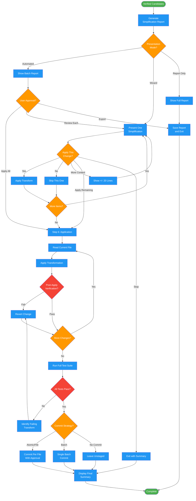

# /simplify-transform

## Workflow Diagram

# Diagram: simplify-transform

Present and apply verified simplifications with multi-mode workflow and git integration. Handles automated, wizard, and report-only presentation modes.



## Legend

| Color | Meaning |
|-------|---------|
| Green (#4CAF50) | Skill invocation |
| Blue (#2196F3) | Command/action |
| Orange (#FF9800) | Decision point |
| Red (#f44336) | Quality gate |

## Command Content

``````````markdown
# /simplify-transform

Present and apply verified simplifications with multi-mode workflow and git integration.

**Part of the simplify-* command family.** Runs after `/simplify-verify` to apply changes.

## Invariant Principles

1. **Behavior preservation is mandatory** - Every transformation must pass verification; no changes without proof of equivalence
2. **Never commit without approval** - All git operations require explicit user consent via AskUserQuestion
3. **Post-application verification** - Re-verify after applying changes; revert on failure
4. **Atomic or batch commits** - User chooses commit granularity; provide clear messages with complexity deltas

<CRITICAL>
This command NEVER commits changes without explicit user approval via AskUserQuestion.
All transformations go through post-application verification.
</CRITICAL>

---

## Step 5: Presentation

Present verified simplifications based on selected mode.

### 5.1 Generate Report

Create comprehensive simplification report:

```markdown
# Simplification Analysis: <branch-name or scope>

**Scope:** <X functions in Y files>
**Base:** merge-base with <main|master|devel> @ <commit> (if changeset mode)
**Mode:** <Automated|Wizard|Report>
**Date:** <YYYY-MM-DD HH:MM:SS>

## Summary

| Metric | Before | After | Delta |
|--------|--------|-------|-------|
| Total Cognitive Complexity | <sum_before> | <sum_after> | <delta> (<percent>%) |
| Max Function Complexity | <max_before> | <max_after> | <delta> |
| Functions Above Threshold | <count_before> | <count_after> | <delta> |
| Functions Analyzed | <total> | - | - |
| Simplifications Proposed | <count> | - | - |

## Changes by File

### <file_path>

#### `<function_name>()` - Complexity: <before> -> <after>

**Patterns Applied:**
1. <Pattern name> (<category>)
2. <Pattern name> (<category>)

**Before:**
\`\`\`<language>
<original code with line numbers>
\`\`\`

**After:**
\`\`\`<language>
<transformed code with line numbers>
\`\`\`

**Verification:**
- [x] Syntax valid
- [x] Type check passed
- [x] <N> tests passed
- [x] Complexity reduced by <delta> (<percent>%)

---

## Skipped (No Coverage)

| Function | File | Complexity | Reason |
|----------|------|------------|--------|
| `<function>` | <file> | <score> | 0% test coverage |

Use `--allow-uncovered` to include these functions (higher risk).

## Skipped (Category Disabled)

| Function | File | Pattern | Flag |
|----------|------|---------|------|
| `<function>` | <file> | <pattern> | --no-<category> |

## Skipped (Verification Failed)

| Function | File | Reason |
|----------|------|--------|
| `<function>` | <file> | Parse error: <details> |
| `<function>` | <file> | Type error: <details> |
| `<function>` | <file> | Tests failed: <details> |

## Action Plan

### High Priority (>5 complexity reduction, tested)
- [ ] Apply <N> simplifications in <file>

### Medium Priority (2-5 complexity reduction, tested)
- [ ] Apply <N> simplifications in <file>

### Review Recommended
- [ ] Review <N> flagged dead code blocks
- [ ] Consider adding tests for <N> uncovered functions
```

### 5.2 Automated Mode Presentation

**Present complete batch report:**

1. Show full report with all proposed changes
2. Display summary statistics
3. Ask for batch approval:

```
AskUserQuestion:
Question: "Review complete. Found <N> simplification opportunities. How would you like to proceed?"
Options:
- Apply all simplifications (will verify each before applying)
- Let me review each one individually (wizard mode)
- Export report and exit (no changes)
```

**If "Apply all":**
- Proceed to application phase (Step 6)
- Apply each verified change
- Re-verify after each application

**If "Review individually":**
- Switch to wizard mode
- Proceed to wizard flow

**If "Export report":**
- Save report to specified path or default location
- Exit without changes

### 5.3 Wizard Mode Presentation

**Present one simplification at a time:**

For each simplification in priority order:

```
===============================================================
Simplification <n> of <total>
Priority: <High|Medium>
===============================================================

File: <file_path>
Function: `<function_name>()`
Complexity: <before> -> <after> (-<delta>, -<percent>%)

Pattern: <Pattern name> (<Category>)
Risk: <Low|Medium|High>

BEFORE:
---------------------------------------------------------------
<original code with highlighting>
---------------------------------------------------------------

AFTER:
---------------------------------------------------------------
<transformed code with highlighting>
---------------------------------------------------------------

Verification:
[ok] Syntax valid
[ok] Type check passed
[ok] <N> tests passed
[ok] Complexity reduced

===============================================================
```

```
AskUserQuestion:
Question: "Apply this simplification?"
Options:
- Yes, apply this change
- No, skip this one
- Show more context (+/-20 lines)
- Apply all remaining (switch to automated)
- Stop wizard (exit)
```

**If "Yes":**
- Apply the transformation
- Show confirmation
- Continue to next

**If "No":**
- Skip and continue to next

**If "Show more context":**
- Display wider code window
- Re-present the same question

**If "Apply all remaining":**
- Switch to automated mode for remaining items

**If "Stop wizard":**
- Exit with summary of what was applied

### 5.4 Report-Only Mode Presentation

**Show full report:**

1. Display complete analysis report
2. Show all proposed changes
3. Save report to file if --save-report specified
4. If --json flag: output as JSON instead of markdown

**Exit without applying any changes.**

### 5.5 Save Report

**Default location:** `${SPELLBOOK_CONFIG_DIR:-~/.local/spellbook}/docs/<project-encoded>/reports/simplify-report-<YYYY-MM-DD>.md`

Generate project encoded path:
```bash
# Find outermost git repo (handles nested repos)
# Returns "NO_GIT_REPO" if not in any git repository
_outer_git_root() {
  local root=$(git rev-parse --show-toplevel 2>/dev/null)
  [ -z "$root" ] && { echo "NO_GIT_REPO"; return 1; }
  local parent
  while parent=$(git -C "$(dirname "$root")" rev-parse --show-toplevel 2>/dev/null) && [ "$parent" != "$root" ]; do
    root="$parent"
  done
  echo "$root"
}
PROJECT_ROOT=$(_outer_git_root)

# If NO_GIT_REPO: Ask user if they want to run `git init`, otherwise use _no-repo fallback
[ "$PROJECT_ROOT" = "NO_GIT_REPO" ] && { echo "Not in a git repo - ask user to init or use fallback"; exit 1; }

PROJECT_ENCODED=$(echo "$PROJECT_ROOT" | sed 's|^/||' | tr '/' '-')
```

Create directory if needed: `mkdir -p "${SPELLBOOK_CONFIG_DIR:-~/.local/spellbook}/docs/${PROJECT_ENCODED}/reports"`

**Custom location:** Use --save-report=<path> flag to override

**JSON output:** If --json flag, save as JSON:

```json
{
  "scope": "<scope>",
  "base": "<base_commit>",
  "mode": "<mode>",
  "timestamp": "<iso8601>",
  "summary": {
    "total_complexity_before": "<number>",
    "total_complexity_after": "<number>",
    "delta": "<number>",
    "delta_percent": "<number>",
    "functions_analyzed": "<number>",
    "simplifications_proposed": "<number>"
  },
  "changes": [
    {
      "file": "<path>",
      "function": "<name>",
      "complexity_before": "<number>",
      "complexity_after": "<number>",
      "patterns": ["<pattern1>", "<pattern2>"],
      "before_code": "<code>",
      "after_code": "<code>",
      "verification": {
        "parse": true,
        "type_check": true,
        "tests_passed": "<number>",
        "complexity_reduced": true
      }
    }
  ],
  "skipped": {
    "no_coverage": [],
    "category_disabled": [],
    "verification_failed": []
  }
}
```

---

## Step 6: Application Phase

Apply verified simplifications and integrate with git.

### 6.1 Apply Transformations

**For each approved simplification:**

1. Read the current file content
2. Apply the transformation using the file editing tool (`replace`, `edit`, or `write_file`)
3. Verify the change preserves behavior (unless fixing a bug)
4. If verification passes: keep the change
5. If verification fails: revert the change, mark as failed

**Critical:** Even though changes were verified during analysis, re-verify after application to catch any edge cases.

### 6.2 Post-Application Verification

**After all transformations applied:**

1. Run full test suite (not just affected tests)
2. Verify all tests pass
3. Calculate final complexity metrics
4. Generate final report

```bash
# Run project test suite
<project_test_command>

# If tests fail, identify which transformation caused the failure
# Revert that transformation
# Re-run tests until passing
```

### 6.3 Git Integration

**After successful application, ask about commit strategy:**

```
AskUserQuestion:
Question: "All simplifications applied successfully. How should I handle commits?"
Options:
- Atomic per file (one commit per file with detailed message)
- Single batch commit (all changes in one commit)
- No commit (leave as unstaged changes for you to commit manually)
```

#### Option 1: Atomic Per File

For each file with changes:

**Show proposed commit message:**
```
refactor(<scope>): simplify <function-name>

Apply: <pattern1>, <pattern2>
Cognitive complexity: <before> -> <after> (-<percent>%)

Patterns:
- <Pattern description>
- <Pattern description>

Verified: syntax ok types ok tests ok
```

**Ask for approval:**
```
AskUserQuestion:
Question: "Commit <file_path> with this message?"
Message:
<show full commit message>

Options:
- Yes, commit with this message
- Edit commit message
- Skip this commit
- Stop (no more commits)
```

**If approved, execute commit:**
```bash
git add <file_path>
git commit -m "<message>"
```

**Safety rules enforced:**
- NEVER commit without explicit user approval
- NEVER include co-authorship footers
- NEVER tag GitHub issues in commit messages
- Show exact commit message before executing

#### Option 2: Single Batch Commit

**Show proposed batch commit message:**
```
refactor: simplify code across <N> files

Cognitive complexity: <total_before> -> <total_after> (-<percent>%)

Files changed:
- <file1>: <function1>, <function2>
- <file2>: <function3>

Patterns applied:
- Guard clauses: <count>
- Boolean simplifications: <count>
- Modern idioms: <count>

Verified: syntax ok types ok tests ok
```

**Ask for approval:**
```
AskUserQuestion:
Question: "Commit all changes with this message?"
Message:
<show full commit message>

Options:
- Yes, commit all changes
- Edit commit message
- Switch to atomic commits instead
- No commit (leave unstaged)
```

**If approved, execute commit:**
```bash
git add <all_changed_files>
git commit -m "<message>"
```

#### Option 3: No Commit

**Report changes and exit:**
```
Changes applied but not committed:
- <file1> (<N> simplifications)
- <file2> (<N> simplifications)

To review: git diff
To commit: git add <files> && git commit -m "your message"
```

### 6.4 Final Summary

**Display completion summary:**

```
===============================================================
                 Simplification Complete!
===============================================================

[ok] Simplifications applied: <count>
[ok] Files modified: <count>
[ok] Total complexity reduction: -<delta> (-<percent>%)

Before: <total_before>
After: <total_after>

<If commits made:>
[ok] Commits created: <count>

<If no commits made:>
[!] Changes applied but not committed.

Next steps:
- Run tests: <project_test_command>
- Review changes: git diff
- Commit if needed: git add <files> && git commit
===============================================================
```

---

## Error Handling

### No Functions Found

**Scenario:** Target scope contains no functions or no functions meet criteria.

**Response:**
```
No simplification opportunities found.

Scope: <scope>
Functions analyzed: <count>
Functions above threshold (complexity >= <threshold>): 0

Consider:
- Lowering --min-complexity threshold (current: <value>)
- Using --allow-uncovered to include untested functions
- Checking a different target scope
```

### Parse Errors

**Scenario:** Source file has syntax errors.

**Response:**
```
Cannot analyze <file>: syntax error

<error details>

Fix syntax errors before running simplification analysis.
```

### Test Failures During Verification

**Scenario:** Transformation causes tests to fail.

**Response:**
```
Verification failed for <function> in <file>

Transformation would break tests:
<test failure details>

This simplification has been skipped.
Continue with remaining simplifications? (yes/no)
```

### Missing Test Command

**Scenario:** Cannot determine how to run tests.

**Response:**
```
Cannot verify simplifications: test command not found.

Detected project type: <type>
Expected test command: <command>

Options:
1. Configure test command in project settings
2. Use --dry-run for analysis only
3. Use --allow-uncovered (skips test verification, higher risk)
```

### Git Repository Issues

**Scenario:** Not in a git repository or cannot find base branch.

**Response:**
```
Cannot determine changeset: <issue>

<If not in git repo:>
/simplify requires a git repository for changeset analysis.
Use explicit file/directory path instead.

<If base branch not found:>
Cannot find base branch (tried: main, master, devel).
Use --base=<branch> to specify base branch.
Or use explicit file/directory path.
```

### Unsupported Language

**Scenario:** File extension not recognized.

**Response:**
```
<file>: language not supported

Supported languages:
- Python (.py)
- TypeScript (.ts, .tsx)
- JavaScript (.js, .jsx)
- Nim (.nim)
- C (.c, .h)
- C++ (.cpp, .cc, .cxx, .hpp)

Generic simplifications (control flow, boolean logic) available for all languages.
Language-specific idioms only available for supported languages.
```

---

## Completion

After successful application:
1. Changes applied and verified
2. Commits created (if requested and approved)
3. Final summary displayed

**Workflow Complete.** Code simplification finished.
``````````
