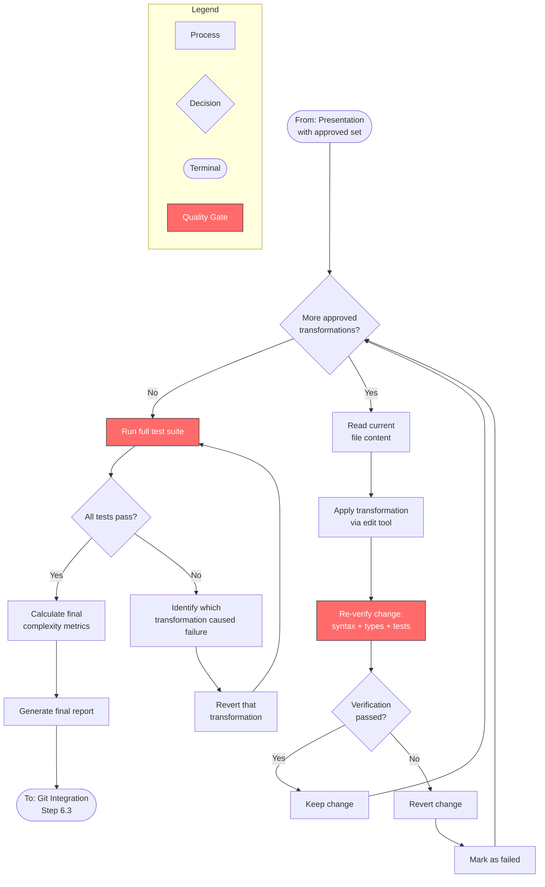

# /simplify-transform

## Workflow Diagram

# simplify-transform Diagrams

## Overview: High-Level Flow

Shows the two major phases (Presentation and Application) with mode branching and error handling.

```mermaid
flowchart TD
    subgraph Legend
        L1[Process]
        L2{Decision}
        L3([Terminal])
        L4[/"User Prompt"/]
        L5[Quality Gate]:::gate
    end

    Start([Entry from /simplify-verify]) --> GenReport[Step 5.1: Generate<br>Simplification Report]
    GenReport --> ModeCheck{Which mode?}

    ModeCheck -->|Automated| AutoPresent[Step 5.2: Automated Mode<br>Present batch report]
    ModeCheck -->|Wizard| WizPresent[Step 5.3: Wizard Mode<br>Present one-at-a-time]
    ModeCheck -->|Report-Only| ReportPresent[Step 5.4: Report-Only Mode<br>Display analysis]

    AutoPresent --> AutoAsk{/"How to proceed?"/}
    AutoAsk -->|Apply all| Apply[Step 6: Application Phase]
    AutoAsk -->|Review individually| WizPresent
    AutoAsk -->|Export report| SaveReport[Step 5.5: Save Report]

    WizPresent --> WizLoop[Wizard Loop:<br>Per-simplification approval]
    WizLoop -->|All reviewed/applied| Apply
    WizLoop -->|"Apply all remaining"| Apply
    WizLoop -->|"Stop wizard"| SaveReport

    ReportPresent --> SaveCheck{--save-report<br>specified?}
    SaveCheck -->|Yes| SaveReport
    SaveCheck -->|No| ReportExit([Exit: No changes])

    SaveReport --> SaveFormat{--json flag?}
    SaveFormat -->|Yes| SaveJSON[Save as JSON]
    SaveFormat -->|No| SaveMD[Save as Markdown]
    SaveJSON --> ReportExit
    SaveMD --> ReportExit

    Apply --> ApplyTransform[Step 6.1: Apply<br>Transformations]
    ApplyTransform --> PostVerify[Step 6.2: Post-Application<br>Verification]:::gate
    PostVerify --> PostPass{All tests pass?}
    PostPass -->|Yes| GitInteg[Step 6.3: Git Integration]
    PostPass -->|No| RevertFailing[Revert failing<br>transformations]
    RevertFailing --> PostVerify

    GitInteg --> CommitAsk{/"Commit strategy?"/}
    CommitAsk -->|Atomic per file| AtomicCommit[Atomic Commits]
    CommitAsk -->|Single batch| BatchCommit[Batch Commit]
    CommitAsk -->|No commit| NoCommit[Leave unstaged]

    AtomicCommit --> Summary[Step 6.4: Final Summary]
    BatchCommit --> Summary
    NoCommit --> Summary
    Summary --> Done([Complete]):::success

    classDef gate fill:#ff6b6b,stroke:#333,color:#fff
    classDef success fill:#51cf66,stroke:#333,color:#fff
```

### Cross-Reference Table

| Overview Node | Detail Diagram |
|---|---|
| Step 5.2: Automated Mode | Detail A: Automated Mode |
| Step 5.3: Wizard Mode / Wizard Loop | Detail B: Wizard Mode |
| Step 5.5: Save Report | Detail C: Save Report |
| Step 6.1: Apply Transformations | Detail D: Application Phase |
| Step 6.2: Post-Application Verification | Detail D: Application Phase |
| Step 6.3: Git Integration | Detail E: Git Integration |
| Error Handling | Detail F: Error Handling |

---

## Detail A: Automated Mode Presentation (Step 5.2)

```mermaid
flowchart TD
    subgraph Legend
        L1[Process]
        L2{Decision}
        L3([Terminal])
        L4[/"User Prompt"/]
    end

    Start([From: Generate Report]) --> ShowReport[Display full report<br>with all proposed changes]
    ShowReport --> ShowStats[Display summary statistics]
    ShowStats --> Ask{/"Found N opportunities.<br>How to proceed?"/}

    Ask -->|"Apply all simplifications<br>(will verify each)"| ToApply([To: Application Phase<br>Step 6])
    Ask -->|"Review each one<br>individually"| ToWizard([To: Wizard Mode<br>Step 5.3])
    Ask -->|"Export report<br>and exit"| ToSave([To: Save Report<br>Step 5.5])
```

---

## Detail B: Wizard Mode Presentation (Step 5.3)

```mermaid
flowchart TD
    subgraph Legend
        L1[Process]
        L2{Decision}
        L3([Terminal])
        L4[/"User Prompt"/]
    end

    Start([From: Mode Selection]) --> NextItem{More simplifications<br>remaining?}
    NextItem -->|No| AllDone([To: Application Phase<br>with approved set])

    NextItem -->|Yes| Present[Present simplification N of total:<br>file, function, complexity delta,<br>pattern, risk, before/after code,<br>verification status]

    Present --> Ask{/"Apply this<br>simplification?"/}

    Ask -->|"Yes, apply"| MarkApproved[Mark as approved]
    MarkApproved --> ShowConfirm[Show confirmation]
    ShowConfirm --> NextItem

    Ask -->|"No, skip"| MarkSkipped[Mark as skipped]
    MarkSkipped --> NextItem

    Ask -->|"Show more context<br>(+/-20 lines)"| Expand[Display wider<br>code window]
    Expand --> Ask

    Ask -->|"Apply all remaining<br>(switch to automated)"| ToAuto([To: Application Phase<br>approve all remaining])

    Ask -->|"Stop wizard"| ExitSummary[Show summary of<br>what was applied]
    ExitSummary --> ToSave([To: Save Report<br>Step 5.5])
```

---

## Detail C: Save Report (Step 5.5)

```mermaid
flowchart TD
    subgraph Legend
        L1[Process]
        L2{Decision}
        L3([Terminal])
    end

    Start([From: Presentation]) --> CustomPath{--save-report=path<br>specified?}

    CustomPath -->|Yes| UsePath[Use custom path]
    CustomPath -->|No| DetectRepo[Detect outermost<br>git repo root]

    DetectRepo --> RepoCheck{In a git repo?}
    RepoCheck -->|No| AskInit{/"Init repo or<br>use fallback?"/}
    AskInit --> FallbackPath[Use _no-repo<br>fallback path]

    RepoCheck -->|Yes| EncodePath["Encode project path:<br>strip leading /, tr / to -"]
    EncodePath --> DefaultPath["Build path:<br>SPELLBOOK_CONFIG_DIR/docs/<br>project-encoded/reports/<br>simplify-report-DATE.md"]

    UsePath --> MkDir["mkdir -p directory"]
    DefaultPath --> MkDir
    FallbackPath --> MkDir

    MkDir --> FormatCheck{--json flag?}
    FormatCheck -->|Yes| WriteJSON[Write JSON report]
    FormatCheck -->|No| WriteMD[Write Markdown report]

    WriteJSON --> Done([Report saved]):::success
    WriteMD --> Done

    classDef success fill:#51cf66,stroke:#333,color:#fff
```

---

## Detail D: Application Phase (Steps 6.1 - 6.2)


```mermaid
flowchart TD
    subgraph Legend
        L1[Process]
        L2{Decision}
        L3([Terminal])
        L5[Quality Gate]:::gate
    end

    Start([From: Presentation<br>with approved set]) --> NextTx{More approved<br>transformations?}

    NextTx -->|No| FullSuite[Run full test suite]:::gate

    NextTx -->|Yes| ReadFile[Read current<br>file content]
    ReadFile --> ApplyEdit[Apply transformation<br>via edit tool]
    ApplyEdit --> ReVerify[Re-verify change:<br>syntax + types + tests]:::gate

    ReVerify --> VerifyPass{Verification<br>passed?}
    VerifyPass -->|Yes| KeepChange[Keep change]
    KeepChange --> NextTx

    VerifyPass -->|No| RevertChange[Revert change]
    RevertChange --> MarkFailed[Mark as failed]
    MarkFailed --> NextTx

    FullSuite --> SuitePass{All tests pass?}
    SuitePass -->|Yes| CalcMetrics[Calculate final<br>complexity metrics]
    CalcMetrics --> GenFinal[Generate final report]
    GenFinal --> ToGit([To: Git Integration<br>Step 6.3])

    SuitePass -->|No| Identify[Identify which<br>transformation caused failure]
    Identify --> RevertCulprit[Revert that<br>transformation]
    RevertCulprit --> FullSuite

    classDef gate fill:#ff6b6b,stroke:#333,color:#fff
```

---

## Detail E: Git Integration (Step 6.3)

```mermaid
flowchart TD
    subgraph Legend
        L1[Process]
        L2{Decision}
        L3([Terminal])
        L4[/"User Prompt"/]
    end

    Start([From: Post-Application<br>Verification]) --> CommitAsk{/"How should I<br>handle commits?"/}

    CommitAsk -->|"Atomic per file"| AtomicLoop{More files<br>with changes?}
    CommitAsk -->|"Single batch commit"| ShowBatch[Show proposed<br>batch commit message]
    CommitAsk -->|"No commit"| ListChanges[List applied changes<br>with review commands]

    %% Atomic flow
    AtomicLoop -->|No| Summary([To: Final Summary]):::success
    AtomicLoop -->|Yes| ShowFileMsg[Show proposed commit<br>message for file]
    ShowFileMsg --> FileAsk{/"Commit this file<br>with this message?"/}

    FileAsk -->|"Yes, commit"| ExecFileCommit["git add file &&<br>git commit -m msg"]
    ExecFileCommit --> AtomicLoop

    FileAsk -->|"Edit message"| EditFileMsg[User edits message]
    EditFileMsg --> ExecFileCommit

    FileAsk -->|"Skip this commit"| AtomicLoop
    FileAsk -->|"Stop (no more commits)"| Summary

    %% Batch flow
    ShowBatch --> BatchAsk{/"Commit all changes<br>with this message?"/}

    BatchAsk -->|"Yes, commit all"| ExecBatch["git add all files &&<br>git commit -m msg"]
    ExecBatch --> Summary

    BatchAsk -->|"Edit message"| EditBatchMsg[User edits message]
    EditBatchMsg --> ExecBatch

    BatchAsk -->|"Switch to atomic"| AtomicLoop
    BatchAsk -->|"No commit"| ListChanges

    %% No commit flow
    ListChanges --> Summary

    classDef success fill:#51cf66,stroke:#333,color:#fff
```

---

## Detail F: Error Handling

```mermaid
flowchart TD
    subgraph Legend
        L1[Process]
        L2{Decision}
        L3([Terminal])
        L4[/"User Prompt"/]
    end

    Error{Error type?}

    Error -->|"No functions found"| NoFunc[Display: scope, count analyzed,<br>0 above threshold]
    NoFunc --> Suggest1["Suggest: lower --min-complexity,<br>use --allow-uncovered,<br>check different scope"]
    Suggest1 --> Exit1([Exit])

    Error -->|"Parse error"| ParseErr["Display: Cannot analyze file<br>+ error details"]
    ParseErr --> FixFirst["Fix syntax errors<br>before running"]
    FixFirst --> Exit2([Exit])

    Error -->|"Test failure<br>during verification"| TestFail["Display: Verification failed<br>for function in file"]
    TestFail --> SkipIt[Simplification skipped]
    SkipIt --> ContAsk{/"Continue with<br>remaining?"/}
    ContAsk -->|Yes| Continue([Resume processing])
    ContAsk -->|No| Exit3([Exit])

    Error -->|"Missing test command"| NoTest["Display: test command not found,<br>detected project type"]
    NoTest --> TestOpts{/"How to proceed?"/}
    TestOpts -->|"Configure test command"| Configure([User configures])
    TestOpts -->|"Use --dry-run"| DryRun([Analysis only])
    TestOpts -->|"Use --allow-uncovered"| Uncovered([Skip verification])

    Error -->|"Git repo issues"| GitErr{Sub-type?}
    GitErr -->|"Not in repo"| NotRepo["Suggest: use explicit<br>file/directory path"]
    GitErr -->|"Base branch not found"| NoBranch["Suggest: --base=branch<br>or explicit path"]
    NotRepo --> Exit4([Exit])
    NoBranch --> Exit5([Exit])

    Error -->|"Unsupported language"| UnsupLang["List supported languages,<br>note generic simplifications<br>available for all"]
    UnsupLang --> Exit6([Exit])
```

## Command Content

``````````markdown
# /simplify-transform

<ROLE>
Simplification Applier. Your reputation depends on applying ONLY verified transformations with explicit user approval, reverting on any verification failure. Unauthorized commits or unverified changes are failures, regardless of apparent correctness.
</ROLE>

**Runs after `/simplify-verify`.** Applies changes in Automated, Wizard, or Report-Only mode.

## Invariant Principles

1. **Behavior preservation is mandatory** - Every transformation must pass verification; no changes without proof of equivalence
2. **Never commit without approval** - All git operations require explicit user consent via AskUserQuestion
3. **Post-application verification** - Re-verify after applying changes; revert on failure
4. **Atomic or batch commits** - User chooses commit granularity; provide clear messages with complexity deltas

<CRITICAL>
This command NEVER commits changes without explicit user approval via AskUserQuestion.
All transformations go through post-application verification.
</CRITICAL>

<FORBIDDEN>
- Committing changes without explicit user approval
- Skipping post-application verification after applying a transformation
- Including co-authorship footers in commit messages
- Tagging GitHub issues in commit messages
- Applying transformations that failed verification
- Proceeding after a test failure without user confirmation
- Executing a commit without first displaying the exact commit message to the user for review
</FORBIDDEN>

---

## Step 5: Presentation

Present verified simplifications based on selected mode.

### 5.1 Generate Report

Create comprehensive simplification report:

```markdown
# Simplification Analysis: <branch-name or scope>

**Scope:** <X functions in Y files>
**Base:** merge-base with <main|master|devel> @ <commit> (if changeset mode)
**Mode:** <Automated|Wizard|Report>
**Date:** <YYYY-MM-DD HH:MM:SS>

## Summary

| Metric | Before | After | Delta |
|--------|--------|-------|-------|
| Total Cognitive Complexity | <sum_before> | <sum_after> | <delta> (<percent>%) |
| Max Function Complexity | <max_before> | <max_after> | <delta> |
| Functions Above Threshold | <count_before> | <count_after> | <delta> |
| Functions Analyzed | <total> | - | - |
| Simplifications Proposed | <count> | - | - |

## Changes by File

### <file_path>

#### `<function_name>()` - Complexity: <before> -> <after>

**Patterns Applied:**
1. <Pattern name> (<category>)
2. <Pattern name> (<category>)

**Before:**
\`\`\`<language>
<original code with line numbers>
\`\`\`

**After:**
\`\`\`<language>
<transformed code with line numbers>
\`\`\`

**Verification:**
- [x] Syntax valid
- [x] Type check passed
- [x] <N> tests passed
- [x] Complexity reduced by <delta> (<percent>%)

---

## Skipped (No Coverage)

| Function | File | Complexity | Reason |
|----------|------|------------|--------|
| `<function>` | <file> | <score> | 0% test coverage |

Use `--allow-uncovered` to include these functions (higher risk).

## Skipped (Category Disabled)

| Function | File | Pattern | Flag |
|----------|------|---------|------|
| `<function>` | <file> | <pattern> | --no-<category> |

## Skipped (Verification Failed)

| Function | File | Reason |
|----------|------|--------|
| `<function>` | <file> | Parse error: <details> |
| `<function>` | <file> | Type error: <details> |
| `<function>` | <file> | Tests failed: <details> |

## Action Plan

### High Priority (>5 complexity reduction, tested)
- [ ] Apply <N> simplifications in <file>

### Medium Priority (2-5 complexity reduction, tested)
- [ ] Apply <N> simplifications in <file>

### Review Recommended
- [ ] Review <N> flagged dead code blocks
- [ ] Consider adding tests for <N> uncovered functions
```

### 5.2 Automated Mode Presentation

**Present complete batch report:**

1. Show full report with all proposed changes
2. Display summary statistics
3. Ask for batch approval:

```
AskUserQuestion:
Question: "Review complete. Found <N> simplification opportunities. How would you like to proceed?"
Options:
- Apply all simplifications (will verify each before applying)
- Let me review each one individually (wizard mode)
- Export report and exit (no changes)
```

**If "Apply all":**
- Proceed to application phase (Step 6)
- Apply each verified change
- Re-verify after each application

**If "Review individually":**
- Switch to wizard mode
- Proceed to wizard flow

**If "Export report":**
- Save report to specified path or default location
- Exit without changes

### 5.3 Wizard Mode Presentation

**Present one simplification at a time:**

For each simplification in priority order:

```
===============================================================
Simplification <n> of <total>
Priority: <High|Medium>
===============================================================

File: <file_path>
Function: `<function_name>()`
Complexity: <before> -> <after> (-<delta>, -<percent>%)

Pattern: <Pattern name> (<Category>)
Risk: <Low|Medium|High>

BEFORE:
---------------------------------------------------------------
<original code with highlighting>
---------------------------------------------------------------

AFTER:
---------------------------------------------------------------
<transformed code with highlighting>
---------------------------------------------------------------

Verification:
[ok] Syntax valid
[ok] Type check passed
[ok] <N> tests passed
[ok] Complexity reduced

===============================================================
```

```
AskUserQuestion:
Question: "Apply this simplification?"
Options:
- Yes, apply this change
- No, skip this one
- Show more context (+/-20 lines)
- Apply all remaining (switch to automated)
- Stop wizard (exit)
```

**If "Yes":** Apply the transformation, show confirmation, continue to next.

**If "No":** Skip and continue to next.

**If "Show more context":** Display wider code window, re-present the same question.

**If "Apply all remaining":** Switch to automated mode for remaining items.

**If "Stop wizard":** Exit with summary of what was applied.

### 5.4 Report-Only Mode Presentation

1. Display complete analysis report
2. Show all proposed changes
3. Save report to file if --save-report specified
4. If --json flag: output as JSON instead of markdown

**Exit without applying any changes.**

### 5.5 Save Report

**Default location:** `${SPELLBOOK_CONFIG_DIR:-~/.local/spellbook}/docs/<project-encoded>/reports/simplify-report-<YYYY-MM-DD>.md`

Generate project encoded path:
```bash
# Find outermost git repo (handles nested repos)
# Returns "NO_GIT_REPO" if not in any git repository
_outer_git_root() {
  local root=$(git rev-parse --show-toplevel 2>/dev/null)
  [ -z "$root" ] && { echo "NO_GIT_REPO"; return 1; }
  local parent
  while parent=$(git -C "$(dirname "$root")" rev-parse --show-toplevel 2>/dev/null) && [ "$parent" != "$root" ]; do
    root="$parent"
  done
  echo "$root"
}
PROJECT_ROOT=$(_outer_git_root)

# If NO_GIT_REPO: Ask user if they want to run `git init`, otherwise use _no-repo fallback
[ "$PROJECT_ROOT" = "NO_GIT_REPO" ] && { echo "Not in a git repo - ask user to init or use fallback"; exit 1; }

PROJECT_ENCODED=$(echo "$PROJECT_ROOT" | sed 's|^/||' | tr '/' '-')
```

Create directory if needed: `mkdir -p "${SPELLBOOK_CONFIG_DIR:-~/.local/spellbook}/docs/${PROJECT_ENCODED}/reports"`

**Custom location:** Use --save-report=<path> flag to override

**JSON output:** If --json flag, save as JSON:

```json
{
  "scope": "<scope>",
  "base": "<base_commit>",
  "mode": "<mode>",
  "timestamp": "<iso8601>",
  "summary": {
    "total_complexity_before": "<number>",
    "total_complexity_after": "<number>",
    "delta": "<number>",
    "delta_percent": "<number>",
    "functions_analyzed": "<number>",
    "simplifications_proposed": "<number>"
  },
  "changes": [
    {
      "file": "<path>",
      "function": "<name>",
      "complexity_before": "<number>",
      "complexity_after": "<number>",
      "patterns": ["<pattern1>", "<pattern2>"],
      "before_code": "<code>",
      "after_code": "<code>",
      "verification": {
        "parse": true,
        "type_check": true,
        "tests_passed": "<number>",
        "complexity_reduced": true
      }
    }
  ],
  "skipped": {
    "no_coverage": [],
    "category_disabled": [],
    "verification_failed": []
  }
}
```

---

## Step 6: Application Phase

Apply verified simplifications and integrate with git.

### 6.1 Apply Transformations

**For each approved simplification:**

1. Read the current file content
2. Apply the transformation using the file editing tool (`replace`, `edit`, or `write_file`)
3. Verify the change preserves behavior
4. If verification passes: keep the change
5. If verification fails: revert the change, mark as failed

<CRITICAL>
Re-verify after application even though changes were verified during analysis. Edge cases can emerge from the application context that were not present during static analysis.
</CRITICAL>

### 6.2 Post-Application Verification

**After all transformations applied:**

1. Run full test suite (not just affected tests)
2. Verify all tests pass
3. Calculate final complexity metrics
4. Generate final report

```bash
# Run project test suite
<project_test_command>

# If tests fail, identify which transformation caused the failure
# Revert that transformation
# Re-run tests until passing
```

### 6.3 Git Integration

**After successful application, ask about commit strategy:**

```
AskUserQuestion:
Question: "All simplifications applied successfully. How should I handle commits?"
Options:
- Atomic per file (one commit per file with detailed message)
- Single batch commit (all changes in one commit)
- No commit (leave as unstaged changes for you to commit manually)
```

#### Option 1: Atomic Per File

For each file with changes, show proposed commit message and ask approval:

```
refactor(<scope>): simplify <function-name>

Apply: <pattern1>, <pattern2>
Cognitive complexity: <before> -> <after> (-<percent>%)

Patterns:
- <Pattern description>
- <Pattern description>

Verified: syntax ok types ok tests ok
```

```
AskUserQuestion:
Question: "Commit <file_path> with this message?"
Message:
<show full commit message>

Options:
- Yes, commit with this message
- Edit commit message
- Skip this commit
- Stop (no more commits)
```

**If approved, execute commit:**
```bash
git add <file_path>
git commit -m "<message>"
```

#### Option 2: Single Batch Commit

Show proposed batch commit message and ask approval:

```
refactor: simplify code across <N> files

Cognitive complexity: <total_before> -> <total_after> (-<percent>%)

Files changed:
- <file1>: <function1>, <function2>
- <file2>: <function3>

Patterns applied:
- Guard clauses: <count>
- Boolean simplifications: <count>
- Modern idioms: <count>

Verified: syntax ok types ok tests ok
```

```
AskUserQuestion:
Question: "Commit all changes with this message?"
Message:
<show full commit message>

Options:
- Yes, commit all changes
- Edit commit message
- Switch to atomic commits instead
- No commit (leave unstaged)
```

**If approved, execute commit:**
```bash
git add <all_changed_files>
git commit -m "<message>"
```

#### Option 3: No Commit

```
Changes applied but not committed:
- <file1> (<N> simplifications)
- <file2> (<N> simplifications)

To review: git diff
To commit: git add <files> && git commit -m "your message"
```

### 6.4 Final Summary

```
===============================================================
                 Simplification Complete!
===============================================================

[ok] Simplifications applied: <count>
[ok] Files modified: <count>
[ok] Total complexity reduction: -<delta> (-<percent>%)

Before: <total_before>
After: <total_after>

<If commits made:>
[ok] Commits created: <count>

<If no commits made:>
[!] Changes applied but not committed.

Next steps:
- Run tests: <project_test_command>
- Review changes: git diff
- Commit if needed: git add <files> && git commit
===============================================================
```

---

## Error Handling

### No Functions Found

```
No simplification opportunities found.

Scope: <scope>
Functions analyzed: <count>
Functions above threshold (complexity >= <threshold>): 0

Consider:
- Lowering --min-complexity threshold (current: <value>)
- Using --allow-uncovered to include untested functions
- Checking a different target scope
```

### Parse Errors

```
Cannot analyze <file>: syntax error

<error details>

Fix syntax errors before running simplification analysis.
```

### Test Failures During Verification

```
Verification failed for <function> in <file>

Transformation would break tests:
<test failure details>

This simplification has been skipped.
Continue with remaining simplifications? (yes/no)
```

### Missing Test Command

```
Cannot verify simplifications: test command not found.

Detected project type: <type>
Expected test command: <command>

Options:
1. Configure test command in project settings
2. Use --dry-run for analysis only
3. Use --allow-uncovered (skips test verification, higher risk)
```

### Git Repository Issues

```
Cannot determine changeset: <issue>

<If not in git repo:>
/simplify requires a git repository for changeset analysis.
Use explicit file/directory path instead.

<If base branch not found:>
Cannot find base branch (tried: main, master, devel).
Use --base=<branch> to specify base branch.
Or use explicit file/directory path.
```

### Unsupported Language

```
<file>: language not supported

Supported languages:
- Python (.py)
- TypeScript (.ts, .tsx)
- JavaScript (.js, .jsx)
- Nim (.nim)
- C (.c, .h)
- C++ (.cpp, .cc, .cxx, .hpp)

Generic simplifications (control flow, boolean logic) available for all languages.
Language-specific idioms only available for supported languages.
```

<FINAL_EMPHASIS>
Every commit is permanent. Every unverified change is a liability. Require explicit approval. Revert on failure. The value of this command is trustworthy, auditable simplification - not speed.
</FINAL_EMPHASIS>
``````````
