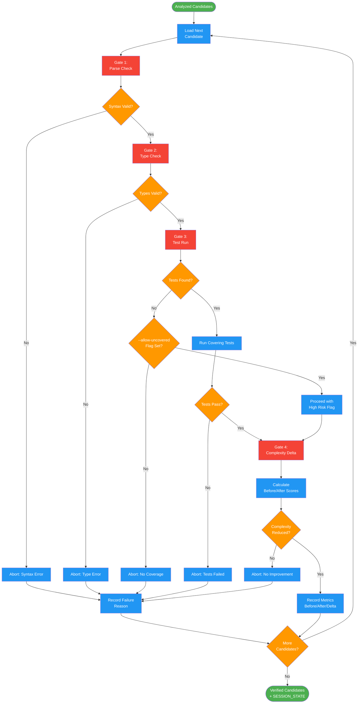

# /simplify-verify

## Workflow Diagram

# Diagram: simplify-verify

Multi-gate verification pipeline for simplification candidates. Each candidate passes through parse, type, test, and complexity gates.



## Legend

| Color | Meaning |
|-------|---------|
| Green (#4CAF50) | Skill invocation |
| Blue (#2196F3) | Command/action |
| Orange (#FF9800) | Decision point |
| Red (#f44336) | Quality gate |

## Command Content

``````````markdown
# /simplify-verify

Run multi-gate verification on proposed simplifications to ensure behavior preservation.

**Part of the simplify-* command family.** Runs after `/simplify-analyze` to validate candidates.

## Invariant Principles

1. **All gates must pass** - Parse, type check, test run, and complexity delta; failure at any gate aborts the transformation
2. **Abort on failure, continue pipeline** - Failed candidates are recorded and skipped; pipeline continues to next candidate
3. **Complexity must decrease** - Transformations that do not reduce cognitive complexity are rejected
4. **Test coverage required** - Untested functions are skipped unless explicitly allowed with higher risk acknowledgment

## Verification Pipeline

```
parse_check -> type_check -> test_run -> complexity_delta
     |             |            |             |
     v             v            v             v
  FAIL?         FAIL?        FAIL?        report
  abort         abort        abort
```

Each gate: FAIL -> abort transformation, record reason, continue to next candidate.

---

## Step 4: Verification Gate

Before proposing any change, run multi-gate verification pipeline.

### 4.1 Verification Pipeline

```
parse_check -> type_check -> test_run -> complexity_delta
     |             |            |             |
     v             v            v             v
  FAIL?         FAIL?        FAIL?        report
  abort         abort        abort
```

<reflection>
Each gate: FAIL -> abort transformation, record reason, continue to next candidate.
Must record before/after scores as evidence.
</reflection>

### 4.2 Gate 1: Parse Check

**Verify syntax validity:**

```bash
# Python
python -m py_compile <file>

# TypeScript
tsc --noEmit <file>

# Nim
nim check <file>

# C/C++
gcc -fsyntax-only <file>
# or
clang -fsyntax-only <file>
```

**If parse fails:**
- Abort transformation
- Mark as "verification failed - syntax error"
- Continue to next candidate

### 4.3 Gate 2: Type Check

**If language has type system and types are present:**

```bash
# Python (if type hints present)
mypy <file>

# TypeScript
tsc --noEmit <file>

# C/C++
# Already covered by compile check
```

**If type check fails:**
- Abort transformation
- Mark as "verification failed - type error"
- Continue to next candidate

### 4.4 Gate 3: Test Run

**Identify tests covering the function:**

1. Run test suite with coverage mapping
2. Find tests that execute the function
3. Run ONLY those tests (for speed)

```bash
# Python
pytest --cov=<module> --cov-report=term-missing <test_file>

# TypeScript/JavaScript
jest --coverage --testNamePattern=<function_name>

# C/C++
# Project-specific test runner with coverage
```

**If tests fail:**
- Abort transformation
- Mark as "verification failed - tests failed"
- Continue to next candidate

**If no tests found:**
- Check --allow-uncovered flag
- If not set: abort transformation, mark as "skipped - no coverage"
- If set: proceed with high-risk flag

### 4.5 Gate 4: Complexity Delta

**Calculate before/after scores:**

1. Calculate cognitive complexity of original function
2. Calculate cognitive complexity of transformed function
3. Compute delta: `after - before`

**Verify improvement:**
- Delta must be negative (reduction)
- If delta >= 0: transformation didn't improve complexity, abort

**Record metrics:**
```
before: <score>
after: <score>
delta: <delta> (<percentage>%)
```

---

## Output

This command produces:
1. Verification status for each candidate (PASS/FAIL with reason)
2. Before/after complexity metrics for passing candidates
3. A SESSION_STATE object for use by `/simplify-transform`

**Next:** Run `/simplify-transform` to apply verified simplifications.
``````````
