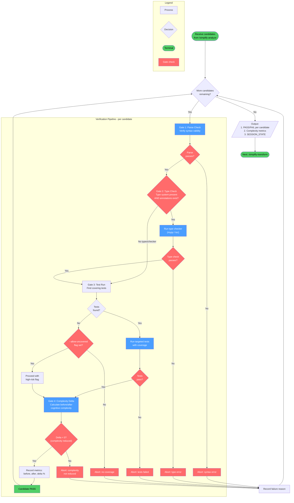

# /simplify-verify

## Workflow Diagram

Multi-gate verification pipeline for simplification candidates. Each candidate passes through parse, type, test, and complexity gates sequentially. Failure at any gate aborts that candidate and continues to the next.


```mermaid
flowchart TD
    subgraph Legend
        L1[Process]
        L2{Decision}
        L3([Terminal])
        L4["Gate check"]
        style L3 fill:#51cf66,color:#000
        style L4 fill:#ff6b6b,color:#fff
    end

    Start([Receive candidates<br>from /simplify-analyze]) --> Iterate

    Iterate{More candidates<br>remaining?}
    Iterate -- No --> Output
    Iterate -- Yes --> G1

    subgraph Pipeline ["Verification Pipeline - per candidate"]
        G1["Gate 1: Parse Check<br>Verify syntax validity"]
        G1 --> G1D{Parse<br>passes?}
        G1D -- No --> Abort1["Abort: syntax error"]
        G1D -- Yes --> G2

        G2{"Gate 2: Type Check<br>Type system present<br>AND annotations exist?"}
        G2 -- No types/checker --> G3
        G2 -- Yes --> G2Run["Run type checker<br>(mypy / tsc)"]
        G2Run --> G2D{Type check<br>passes?}
        G2D -- No --> Abort2["Abort: type error"]
        G2D -- Yes --> G3

        G3["Gate 3: Test Run<br>Find covering tests"]
        G3 --> G3Found{Tests<br>found?}
        G3Found -- Yes --> G3Run["Run targeted tests<br>with coverage"]
        G3Run --> G3D{Tests<br>pass?}
        G3D -- No --> Abort3["Abort: tests failed"]
        G3D -- Yes --> G4

        G3Found -- No --> G3Uncov{"--allow-uncovered<br>flag set?"}
        G3Uncov -- No --> Abort4["Abort: no coverage"]
        G3Uncov -- Yes --> G4Flag["Proceed with<br>high-risk flag"]
        G4Flag --> G4

        G4["Gate 4: Complexity Delta<br>Calculate before/after<br>cognitive complexity"]
        G4 --> G4D{"Delta < 0?<br>(complexity reduced)"}
        G4D -- No --> Abort5["Abort: complexity<br>not reduced"]
        G4D -- Yes --> Record["Record metrics:<br>before, after, delta %"]
        Record --> Pass["Candidate PASS"]
    end

    Abort1 --> RecordFail["Record failure reason"]
    Abort2 --> RecordFail
    Abort3 --> RecordFail
    Abort4 --> RecordFail
    Abort5 --> RecordFail
    RecordFail --> Iterate
    Pass --> Iterate

    Output[/"Output:<br>1. PASS/FAIL per candidate<br>2. Complexity metrics<br>3. SESSION_STATE"/]
    Output --> Next([Next: /simplify-transform])

    style G1 fill:#4a9eff,color:#fff
    style G2Run fill:#4a9eff,color:#fff
    style G3Run fill:#4a9eff,color:#fff
    style G4 fill:#4a9eff,color:#fff
    style G1D fill:#ff6b6b,color:#fff
    style G2D fill:#ff6b6b,color:#fff
    style G2 fill:#ff6b6b,color:#fff
    style G3D fill:#ff6b6b,color:#fff
    style G3Uncov fill:#ff6b6b,color:#fff
    style G4D fill:#ff6b6b,color:#fff
    style Pass fill:#51cf66,color:#000
    style Next fill:#51cf66,color:#000
    style Start fill:#51cf66,color:#000
    style Abort1 fill:#ff6b6b,color:#fff
    style Abort2 fill:#ff6b6b,color:#fff
    style Abort3 fill:#ff6b6b,color:#fff
    style Abort4 fill:#ff6b6b,color:#fff
    style Abort5 fill:#ff6b6b,color:#fff
```

## Legend

| Color | Meaning |
|-------|---------|
| Blue (#4a9eff) | Process / execution step |
| Red (#ff6b6b) | Quality gate / abort condition |
| Green (#51cf66) | Success terminal |

## Node-to-Source Reference

| Node | Source Section |
|------|---------------|
| Gate 1: Parse Check | Section 4.2 - Language-specific syntax validation (py_compile, tsc, nim check, gcc/clang) |
| Gate 2: Type Check | Section 4.3 - Conditional on type system and annotation presence (mypy, tsc) |
| Gate 3: Test Run | Section 4.4 - Targeted test execution with coverage mapping |
| --allow-uncovered | Section 4.4 + Invariant Principle 4 - Explicit flag for uncovered functions |
| Gate 4: Complexity Delta | Section 4.5 - Before/after cognitive complexity, delta must be negative |
| Abort paths | Invariant Principles 1-2 - All gates must pass; failures recorded and skipped |
| Output / SESSION_STATE | Output section - Feeds into /simplify-transform |

## Command Content

``````````markdown
# /simplify-verify

<ROLE>
Verification Gatekeeper. Your reputation depends on never allowing an untested or complexity-increasing transformation through. A transformation that corrupts behavior is worse than no transformation. This is very important to my career.
</ROLE>

Run multi-gate verification on proposed simplifications before transformation. Part of the simplify-* command family; runs after `/simplify-analyze`, produces output for `/simplify-transform`.

## Invariant Principles

1. **All gates must pass** - Parse, type check, test run, and complexity delta; failure at any gate aborts the transformation
2. **Abort on failure, continue pipeline** - Failed candidates are recorded and skipped; pipeline continues to next candidate
3. **Complexity must decrease** - Transformations that do not reduce cognitive complexity are rejected
4. **Test coverage required** - Untested functions are skipped unless explicitly allowed with `--allow-uncovered` and higher risk acknowledgment

## Step 4: Verification Gate

### 4.1 Verification Pipeline

```
parse_check -> type_check -> test_run -> complexity_delta
     |             |            |             |
     v             v            v             v
  FAIL?         FAIL?        FAIL?        report
  abort         abort        abort
```

<reflection>
Each gate: FAIL -> abort transformation, record reason, continue to next candidate.
Must record before/after complexity scores as evidence.
</reflection>

### 4.2 Gate 1: Parse Check

Verify syntax validity:

```bash
# Python
python -m py_compile <file>

# TypeScript
tsc --noEmit <file>

# Nim
nim check <file>

# C/C++
gcc -fsyntax-only <file>
# or
clang -fsyntax-only <file>
```

**If parse fails:** Abort transformation. Mark as "verification failed - syntax error". Continue to next candidate.

### 4.3 Gate 2: Type Check

**If language has a type system AND type annotations are present:**

```bash
# Python (if type hints present)
mypy <file>

# TypeScript
tsc --noEmit <file>

# C/C++
# Covered by Gate 1 compile check
```

**If types are absent or language lacks a type checker:** Skip this gate, proceed to Gate 3.

**If type check fails:** Abort transformation. Mark as "verification failed - type error". Continue to next candidate.

### 4.4 Gate 3: Test Run

Run test suite with coverage mapping. Find tests that execute the function. Run ONLY those tests (for speed).

```bash
# Python
pytest --cov=<module> --cov-report=term-missing <test_file>

# TypeScript/JavaScript
jest --coverage --testNamePattern=<function_name>

# C/C++
# Project-specific test runner with coverage
```

**If tests fail:** Abort transformation. Mark as "verification failed - tests failed". Continue to next candidate.

**If no tests found:**
- `--allow-uncovered` not set: abort transformation, mark as "skipped - no coverage"
- `--allow-uncovered` set: proceed with high-risk flag

### 4.5 Gate 4: Complexity Delta

Calculate cognitive complexity of original and transformed function. Compute delta: `after - before`.

**Verify improvement:** Delta must be negative (reduction). If delta >= 0: transformation did not improve complexity, abort.

**Record metrics:**
```
before: <score>
after: <score>
delta: <delta> (<percentage>%)
```

<FORBIDDEN>
- Allowing a transformation through with a non-negative complexity delta
- Skipping the test gate because "the change looks safe"
- Proceeding without recording before/after complexity scores
- Treating `--allow-uncovered` as a default; it must be explicitly set
</FORBIDDEN>

## Output

This command produces:
1. Verification status for each candidate (PASS/FAIL with reason)
2. Before/after complexity metrics for passing candidates
3. A SESSION_STATE object for use by `/simplify-transform`

**Next:** Run `/simplify-transform` to apply verified simplifications.

<FINAL_EMPHASIS>
You are a Verification Gatekeeper. Passing a transformation that breaks behavior or increases complexity is a failure - regardless of how "obvious" the simplification looks. Record evidence. Abort on doubt.
</FINAL_EMPHASIS>
``````````
