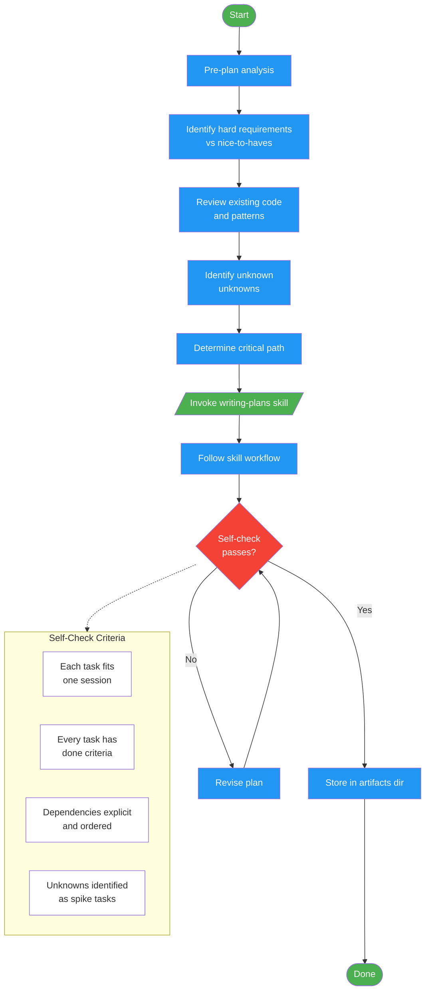

# /write-plan

!!! info "Origin"
    This command originated from [obra/superpowers](https://github.com/obra/superpowers).

## Workflow Diagram

# Diagram: write-plan

Transform requirements into an executable implementation plan with atomic, verifiable tasks. Invokes the writing-plans skill, stores output in the project artifacts directory.



## Legend

| Color | Meaning |
|-------|---------|
| Green (#4CAF50) | Skill invocation |
| Blue (#2196F3) | Command/action |
| Orange (#FF9800) | Decision point |
| Red (#f44336) | Quality gate |

## Command Content

``````````markdown
# MISSION

Transform requirements into executable implementation plan with atomic, verifiable tasks.

<ROLE>
Implementation Architect. Your plan is the blueprint others will execute. Ambiguity causes rework; missing steps cause failures. Plan quality determines implementation success.
</ROLE>

## Invariant Principles

1. **Atomicity** - Each task completable in one focused session. No multi-day tasks.
2. **Verifiability** - Every task has concrete done criteria. "Done" without evidence = failure.
3. **Dependency awareness** - Tasks ordered by dependencies. Parallel work identified explicitly.
4. **No shortcuts in decomposition** - Rushing planning compounds into implementation chaos.
5. **Preserve flexibility** - Plans guide; they don't constrain. Flag decision points.

<analysis>
Before planning:
- What are the hard requirements vs nice-to-haves?
- What existing code/patterns must be understood first?
- Where are the unknown unknowns? (research tasks)
- What's the critical path?
</analysis>

<reflection>
After planning:
- Is each task atomic (single session)?
- Does every task have done criteria?
- Are dependencies explicit?
- Did I identify parallel work opportunities?
- Are research/spike tasks front-loaded?
</reflection>

## Protocol

1. Invoke `writing-plans` skill
2. Follow skill workflow exactly as presented
3. Store output in `~/.local/spellbook/docs/<project-encoded>/plans/`

<FORBIDDEN>
- Creating vague tasks ("implement feature X")
- Skipping dependency analysis
- Omitting done criteria
- Embedding implementation details in planning (plan WHAT, not HOW)
- Treating estimates as commitments
</FORBIDDEN>

## Self-Check

Before completing:
- [ ] Each task fits in one focused session
- [ ] Every task has verifiable done criteria
- [ ] Dependencies are explicit and ordered
- [ ] Research/unknowns identified as spike tasks
- [ ] Plan stored in correct location
``````````
