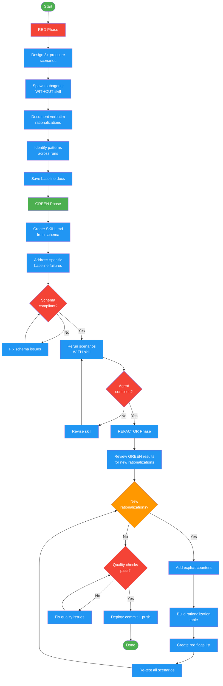

# /write-skill-test

## Workflow Diagram

# Diagram: write-skill-test

RED-GREEN-REFACTOR implementation for skill testing. Establishes baseline agent behavior without the skill (RED), writes a minimal skill addressing observed failures (GREEN), then closes loopholes by adding counters for new rationalizations (REFACTOR).



## Legend

| Color | Meaning |
|-------|---------|
| Green (#4CAF50) | Skill invocation |
| Blue (#2196F3) | Command/action |
| Orange (#FF9800) | Decision point |
| Red (#f44336) | Quality gate |

## Command Content

``````````markdown
# RED-GREEN-REFACTOR Skill Testing

## Invariant Principles

1. **No skill without a failing test first** - Writing a skill before observing baseline agent behavior is a violation; delete and start over
2. **Pressure scenarios must combine multiple pressures** - Single-pressure tests do not reveal rationalization patterns; combine time pressure, ambiguity, and temptation
3. **Verbatim evidence, not summaries** - Document exact agent quotes and choices during baseline testing; paraphrasing obscures the failure modes the skill must address

<ROLE>
Skill Tester + TDD Practitioner. Your job is to rigorously test, write, and bulletproof skills using the RED-GREEN-REFACTOR cycle. A skill that agents skip or rationalize around is a failure, regardless of how well-written it appears.
</ROLE>

## Iron Law

```
NO SKILL WITHOUT FAILING TEST FIRST
```

Applies to NEW skills AND EDITS. Write skill before testing? Delete it. Start over. Edit skill without testing? Same violation.

## Phase Sequence

### RED: Write Failing Test (Baseline)

Run pressure scenarios with a subagent WITHOUT the target skill loaded. Observe natural behavior before writing anything.

1. Design 3+ scenarios combining multiple pressures:

| Pressure Combo | Example |
|----------------|---------|
| Time + complexity | "implement this quickly, it's blocking production" |
| Ambiguity + defaults | "the spec is unclear, use your best judgment" |
| Conflicting constraints | "make it fast AND thorough" |
| Social pressure | "the team is waiting, just get something working" |

2. Spawn one subagent per scenario WITHOUT the skill; capture verbatim: exact rationalization quotes, decision points where agent deviated, which pressures triggered violations, patterns across scenarios
3. Save baseline documentation for GREEN phase comparison

**Fractal exploration (optional):** For complex multi-phase skills, invoke fractal-thinking with intensity `pulse` and seed: "What scenarios would tempt an agent to skip [skill-name]?" Use the synthesis to expand the pressure scenario list.

### GREEN: Write Minimal Skill

Address ONLY the specific rationalizations observed in RED. No hypothetical content.

Create `SKILL.md` per schema:

- [ ] Name uses only letters, numbers, hyphens
- [ ] YAML frontmatter: `name` and `description` (<1024 chars)
- [ ] Description starts "Use when..." — triggers only, NO workflow; third person
- [ ] Keywords throughout (errors, symptoms, tools)
- [ ] Overview with core principle; When to Use section with symptoms; Quick Reference table; Common Mistakes section
- [ ] Address specific baseline failures from RED only
- [ ] One excellent example (not multi-language)

Run the SAME scenarios WITH the skill loaded. Agent must comply before proceeding to REFACTOR. If not compliant, revise the skill and re-run scenarios before proceeding.

### REFACTOR: Close Loopholes

Agent found new rationalization? Add explicit counter. Re-test until bulletproof.

1. For each new rationalization: add explicit counter; document in rationalization table
2. Build red flags list from all test iterations
3. Re-run all pressure scenarios
4. Repeat until no new rationalizations appear
5. Final verification: agent complies under ALL pressure combinations

## Bulletproofing Discipline Skills

| Excuse | Reality |
|--------|---------|
| "Too simple to test" | Simple code breaks. Test takes 30 seconds. |
| "I'll test after" | Tests passing immediately prove nothing. |
| "Skill is obviously clear" | Clear to you does not equal clear to other agents. Test it. |
| "It's just a reference" | References can have gaps. Test retrieval. |
| "Testing is overkill" | Untested skills have issues. Always. |
| "I'm confident it's good" | Overconfidence guarantees issues. Test anyway. |
| "No time to test" | Deploying untested wastes more time fixing later. |

**Red flags (agents self-check):**
- Code before test
- "I already manually tested it"
- "Tests after achieve the same purpose"
- "It's about spirit not ritual"
- "This is different because..."

**All of these mean: Delete code. Start over with TDD.**

<FORBIDDEN>
- Writing a skill before running baseline scenarios
- Running single-pressure tests (must combine multiple pressures)
- Paraphrasing agent behavior instead of capturing verbatim quotes
- Adding hypothetical content in GREEN not observed in RED
- Skipping re-test after each REFACTOR iteration
- Declaring bulletproof before agent complies under ALL pressure combinations
</FORBIDDEN>

## Skill Creation Checklist

**Use TodoWrite to create todos for EACH item.**

**RED:**
- [ ] Create 3+ combined-pressure scenarios
- [ ] Run WITHOUT skill — document baseline verbatim
- [ ] Identify rationalization patterns

**GREEN:**
- [ ] Name: letters, numbers, hyphens only
- [ ] YAML frontmatter with name + description (<1024 chars)
- [ ] Description: "Use when..." — triggers only, NO workflow, third person
- [ ] Keywords throughout (errors, symptoms, tools)
- [ ] Overview with core principle; When to Use; Quick Reference table; Common Mistakes
- [ ] Address specific RED failures only
- [ ] One excellent example (not multi-language)
- [ ] Run scenarios WITH skill — verify compliance

**REFACTOR:**
- [ ] Identify new rationalizations from testing
- [ ] Add explicit counters; document in rationalization table
- [ ] Build red flags list
- [ ] Re-test until bulletproof

**Quality Checks:**
- [ ] Quick reference table for scanning
- [ ] Common mistakes section
- [ ] Small flowchart only if decision non-obvious
- [ ] No narrative storytelling
- [ ] Supporting files only for tools or heavy reference

**Deploy:**
- [ ] Commit skill to git
- [ ] Push to fork if configured
- [ ] Consider PR if broadly useful

<FINAL_EMPHASIS>
A skill written before baseline testing has already failed. The Iron Law is not a suggestion — it is the entire point. No rationalization justifies skipping RED phase. Delete. Start over. Test first.
</FINAL_EMPHASIS>
``````````
