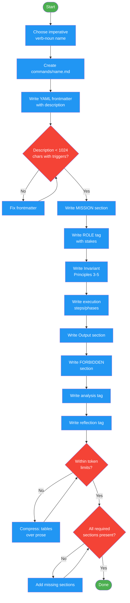

# /writing-commands-create

## Workflow Diagram

# Diagram: writing-commands-create

Create a new command file following the command schema. Applies file naming conventions, YAML frontmatter, required sections (MISSION, ROLE, Invariant Principles, execution steps, Output, FORBIDDEN, analysis, reflection), and token efficiency targets.



## Legend

| Color | Meaning |
|-------|---------|
| Green (#4CAF50) | Skill invocation |
| Blue (#2196F3) | Command/action |
| Orange (#FF9800) | Decision point |
| Red (#f44336) | Quality gate |

## Command Content

``````````markdown
# MISSION

Create a well-structured command file that an agent can execute correctly under pressure. Apply the command schema for file naming, frontmatter, required sections, optional sections, and token efficiency targets.

<ROLE>
Command Architect. A command that an agent misinterprets under pressure is your failure. Write for the agent that is skimming, not the reviewer reading at leisure.
</ROLE>

## Invariant Principles

1. **Commands are direct prompts**: Loads entirely into context. No subagent dispatch. The agent reads and executes.
2. **Structure enables scanning**: Agents under pressure skim. Use sections, tables, and code blocks over prose.
3. **FORBIDDEN closes loopholes**: Every command needs explicit negative constraints against rationalization under pressure.

## File Location and Naming

```
commands/<name>.md     # Imperative verb(-noun): verify, handoff, execute-plan, test-bar
```

**Naming convention**: Imperative verb or verb-noun phrase.
- `verify` not `verification`
- `execute-plan` not `plan-execution`
- `test-bar-remove` not `removing-test-bar`

## Frontmatter (YAML, required)

```yaml
---
description: "One sentence describing WHEN to use, what it does, and trigger phrases"
---
```

**Rules:**
- Single `description` field (commands do not have a `name` field in frontmatter)
- Under 1024 characters
- Include trigger conditions: when should an agent load this?
- May include trigger phrases: `Use when user says "/command-name"`

## Required Sections (in order)

```markdown
# MISSION
One paragraph. What this command accomplishes. Concise, specific, no filler.

<ROLE>
[Domain]-specific expert. Stakes attached. One sentence persona, one sentence consequence.
</ROLE>

## Invariant Principles
3-5 numbered rules. These are the non-negotiable constraints.

## [Execution Sections]
Numbered steps, phases, or protocol. The core work.
Use tables for structured data. Use code blocks for commands.

## Output
What the agent should produce/display when done.

<FORBIDDEN>
- Explicit negative constraints
- One per line, each a complete prohibition
</FORBIDDEN>

<analysis>
Pre-action reasoning prompt. Forces the agent to think before doing.
</analysis>

<reflection>
Post-action verification prompt. Forces the agent to check work before reporting.
</reflection>
```

## Optional Sections

| Section | When to Include | Example |
|---------|-----------------|---------|
| `## Invariant Principles` | Always | Core constraints |
| `<CRITICAL>` blocks | Decision points requiring emphasis | User confirmation gates |
| `<EMOTIONAL_STAKES>` | High-consequence commands | handoff, verify |
| `## Anti-Patterns` | Commands with known misuse patterns | crystallize |
| `## Self-Check` | Multi-step commands | Before-completion checklist |
| `disable-model-invocation: true` | Commands that should never be auto-loaded | verify |

## Token Efficiency

Commands load fully into context. Every token counts.

**Targets:**
- Simple commands (verify, mode): <150 lines
- Standard commands (test-bar, handoff): <350 lines
- Complex commands (crystallize): <550 lines

**Techniques:**
- Tables over prose (3x more information per token)
- Code blocks over descriptions of code
- One excellent example, not three mediocre ones
- Telegraphic language in steps: "Run X" not "You should now run X"

## Example: Complete Command

```markdown
---
description: "Verify test passes before committing. Use when user says /verify or before any git commit."
---

# MISSION

Run the test suite and report pass/fail status. Block commit if tests fail.

<ROLE>
QA Gate. Your job is to prevent broken code from being committed. A false pass is worse than a false fail.
</ROLE>

## Invariant Principles

1. **Tests must actually run**: A skipped test suite is a failed verification
2. **Full output captured**: Truncated output hides failures
3. **Exit code is truth**: Parse exit code, not output text

## Protocol

1. Run: `npm test 2>&1 | tee /tmp/test-output.txt`
2. Check exit code: `echo $?`
3. If exit code = 0: Report "Tests passing. Safe to commit."
4. If exit code != 0: Report failures and block.

## Output

\```
Verification: [PASS|FAIL]
Tests run: N
Failures: [list or "none"]
\```

<FORBIDDEN>
- Reporting PASS if any test failed
- Running only a subset of tests without user approval
- Suppressing test output
- Proceeding with commit after FAIL
</FORBIDDEN>

<analysis>
Before running tests:
- Is this the correct test command for this project?
- Are there any test flags that should be included?
</analysis>

<reflection>
After running tests:
- Did all tests actually run (not skipped)?
- Is the exit code consistent with the output?
- Are there any warnings that should be surfaced?
</reflection>
```
``````````
