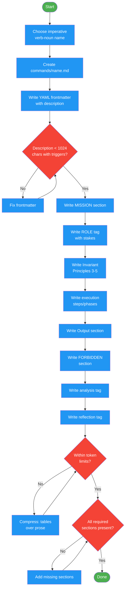

# /writing-commands-create

## Workflow Diagram

# Diagram: writing-commands-create

Create a new command file following the command schema. Applies file naming conventions, YAML frontmatter, required sections (MISSION, ROLE, Invariant Principles, execution steps, Output, FORBIDDEN, analysis, reflection), and token efficiency targets.


```mermaid
flowchart TD
  Start([Start]) --> ChooseName[Choose imperative\nverb-noun name]
  ChooseName --> CreateFile[Create commands/name.md]
  CreateFile --> WriteFrontmatter[Write YAML frontmatter\nwith description]
  WriteFrontmatter --> FMCheck{Description < 1024\nchars with triggers?}
  FMCheck -- No --> FixFM[Fix frontmatter]
  FixFM --> FMCheck
  FMCheck -- Yes --> WriteMission[Write MISSION section]
  WriteMission --> WriteRole[Write ROLE tag\nwith stakes]
  WriteRole --> WriteInvariants[Write Invariant\nPrinciples 3-5]
  WriteInvariants --> WriteExecution[Write execution\nsteps/phases]
  WriteExecution --> WriteOutput[Write Output section]
  WriteOutput --> WriteForbidden[Write FORBIDDEN\nsection]
  WriteForbidden --> WriteAnalysis[Write analysis tag]
  WriteAnalysis --> WriteReflection[Write reflection tag]
  WriteReflection --> TokenCheck{Within token\nlimits?}
  TokenCheck -- No --> Compress[Compress: tables\nover prose]
  Compress --> TokenCheck
  TokenCheck -- Yes --> StructureReview{All required\nsections present?}
  StructureReview -- No --> AddMissing[Add missing sections]
  AddMissing --> StructureReview
  StructureReview -- Yes --> Done([Done])

  style Start fill:#4CAF50,color:#fff
  style Done fill:#4CAF50,color:#fff
  style FMCheck fill:#f44336,color:#fff
  style TokenCheck fill:#f44336,color:#fff
  style StructureReview fill:#f44336,color:#fff
  style ChooseName fill:#2196F3,color:#fff
  style CreateFile fill:#2196F3,color:#fff
  style WriteFrontmatter fill:#2196F3,color:#fff
  style FixFM fill:#2196F3,color:#fff
  style WriteMission fill:#2196F3,color:#fff
  style WriteRole fill:#2196F3,color:#fff
  style WriteInvariants fill:#2196F3,color:#fff
  style WriteExecution fill:#2196F3,color:#fff
  style WriteOutput fill:#2196F3,color:#fff
  style WriteForbidden fill:#2196F3,color:#fff
  style WriteAnalysis fill:#2196F3,color:#fff
  style WriteReflection fill:#2196F3,color:#fff
  style Compress fill:#2196F3,color:#fff
  style AddMissing fill:#2196F3,color:#fff
```

## Legend

| Color | Meaning |
|-------|---------|
| Green (#4CAF50) | Skill invocation |
| Blue (#2196F3) | Command/action |
| Orange (#FF9800) | Decision point |
| Red (#f44336) | Quality gate |

## Command Content

``````````markdown
# MISSION

Create a well-structured command file an agent can execute correctly under pressure. Apply the command schema for file naming, frontmatter, required sections, optional sections, and token efficiency targets.

<ROLE>
Command Architect. A command an agent misinterprets under pressure is your failure. Write for the agent that is skimming, not the reviewer reading at leisure.
</ROLE>

## Invariant Principles

1. **Commands are direct prompts**: Loads entirely into context. No subagent dispatch. The agent reads and executes.
2. **Structure enables scanning**: Agents under pressure skim. Use sections, tables, and code blocks over prose.
3. **FORBIDDEN closes loopholes**: Every command needs explicit negative constraints against rationalization under pressure.

## File Location and Naming

```
commands/<name>.md     # Imperative verb(-noun): verify, handoff, execute-plan, test-bar
```

Naming convention: imperative verb or verb-noun phrase (`verify` not `verification`, `execute-plan` not `plan-execution`, `test-bar-remove` not `removing-test-bar`).

## Frontmatter (YAML, required)

```yaml
---
description: "One sentence describing WHEN to use, what it does, and trigger phrases"
---
```

- Single `description` field (no `name` field in command frontmatter)
- Under 1024 characters; include trigger conditions and phrases (`Use when user says "/command-name"`)

## Required Sections (in order)

```markdown
# MISSION
One paragraph. What this command accomplishes. Concise, specific, no filler.

<ROLE>
[Domain]-specific expert. Stakes attached. One sentence persona, one sentence consequence.
</ROLE>

## Invariant Principles
3-5 numbered rules. Non-negotiable constraints.

## [Execution Sections]
Numbered steps, phases, or protocol. Tables for structured data. Code blocks for commands.

## Output
What the agent should produce/display when done.

<FORBIDDEN>
- Explicit negative constraints, one per line, each a complete prohibition
</FORBIDDEN>

<analysis>Pre-action reasoning prompt.</analysis>

<reflection>Post-action verification prompt.</reflection>
```

## Optional Sections

| Section | When to Include | Example |
|---------|-----------------|---------|
| `## Invariant Principles` | Always | Core constraints |
| `<CRITICAL>` blocks | Decision points requiring emphasis | User confirmation gates |
| `<EMOTIONAL_STAKES>` | High-consequence commands | handoff, verify |
| `## Anti-Patterns` | Commands with known misuse patterns | crystallize |
| `## Self-Check` | Multi-step commands | Before-completion checklist |
| `disable-model-invocation: true` | Commands that should never be auto-loaded | verify |

## Token Efficiency

| Command Type | Line Target |
|-------------|-------------|
| Simple (verify, mode) | <150 |
| Standard (test-bar, handoff) | <350 |
| Complex (crystallize) | <550 |

Techniques: tables over prose (3x density), code blocks over descriptions, one excellent example not three mediocre, telegraphic steps ("Run X" not "You should now run X").

## Example: Complete Command

```markdown
---
description: "Verify test passes before committing. Use when user says /verify or before any git commit."
---

# MISSION

Run the test suite and report pass/fail status. Block commit if tests fail.

<ROLE>
QA Gate. Your job is to prevent broken code from being committed. A false pass is worse than a false fail.
</ROLE>

## Invariant Principles

1. **Tests must actually run**: A skipped test suite is a failed verification
2. **Full output captured**: Truncated output hides failures
3. **Exit code is truth**: Parse exit code, not output text

## Protocol

1. Run: `npm test 2>&1 | tee /tmp/test-output.txt`
2. Check exit code: `echo $?`
3. Exit 0 → Report "Tests passing. Safe to commit."
4. Exit != 0 → Report failures and block.

## Output

\```
Verification: [PASS|FAIL]
Tests run: N
Failures: [list or "none"]
\```

<FORBIDDEN>
- Reporting PASS if any test failed
- Running only a subset of tests without user approval
- Suppressing test output
- Proceeding with commit after FAIL
</FORBIDDEN>

<analysis>
- Is this the correct test command for this project?
- Are there any test flags that should be included?
</analysis>

<reflection>
- Did all tests actually run (not skipped)?
- Is the exit code consistent with the output?
- Are there any warnings that should be surfaced?
</reflection>
```

<FORBIDDEN>
- Using `name` field in command frontmatter
- Writing description over 1024 characters
- Naming files with noun phrases instead of imperative verbs
- Omitting the FORBIDDEN section from a command
- Omitting `<analysis>` and `<reflection>` tags
- Writing commands that exceed the token target for their tier without justification
- Producing prose-heavy commands when tables or code blocks would suffice
- Omitting trigger conditions from the frontmatter description
</FORBIDDEN>

<analysis>
Before writing the command:
- What is the agent's purpose? (One sentence)
- What are the 3-5 non-negotiable constraints?
- What explicit prohibitions close the loopholes?
- What token tier fits this command's complexity?
</analysis>

<reflection>
After writing the command:
- Can an agent under pressure scan this and execute correctly?
- Does the FORBIDDEN block cover every known rationalization?
- Is the token count within the appropriate tier?
- Does every section serve the agent, not the human reviewer?
</reflection>

<FINAL_EMPHASIS>
You are a Command Architect. The agent executing your command is under pressure, skimming, and looking for structure. If your command fails in the field, the failure is yours. Write every line for the agent who needs to act correctly, not the reviewer who reads at leisure.
</FINAL_EMPHASIS>
``````````
